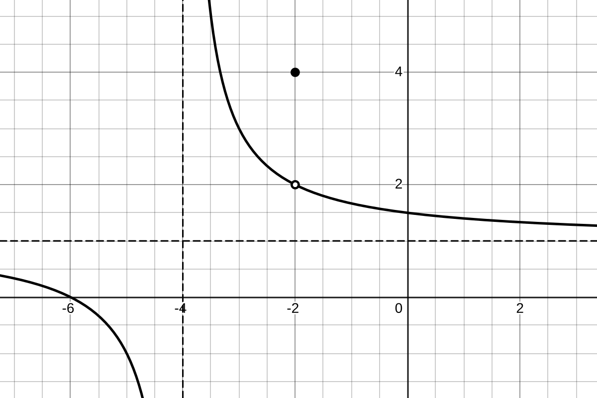
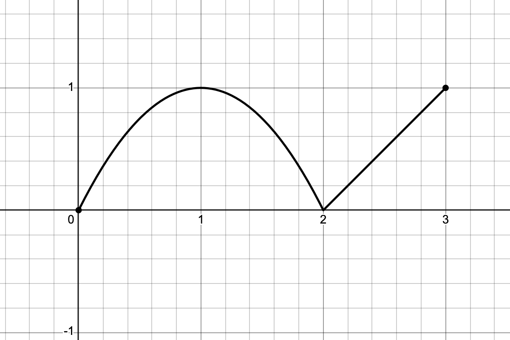
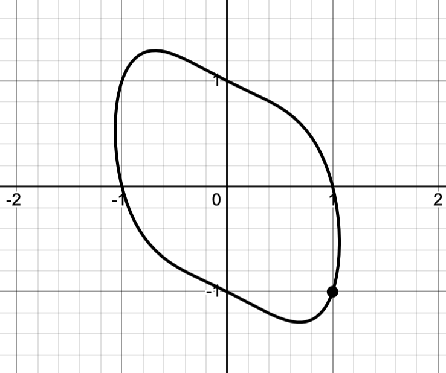
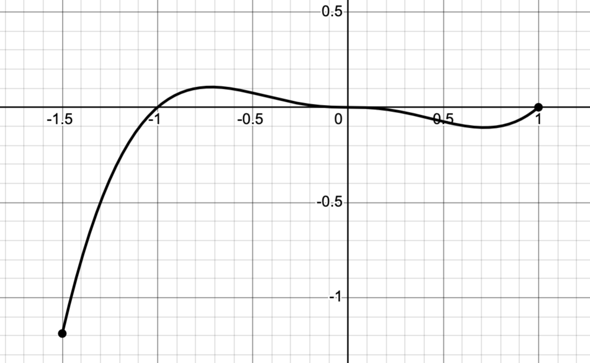
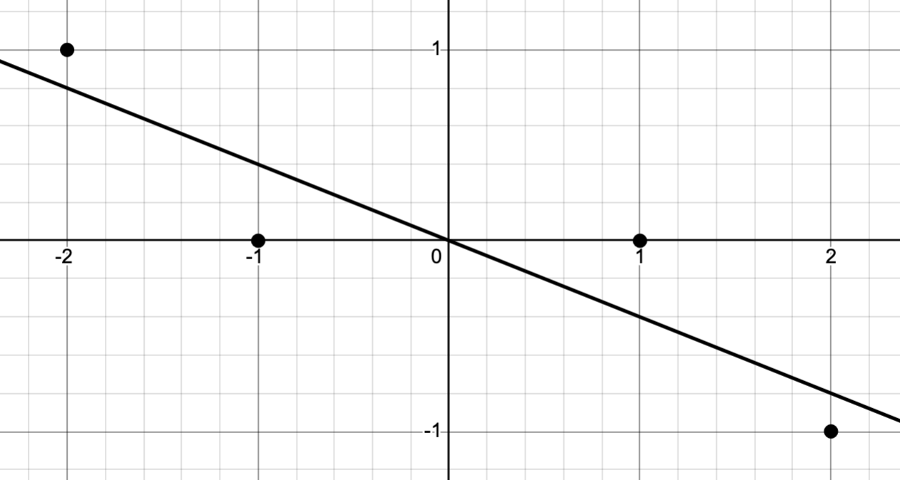
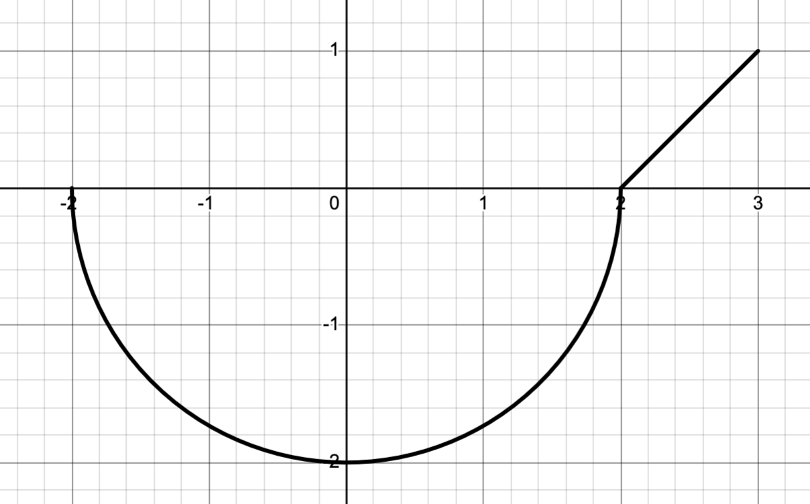

Our class final exams are set according to [UNCA's Final Exam Schedule](https://drive.google.com/file/d/1sCKQNjolBQ7PS-OoLL4OUpJzE3Kr4X9S/view){target=_blank}. According to that schedule,

- The 11:00 AM section's final will be on Friday, December 5 from 11:30-2:00 and 
- The 12:30 PM sections final will on Monday, December 8 also from 11:30-2:00.

This problem sheet consists primarily of problems right off of past exams, together with a few new problems. You should treat this review sheet like the past review sheets. The final exam will have significant similarities to this review sheet so, if you can do well on this review sheet, you should be able to do well on the final.

*Please* study for the final! Don't just look at the review sheet and figure that you already know how to do the problems. In my experience, final exams c an have a significant impact on final grades.

## Exam 1

2. The graph of a function is shown in @fig-piecewise_for_limits. Based on that, evaluate each of the following:

   a. $f(-2)$
   b. $\displaystyle \lim_{x\to -2} f(x)$
   c. $\displaystyle \lim_{x\to -4^-} f(x)$
   d. $\displaystyle \lim_{x\to -4} f(x)$
   e. $\displaystyle \lim_{x\to \infty} f(x)$


3. Evaluate the following limits and be sure to show your work clearly and completely using correct mathematical syntax.

   a. $\displaystyle \lim_{x\to3} \frac{x-2}{x^2 - x + 6}$
   b. $\displaystyle \lim_{x\to2} \frac{x-2}{2x^2 - 7x + 6}$

4. Evaluate the following limits as efficiently as you can; I'm really just interested in the answers.

   a. $\displaystyle \lim_{x\to\infty} \frac{x^2-2}{2x^2 - x + 6}$
   b. $\displaystyle \lim_{x\to3^-} \frac{x-2}{x-3}$


8. Let $f(x) = x^2 - 4x - 2$.

   a. Sketch the graph of $f$. Your graph need be only a sketch but be sure to you have the correct general shape, $y$-intercept, and axis of symmetry.
   b. Add the line that's tangent to the graph at the point where $x=3$.
   c. Find an equation for that tangent line.


9. The complete graph of a function $f$ is shown in @fig-piecewise_for_deriv_sketch, together with a spare set of axes below that. Sketch the graph of $f'$ on the spare set of axes.


## Exam 2

1. Use the differentiation rules to compute the derivatives of the following functions.  
   Note that there are three bonus questions!
   a) $\displaystyle f(x) = x^5 + 5^x$
   b) $\displaystyle f(x) = (x^3 + 2x)\cos(x)$
   c) $\displaystyle f(x) = \dfrac{x^2 e^x}{1 + x^3}$
   d) $\displaystyle f(x) = e^{\tan(x^3)}$
   e) $\displaystyle f(x) = \arcsin(3x)\arctan(x^3)$

   ---

   f) $\displaystyle f(x) = (2x^4 - 3x)e^{x^2}$
   g) $\displaystyle f(x) = \dfrac{\ln(x)}{x^3 + 1}$
   h) $\displaystyle f(x) = \sin(x^2)\cos(3x)$

3. Suppose I invest $10,000 at an annual rate of $6\%$ compounded 12 times per year.
   a) How much will I have after 10 years?
   b) How long will it take until I have $15,000? 

7. The graph of the equation $x^{4}+y^{2}+xy=1$ is shown in @fig-implicit. Use implicit differentiation to express $y'$ as a function in terms of both $x$ and $y$. Then, find an equation of the line that's tangent to the graph at the point $(1,-1)$.

## Exam 3

2. The graph of $f(x) = x^3\ln(x^2)$ over the interval $[-1.5,1]$ is shown in @fig-x3logx2. Find the exact locations of the absolute minimum and the absolute maximum over that interval.

\newpage 

3. @fig-regress plots the data 
$$\{(-2,1),(-1,0),(1,0), (2,-1)\},$$
together with its regression line of the form $f(x)=ax$.

   a. Write down the formula for $E(a)$ representing the squared error of the regression as a function of the parameter $a$.
   b. Use your squared error function to find the value of $a$ that minimizes that squared error.

6. The complete graph of a function $f$ is shown in @fig-piecewise_for_int; it consists of a semi-circle and a straight line segment. Evaluate  
$$
\int_{-2}^3 f(x) \, dx.
$$


8. Evaluate the following definite and indefinite integrals.

    a. $\displaystyle \int (x^3 + e^x + \sin(x) - \cos(x) +1) \, dx$
    b. $\displaystyle \int \frac{x^2 + x + 1}{x} \, dx$
    c. $\displaystyle \int x e^{-x^2} \, dx$
    d. $\displaystyle \int_0^{2} x^3\sqrt{x^4+1} \, dx$

9. Use $u$-substitution to express the normal integral
   $$\frac{1}{\sqrt{32\pi}} \int_0^8 e^{-(x-2)^2/32} \, dx$$
   as a *standard* normal integral.

## Bonus related rates questions 

Let's plan on a related rates question for the final. Here are a couple

1. Suppose I’m driving down a straight road at 65 mph. A kindly police officer is 1/4 mile down the road and 1/10 mile off the road. What speed does the kindly police officer’s radar detector register at that point in time?

2.  Suppose I pull the bottom of a 10 foot tall ladder away from a wall at the rate of 2 feet per
second. At what rate is the top of the ladder moving towards the floor when it is 3 feet away
from the floor?

\newpage 

## Figures 

{#fig-piecewise_for_limits width=70% fig-align="center" fig-alt="Pieciwise graph for limits"}

{#fig-piecewise_for_deriv_sketch width=70% fig-align="center" fig-alt="Piecewise graph for derivatives"} 

{#fig-implicit width=70% fig-align="center" fig-alt="Implicit graph for derivative"}

{#fig-x3logx2 width=70% fig-align="center"} 

{#fig-regress width=70% fig-align="center"}

{#fig-piecewise_for_int width=70% fig-align="center"} 


::: {.content-visible when-format="html"}

## Questions

If you'd like to ask a question about or reply to a question on this sheet, you can do so by pressing the "Reply on Discourse" button below.

```{ojs}
embedDiscourseMathTopic(58)
```

```{ojs}
import {embedDiscourseMathTopic} from '/components/EmbedDiscourseMathTopics/embedDiscourseMathTopic.js';
```

:::


