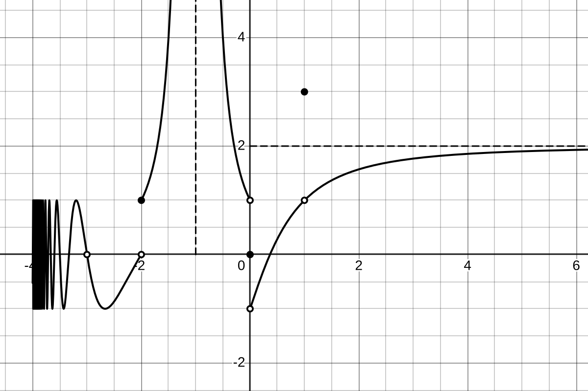
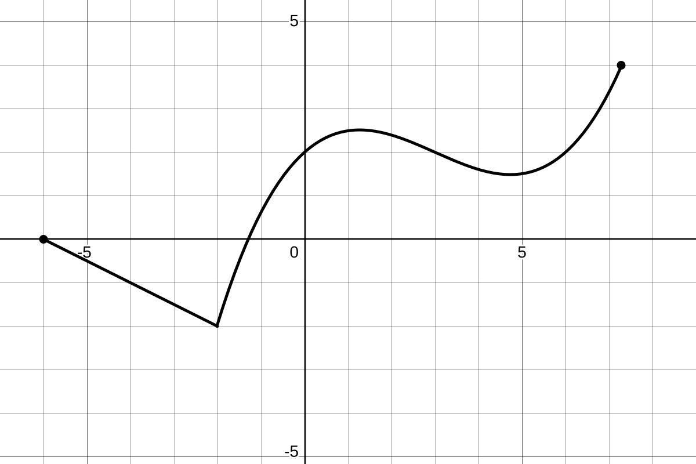
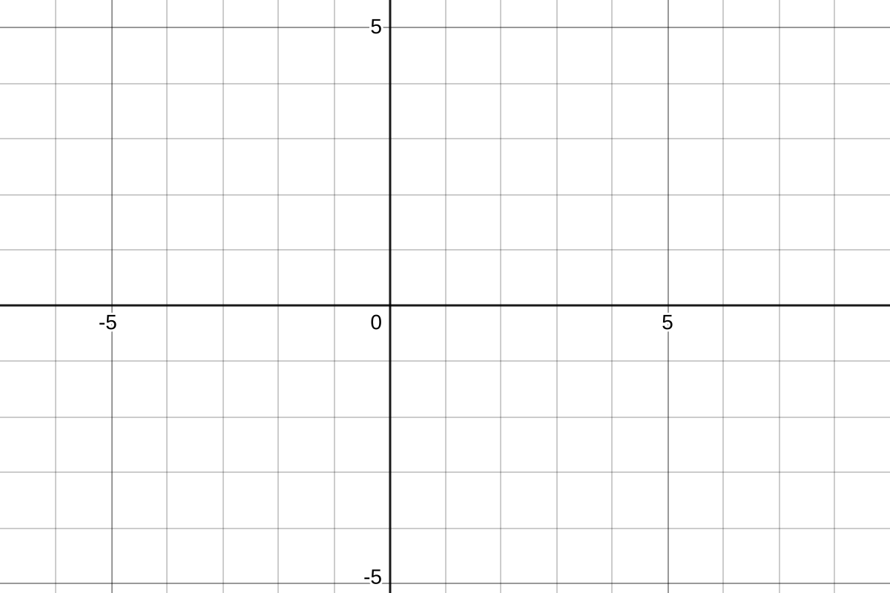

We have our first exam this coming Friday, September 12th. The problems on the exam will be very much like the problems you see here. I will go over this problem sheet in class on Wednesday but it will help you immensely to think about it on your own first so *please* work it out to the best of your ability prior to meeting on Wednesday.

## Problems 

1. Curious about the following limit,
   $$
   \lim_{x\to0} \frac{\tan\left(\sqrt{x/\pi}\right)}{\sqrt{x}},
   $$
   I used my computer to plug in several values of $x$ that are *close* to $0$ but not equal to $0$. The results are shown in @tbl-funvalues below.  

```{python}
#| label: tbl-funvalues
#| tbl-cap: Values of $f(x)=\frac{\tan(\sqrt{x/\pi})}{\sqrt{x}}$ near $x=0$.

from IPython.display import Markdown
from numpy import tan, pi, sqrt

x_vals = [10**(-n) for n in range(1,6)]
def f(x):
    return tan(sqrt(x/pi))/sqrt(x)

# header row: first col is empty, then the x values
header = "   |   | " + " | ".join(" " for x in x_vals) + " |"

# separator row: one "---" per column
sep = "|" + "---|" * (len(x_vals) + 1)

# data rows: first cell is math header
row_x  = "| $x$   | " + " | ".join(f"{x:.7f}" for x in x_vals) + " |"
row_fx = "| $f(x)$ | " + " | ".join(f"{f(x):.7f}" for x in x_vals) + " |  "

md_table = "\n   ".join([header, sep, row_x, row_fx]) + "  "

indented_table = "\n".join("    " + line for line in md_table.splitlines())

Markdown(md_table)
```

&nbsp;&nbsp;&nbsp;&nbsp;&nbsp;&nbsp;&nbsp;&nbsp;&nbsp; Based on those computations, can you make a conjecture as to the approximate value of the limit?  
&nbsp;&nbsp;&nbsp;&nbsp;&nbsp;&nbsp;&nbsp;&nbsp;&nbsp; Be sure to indicate how many digits you believe to be correct and why.

2. The graph of a function is shown in figure @fig-piecewise_limits.

   a) For $a=-3,-2,-1,0,\text{ and }1$, find 
      i) $\displaystyle\lim_{x\to a} f(x)$
      ii) $\displaystyle\lim_{x\to a^+} f(x)$
      iii) $\displaystyle\lim_{x\to a^-} f(x)$, and 
      iv) $f(a)$
   \newpage
   b) What are 
      i) $\displaystyle \lim_{x\to-4^-} f(x)$ and 
      ii) $\displaystyle \lim_{x\to\infty} f(x)$? 

3. Let's suppose that we know that 
$$
\lim_{x\to 2} f(x) = 3 \text{ and } \lim_{x\to2} g(x) = 5.
$$
What can you say about the following limits?

   a) $\displaystyle \lim_{x\to2} (2f(x)-g(x))$?
   b) $\displaystyle \lim_{x\to2} \frac{f(x) - 3}{g(x)-5}$?


4. Compute the following limits.

   a) $\displaystyle \lim_{x\to4}\frac{x^2 - 3x - 4}{x-4}$
   b) $\displaystyle \lim_{x\to-2}\frac{x^2 + 5x + 6}{x+2}$
   c) $\displaystyle \lim_{x\to1}\frac{2x^2+x+5}{x+1}$

&nbsp;&nbsp;&nbsp;&nbsp;&nbsp;&nbsp;&nbsp;&nbsp;&nbsp; *Note*: There's likely to be one slightly harder problem with a bit more challenging algebra.  
&nbsp;&nbsp;&nbsp;&nbsp;&nbsp;&nbsp;&nbsp;&nbsp;&nbsp;Here are a couple of examples:

&nbsp;&nbsp;&nbsp;&nbsp;&nbsp;&nbsp;&nbsp;&nbsp;&nbsp;&nbsp;&nbsp;&nbsp;&nbsp;&nbsp; d. $\displaystyle \lim_{x\to-2}\frac{x+2}{x^3 + 3x^2 + 3x + 2}$  
&nbsp;&nbsp;&nbsp;&nbsp;&nbsp;&nbsp;&nbsp;&nbsp;&nbsp;&nbsp;&nbsp;&nbsp;&nbsp;&nbsp; e. $\displaystyle \lim_{x\to3/2}\frac{2x-3}{2x^3 - 5x^2 + x + 3}$

5. Compute the following limits involving infinity.

   a. $\displaystyle \lim_{x\to\infty} \frac{2x^2 + 3x - 2}{5x^2-4}$
   b. $\displaystyle \lim_{x\to\infty} \frac{2x^2 + 3x - 2}{5x^3-4}$
   c. $\displaystyle \lim_{x\to2^-} \frac{x+1}{x-2}$

6. Write down a complete sentence referring to the intermediate value theorem explaining why $f(x)= 3x^7-x-1$ has a root between $x=0$ and $x=1$.

7. Find the derivatives of the following functions, *using the definition of the derivative*.

    a. $f(x) = 3x^2 + 2x + 1$
    b. $f(x) = x^6$

\newpage

8. Find the derivatives of the following polynomials using the basic differentiation rules.

   a. $f(x) = 3x^2 + 2x + 1$
   b. $f(x) = 61x^{48} + 2x^{16} + x^{14} - x - 1$

9. The graph of the function $f$ is shown in the top part of @fig-sketch. Sketch the graph of $f'$ on the axes provided below the graph of $f$.

10. Let $f(x) = 4+4x-x^2$.

    a. Sketch the graph of $f$, together with the its tangent line at the point $x=1$.
    b. Find a formula for the tangent line.


## Figures

<!-- https://www.desmos.com/calculator/nmsqvmaysf -->
{#fig-piecewise_limits}

<div style="height: 100px;"></div>


::: {#fig-sketch layout-ncol=1}




The graph of a function, together with an empty pair of axes for problem 9
:::

::: {.content-visible when-format="html"}

## Questions

If you'd like to ask a question about or reply to a question on this sheet, you can do so by pressing the "Reply on Discourse" button below.

```{ojs}
embedDiscourseMathTopic(38)
```

```{ojs}
import {embedDiscourseMathTopic} from '/components/EmbedDiscourseMathTopics/embedDiscourseMathTopic.js';
```

:::

