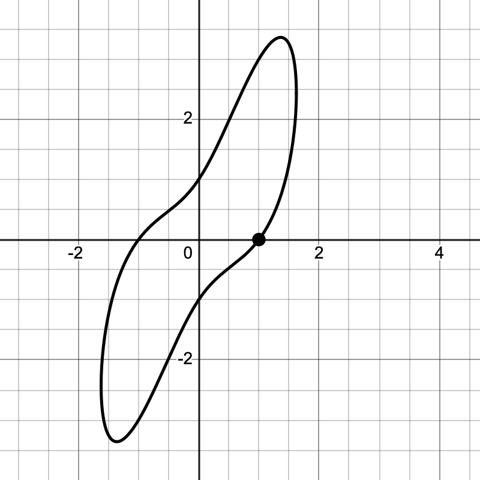
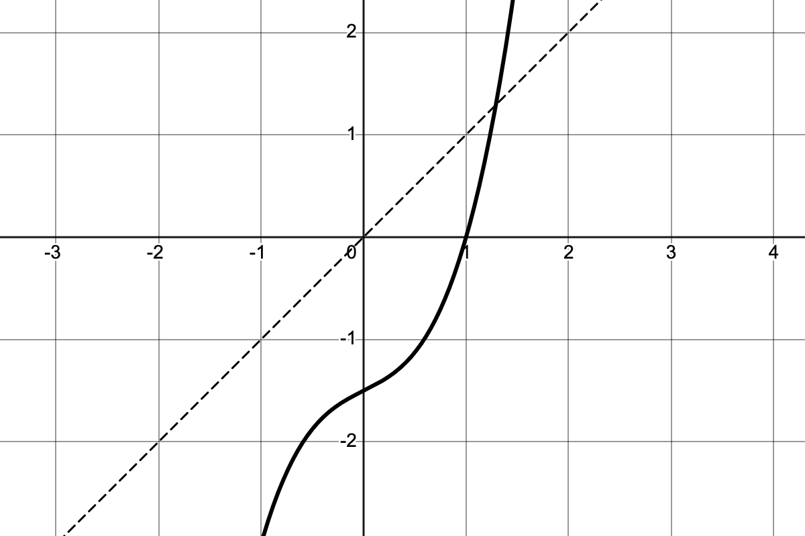

We have our second exam this coming Friday, September 17th. The problems on the exam will be very much like the problems you see here. I will go over this problem sheet in class on Wednesday but it will help you immensely to think about it on your own first so *please* work it out to the best of your ability prior to meeting on Wednesday.


## Problems 

1. Use the differentiation rules to compute the derivatives of the following functions.  
   a) $\displaystyle f(x) = x^2 \, 2^x$
   a) $\displaystyle f(x) = x^3 e^{2x}$
   b) $\displaystyle f(x) = \dfrac{\ln(x)}{x^2}$
   c) $\displaystyle f(x) = (x^2 + 1)\sin(x)$
   d) $\displaystyle f(x) = e^{x^2 + 3x}$
   e) $\displaystyle f(x) = \tan(x)\cos(x^2)$
   f) $\displaystyle f(x) = \dfrac{x^2 e^x}{1 + x^3}$
   g) $\displaystyle f(x) = \ln(\sin(x))$
   h) $\displaystyle f(x) = x^5 \tan(3x)$
   i) $\displaystyle f(x) = e^{\sin(x^2)}$
   j) $\displaystyle f(x) = \dfrac{\sqrt{x} + e^x}{x^2 + 1}$
   k) $\displaystyle f(x) = x^2 e^{2x} \sin(\pi x) \cos(x)$
   l) $\displaystyle f(x) = \arcsin(3x) + \arctan(x^3)$

2. Use logarithmic differentiation to evaluate the derivatives of the following functions:
   a) $\displaystyle f(x) = x^2 e^{2x} \sin(\pi x) \cos(x)$
   b) $\displaystyle f(x) = \frac{e^x \sqrt{x^2+1}}{\sin(x)\sqrt{x^2-1}}$

3. Suppose I invest $10,000 at an annual rate of $5\%$ compounded 4 times per year.
   a) How much will I have after 5 years?
   b) How long will it take my money to double?  
   Repeat the problem assuming your money is compounded continuously.

4. Sketch the graph of $$f(x) = 3\sin\left(\frac{\pi}{2} x\right).$$  
   Be sure to clearly indicate the $x$ and $y$ intercepts, as well as the maximum and minimum values.

5. Use the fact that $\displaystyle \lim_{\theta\to0} \sin(\theta)/\theta = 1$ to compute 
   a) $\displaystyle \lim_{x\to0}\frac{\sin(15x)}{4x}$
   b) $\displaystyle \lim_{h\to0}\frac{\cos(h)-1}{h}$


6. Supposing that $f$ and $g$ are differentiable functions, use the definition of the derivative to show that

   a. $\displaystyle \frac{d}{dx} f(x)+3g(x) = f'(x)+3g'(x)$
   b. $\displaystyle \frac{d}{dx} x^2\,f(x) = 2x\,f(x)+x^2\,f'(x)$

7. The graph of the equation $x^{4}+y^{2}-3xy=1$ is shown in @fig-implicit_graph.
   a) Explain how you know for sure that the point $(1,0)$ is on the graph.
   b) Use implicit differentiation express $y'$ as a function in terms of both $x$ and $y$.
   c) Find an equation of the line that's tangent to the graph at the point $(1,0)$.

8. The graph of $f(x)=x^{3}+\frac{1}{2}x-\frac{3}{2}$, together with the line $y=x$, is shown in @fig-graph_for_inverse.

   a) Sketch the graph of of $f^{-1}(x)$ right on the same set of axes.
   b) Evaluate $(f^{-1})'(0)$.


## Figures 

::: {style="max-width: 450px; margin: 0 auto"}
{#fig-implicit_graph}
:::

::: {style="max-width: 450px; margin: 0 auto"}
{#fig-graph_for_inverse}
:::


::: {.content-visible when-format="html"}

## Questions

If you'd like to ask a question about or reply to a question on this sheet, you can do so by pressing the "Reply on Discourse" button below.

```{ojs}
embedDiscourseMathTopic(43)
```

```{ojs}
import {embedDiscourseMathTopic} from '/components/EmbedDiscourseMathTopics/embedDiscourseMathTopic.js';
```

:::


