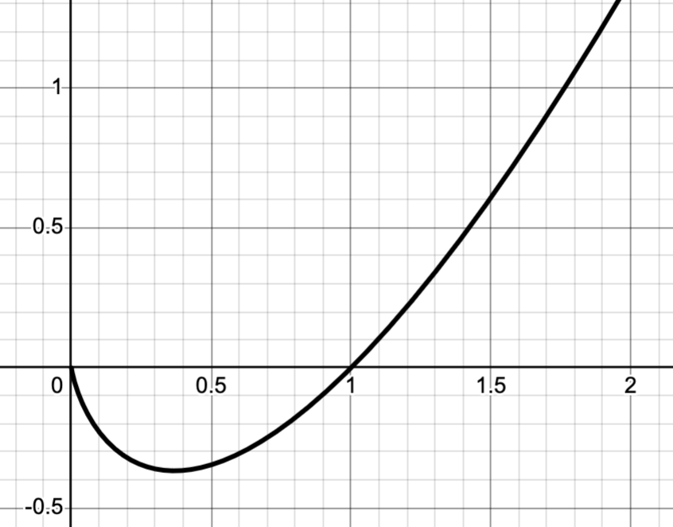
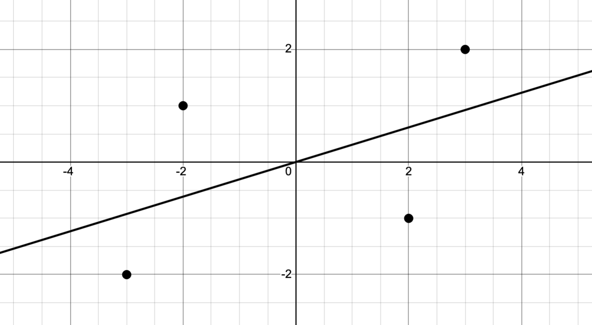
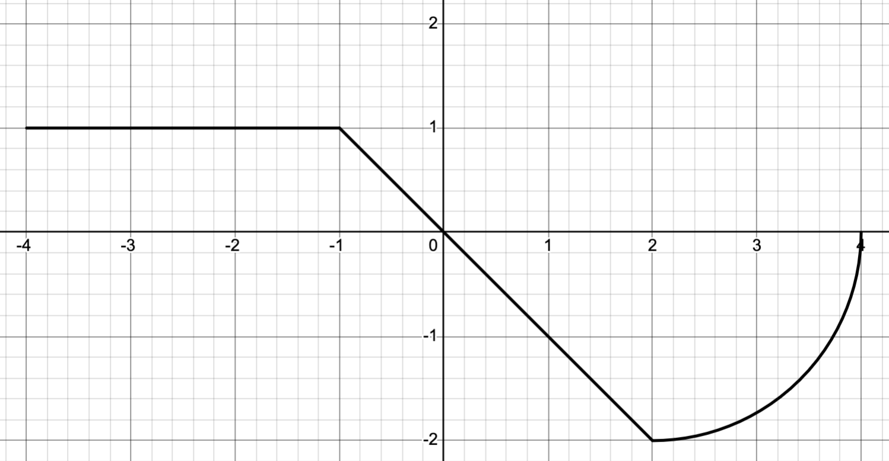

We have our third exam this coming Friday, November 21st. The problems on the exam will be very much like the problems you see here. I will go over this problem sheet in class on Wednesday but it will help you immensely to think about it on your own first so *please* work it out to the best of your ability prior to meeting on Wednesday.


## Problems 

1. Let $f(x) = \frac{1}{\sqrt{2\pi}} e^{-x^2/2}$; recall that this is exactly the formula for the standard normal distribution.

   a. Sketch the graph of $f$ and indicate the approximate locations of any inflection points.
   b. Find $f''(x)$ and use it to find the exact locations of the inflection points.

2. The graph of $f(x) = x\ln(x)$ is shown in figure @fig-xlogx. Find the exact location of the global minimum.

3. I need to enclose 400 square meters divided into three portions, as shown in @fig-fence. I'll use the same fencing for both the exterior and interior portions. What are the dimensions of the enclosure that use the least amount of fencing?


4. @fig-regress plots the data 
$$\{(-3,-2),(-2,1),(2,-1), (3,2)\},$$
together with its regression line of the form $f(x)=ax$.

   a. Write down the formula for $E(a)$ representing the squared error of the regression as a function of the parameter $a$.
   b. Find the value of $a$ that minimizes that squared error.

5. Let $f(x) = x^4-16$.

   a. Write down the corresponding Newton's method iteration function $N(x)$.
   b. Take two Newton steps from the initial seed $x_0=1$.
   c. Suppose that we generate a sequence via iterated applications of $N$. What is the limit of the resulting sequence?

6. Write down both right and left Riemann sums for 
$$
\int_0^2 e^x \, dx
$$
using $n=4$ terms. Which is an upper bound and which is a lower bound for the actual value?

7. The complete graph of a function $f$ is shown in @fig-piecewise_integral. Evaluate 
$$
\int_{-4}^4 f(x) \, dx.
$$

8. An object is thrown off a $90$ ft tall cliff with an initial vertical velocity of $20$ ft/s. Find the function $y(t)$ that describes the height of the object as a function of time $t$.

9. Evaluate the following definite and indefinite integrals.

    a. $\displaystyle \int (x^2 + e^x - \sin(x) + \cos(x)) \, dx$
    b. $\displaystyle \int \frac{x^3 +x^2 + x + 1}{x^2} \, dx$
    c. $\displaystyle \int x\sin(x^2+1) \, dx$
    d. $\displaystyle \int_0^{2} (x^2 + 1) \, dx$
    d. $\displaystyle \int_0^{2} x\sqrt{x^2 + 1} \, dx$

10. Use $u$-substitution to express the following normal integrals as *standard* normal integrals:

    a. $\displaystyle \int_0^3 \frac{1}{\sqrt{8\pi}} e^{-(x-1)^2/8} \, dx$
    b. $\displaystyle \int_{-10}^{10} \frac{1}{\sqrt{50\pi}} e^{-x^2/50} \, dx$

## Figures 

::: {style="max-width: 650px; margin: 0 auto"}
{#fig-xlogx}
:::

::: {style="max-width: 650px; margin: 0 auto"}

```{python}
#| label: fig-fence
#| fig-cap: "A partitioned corral"

import matplotlib.pyplot as plt
plt.plot([1,1],[2,0], color='black', linestyle='--')
plt.plot([4,4],[2,0], color='black', linestyle='--')
plt.plot([0,5,5,0,0],[0,0,2,2,0], color='black', linewidth=2.5)
ax = plt.gca()
ax.set_aspect('equal')
plt.axis('off')
```

:::

::: {style="max-width: 650px; margin: 0 auto"}
{#fig-regress}
:::

::: {style="max-width: 650px; margin: 0 auto"}
{#fig-piecewise_integral}
:::


::: {.content-visible when-format="html"}

## Questions

If you'd like to ask a question about or reply to a question on this sheet, you can do so by pressing the "Reply on Discourse" button below.

```{ojs}
embedDiscourseMathTopic(49)
```

```{ojs}
import {embedDiscourseMathTopic} from '/components/EmbedDiscourseMathTopics/embedDiscourseMathTopic.js';
```

:::


