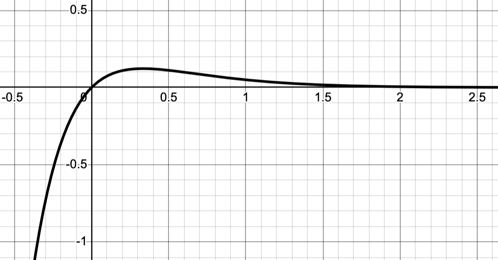
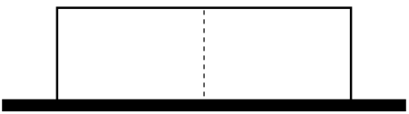
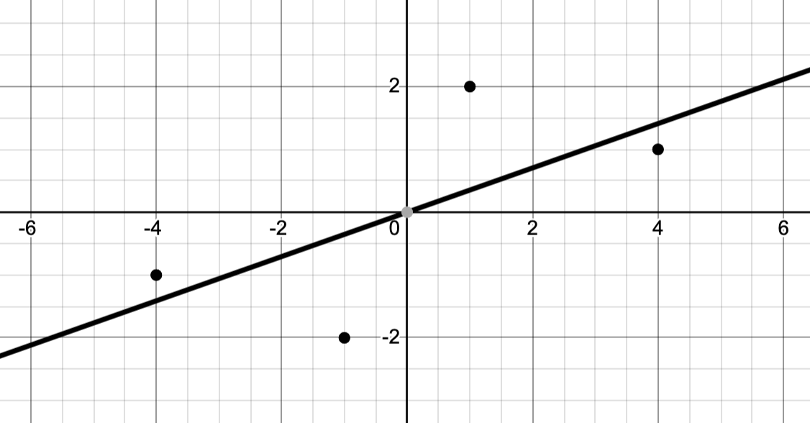

We'll have our third quiz this Friday, October 31st. There will probably be four questions on the quiz that will be a lot like the problems you see here.


::: {.content-visible when-format="html"}

If you have questions about any of the problems on this sheet, you can use the Reply on Discourse button down below.

:::

## Problems 

1. Let $f(x) = 2 x^2 - 3 x - 1$ restricted to the interval $[0,3]$. Use the derivative of $f$ to find the absolute maximum and minimum values of $f$ and their locations.

2. @fig-extreme_inflection shows the graph of $f(x) = x e^{-3x}$. 
   a. Use the first derivative of $f$ to find the exact location of the maximum.
   b. Use the second derivative of $f$ to find the exact location of the inflection point.


3. I need to fence off an enclosure divided into two portions, as shown in @fig-fence. My requirements are:

   - The total area enclosed must be 100 square meters,
   - One side will be against an existing wall, and 
   - The cost of the interior portion of the fence shown by the dashed line is only $1/3$ the cost of the rest of the fence.

   What are the dimensions of the least expensive such enclosure?


4. @fig-exp_square shows the graph of $f(x)=e^{-x}$ together with a rectangle inscribed under the graph of $f$ with one vertex on the graph, one vertex at the origin, and two vertices on the coordinate axes. Find the maximum possible volume of that rectangle.


5. @fig-regression plots the data 
$$\{(-4,-1),(-1,-2),(1,2), (4,1)\},$$
together with its regression line of the form $f(x)=ax$.

   a. Write down the formula for $E(a)$ representing the squared error of the regression as a function of the parameter $a$.
   b. Find the value of $a$ that minimizes that squared error.

6. Let $f(x) = x^3-1$.

   a. Write down the corresponding Newton's method iteration function $N(x)$.
   b. Take two Newton steps from the initial seed $x_0=2$.
   c. Suppose that we generate a sequence via iterated applications of $N$. What is the limit of the resulting sequence?


## Figures

::: {style="max-width: 650px; margin 0 auto;"}

{#fig-extreme_inflection}

:::

::: {style="max-width: 650px; margin 0 auto;"}

{#fig-fence}

:::


```{python}
#| fig-cap: A rectangle inscribed under the graph of $y=e^{-x}$
#| label: fig-exp_square
import numpy as np
import matplotlib.pyplot as plt

# Define the function
def f(x):
    return np.exp(-x)

# Define the range for plotting
x = np.linspace(0, 5, 400)
y = f(x)

# Choose x-value for the rectangle (optimal for area is x=1)
x0 = 1.0
y0 = f(x0)

# Create the figure
fig, ax = plt.subplots(figsize=(7, 4))

# Plot the function
ax.plot(x, y, color="black", linewidth=1.5)

# Draw the rectangle under the curve
rectangle_x = [0, x0, x0, 0, 0]
rectangle_y = [0, 0, y0, y0, 0]
ax.plot(rectangle_x, rectangle_y, color="gray", linewidth=1.5)
ax.fill_between(rectangle_x, rectangle_y, color="gray", alpha=0.2)

# Remove top/right spines and move axes to origin
for spine in ["top", "right"]:
    ax.spines[spine].set_visible(False)
ax.spines["bottom"].set_position("zero")
ax.spines["left"].set_position("zero")

# Set limits and aspect
ax.set_xlim(-0.5, 5)
ax.set_ylim(-0.2, 1.2)

# Label axes with small offsets
ax.text(5.1, 0, "x", fontsize=12, va="center")
ax.text(0, 1.25, "y", fontsize=12, ha="center")

# Remove ticks for a cleaner look
ax.set_xticks([])
ax.set_yticks([])

plt.tight_layout()
plt.show()
```

::: {style="max-width: 650px; margin 0 auto;"}

{#fig-regression}

:::


::: {.content-visible when-format="html"}

## Questions

If you'd like to ask a question about or reply to a question on this sheet, you can do so by pressing the "Reply on Discourse" button below.

```{ojs}
embedDiscourseMathTopic(46)
```

```{ojs}
import {embedDiscourseMathTopic} from '/components/EmbedDiscourseMathTopics/embedDiscourseMathTopic.js';
```

:::


