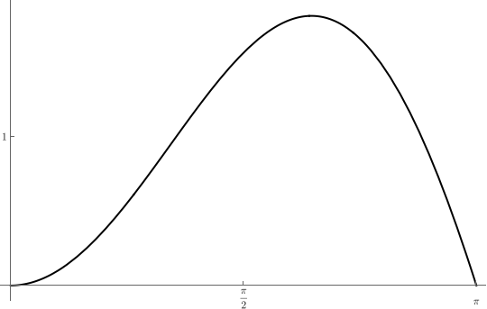
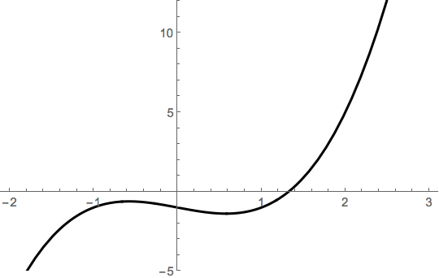
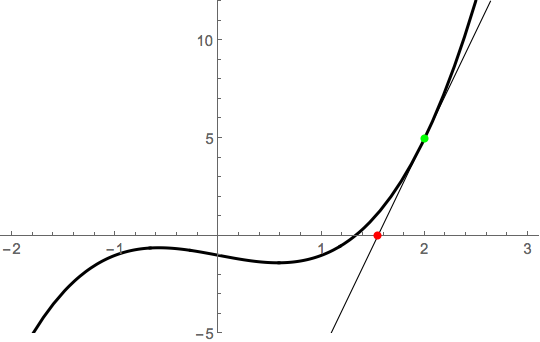
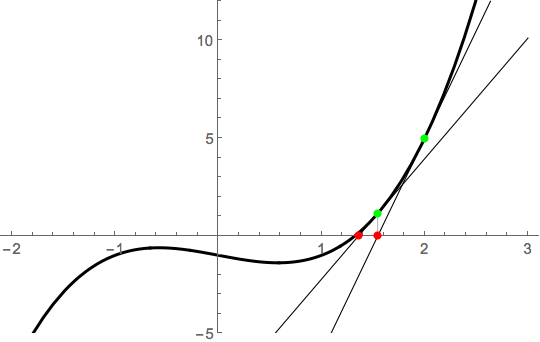

## An optimization problem

Suppose we want to find the maximum value of $f(x)=x \sin(x)$ over the interval
$[0,\pi]$. A glance at graph shows there's exactly one.

::: img

:::

So, how would we find that? I guess we just have to solve 
$$f'(x) = \sin(x) + x\cos(x) = 0$$ 
Unfortunately, that's hard!

## Resources for the numerical solutions of equations

There are plenty of tools for solving equations numerically. One of the
simplest to use is WolframAlpha. To solve $\sin(x)+x\cos(x)=0$, for
example, just [type it
in](https://www.wolframalpha.com/input/?i=solve+sin%28x%29%2Bxcos%28x%29){target="_blank"}!

If you move on in a technical discipline, though, you'll eventually
want to use a more programmatic tool. One broadly applicable tool for
mathematical exploration and programming is
[SageMath](https://www.sagemath.org).

  

  

  

## Newton\'s method

Newton's method is a technique to find numerical approximations to
roots of functions; it is theoretical foundation on which numerical
tools like Sage's `find_root` works. Given an initial guesss $x_1$,
Newton's method improves this guess by applying the function 
$$N(x) = x - \frac{f(x)}{f'(x)}.$$ 
This produces $x_2 = N(x_1)$. We then
plug that back in to get $x_3$ and continue. More generally, we
produce a sequence $(x_k)$ via $x_k=N(x_{k-1})$.

## Example

Let $f(x) = x^3-x-1$. It's evident from a graph that there's one
root.

::: img

:::

Newton's method works by riding the tangent line from an initial guess.
If we note that $x_1=2$ is pretty close to the root, we compute
$x_2 = N(x_2)$, where 
$$N(x) = x - \frac{f(x)}{f'(x)} = x -
\frac{x^3-x-1}{3x^2-1}.$$ Thus, $x_2 = N(2) = 2-5/11 \approx
1.54545$. Geometrically, this point is obtained by riding the tangent
line to the $x$-axis:

::: img

:::

If we do that again, we end up even closer to the root:

::: img

:::

That's why we iterate!

## Performing Newton's method

Here's how we can apply Newton's method to the previous example using Sage:

  

## Exercises

1.  Use a numerical tool to solve the following equations. Be sure to
    find all solutions
    a.  $x^5-x-1 = 0$
    b.  $x^5-2x-1 = 0$
    c.  $\sin(3x) = x/2$
2.  For each of the following functons, take three Newton steps from the
    given initial point
    a.  $f(x) = x^2 - 2$ from $x_1 = 2.0$
    b.  $f(x) = \sin(x)$ from $x_1 = 3.0$
    c.  $f(x) = x^5-x-1$ from $x_1 = 1.0$
3.  The equation $\sin(x)=x/9$ has 7 solutions. We want to find an
    approximation to the largest solution. Use a graph to find a good
    initial approximation for your $x_1$ and apply Newton's method
    from that point obtain the approximation.
