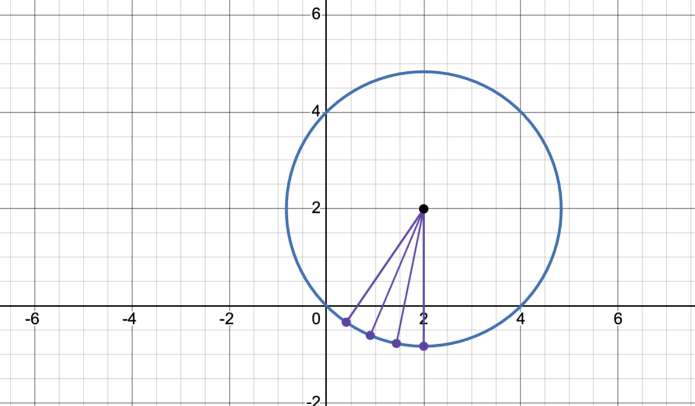
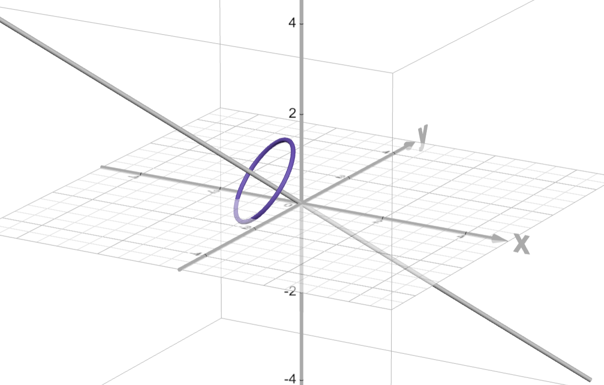
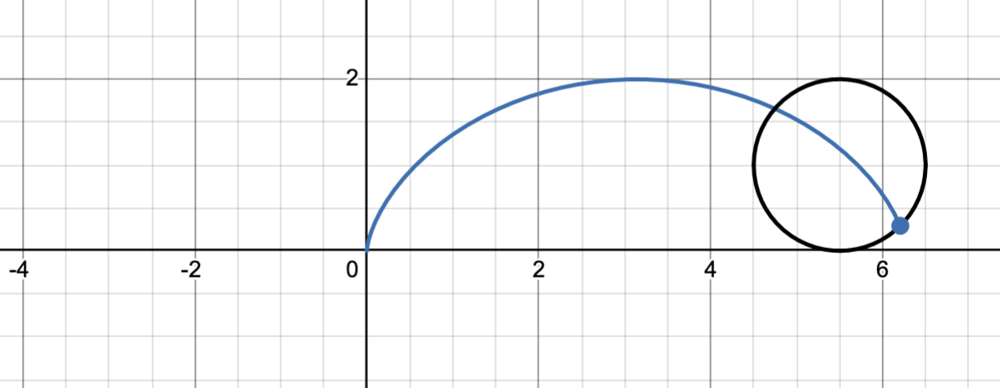
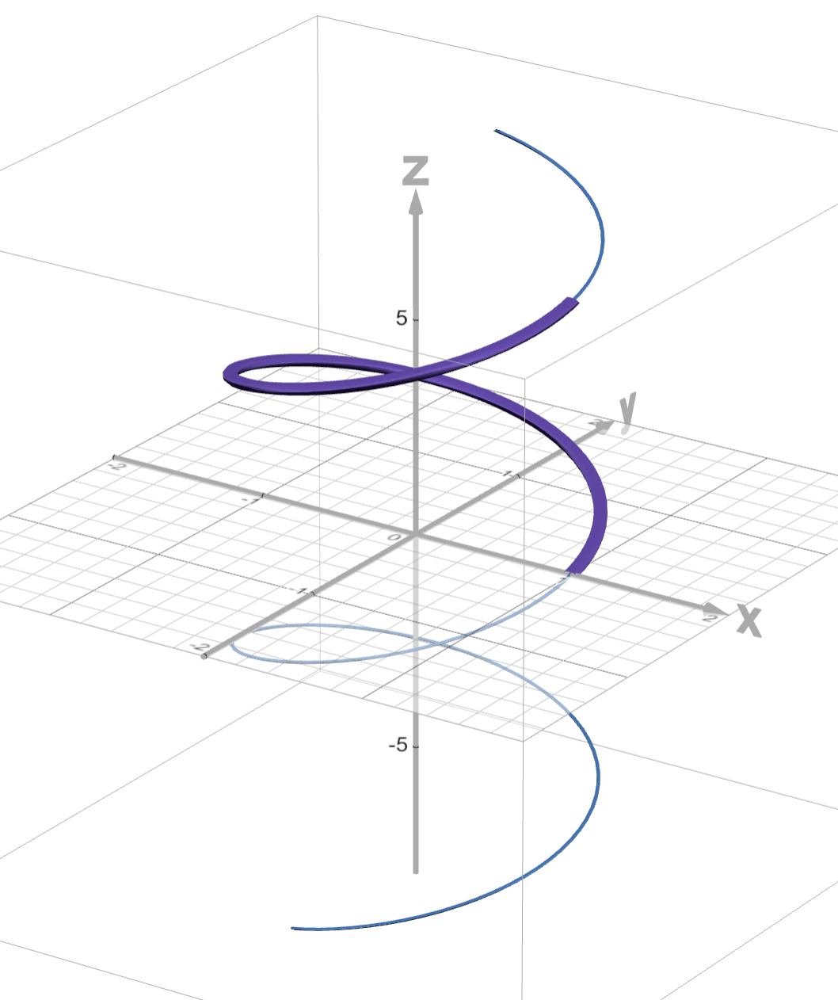
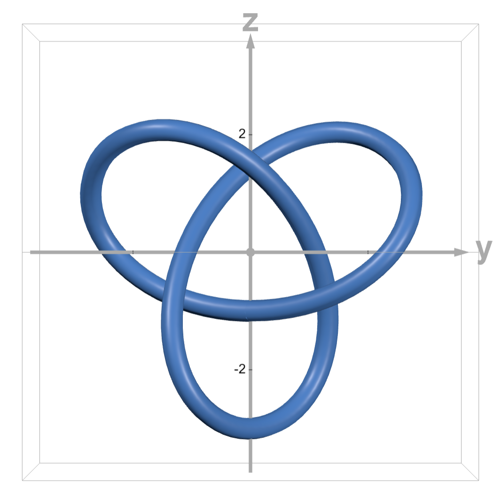
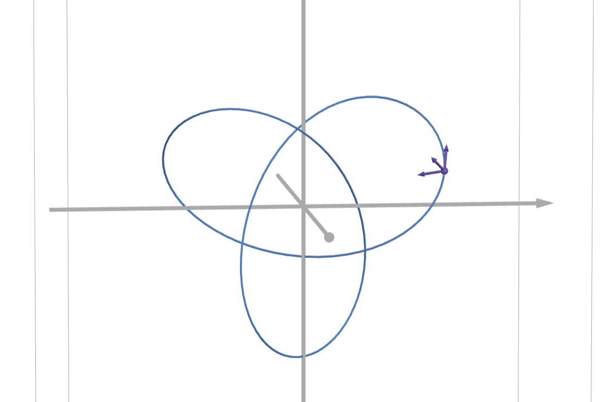

## Recap 

I guess we all know a bit about three dimensional space including 

- vectors, vector algebra (like addition and products), and their geometry
- equations of things like planes and spheres, 
- parametric/vector equations for lines, circles, and other curves

Today, we're going to push our knowledge on the vector formulation of curves in space to compute arc length and the TNB frame. First, though, let's recap what we know about vector functions and how they describe motion to make sure we're all on the same page about notation.

## Vectors and motion 

### Lines in the plane and space 

A point $P$ and a direction vector $\vec{d}$ determine a line via 

$$\vec{p}(t) = P + \vec{d}\,t.$$

@fig-line2d shows the line through the point $P=(-1,1)$ in the direction of the vector $\vec{d}=\langle3,1\rangle$.

::: {style="max-width: 600px; margin: 0 auto"}

```{python}
#| fig-cap: A point and vector determine a line
#| label: fig-line2d

from components.figures import draw_line_through_point_and_vector
draw_line_through_point_and_vector()
```

:::


@fig-line3d shows the line through the point $P=(-2,-3,2)$ in the direction of the vector $\vec{d}=\langle3,3,1\rangle$.

::: {style="max-width: 600px; margin: 0 auto;"}

{target=_blank}](figures/LineThroughSpace.png){#fig-line3d}

:::

By combining the vectors via scalar multiplication, it's not hard to express these as 
$$
\langle x(t),y(t) \rangle \text{ or } \langle x(t),y(t),z(t) \rangle.
$$
That allows you to clearly see the parametric form.

### Circles in the plane 

A circle has the form 

$$
\vec{p}(t) = C + r\langle\cos(t), \sin(t)\rangle.
$$

```{python}
#| fig-cap: "A center and radius determine a circle"
#| fig-align: center
#| label: fig-circle2d

from components.figures import draw_circle_with_center
draw_circle_with_center()
```

When describing *motion*, rather than just a static curve, we often care about starting position and speed. @fig-clockwise_circle illustrates the motion described by

$$
p\left(t\right)=-2\sqrt{2}\langle\sin\left(at\right),\cos\left(at\right)\rangle+\langle2,2\rangle
$$

::: {.content-visible when-format="html"}

You can control the parameter $a$ with the Frequency slider.

:::

::: {.content-visible when-format="html" #fig-clockwise_circle fig-cap="Clockwise circular motion of varying speed" style="width: 600px; margin: 0 auto;"}

<iframe src="https://www.desmos.com/calculator/s6c83jtxt8?embed" width="600" height="350" style="border: 1px solid #ccc" frameborder=0></iframe>

:::


::: {.content-visible when-format="pdf" style="max-width: 600px; margin: 0 auto;"}

{#fig-clockwise_circle}

:::

### Circles in space 

A circle that's parallel to one of the coordinate planes is easy enough; just set one coordinate to zero. The result might look like so:

::: {style="max-width: 600px; margin: 0 auto;"}

{target=_blank}](figures/simpleCircle3D.png){#fig-simpleCircle3D}

:::


The parametric/vector formulae are 
$$
\begin{aligned}
\vec{p}(t) &= \langle \cos(t), -1, \sin(t) \rangle \\ 
&= \cos(t) \vec{\imath} - \vec{\jmath} + \sin(t) \vec{k}.
\end{aligned}
$$

Circles in space but in general position can be a bit trickier but the vector formulation in @fig-simpleCircle3D gives us a clue as to how we might proceed. The idea is to have a pair of unit vectors $\vec{u}$ and $\vec{v}$ parallel to the plane in which you'd like your plane to reside; $\vec{u}$ and $\vec{v}$ should also be perpendicular to one another. If you'd like the center to be $C$ and the radius to be $r$, then one possible parameterization is 
$$
\vec{p}(t) = C + r\cos(t)\vec{u} + r\sin(t)\vec{v}.
$$
This can be fiddled with quite a lot, particularly if you're describing motion.

**Example**: Parameterize a circle centered at the point $(-1,-1,1)$ and wrapped around the line through that point with direction vector $\vec{n}=\frac{1}{\sqrt{3}}\langle -1,-1,1 \rangle$. 

*Solution*: 
[https://www.desmos.com/3d/wztyjqums0](https://www.desmos.com/3d/wztyjqums0){target=_blank}

::: {style="max-width: 600px; margin: 0 auto;"}

{#fig-skewedCircle3D}

:::


### Mix and match

Circles and lines can be mixed and matched to powerful effect.

#### The cycloid

A point on a rolling circle traces out a path called a cycloid. The simplest form of a cycloid is 

$$\vec{p}(t) = \langle t-\sin\left(t\right),1-\cos\left(t\right)\rangle.$$

::: {.content-visible when-format="html" #fig-cycloid fig-cap="The cycloid" style="width: 600px; margin: 0 auto;"}

<iframe src="https://www.desmos.com/calculator/4b697a7834?embed" width="600" height="300" style="border: 1px solid #ccc" frameborder=0></iframe>

:::


::: {.content-visible when-format="pdf" style="max-width: 600px; margin: 0 auto;"}

{#fig-cycloid}

:::

#### A helix

We just saw how a circle can be wrapped around a line and centered at a fixed point. If the center moves along the line with constant speed, the path is called a helix.

::: {style="max-width: 600px; margin: 0 auto;"}

{target=_blank}](figures/helix.png){#fig-helix}

:::


## Arc length 

Distance traveled or arc length is a pretty crucial question. The basic idea is simple: just integrate the speed. Thus, if $\vec{p}(t)$ parameterizes a motion as an object moves during the time interval from $t=a$ to $t=b$, its distance traveled should be 
$$
L = \int_a^b \|\vec{p}'(t)\| \, dt.
$$

This often leads to a pretty nasty integral! In that case, we might just get a numerical estimate. There are some interesting cases that can be worked out in closed form, though.


**Reasonable example**: Let's suppose that we parameterize a helix about the $z$-axis as 
$$
\vec{p}(t) = \langle \cos(t), \sin(t) \, t \rangle.
$$
Find the length of one turn of this corkscrew.

::: {style="max-width: 600px; margin: 0 auto;"}

{#fig-helixLength}

:::

*Solution*: The pic *is* the solution! [https://www.desmos.com/3d/4hjwbvggfd](https://www.desmos.com/3d/4hjwbvggfd){target=_blank}

Maybe we should do that by hand too?

**Unreasonable example**:

Here's a very fun curve called a *trefoil knot*:

::: {style="max-width: 600px; margin: 0 auto;"}

{#fig-trefoil}

:::

A parameterization is given by 
$$
\vec{p}\left(t\right)\ = \langle\sin\left(3t\right),\ \sin\left(t\right)+2\sin\left(2t\right),\cos\left(t\right)-2\cos\left(2t\right)\rangle.
$$

*Solution*: Note that $\|\vec{p}'(t)\|$ leads to quite a complicated integral! Desmos can compute it numerically , though: [https://www.desmos.com/3d/8pvqpwuoqv](https://www.desmos.com/3d/8pvqpwuoqv){target=_blank}

## The TNB Frame

Every accelerating object carries with it a uniquely defined reference frame called the TNB Frame. This reference frame is crucial in Einstein's general theory of relativity and also has applications to computer graphics.

### An important lemma

The TNB frame is based on the following theorem:

**Theorem**: If $\|\vec{p}(t)\|$ is constant, then $\vec{p}(t) \cdot \vec{p}'(t) = 0$.

It's not too hard to prove this theorem and we'll do so in class. 

::: {.content-visible when-format="html"}

There's a pretty easy geometric interpretation as well:

```{ojs}
import {pic, run} from '@mcmcclur/tracing-a-path-on-a-sphere';
runit = run;
pic
```

:::

### Constructing the TNB Frame

Given $\vec{p}(t)$ construct the vectors $\vec{T}(t)$, $\vec{N}(t)$, and $\vec{B}(t)$ as follows:

- $\displaystyle \vec{T}(t) = \vec{p}'(t)/\|\vec{p}'(t)\|$,
- $\displaystyle \vec{N}(t) = \vec{T}'(t)/\|\vec{T}'(t)\|$, and 
- $\displaystyle \vec{B}(t) = \vec{T}(t) \times \vec{N}(t)$

Note that 

- $\vec{T}(t)$ is a unit vector pointing in the direction of motion,
- $\vec{N}(t)$ is a unit vector that's perpendicular to $\vec{T}(t)$ by our lemma, and 
- $\vec{B}(t)$ is a unit vector that's perpendicular to both $\vec{T}$ and $\vec{N}$ by the properties of the cross-product.

Thus, the trio of vectors $\vec{T}$, $\vec{N}$, and $\vec{B}$ form an orthogonal basis for $\mathbb R^3$ whose origin moves with our moving object.

Here's what this looks like for the trefoil knot:

::: {style="max-width: 600px; margin: 0 auto;"}

{#fig-trefoilTNB}

:::

You can *really* see the action on Desmos: [https://www.desmos.com/3d/7q5zncqh8q](https://www.desmos.com/3d/7q5zncqh8q){target=_blank}

## Problems

1. Parameterize the circle of radius 3 centered at the origin and contained in the plane $x+2y-3z=0$.
2. Show that the arc length formula works as expected for 
   a. A line segment $\vec{p}(t) = t\langle a,b \rangle + (1-t)\langle c,d \rangle$, where $t$ ranges from zero to one.
   b. A circle $\vec{p}(t) = \langle r\cos(t), r\sin(t) \rangle$.
3. Compute the TNB frame for the helix $\vec{p}(t) = \langle 2\cos(t), 3t, 2\sin(t) \rangle$.