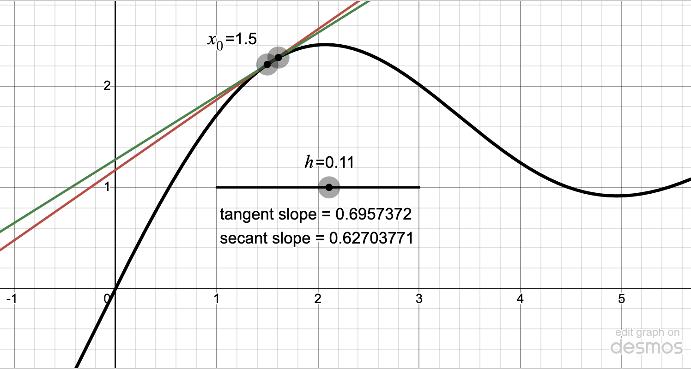

In today's lecture, we're going to discuss partial derivatives and a couple of their applications.

## What is a partial derivative?

A partial derivative tells you the rate of change of a function of several variables in one of the positively oriented cardinal directions. They're a lot like the derivatives that you learn about for functions of one variable in Calc I.

### Plain old ordinary derivatives

A derivative, as you probably know, measures the instantaneous rate of change of a function value with respect to its input variable. It is defined by the difference quotient:
$$
f'(x) = \lim_{h\to0}\frac{f(x+h)-f(x)}{h}.
$$
The fraction that you see there is the difference quotient, which represents a good approximation to the slope of the function right at the point in question. The difference quotient also depends on the parameter $h$; the smaller $h$ is, the better the approximation. If we take the limit as $h\to0$, we should get the *exact* slope. That's the point!

This process is illustrated for the function $f\left(x\right)=\sin\left(x\right)+x-\frac{x^{2}}{8}$ in @fig-desmos_difference_quotient.

::: {#fig-desmos_difference_quotient .figure fig-cap="The 1D Difference Quotient" fig-alt="Approximation with the difference quotient" fig-align="center"}

:::: {.content-visible when-format="pdf"}
{width=80%}
::::

:::: {.content-visible when-format="html"}
```{=html}
<iframe src="https://www.desmos.com/calculator/hmz5vkfjfr?embed" width="750" height="400" style="border: 1px solid #ccc" frameborder="0"></iframe>
```

::::

:::

Of course, we don't use the difference quotient to compute derivatives; we use the much more efficient differentiation rules. Thus, for the function at hand, we have 
$$
f'(x) = \cos(x) + 1 - \frac{1}{4}x.
$$
That's where the exact slope of the tangent line in @fig-desmos_difference_quotient comes from.

### Partial derivatives 

Now, imagine that you're sitting on a hillside whose elevation is described by the graph of a function $z=f(x,y)$. There isn't just one oriented direction anymore; rather, there are infinitely many. Later, you'll talk about *directional* derivatives which really do measure the rate of change in *any* direction. The first step, though, is to consider what happens if you march in one of the two positively oriented cardinal directions - i.e. due North or due East.

This situation is illustrated as a contour plot for the hill $f(x,y)=2-(x^2+y^2)/2$ in @fig-contours. 

::: {style="max-width: 600px; margin: 0 auto"}

```{python}
#| label: fig-contours
#| fig-cap: The hill $f(x,y)=2-(x^2+y^2)/2$

import numpy as np
import matplotlib.pyplot as plt

# Function
def f(x, y):
    return 2 - 0.5 * (x**2 + y**2)

# Grid
x = np.linspace(-3, 3, 401)
y = np.linspace(-3, 3, 401)
X, Y = np.meshgrid(x, y)
Z = f(X, Y)

# Figure
# fig, ax = plt.subplots(figsize=(6, 6))

# Shaded contours with reversed blue scheme
# levels = np.linspace(Z.min(), Z.max(), 30)
levels = np.arange(-7,2,1)
cf = plt.contourf(X, Y, Z, levels=levels, cmap="Blues_r")
# Optional contour lines for clarity (comment out if not desired)
contours = plt.contour(X, Y, Z, levels=levels, colors="k", linewidths=0.5, alpha=0.4, linestyles="solid")
plt.clabel(contours, inline=True, fontsize=8)


# Mark the point (1,1)
plt.plot(1, 1, marker="o", ms=8, color="black", markerfacecolor="black", zorder=5)

# Two vectors from (1,1): +x and +y directions
plt.quiver(
    [1, 1], [1, 1],    # tails
    [1, 0], [0, 1],    # vector components (dx, dy)
    angles='xy', scale_units='xy', scale=1, width=0.008, color="black", zorder=6
)

# Axes styling
ax = plt.gca()
ax.set_aspect('equal')
ax.set_xlim(-3, 3)
ax.set_ylim(-3, 3)
ax.set_xlabel("x")
ax.set_ylabel("y")
# cbar = fig.colorbar(cf, ax=ax, shrink=0.85, label="f(x, y)")

plt.tight_layout()
# plt.show()
```

:::


::: {.content-visible when-format="html"}

We can also plot this same hill in 3D:

```{ojs}
viewof pt 
show 
pic 
```

:::

### Partial derivatives conceptually

However you view it, these pictures motivate the concept of a *partial derivative*. A function $f(x,y)$ that maps $\mathbb R^2 \to \mathbb R$ can have two partial derivatives:

- $\displaystyle \frac{\partial f}{\partial x}$ or $f_x(x,y)$ or just $f_x$ denotes the partial derivative of $f$ with respect to $x$, which measures the rate of change of $f$ in the positive $x$ direction and 
- $\displaystyle \frac{\partial f}{\partial y}$ or $f_y(x,y)$ or just $f_y$ denotes the partial derivative of $f$ with respect to $y$, which measures the rate of change of $f$ in the positive $y$ direction. 

@fig-contours indicates that both $f_x(1,1)$ and $f_y(1,1)$ are both positive and have the same value, which looks to be about 1.

### The definition of a partial derivative

Partial derivatives are defined using multi-variable difference quotients:

$$f_x(x,y) = \lim_{h\to0}\frac{f(x+h,y)-f(x,y)}{h}$$
$$f_y(x,y) = \lim_{h\to0}\frac{f(x,y+h)-f(x,y)}{h}$$

The only difference between these two expressions is that the displacement ($h$) is applied to the $x$-coordinate for $f_x$ and to the $y$-coordinate for $f_y$.

### Computing partial derivatives algebraically

Computing partial derivatives is fairly straightforward; you may have done it before! In a Calc I class, you might very well look at a function like
$$
f(x) = \sin(\alpha \, x) \text{ and compute } f'(x) = \alpha\, \cos(\alpha\, x).
$$
The $\alpha$ is a constant related to the frequency of the corresponding sine wave. Most importantly, $\alpha$ is unspecified so it's represented as a symbol.
$$
f(x,y) = \sin(x\,y) \text{ and compute } f_x(x,y) = y\,\cos(x\,y).
$$
This works, because only $x$ is affected by the $h$. Put another way, $y$ is constant when we move only in the $x$-direction.

### Example 

Let $\displaystyle f(x,y) = x^2\,e^{x^2 + y^2}$

$$
f_x(x,y) = 2 x \, e^{x^2+y^2} + x^2 \, e^{x^2+y^2}\,2x
$$
and 
$$
f_y(x,y) = 2 x^2 \, y \, e^{x^2+y^2}.
$$

### Estimating partial derivatives geometrically

In some applied situations, you might need to estimate partial derivatives from a contour diagram. @fig-contour_estimation shows the graph of an unknown function $f$. Can you estimate $f_x(1.54, 0.96)$, which is the point marked in the figure?

<details>
<summary>Unknown??</summary>
OK, the function is actually $f(x,y)=x^2\,\sin(x+y^2)$, but that's not the point.
</details>

```{python}
#| fig-cap: A contour diagram for estimation
#| label: fig-contour_estimation

# Define the function
def f(x, y):
    return x**2 * np.sin(x + y**2)

# Define the grid
x = np.linspace(-0.6, 3, 400)
y = np.linspace(-0.6, 3, 400)
X, Y = np.meshgrid(x, y)
Z = f(X, Y)

fig, ax = plt.subplots(figsize=(6,6))

im = ax.imshow(
    Z,
    extent=[x.min(), x.max(), y.min(), y.max()],
    origin='lower',
    cmap='Blues_r',
    aspect='equal',          # preserve aspect without changing limits
    interpolation='nearest'  # avoids blending artifacts at edges
)

cs = ax.contour(X, Y, Z, levels=16, colors='black', linewidths=0.7)
ax.clabel(cs, inline=True, fontsize=8)

ax.set_xlim(x.min(), x.max())
ax.set_ylim(y.min(), y.max())
ax.margins(0)               # kill the default padding

# Point marker
ax.plot([1.54], [0.96], 'ok')

ax.set_xlabel("x")
ax.set_ylabel("y")
fig.tight_layout()
plt.show()
```

## A couple extensions

We can extend the idea of a partial derivative of a bivariate function in a couple of ways.

### Functions of more variables

There is no reason we cannot discuss functions of three or more variables. For example,
$$
f(x,y,z) = (x^2 + 2y^2 + 3z^2)^2.
$$

Then,

$$
\begin{aligned}
  \frac{\partial f}{\partial x} &= 2x \times 2(x^2 + 2y^2 + 3z^2) \\
  \frac{\partial f}{\partial y} &= 4y \times 2(x^2 + 2y^2 + 3z^2) \\
  \frac{\partial f}{\partial z} &= 6z \times 2(x^2 + 2y^2 + 3z^2).
\end{aligned}
$$


### Second order derivatives

We can take higher order derivatives easily enough. A function of two variables has four second order partial derivatives. If 
$$
f(x,y) = x^2 y^3,
$$
Then,
$$
\begin{aligned}
  \frac{\partial f}{\partial x} &= 2x y^3 \\
  \frac{\partial f}{\partial y} &= 3x^2 y^2.
\end{aligned}
$$
Thus,
$$
\begin{aligned}
  \frac{\partial^2 f}{\partial x^2} &= 2 y^3 \\
  \frac{\partial^2 f}{\partial y \partial x} &= 6x y^2 \\
  \frac{\partial^2 f}{\partial x \partial y} &= 6x y^2 \\
  \frac{\partial^2 f}{\partial y^2} &= 6x^2 y.
\end{aligned}
$$

You might notice, though, that the two middle terms are equal. This is a general fact called Clairaut's Theorem.


## Tangent planes 

An important application in Calc I is the computation of a tangent line. In that context, we use the point slope formula 
$$
y = y_0 + m(x-x_0),
$$
where the point $x_0$ is given, the value $y_0=f(x_0)$, and the slope $m=f'(x_0)$.

The corresponding problem in Calc III is to find the equation of a tangent plane:
$$
z = z_0 + m_x(x-x_0) + m_y(y-y_0),
$$
where the slopes $m_x$ and $m_y$ in the $x$ and $y$ directions can be computed from the partial derivatives $f_x$ and $f_y$.


**Example**: Suppose that $f(x,y) = 2-(x^2 + y^2/2)$. Find an equation of the plane that's tangent the graph of $f$ at the point $(1,2)$.

**Solution**:  We have 
$$
f(x,y) = 2 - \left( x^2 + \frac{y^2}{2} \right) = 2 - x^2 - \frac{1}{2}y^2.
$$
Thus,
$$
f_x(x,y) = -2x \text{ and } f_y(x,y) = -y.
$$
At $(1,2)$, we get 
$$
\begin{aligned}
f(1,2) &= 2 - 1 - 2 = -1, \\
f_x(1,2) &= -2, \quad f_y(1,2) = -2.
\end{aligned}
$$
Thus, our tangent plane is 
$$
\begin{aligned}
z &= f(1,2) + f_x(1,2)(x - 1) + f_y(1,2)(y - 2) \\[6pt]
  &= -1 - 2(x - 1) - 2(y - 2) \\[6pt]
  &= 5 - 2x - 2y.
\end{aligned}
$$

An equation of the tangent plane is
$$
z = 5 - 2x - 2y.
$$


## Optimization

Optimization is a fundamental application of calculus that is of tremendous importance. It's possible that we're getting slightly ahead of the game here, but if you see this more than once, that's fine. We are only just starting the topic, too; there is much more to cover, including classification and constrained optimization.

### Univariate optimization 

In Calc I, you learn how to find maxima and minima of functions of a single variable. If you have a differentiable function $f$ defined on $\mathbb R$, the strategy is to solve the equation $f'(x)=0$; these solutions are called *critical points* and they are candidates for where extremes might occur. 

Once you have your critical points, it can be a bit tricky to determine which are maxima, which are minima, and which are neither. There's a second derivative test that can help with this classification. The easiest thing to do, though, is to examine a graph, and that's what we'll do here.

### Bivariate optimization

When studying the optimization of functions of two variables, *both* partial derivatives should be zero to obtain a critical point. That yields a system of equations to solve for the critical points. There's again a second derivative test to help us classify the critical points, though we won't get into that now. It's generally pretty easy to tell what's going on from a contour diagram.


#### Example 1

Let's consider the function $f(x,y) = x^2 - x y + 2 y^2 - 3 y$. 

Judging from @fig-contour_for_optimization1, it appears there is a minimum value with small, positive coordinates.

```{python}
#| fig-cap: A contour diagram for optimization
#| label: fig-contour_for_optimization1

# Define the function
def f(x, y):
    return x**2 - x*y + 2*y**2 - 3*y

# Define the grid
x = np.linspace(-1, 2, 400)
y = np.linspace(-1, 2, 400)
X, Y = np.meshgrid(x, y)
Z = f(X, Y)

fig, ax = plt.subplots(figsize=(6,6))

im = ax.imshow(
    Z,
    extent=[x.min(), x.max(), y.min(), y.max()],
    origin='lower',
    cmap='Blues_r',
    aspect='equal',          # preserve aspect without changing limits
    interpolation='nearest'  # avoids blending artifacts at edges
)

cs = ax.contour(X, Y, Z, levels=16, colors='black', linewidths=0.7)
# ax.clabel(cs, inline=True, fontsize=8)

ax.set_xlim(x.min(), x.max())
ax.set_ylim(y.min(), y.max())
ax.margins(0)               # kill the default padding

ax.set_xlabel("x")
ax.set_ylabel("y")
fig.tight_layout()
plt.show()
```

To find the minimum, we need to solve the system
$$
\begin{aligned}
\frac{\partial f}{\partial x} &= 2x - y = 0,\\
\frac{\partial f}{\partial y} &= -x + 4y - 3 = 0.
\end{aligned}
$$

Solving the first equation for $y$ gives $y = 2x$. Plugging this into the second, we get
$$
-x + 4(2x) - 3 = 0 
\quad\Longrightarrow\quad
-x + 8x - 3 = 0 
\quad\Longrightarrow\quad
7x - 3 = 0,
$$
so $x = \dfrac{3}{7}$. Substituting back, we find $y = 2x = \dfrac{6}{7}$.

Thus, the minimum value occurs at the critical point which is 
$$
\left(\frac{3}{7}, \frac{6}{7}\right).
$$


#### Example 2

There can certainly be multiple critical points. Let's illustrate that with 
$f(x,y)=x^3 - 6xy - y^3$.  We begin with a contour diagram:


```{python}
#| fig-cap: A contour diagram for optimization
#| label: fig-contour_for_optimization2

# Define the function
def f(x, y):
    return x**3 - 6*x*y - y**3

# Define the grid
x = np.linspace(-4, 2, 400)
y = np.linspace(-2, 4, 400)
X, Y = np.meshgrid(x, y)
Z = f(X, Y)

fig, ax = plt.subplots(figsize=(6,6))

im = ax.imshow(
    Z,
    extent=[x.min(), x.max(), y.min(), y.max()],
    origin='lower',
    cmap='Blues_r',
    aspect='equal',          # preserve aspect without changing limits
    interpolation='nearest'  # avoids blending artifacts at edges
)

cs = ax.contour(X, Y, Z, levels=16, colors='black', linewidths=0.7)
# ax.clabel(cs, inline=True, fontsize=8)

ax.set_xlim(x.min(), x.max())
ax.set_ylim(y.min(), y.max())
ax.margins(0)               # kill the default padding

ax.set_xlabel("x")
ax.set_ylabel("y")
fig.tight_layout()
plt.show()
```

It certainly looks like there is a saddle point at the origin and a maximum in the second quadrant that is harder to pinpoint exactly.

To find these more precisely, we use the system

$$
\begin{aligned}
\frac{\partial f}{\partial x} &= 3x^2 - 6y = 0 \\
\frac{\partial f}{\partial y} &= -6x - 3y^2 = 0.
\end{aligned}
$$

Solving for $y$ in the first equation, we get $y=x^2/2$. If we plug that into the second after dividing by $-3$, we get 
$$
2x + \left(\frac{x^2}{2}\right)^2 = 2x(1+x^3/8) = 0.
$$
Thus, $x=0$ or $x=-2$. You can plug those values back into either original equation to get the corresponding values of $y=0$ and $y=2$.

::: {style="display=: none"}

```{ojs}
import {viewof pt, show, pic} from '@mcmcclur/partial-derivatives'
```
:::


