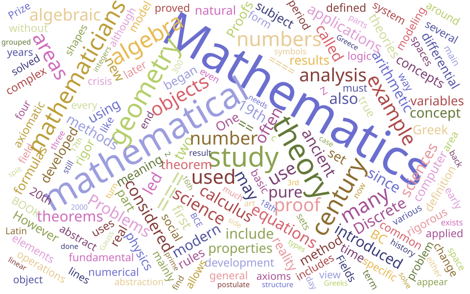
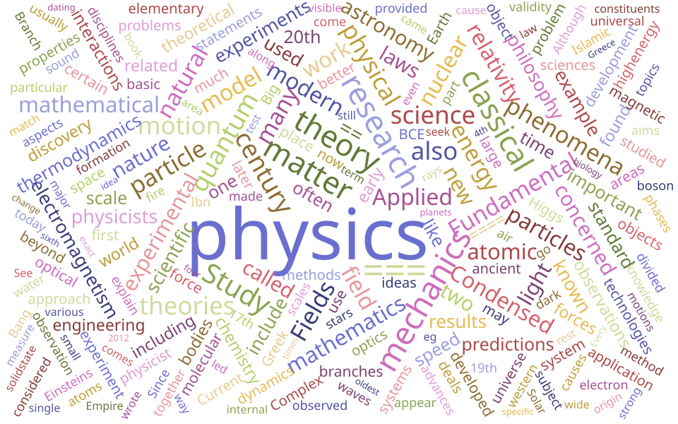

[Cosine similarity](https://en.wikipedia.org/wiki/Cosine_similarity){target=_blank} is a measure of how similar two vectors are that's widely used in textual analysis. The basic idea is that 

- when two normalized vectors are exactly the same, then their dot product is $1$,
- when two normalized vectors are exactly opposite, then their dot product is $-1$,
- when one normalized vector is modified just slightly and then renormalized to obtain a second vector, the dot product of the two vectors should be close to $1$, and 
- when two normalized vectors have little relationship, then their dot product should be close to zero.

Thus, we can use the dot product to measure how closely related two vectors are. I suppose the next question might be - where would these vectors come from in the context of textual analysis? 

Well, let's illustrate the idea by computing similarities between the Wikipedia articles for Mathematics, Physics, Chemistry, Food science, Nutritional science, and Baking.

## Word counts 

One very simple way to translate text into a vector is to simply create a list of word counts for a preset collection of common words.


```{python}
from components.wikiCosineCountSimilarity import build_counts_df, cosine_similarity_matrix
word_counts = build_counts_df([
    "Mathematics","Physics","Chemistry","Food science","Nutritional science","Baking"
])
word_counts
```

I'm sure you've seen exactly this kind of thing used to build word clouds like the following:



---



It's not too hard to find words common to both word clouds.

### Resulting cosine similarity

Now, it's easy to transform the rows of word counts to normalized vectors. You can then compute the pairwise dot products to generate the following matrix of values:

```{python}
import matplotlib.pyplot as plt

cosine_df = cosine_similarity_matrix(word_counts)
plt.figure(figsize=(6, 5))
plt.imshow(cosine_df, cmap="Blues", vmin=0, vmax=1)

# Add tick labels from DataFrame index/columns
plt.xticks(range(len(cosine_df.columns)), cosine_df.columns, rotation=45, ha="right")
plt.yticks(range(len(cosine_df.index)), cosine_df.index)

ax = plt.gca()
# overlay text labels (numeric values)
for i in range(len(cosine_df.index)):
    for j in range(len(cosine_df.columns)):
        value = cosine_df.iloc[i, j]
        color = "black" if value < 0.5 else "white"  # contrast for readability
        ax.text(j, i, f"{value:.2f}", ha="center", va="center", color=color, fontsize=8)

plt.tight_layout()
plt.show()
```

Not surprisingly, the three sciences are closely related, as are the three culinary topics. The relationships between the sciences and the culinary arts seem to be much weaker.

Surely, there must be more that can be said about the relationship between cooking and chemistry?


## Sentence transformers 

While Natural Language Parsing has been developing for decades, the current rage of Large Language Models and their associated chatbots has been largely driven by the innovation of [the Transformer](https://en.wikipedia.org/wiki/Transformer_(deep_learning_architecture)){target=_blank}.

The goal of NLP is to break text into tokens so that the text can be represented mathematically — usually as vectors. The objective then is to use the model to extract meaning from the text. When we use word counting, the tokens are simply words. Words are reasonable tokens for simple models and for many LLMs, but transformers typically use smaller pieces — subwords — as their basic tokens. Parts of words (like *pre* in *pre*med, *pre*calc, or *pre*historic) can be tokens, too. There are many more potential tokens, as well.

The true innovation of the Transformer lies in how text is mapped into a vector space. The coordinates of that vector space don't correspond to tokens, as in the word count example. Rather, the coordinates correspond to the nodes in the final layer of a neural network that's trained to understand the relationships between the tokens. As a result, Transformers can tell when different words mean the same or similar things. This allows the Transformer to recognize similarities that simple word counts miss. 

I'm no expert in this topic but there's a [Python transformer library](https://pypi.org/project/sentence-transformers/){target=_blank} that makes it easy to map text into a 384 dimensional vector space using this process. Here's the resulting cosine similarity between these articles:

```{python}
from components.wikiCosineTransformerSimilarity import cosineTransformerSimilarity

titles = [
    "Mathematics","Physics","Chemistry","Food science","Nutritional science","Baking"
]
S = cosineTransformerSimilarity(titles)
plt.figure(figsize=(6, 5))
plt.imshow(S, cmap="Blues", vmin=0, vmax=1)

# Add tick labels from DataFrame index/columns
plt.xticks(range(len(titles)), titles, rotation=45, ha="right")
plt.yticks(range(len(titles)), titles)

ax = plt.gca()
# overlay text labels (numeric values)
for i in range(len(titles)):
    for j in range(len(titles)):
        value = S[i, j]
        color = "black" if value < 0.5 else "white"  # contrast for readability
        ax.text(j, i, f"{value:.2f}", ha="center", va="center", color=color, fontsize=8)

plt.tight_layout()
plt.show()
```