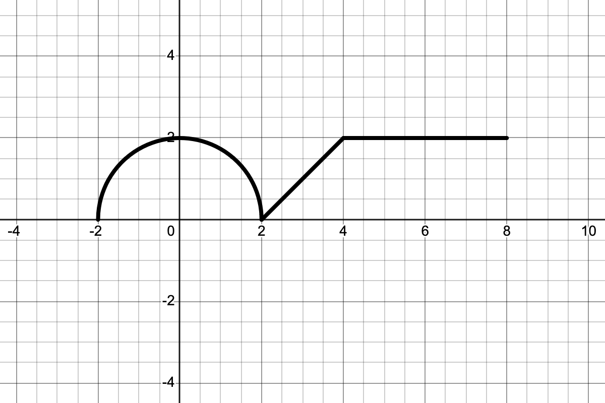
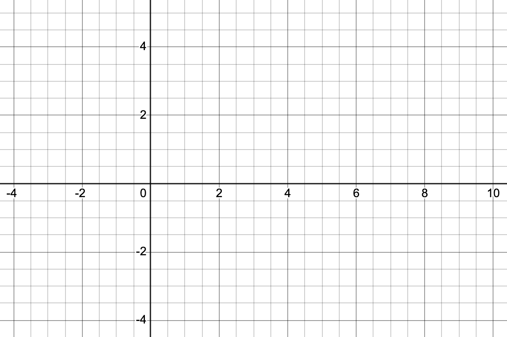

<!-- \vspace{-0.5in} -->

Here are a few more practice problems for our first exam this Friday.

1. Let's suppose that we know that 
$$
\lim_{x\to -1} f(x) = 2 \text{ and } \lim_{x\to-1} g(x) = -3.
$$
What can you say about  
$$\lim_{x\to-1} (4f(x)-2g(x))?$$

2. Write down a complete sentence referring to the intermediate value theorem explaining why 
$$f(x)= \sqrt[3]{x} + \frac{1}{4}x - 2$$
has a root between $x=0$ and $x=8$.

3. Find the derivatives of the following functions using the basic differentiation rules.

   a. $f(x) = 4x^2 - 1$
   b. $f(x) = 42x^{18} - 3x^{15} + 5x^{4} - 10$
   c. $\displaystyle f(x) = \frac{x^4 - 2x^{5/2} - x + \sqrt{x}}{x^2}$.

4. Find the derivative of the following function, *using the definition of the derivative*:
$$f(x) = 4x^2 - 1.$$

5. Let $f(x) = 5x-x^2$.

    a. Sketch the graph of $f$, together with the its tangent line at the point $x=2$.
    b. Find a formula for the tangent line.

\newpage 

6. The graph of the function $f$ is shown in the top part of @fig-sketch below. It consists of a semi-circle and two line segments. Sketch the graph of $f'$ on the axes provided below the graph of $f$.

::: {#fig-sketch layout-ncol=1}

{width=4.5in}

\vspace{0.2in}

{width=4.5in}

The graph of a function, together with an empty pair of axes for problem 6

:::
