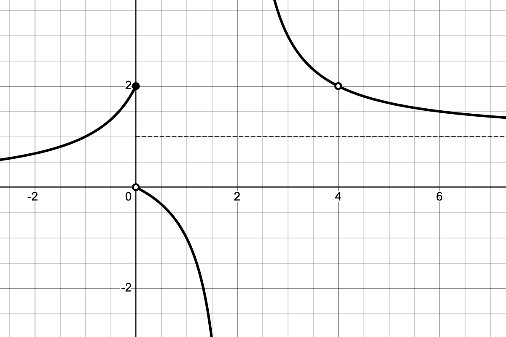

Here are a few more practice problems for our first quiz this Friday.

## Problems 

1. Use a little algebra together with the limit laws to show that
$$
\lim_{x\to2}\frac{x-2}{x^{3} - x^{2} - x - 2} = \frac{1}{7}.
$$
Be sure to write your solution out fully using correct mathematical notation and connectives.

\vspace{3mm}

2. Let $f(x) = 1-x-x^3$. Write a complete sentence referring to the intermediate value theorem *proving* that $f$ has a root between $x=0$ and $x=1$.

\vspace{3mm}

3. Find the values of the following limits quickly and efficiently. You need write only the answer and you generally don't need to simplify.

   a. $\displaystyle \lim_{x\to3} \frac{x^5 - x^2 - x}{2x^2 - 5}.$
   \vspace{2mm}
   b. $\displaystyle \lim_{x\to\infty} \frac{x^2 - x}{2x^2 - 5}.$
   \vspace{2mm}
   c. $\displaystyle \lim_{x\to3}\frac{x^2-6}{(x-3)^2}$

\newpage 

4. The graph of a function $f$ is shown in @fig-limit_graph below. Use that graph to evaluate the following:
   
   a. $\lim_{x\to 0^-}f(x)$
   b. $\lim_{x\to 0^+}f(x)$
   c. $\lim_{x\to 0}f(x)$
   d. $f(0)$
   e. $\lim_{x\to 4^-}f(x)$
   f. $\lim_{x\to 4^+}f(x)$
   g. $\lim_{x\to 4}f(x)$
   h. $f(4)$
   i. $\lim_{x\to\infty}f(x)$ 
  
{#fig-limit_graph fig-align="center" width=80%}

