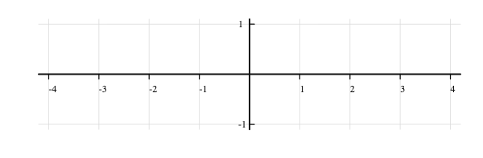
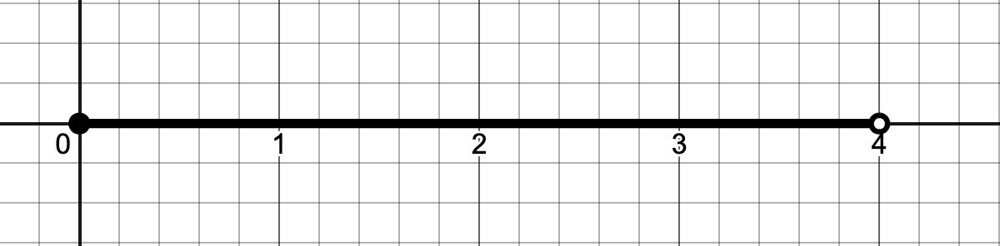
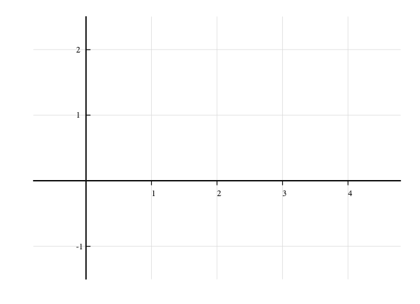

Here are a few problems you should try in order to reacquaint yourself with a bit of precalculus math and familiarize yourself with our notation in Calculus I.

## The problems

1. Define two intervals in set theoretic notation as
$$A = \{x\in\mathbb R: -1<x\leq 2\} \text{ and } B = \{x\in\mathbb R: -3<x\leq 1\}.$$
Draw the set $S = A\cap B$ on the set of axes shown in @fig-empty_axes.
Note that $S$ should be an interval; be sure to indicate whether the endpoints are half-open or half closed.

2. Write down the half open interval shown in @fig-half_open_interval in set theoretic notation.

3. Let $I=\{x\in\mathbb R: 0 \leq x < 4\}$ and define $f:I\to\mathbb R$ by $f(x) = \frac{1}{2} (x^2-3x)$. Sketch the graph of $f$ on the empty axes in @fig-empty_axes2.

4. Find an equation for the line containing the points $(-1,-1)$ and $(5,2)$.

5. Simplify the rational expression
$$\frac{x^3 - 2x^2 + 2x - 1}{x-1}$$
to a polynomial. Be sure to explain your work, indicating:
   a. How the numerator factors and
   b. Any assumptions that must be made for the original rational expression to equal a polynomial

\newpage 

## Figures 

{#fig-empty_axes fig-align="center" width=80%}

{#fig-half_open_interval fig-align="center" width=80%}

{#fig-empty_axes2 fig-align="center" width=80%}
