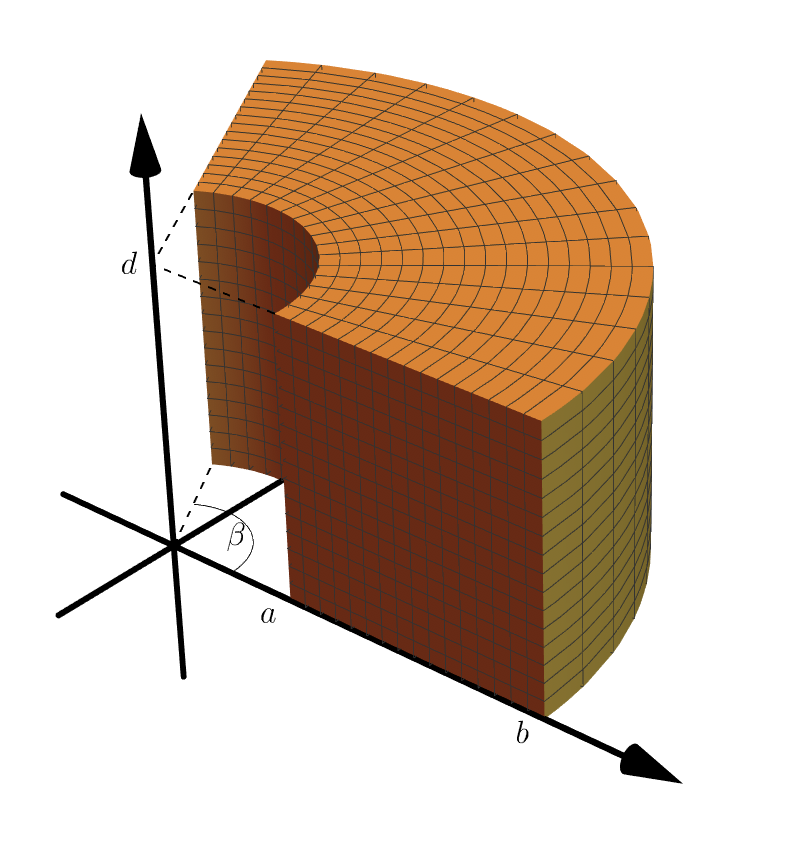
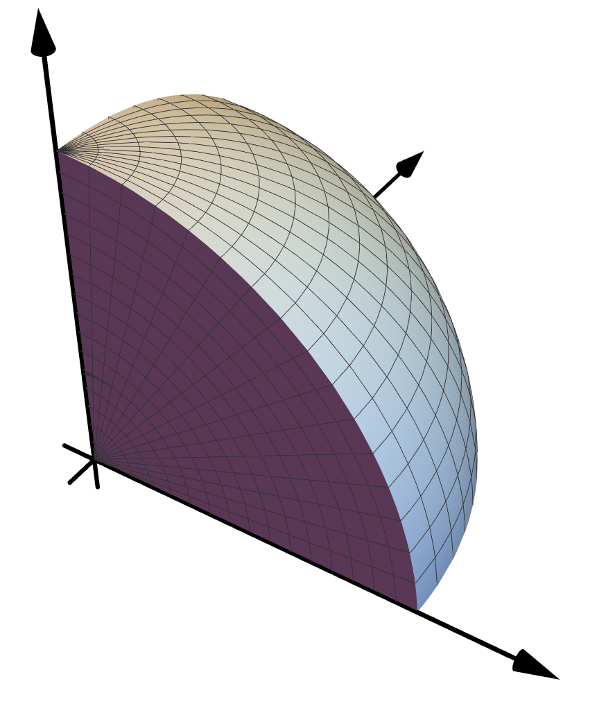
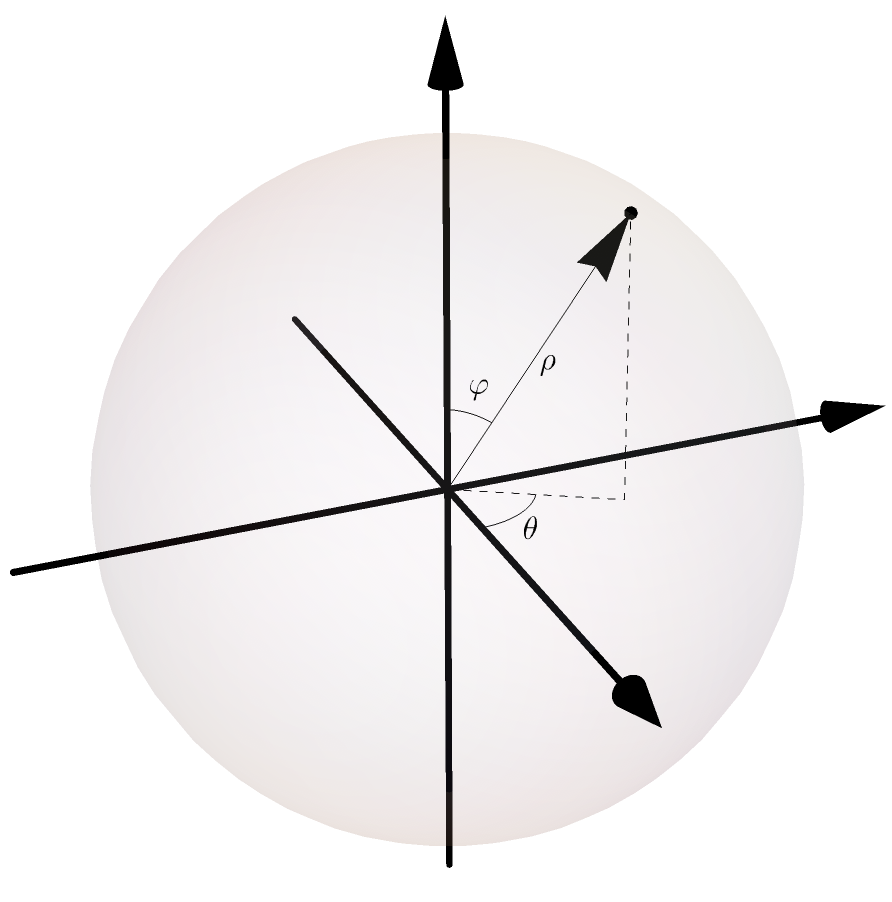

Here's a summary of the three new types of coordinate systems (polar, cylindrical, and spherical) that we've seen for integration. There's also a couple of example problems of each for us to try together.

## Polar coordinates 

Works great with regions bound by circular arcs centered at the origin and rays emanating from the origin:

```{python}
#| echo: false
#| fig-pos: "htbp"
from images.polar_wedge import make_polar_wedge
make_polar_wedge()
```
These types of regions have bounds like 
$$a\leq r \leq b \text{ and } \alpha \leq \theta \leq \beta,$$
which correspond to double integrals that translate like 
$$
\color{green}{\iint_R} \color{blue}{f(x,y)} \, \color{red}{dA} \: \color{black}{\to} \: \color{green}{\int_{\alpha}^{\beta} \int_a^b} \color{blue}{F(r,\theta)} \: \color{red}{r \, dr \, d\theta},
$$
where 
$$F(r,\theta) = f(r\cos(\theta), r\sin(\theta))$$
or just $r^2 = x^2 + y^2$.

### Polar examples 

Polar coordinates might help for integrals like 

- $\displaystyle \iint\limits_D (4-(x^2+y^2)) \, dA$ where $D$ is the portion of the disk of radius 2 centered at the origin that lies in the first quadrant.
- $\displaystyle \iint\limits_{D_R} e^{-(x^2+y^2)} \, dA$ where ${D_R}$ is the disk of radius $R$ centered at the origin.

\newpage

## Cylindrical coordinates 

Cylindrical coordinates look a lot like polar coordinates + $z$. The work great with spatial regions that are extrusions of polar regions along the $z$-axis, like so:

:::{style="max-width: 400px"}

:::

This type of region has bounds like
$$
a \leq r \leq b, \quad \alpha \leq \theta \leq \beta, \quad c \leq z \leq d.
$$
We can set this up as an iterated integral like so:
$$
\color{green}{\iiint_R}
\color{blue}{f(x,y,z)} \,
\color{red}{dV}
\color{black}{=}
\color{green}{\int_{\alpha}^{\beta} \int_c^d \int_a^b}
\color{blue}{f(r\cos(\theta), r\sin(\theta), z)}
\,
\color{red}{r \, dr \, dz \, d\theta}
$$

Things shouldn't be too complicated if the $z$ bounds involve functions of $r$ and $\theta$, to get a region like 
$$
a \leq r \leq b, \quad \alpha \leq \theta \leq \beta, \quad g(r,\theta) \leq z \leq h(r,\theta).
$$
An example there could be 
$$
\{(r,\theta,z): 0 \leq z \leq 4-r^2\},
$$
which looks like 

:::{style="max-width: 500px"}

:::

### Cylindrical examples 

- Let $R$ denote the region in the first octant contained in the cylinder of radius $2$ centered on the $z$ axis and bound above by $z=5$. Compute 
$$\iiint\limits_R (2x^2 + 2y^2 + z) \, dV.$$
- Let $R$ denote the region bound between the paraboloid $z=x^2+y^2$ and the plane $z=9$. Set up 
  $$\iiint\limits_R f(x,y,z) \, dV$$
  as an iterated integral in cylindrical coordinates.

\newpage

## Spherical coordinates 

Spherical coordinates work well with regions bound by portions of spheres centered at the origin. Here's one example:

:::{style="max-width: 500px"}

:::


These regions have the form 
$$
\alpha \leq \theta \leq \beta, \quad
\gamma \leq \varphi \leq \delta, \quad
a \leq \rho \leq b.
$$

When setting this type of integral up, remember that 

- $\rho$ denotes the distance to the origin,
- $\varphi$ denotes the angle from the positive $z$-axis,
- $\theta$ denotes the usual polar angle.

:::{style="max-width: 500px"}

:::

We can set up an integral over a region like this via 
$$
\color{green}{\iiint_R}
\color{blue}{f(x,y,z)} \,
\color{red}{dV}
\color{black}{=}
\color{green}{\int_{\alpha}^{\beta} \int_{\gamma}^{\delta} \int_a^b}
\color{blue}{f(\rho\sin(\varphi)\cos(\theta), \rho\sin(\varphi)\sin(\theta), \rho\cos(\varphi))}
\,
\color{red}{\rho^2 \sin(\varphi)\, d\rho \, d\varphi \, d\theta}.
$$
Often, the integrand depends on $x^2+y^2+z^2$, which can be translated directly to $\rho^2$.

### Spherical examples 

- Let $R$ denote the region inside the sphere is radius $2$, outside the sphere of radius $1$, and above the $xy$-plane. Evaluate 
  $$\iiint\limits_R (x^2+y^2+z^2)^3 \, dV.$$
- Let $R$ denote the region inside the unit sphere. Evaluate 
  $$\iiint\limits_R (x^2+y^2+z^2) \, dV.$$