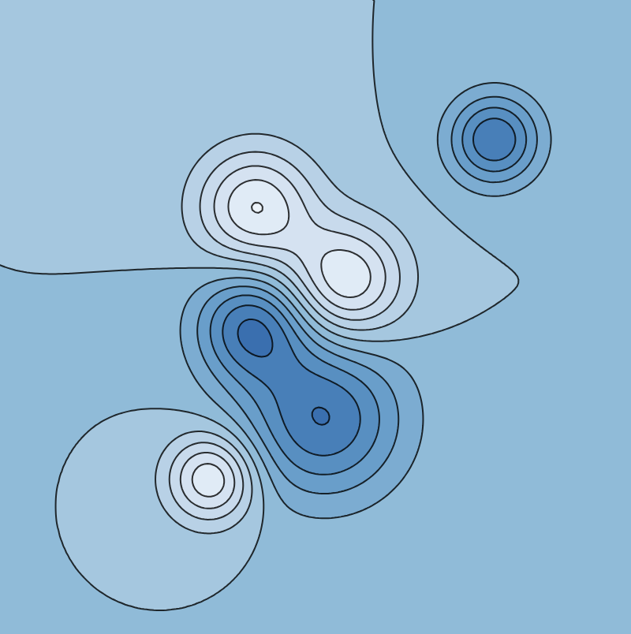
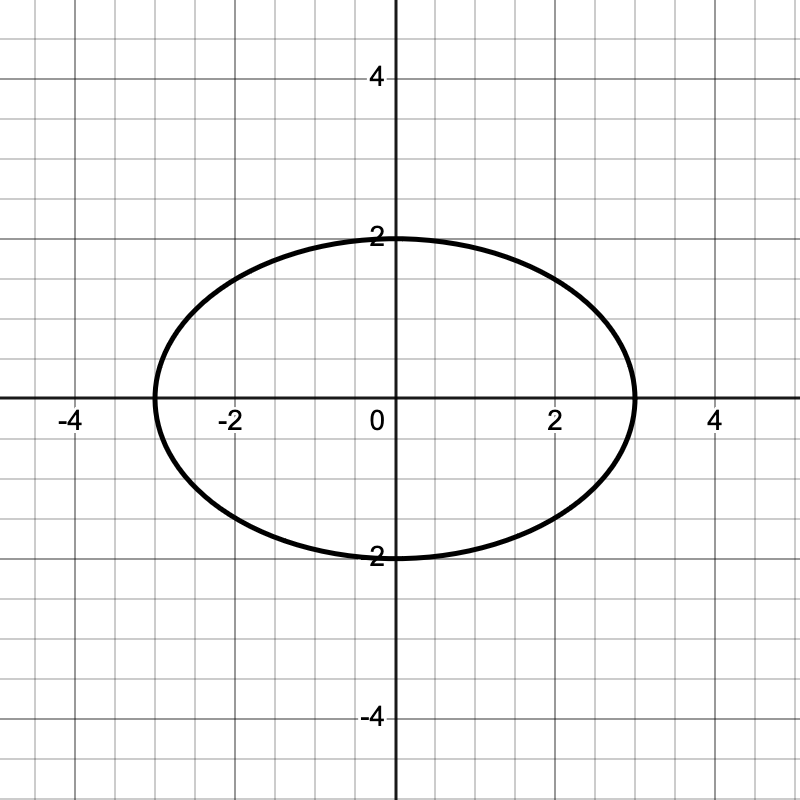
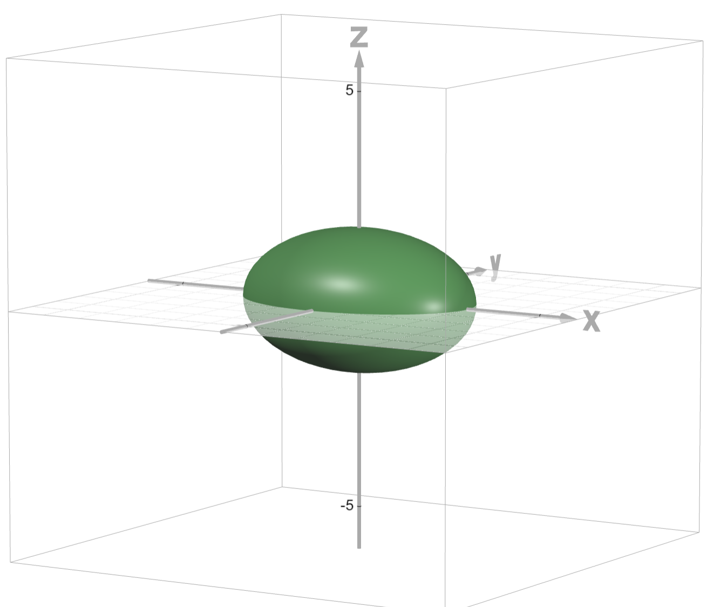
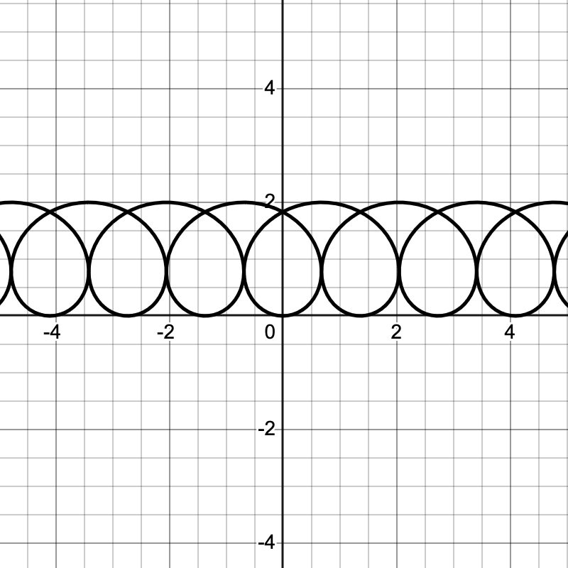
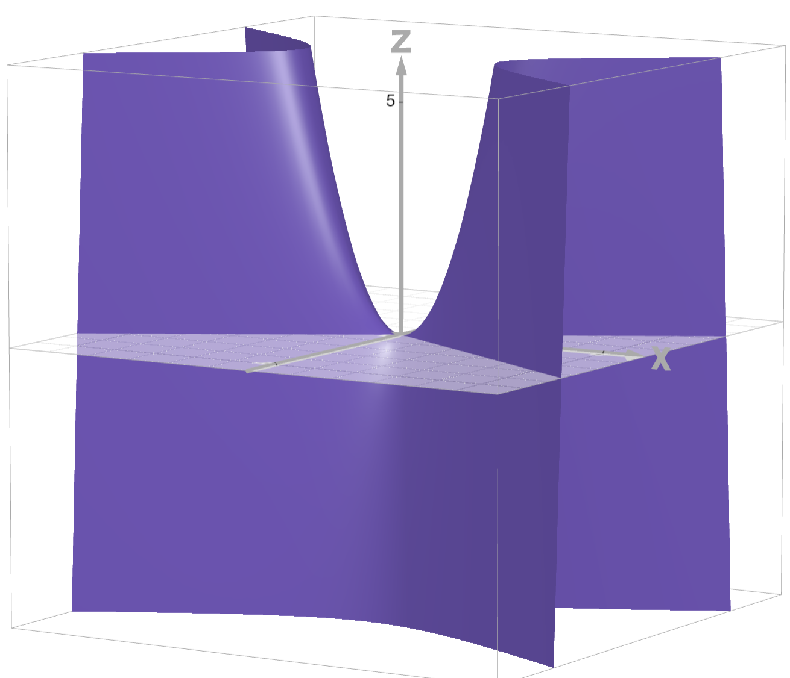
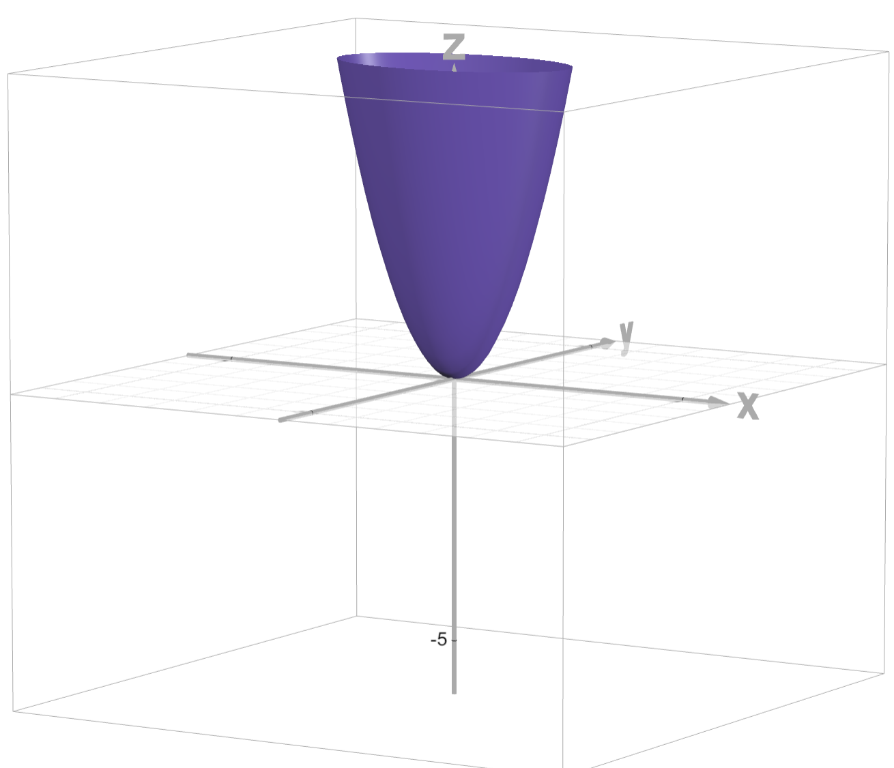
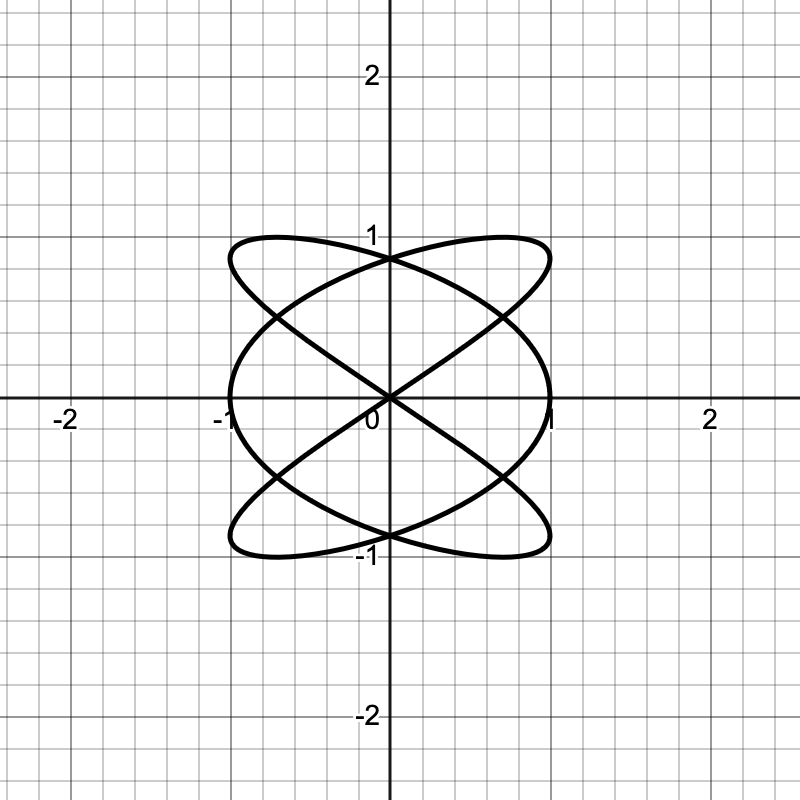
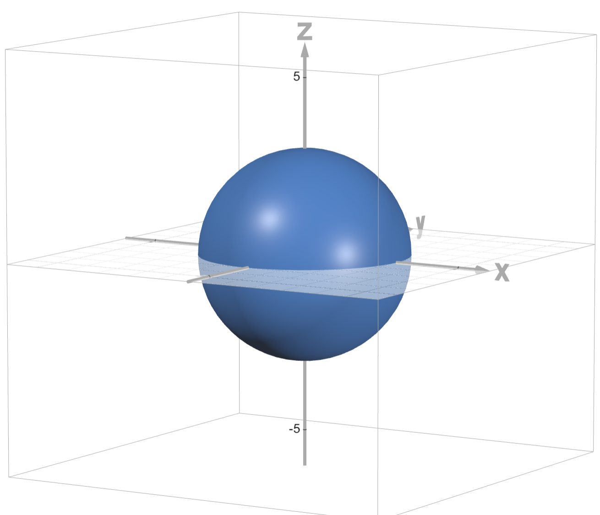
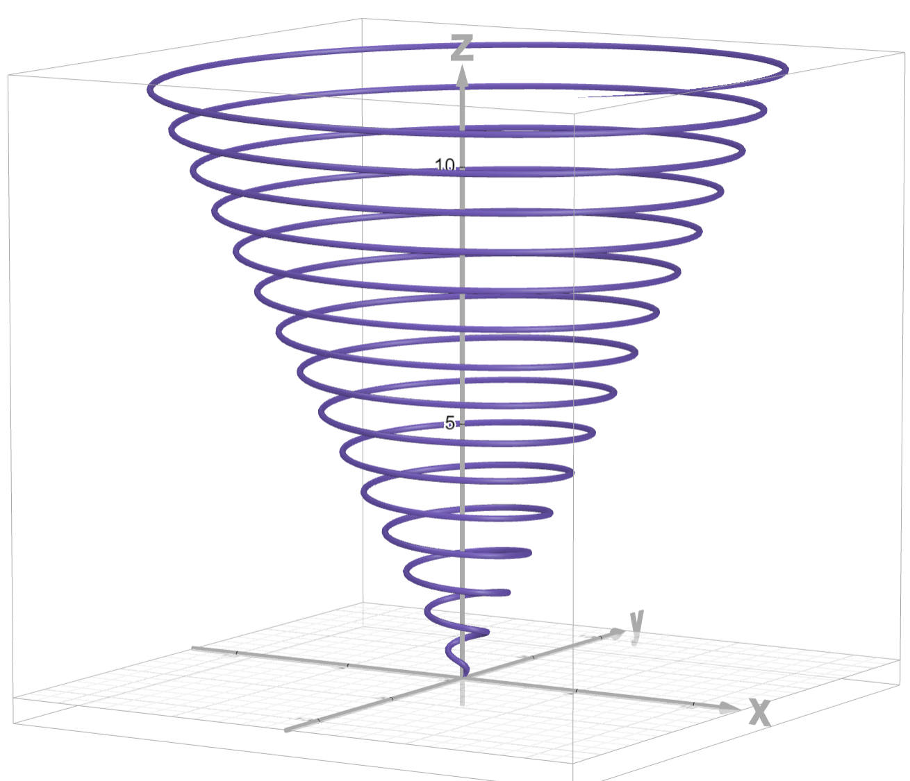
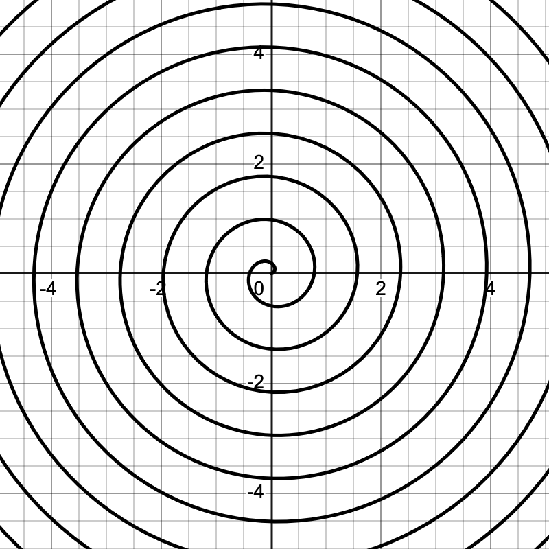

\vspace{-0.7in}
We have our first exam in two days - this Friday, February 13. These problems form an opportunity for you to write down a few solutions for me to see.

## The problems

1. Let $\vec{u} = \langle 2,-1 \rangle$ and let $\vec{v} = \langle 3,1 \rangle$. 
   a. Draw the vectors $\vec{u}$ and $\vec{v}$ emanating from the same point.
   b. Express $\vec{u}$ as a sum of two vectors: One vector parallel to $\vec{v}$ and the other perpendicular to $\vec{v}$.
   c. Draw those two vectors from part (b) on your picture.

6. Suppose that two objects move in uniform, linear motion in space according to the parameterizations 
$$
\vec{p}(t) = \langle 2 + t, -t, 4 + 2 t \rangle
\text{ and }
\vec{q}(t) = \langle t, -2 + 3 t, -1 + 3 t \rangle.
$$
   a. Do the objects collide? If so, where and when?
   b. Do the paths intersect? If so, where?

8. Suppose the position of an object is parameterized by $\vec{p}(t) = \langle \sin(3t), e^{-t^2}, t\cos(t) \rangle$. Express the total distance traveled by the object over the time interval $[0,2\pi]$ as a definite integral.

11. @fig-contours shows a contour plot. Identify any local maxima, minima or saddle points that you see on that figure.

12. Match the groovy function, equation, or parameterization below with the groovy plot that you see in @fig-graphs. 

    a. $\:\:\displaystyle \vec{p}(t) = t\left\langle\sin\left(8t\right),\cos\left(8t\right),1\right\rangle$
    i. $\:\:\displaystyle x^{2}+y^{2}+z^{2}=9$
    d. $\:\:\displaystyle \vec{p}(t) = \left\langle t-\sin\left(4.6t\right),1-\cos\left(4.6t\right)\right\rangle$
    e. $\:\:\displaystyle \vec{p}(t) = t\left(\cos\left(8t\right),\sin\left(8t\right)\right)$
    f. $\:\:\displaystyle f(x,y) = x^{2}-3y^{2}$
    b. $\:\:\displaystyle \vec{p}(t) = \left\langle3\cos\left(t\right),2\sin\left(t\right)\right\rangle$
    g. $\:\:\displaystyle f(x,y) = x^{2}+3y^{2}$
    c. $\:\:\displaystyle \vec{p}(t) = \left\langle\cos\left(3t\right),\sin\left(2t\right)\right\rangle$.
    h. $\:\:\displaystyle x^{2}+2y^{2}+3z^{2}=9$

\newpage 

## Figures

{#fig-contours fig-align="center" style="max-width: 500px; margin: 0 auto 10px auto"}

::: {#fig-graphs layout="[[5,-1,5,-1,5]]"}

Groovy graphs
:::
