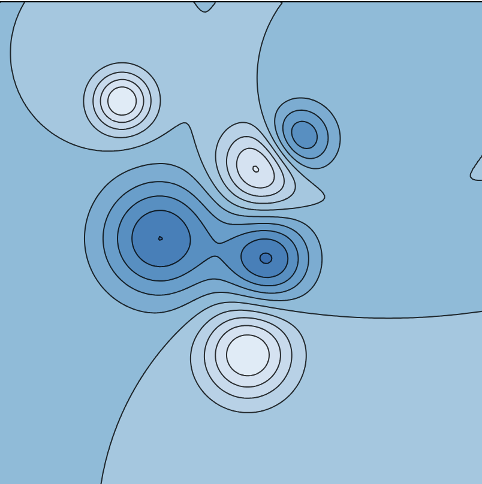
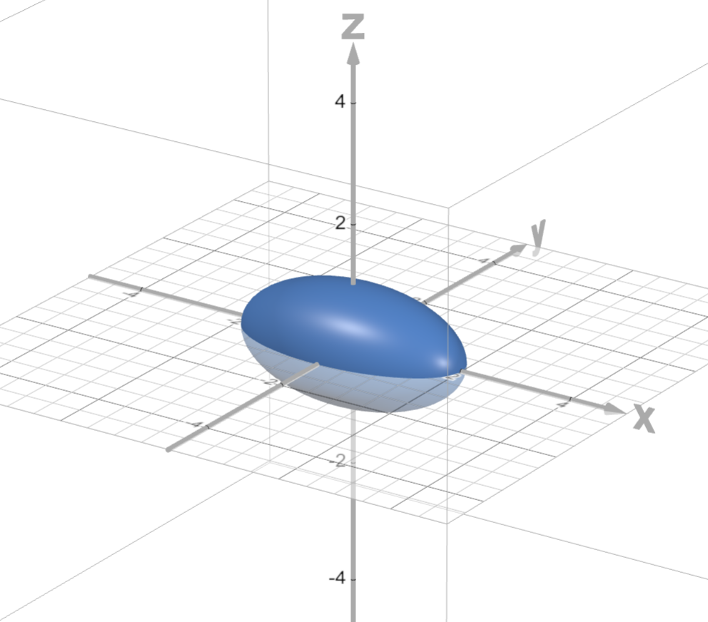
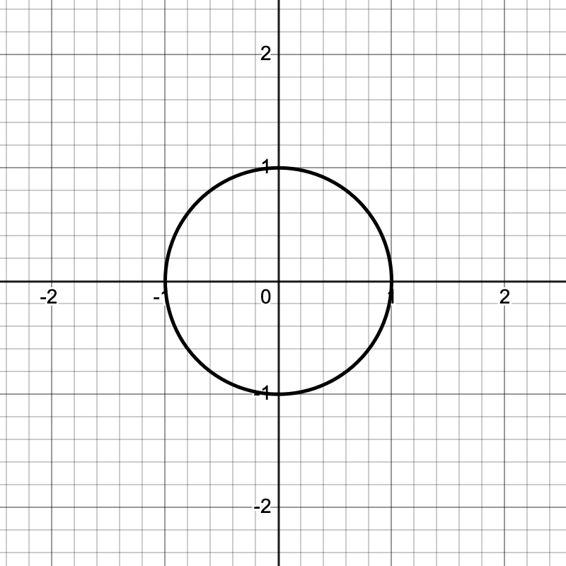
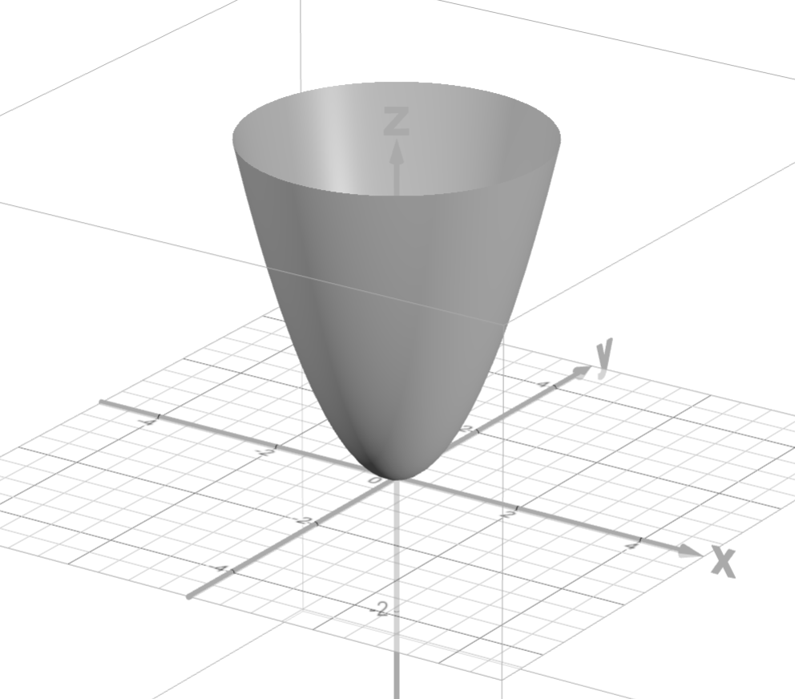
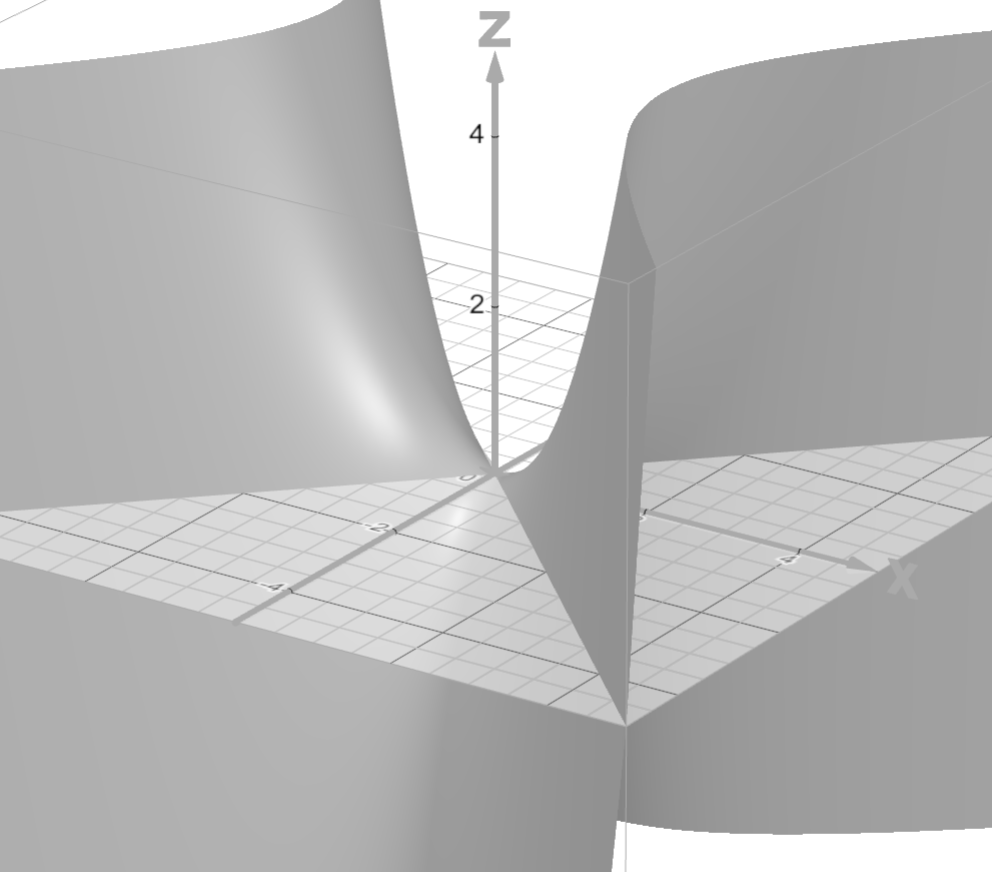
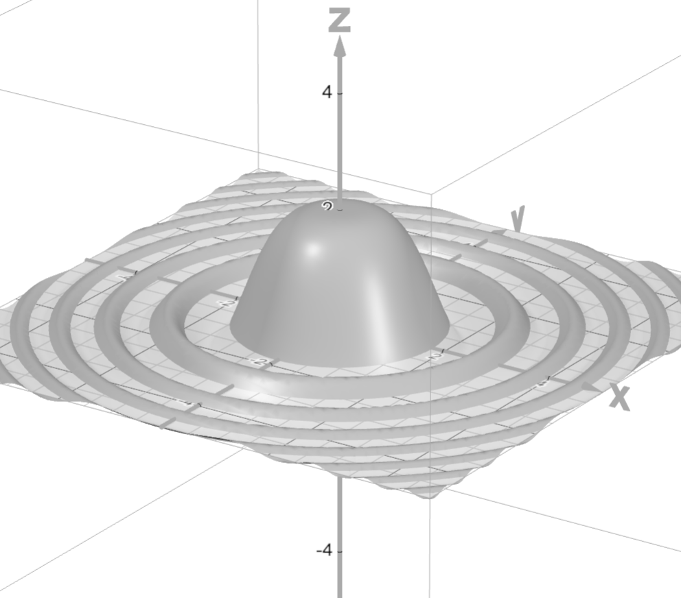
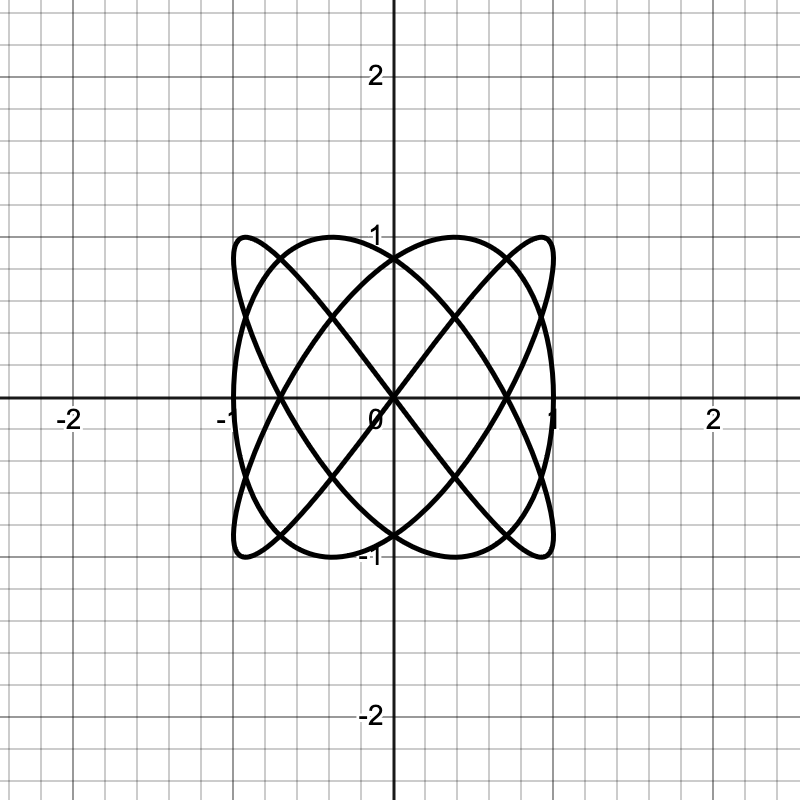
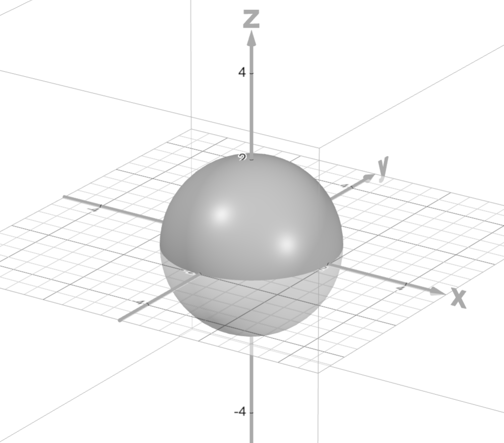
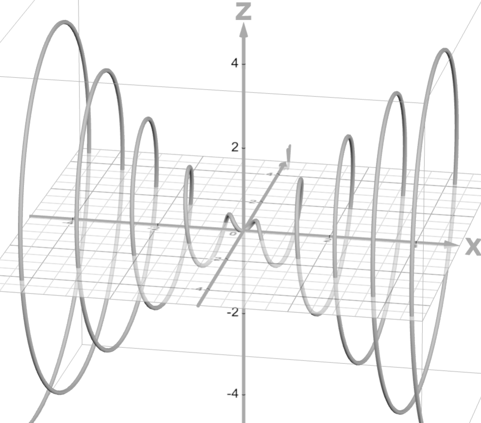
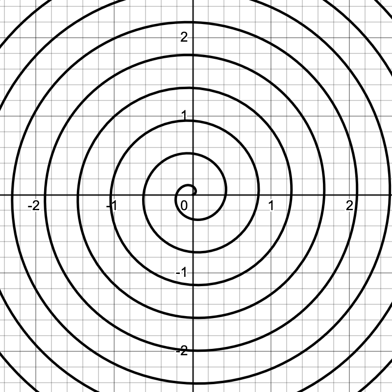

We have our first exam this coming Friday, February 13. The problems on the exam will have a lot in common with the following problems.

::: {.content-visible when-format="html"}

If you have questions about any of the problems on this sheet, you can use the Reply on Discourse button down below.

:::

## The problems

1. Let $\vec{u} = \langle 1,2 \rangle$ and let $\vec{v} = \langle 4,1 \rangle$. 
   a. Draw the vectors $\vec{u}$ and $\vec{v}$ emanating from the same point.
   b. Express $\vec{u}$ as a sum of two vectors: One vector parallel to $\vec{v}$ and the other perpendicular to $\vec{v}$.
   c. Draw those two vectors from part (b) on your picture.

2. Suppose that a force vector $\vec{F} = \langle 1,3,-1 \rangle$ induces a displacement $\vec{d} = \langle 2,2,2 \rangle$. Find the work done by $\vec{F}$ in this process.

3. Find an equation of the plane containing the three points 
$$\{(1,1,1), (3,2,1), (2,-2,4)\}.$$
   If there is no such unique plane, then explain clearly why.

4. Find the point or points of intersection between the line 
$$\vec{\ell}(t) = \langle 1,0,1 \rangle + \langle 3,1,1 \rangle t
\text{ and the plane } 3x-y+2z = 4.$$
   If there is no such point, then explain clearly why.

5. Find the point or points of intersection between the helix 
$$
\vec{p}(t) = \langle t,\cos(\pi t), \sin(\pi t) \rangle
\text{ and the ellipsoid } 
x^2 + 4y^2 + 4z^2 = 4.
$$
   If there is no such point, then explain clearly why.

\newpage 

6. Suppose that two objects move in uniform, linear motion in space according to the parameterizations 
$$
\vec{p}(t) = \langle 2 + t, 3 + t, 3 + 2 t \rangle
\text{ and }
\vec{q}(t) = \langle 2 - t, 2 t, -2 + 3 t \rangle.
$$
   a. Do the objects collide? If so, where and when?
   b. Do the paths intersect? If so, where?

7. Consider the plane $2x + 2y - z = 3$.
   a. Show that the point $(1,1,1)$ is on the plane.
   b. Parameterize the circle of radius $2$ that's contained in the plane and centered at $(1,1,1)$.

8. Suppose the position of an object is parameterized by $\vec{p}(t) = \langle \cos(3t), \sin(5t), \sin(7t)\cos(11t) \rangle$. Express the total distance traveled by the object over the time interval $[0,2\pi]$ as a definite integral.

9. Let $\vec{p}(t) = \langle t,\cos(\pi t), \sin(\pi t) \rangle$ parameterize the motion of an object along a helix. Find the TNB frame for that object.

10. Consider the motion parameterized by
$$\vec{c}(t) = \langle 2\cos(t), \sqrt{2}\sin(t), \sqrt{2}\sin(t) \rangle.$$
    a. Show that $\|\vec{c}(t)\|$ is constant.
    b. Show that $\vec{c}(t) \perp \vec{c}'(t)$.

11. @fig-contours shows a contour plot. Identify any local maxima, minima or saddle points that you see on that figure.

12. Match the groovy function, equation, or parameterization below with the groovy plot that you see in @fig-graphs. 

    a. $\:\:\displaystyle x^{2}+y^{2}+z^{2}=4$
    b. $\:\:\displaystyle f(x,y) = x^{2}+y^{2}$
    c. $\:\:\displaystyle \vec{p}(t) = \left\langle\cos\left(t\right),\sin\left(t\right)\right\rangle$.
    d. $\:\:\displaystyle \vec{p}(t) = t\left\langle\cos\left(15t\right),\sin\left(15t\right)\right\rangle$
    e. $\:\:\displaystyle \vec{p}(t) = t\left\langle 1,\cos\left(6t\right),\sin\left(6t\right)\right\rangle$
    f. $\:\:\displaystyle f(x,y) = 2\frac{\sin\left(x^{2}+y^{2}\right)}{x^{2}+y^{2}}$
    g. $\:\:\displaystyle f(x,y) = x^{2}-y^{2}$
    h. $\:\:\displaystyle x^{2}+4y^{2}+4z^{2}=4$
    i. $\:\:\displaystyle \vec{p}(t) = \left\langle\cos\left(3t\right),\sin\left(4t\right)\right\rangle$

\newpage 

## Figures

{#fig-contours fig-align="center" style="max-width: 500px; margin: 0 auto 10px auto"}

::: {#fig-graphs layout="[[5,-1,5,-1,5]]"}



















Groovy graphs
:::

::: {.content-visible when-format="html"}

## Your questions and answers 

If you’d like to ask a question about or reply to a question on this sheet, you can do so by pressing the “Reply on Discourse” button below.

```{ojs}
embedDiscourseMathTopic(93)
```

```{ojs}
import {embedDiscourseMathTopic} from '/components/EmbedDiscourseMathTopics/embedDiscourseMathTopic.js';
```

:::
