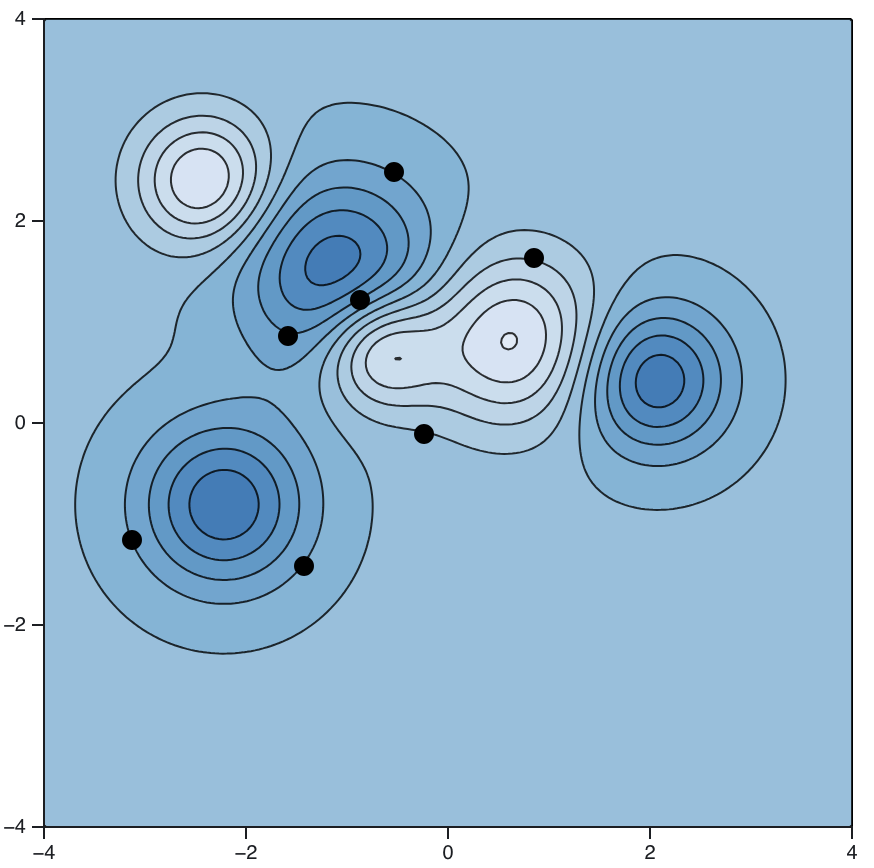

We have our second exam next Friday, April 3. The problems on the exam will have a lot in common with the following problems.

::: {.content-visible when-format="html"}

If you have questions about any of the problems on this sheet, you can use the Reply on Discourse button down below.

:::

## The problems


1. Let $f(x,y)=x y^3$.
   a. Compute $\nabla f$.
   b. From the point $(2,1)$, in what direction $\vec{u}$ is $f$changing the fastest?
   c. From the point $(2,1)$, is there any direction $\vec{u}$ so that $D_{\vec{u}}f(2,1)=10$?

2. Find all points on the curve $x^2+y^2-x y=4$ where a normal vector to the curve is perpendicular to the vector $\langle 1,2\rangle$.

3. Find and classify the critical points of the function
	$f(x,y)=x^3-6 x y-y^2$.

4. Find the equation of the plane tangent to the graph of
	$2x^2 - y^2 + z^2 = 8$ at the point $(2,1,1)$.

5. A contour plot with several points indicated is shown in @fig-gradient_sketch. Sketch the gradient vectors for those points right on top of the plot. Be sure to pay attention to the direction and relative magnitude of those vectors.

6. Evaluate the following double integrals.

	 a. $\displaystyle \int _0^2\int _0^16x^2ydxdy$
   b. $\displaystyle \iint\limits_{D} x^2 \, dA$, where $\text{\textit{$D$}}$ is the region in the plane bound between $\text{\textit{$y$}}=\text{\textit{$x$}}^2$ and $\text{\textit{$y$}}=4$.
   c. $\displaystyle \int _0^1\int _y^1\sin \left(x^2\right)dxdy$

7. Let $D$ denote the solid pyramid with vertices located at $(5,0,0)$, $(0,3,0)$, $(0,0,2)$, and the origin. Set up an iterated integral to represent the volume of $D$.

8. Find the volume trapped under the graph of the function $f(x,y)=9-\left(x^2+y^2\right)$ and over the $x y$-plane.

9. Let $R$ denote the region between $f(x,y) = 9-(x^2+y^2)$. Evaluate
	$$
	\iiint_R (x^2+y^2)z \, dV.
	$$

10. Let $\text{\textit{$R$}}$ denote the top half of a sphere of radius 2. Set up the triple integral of the arbitrary function $\text{\textit{$f$}}$ in spherical coordinates.

11. Let $D$ denote the three-dimensional domain above the cone $z=\sqrt{x^2+y^2}$ and inside the sphere $x^2+y^2+z^2\leq 4$. Evaluate
	$$\displaystyle \iiint\limits_{D} (x^2 + y^2 + z^2) \, dV.$$

12. Find the volume under the surface $f(x,y) = \cos \left(x^2+y^2\right)+1$ and over the disk $x^2+y^2\leq 3\pi$.

13. Express $(1+i)^{100}$ as a real number.

14. Find the roots of $x^2 + 2x + 2 = 0$.


## Images

::: {style="max-width: 550px"}
{#fig-gradient_sketch}
:::

::: {.content-visible when-format="html"}

## Your questions and answers 

If you’d like to ask a question about or reply to a question on this sheet, you can do so by pressing the “Reply on Discourse” button below.

```{ojs}
embedDiscourseMathTopic(125)
```

```{ojs}
import {embedDiscourseMathTopic} from '/components/EmbedDiscourseMathTopics/embedDiscourseMathTopic.js';
```

:::
