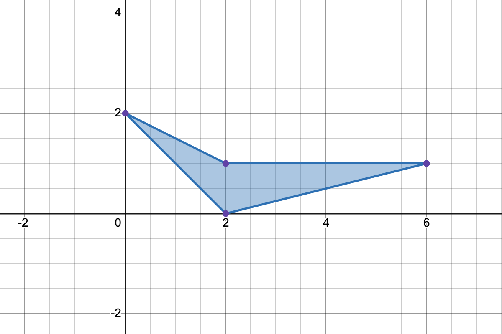
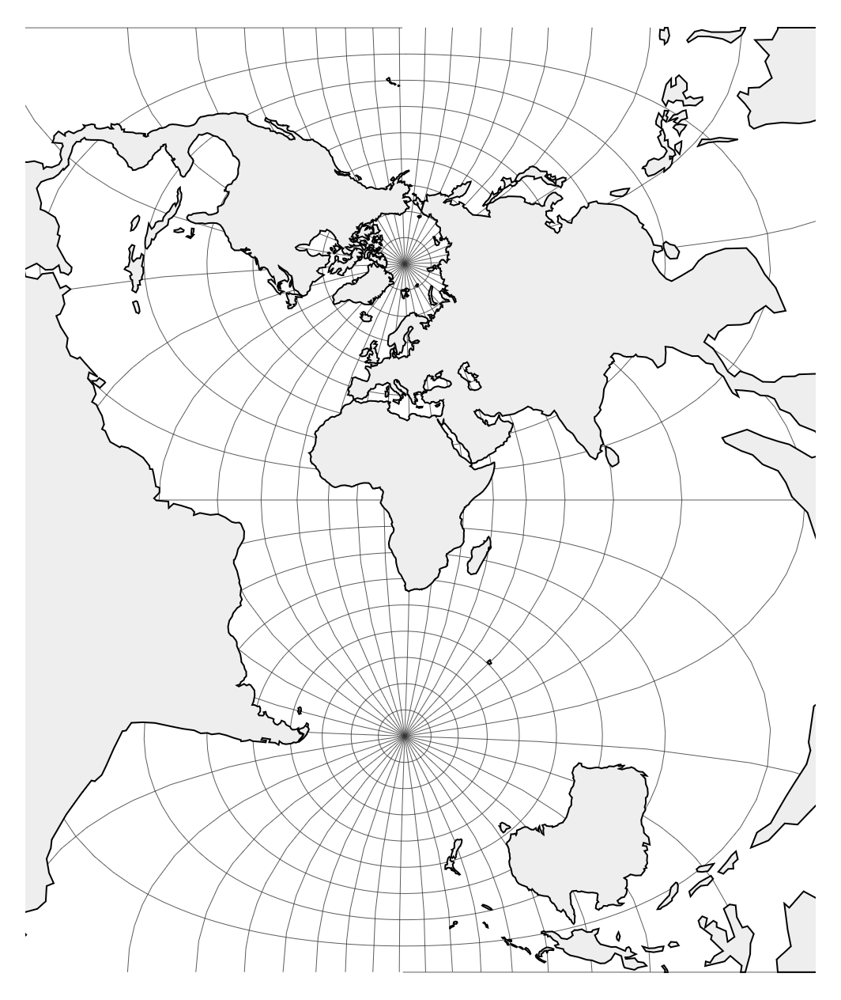

\vspace{-0.5in}

We have our second exam in two days - this Friday, April 24. These problems form an opportunity for you to write down a few solutions for me to see.

Of course, you should still work out the full review for exam 3 to the best of your ability, since it represents the full gamut of material you might expect. We already practiced th material on the new coordinate systems in class on Monday. This sheet focuses on prior material and a couple of other tricky items. Inclusion or exclusion on this sheet makes a problem no more or less likely to appear on the exam itself.

## The problems

1. Let $C$ denote the curve
   $$\vec{r}(t) = \langle t^2,t^3  \rangle$$
   where $0 \leq t \leq 3$ and let
   $$\vec{F}(x,y) = \langle xy,x^2 \rangle.$$
   Compute 
   $$\int_C \vec{F}\cdot d\vec{r}$$

2. Use Green's theorem to compute
   $$\oint_C 2xy \, dx - x^2 \, dy,$$
   where $C$ is the positively oriented boundary of the rectangle with vertices $(0,0)$, $(2,0)$, $(2,1)$, and $(0,1)$.

3. Let $\vec{F}$ denote the conservative vector field
   $$\vec{F}(x,y) = \left\langle 2 xy + 1, x^2\right\rangle.$$
   Find a potential function $f$ for $\vec{F}$ and use it to compute
   $$\int_C \vec{F}\cdot d\vec{r},$$
   where $C$ is a path from the origin to the point $(-2,1)$.

4. Let $$\vec{F}(x,y,z) = \langle x^2, y^3, z \rangle.$$
   Use the divergence theorem to compute
   $$\int_S \vec{F}\cdot d\vec{n},$$
   where $S$ is the surface of the outward oriented unit cube.

5. Use Green's area theorem to express the area of the polygon shown in @fig-poly as a sum of four terms. You do not need to simplify it down to a single number.

6. The equi-rectangular projection is the cylindrical projection defined by $T(\varphi ,\theta )=(\theta ,\varphi )$. Compute the general distortion factors $M_p$ and $M_m$ for $T$ as functions of $\varphi$ and $\theta$. Use this to explain why the equi-rectangular projection is neither conformal nor equal area.

7. A transverse Mercator projection with the standard graticule is shown in @fig-projection. Could this map potentially be conformal? State clearly exactly what property of this map guides your decision and why.

## Images

{#fig-poly width=80%}

{#fig-projection}
