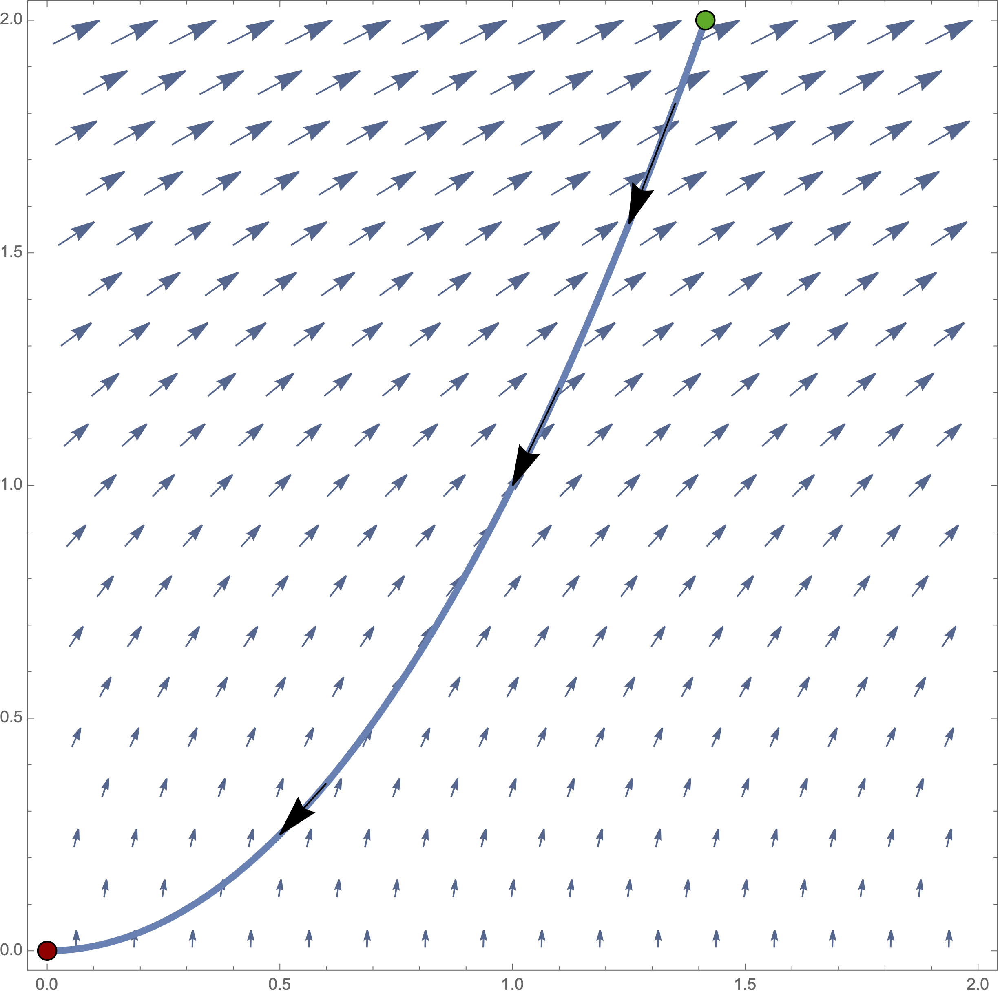
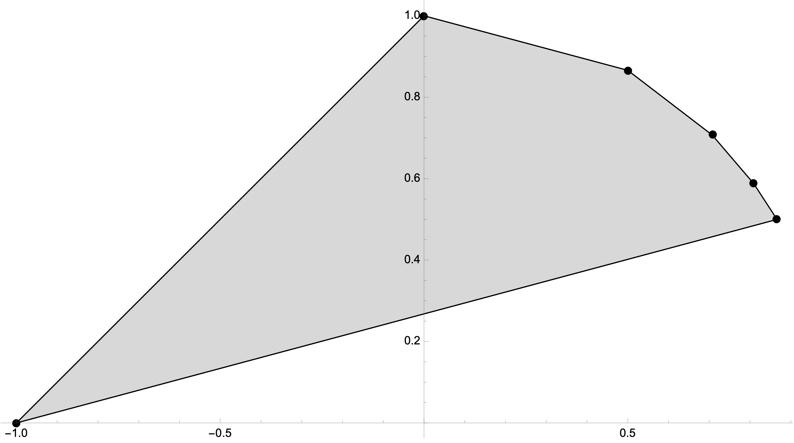
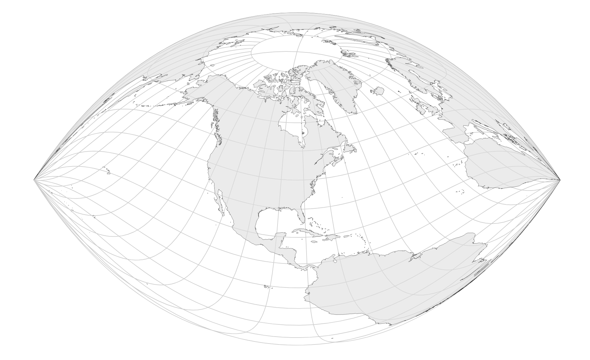

We have our third exam next Friday, April 24. The problems on the exam will have a lot in common with the following problems.

::: {.content-visible when-format="html"}

If you have questions about any of the problems on this sheet, you can use the Reply on Discourse button down below.

:::

## The problems


1. Let $C$ denote the curve
   $$\vec{r}(t) = \langle t^2,t \rangle$$
   and let
   $$\vec{F}(x,y) = \langle y,x \rangle.$$
   Compute $$\int_C \vec{F}\cdot d\vec{r}.$$

2. Consider the vector field $\vec{F}$ and curve $C$ shown in the figure below. Is
   $$\int_C \vec{F} \cdot d\vec{r}$$
   positive or negative? Why?

3. Use Green's theorem to compute
   $$\oint_C 2x \, dx - x \, dy,$$
   where $C$ is the positively oriented boundary of the rectangle with vertices $(0,0)$, $(3,0)$, $(3,2)$, and $(0,2)$.

\newpage 

4. Let $\vec{F}$ denote the conservative vector field
   $$\vec{F}(x,y) = \left\langle 2 x y^3+1,3 x^2 y^2+1\right\rangle.$$
   Find a potential function $f$ for $\vec{F}$ and use it to compute
   $$\int_C \vec{F}\cdot d\vec{r},$$
   where $C$ is a path from the origin to the point $(1,1)$.

5. Let $$\vec{F}(x,y,z) = \langle x, y, z^2 \rangle.$$
   Use the divergence theorem to compute
   $$\int_S \vec{F}\cdot d\vec{n},$$
   where $S$ is the surface of the outward oriented unit cube.

6. Let $E$ denote the positively oriented ellipse $x^2 + 4y^2 = 4$.
   
   a. Set up and evaluate the integral
   $$\oint_E 0 \, dx + x \, dy.$$
   b. Use Green's theorem to interpret your integral computation in terms of area.

7. The polygon shown in @fig-poly has six vertices and six edges. Thus, I guess it's an irregular hexagon. Its edges are at the points
   $$
     (\cos(i \pi/6),\sin(i \pi/6)), \: \text{ for } \, i = 1\ldots 6.
   $$
   Write down a formula for the area of the polygon in terms of the vertices.  
   I think it might make a lot of sense to use a summation notation here.

8. The equi-rectangular projection is the cylindrical projection defined by $T(\varphi ,\theta )=(\theta ,\varphi )$. Compute the general distortion factors $M_p$ and $M_m$ for $T$ as functions of $\varphi$ and $\theta$. Use this to explain why the equi-rectangular projection is neither conformal nor equal area.

9. Mercator's projection is the cylindrical projection defined by $T(\varphi ,\theta )=(\theta ,\ln (|\sec (\varphi )+\tan (\varphi )|))$. Compute the general distortion factors $M_p$ and $M_m$ for $T$ as functions of $\varphi$ and $\theta$. Use this to prove that Mercator's projection is conformal.

10. Lambert's equal area, cylindrical projection is the cylindrical projection defined by $T(\varphi ,\theta )=(\theta ,\sin (\varphi ))$. Compute the general distortion factors $M_p$ and $M_m$ for $T$ as functions of $\varphi$ and $\theta$. Use this to prove that Lambert's projection is equal area.

11. The Craig retroazimuthal projection with the standard graticule is shown in @fig-craig_football. Is this map conformal? State clearly exactly why or why not.

\newpage 

## Images

::: {style="max-width: 550px"}
{#fig-line_int_pic width=550px}
:::

::: {style="max-width: 550px"}
{#fig-poly}
:::

::: {style="max-width: 550px"}
{#fig-craig_football}
:::

::: {.content-visible when-format="html"}

## Your questions and answers 

If you'd like to ask a question about or reply to a question on this sheet, you can do so by pressing the "Reply on Discourse" button below.

```{ojs}
embedDiscourseMathTopic(153)
```

```{ojs}
import {embedDiscourseMathTopic} from '/components/EmbedDiscourseMathTopics/embedDiscourseMathTopic.js';
```

:::
