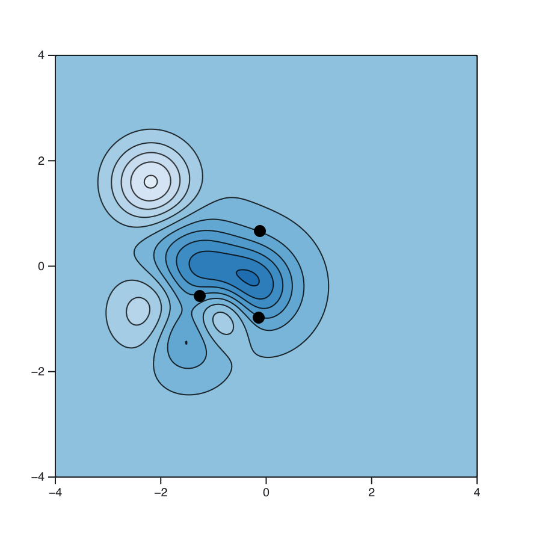

Our class final exams are set according to [UNCA's Final Exam Schedule](https://drive.google.com/file/d/1rWHAhzaWnTDV99wk-7eVqTPm5GFwSnUt/view){target=_blank}. According to that schedule,

- The 8:00 AM section's final will be on Friday, May 1 from 8:00-10:30 and 
- The 9:30 PM section's final will on Monday, May 4 also from 8:00-10:30.

This problem sheet consists primarily of problems right off of past exams, together with a few new problems. You should treat this review sheet like the past review sheets. The final exam will have significant similarities to this review sheet so, if you can do well on this review sheet, you should be able to do well on the final.

*Please* study for the final! Don't just look at the review sheet and figure that you already know how to do the problems. In my experience, final exams can have a significant impact on final grades.

## Exam 1

2. Find an equation of the plane containing the three points 
$$\{(1,-1,1), (3,-2,1), (2,2,-4)\}.$$
   If there is no such unique plane, then explain clearly why.


3. Suppose that two objects move in uniform, linear motion in space according to the parameterizations 
$$
\vec{p}(t) = \langle -t, 1 + t, 9 + 3 t \rangle
\text{ and }
\vec{q}(t) = \langle -2 + 2 t, 1 - t, -1 + 2 t \rangle.
$$
   a. Do the objects collide? If so, where and when?
   b. Do the paths intersect? If so, where?

## Exam 2

1. Find and classify the critical points of the function
	$f(x,y)=x^2 + xy^2 - y + 1$.

3. Find the equation of the plane tangent to the graph of
	$x^2 + 2y^2 + 3z^2 = 6$ at the point $(1,1,1)$.

5. Evaluate the double integral 
   $$\iint\limits_{D} x \, dA,$$
   where $D$ is the domain stuck between the curves $y=x^2-1$ and $y=x+1$.

6. Let $D$ denote the solid pyramid with vertices located at $(2,0,0)$, $(0,2,0)$, $(0,0,1)$, and the origin. Set up an iterated integral to represent the volume of $D$.

7. Use polar coordinates to evaluate the double integral
   $$\iint\limits_D e^{-(x^2+y^2)} \, dA,$$
   where $D$ is the disk of radius $8$ centered at the origin.


## Exam 3

1. Let $C$ denote the curve
   $$\vec{r}(t) = \langle t+1,t^3  \rangle$$
   where $0 \leq t \leq 2$ and let
   $$\vec{F}(x,y) = \langle xy,x \rangle.$$
   Compute 
   $$\int_C \vec{F}\cdot d\vec{r}$$


3. Use Green's theorem to compute
   $$\oint_C 2xy \, dx + (x^2 + x) \, dy,$$
   where $C$ is the positively oriented boundary of the rectangle with vertices $(0,0)$, $(3,0)$, $(3,-1)$, and $(0,-1)$.

4. Let $\vec{F}$ denote the conservative vector field
   $$\vec{F}(x,y) = \left\langle 2 x y^3+2,3 x^2 y^2+3\right\rangle.$$
   Find a potential function $f$ for $\vec{F}$ and use it to compute
   $$\int_C \vec{F}\cdot d\vec{r},$$
   where $C$ is a path from the origin to the point $(-1,1)$.

## Extra questions 

1. In this problem, we'll find an equation of the regression line for the three points 
$$(0,0), (1, 0), \text{ and } (2, 4).$$ 
To do so, use the techniques that we've learned to quantify your total squared error $E(a,b)$ and then minimize that error.


2. A contour plot with several points indicated is shown in @fig-hills_valleys.

   a. Identify any local maxima, minima or saddle points that you see on that figure.
   b. Sketch the gradient vectors for those points right on top of the plot.  
   Be sure to pay attention to the direction and relative magnitude of those vectors.

{id="fig-hills_valleys"}


::: {.content-visible when-format="html"}

## Your questions and answers 

If you'd like to ask a question about or reply to a question on this sheet, you can do so by pressing the "Reply on Discourse" button below.

```{ojs}
embedDiscourseMathTopic(166)
```

```{ojs}
import {embedDiscourseMathTopic} from '/components/EmbedDiscourseMathTopics/embedDiscourseMathTopic.js';
```

:::
