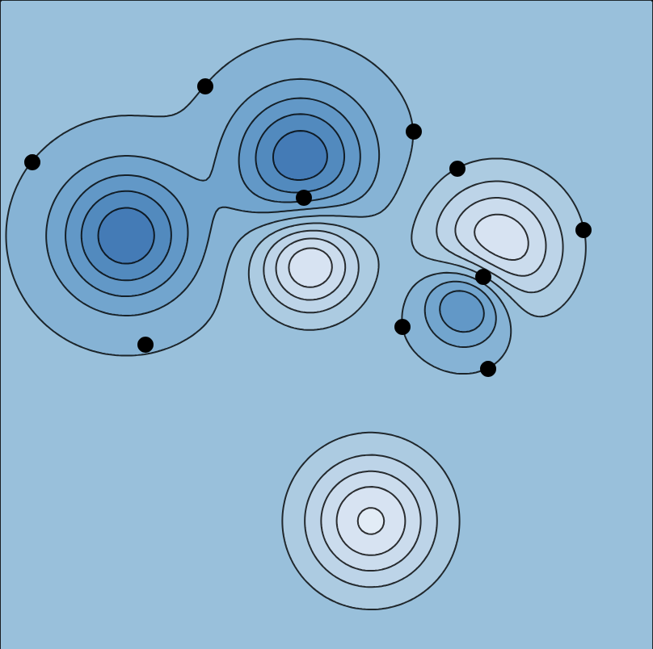

It's not hard to generate functions with the same general characteristics as the peaks function. On our next quiz and/or exam, I'm likely to do so and then ask you to draw some gradient vectors emanating from a few specified points.

Here's an example for you to try out:

{fig-align="center" width="420px"}