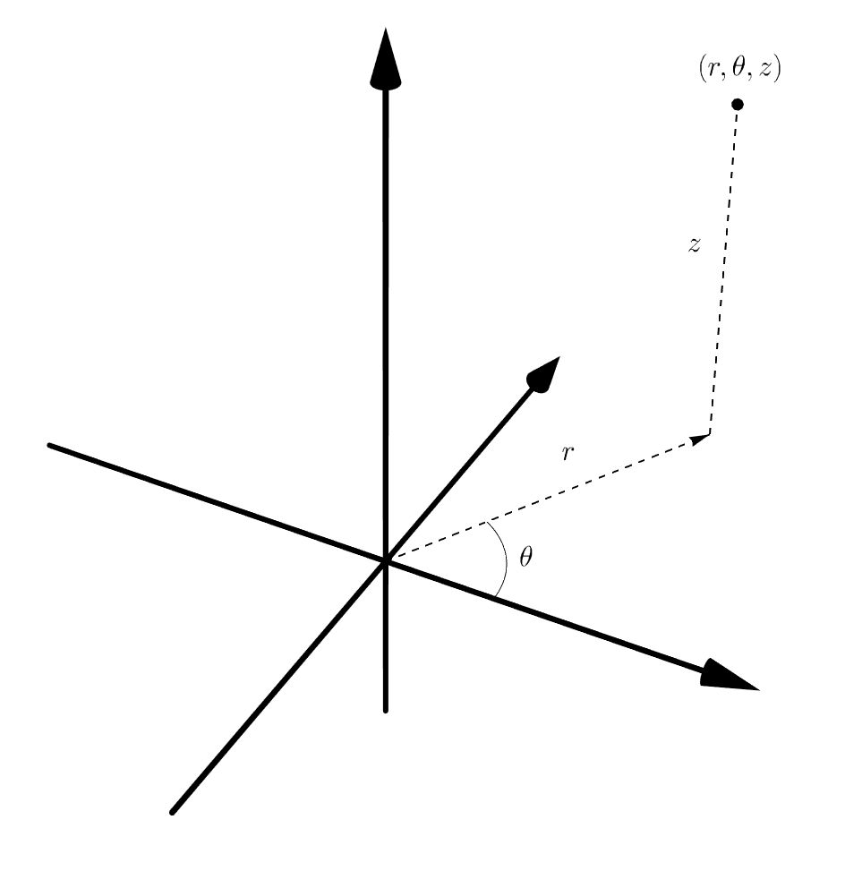
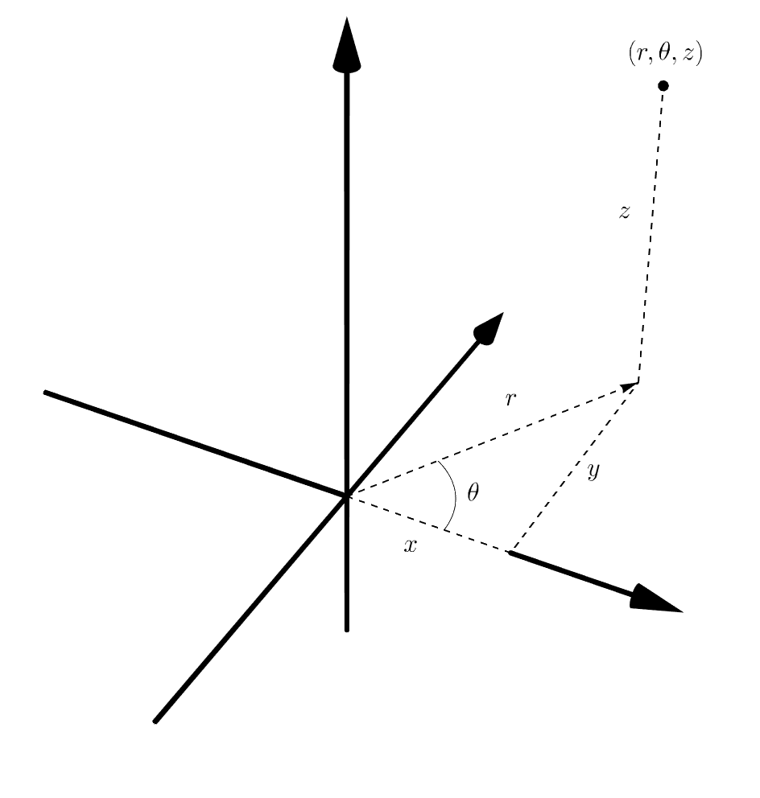
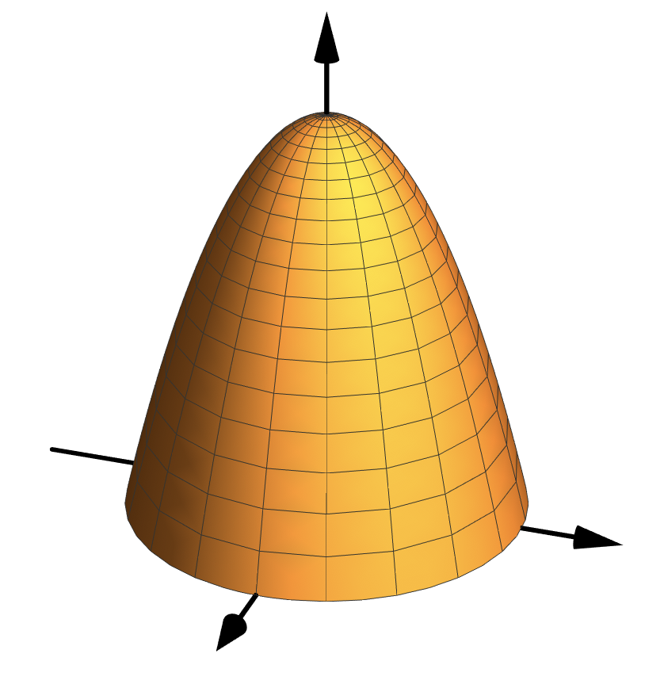
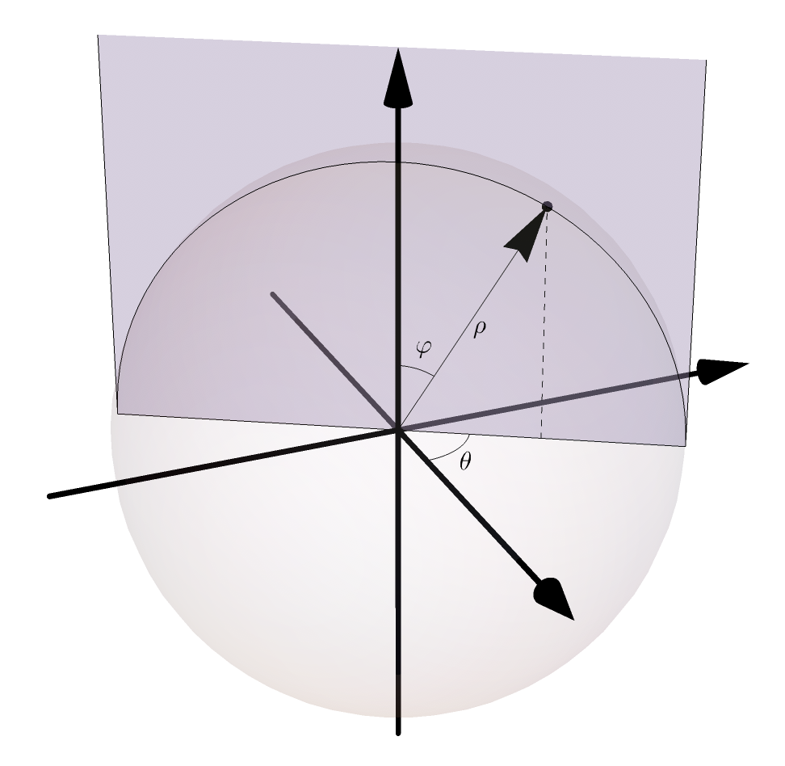
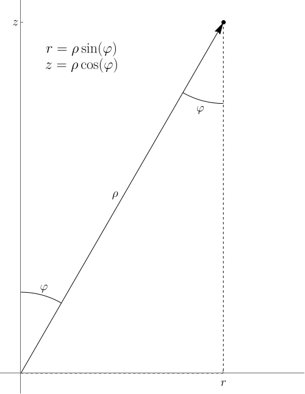

## 3D Coordinates

Polar coordinates for the plane generalize to 3D in two different ways:

- Cylindrical coordinates  
- Spherical coordinates  

In this overview, we'll meet both coordinate systems with a focus on expressing triple integrals

$$
\iiint_R f(x,y,z) \, dV
$$

over regions that are "simple" in those coordinate systems.

---

## Cylindrical coordinates

::: {style="max-width: 500px"}

:::

Cylindrical coordinates are like polar + $z$: specify a point in the plane via polar coordinates $(r,\theta)$, then its vertical displacement using $z$.

---

### Cylindrical coords with xy

::: {style="max-width: 500px"}

:::

If you put $x$ and $y$ in that picture, you can see the relationship between cylindrical and Cartesian.

---

### Translation

Given $f(x,y,z)$, we can derive $F(r,\theta,z)$ using

$$
\begin{aligned}
x &= r\cos(\theta) \\
y &= r\sin(\theta) \\
z &= z
\end{aligned}
$$

That is,

$$
F(r,\theta,z) = f(r\cos(\theta), r\sin(\theta), z)
$$

---

### Examples

If $f(x,y,z) = x^2 - \sin(yz)$, then

$$
F(r,\theta,z) = r^2\cos^2(\theta) - \sin(r\sin(\theta)z)
$$

Any $x^2 + y^2$ can be replaced with $r^2$. For example, if  
$f(x,y,z) = (4 - (x^2 + y^2))z$, then

$$
F(r,\theta,z) = (4 - r^2)z
$$

---

## Triple integrals in cylindrical coordinates

We can express a triple integral as

$$
\color{green}{\iiint_R}
\color{blue}{f(x,y,z)} \,
\color{red}{dV}
=
\color{green}{\int_{\alpha}^{\beta} \int_c^d \int_a^b}
\color{blue}{f(r\cos(\theta), r\sin(\theta), z)}
\,
\color{red}{r \, dr \, dz \, d\theta}
$$

As with polar coordinates and general change of variables, we translate:

- bounds of integration  
- the function  
- the volume element  

Note: the factor $r$ is part of $dV$.

---

### Simple cylindrical regions

::: {style="max-width: 500px"}

:::

The simplest regions have the form

$$
a \leq r \leq b, \quad \alpha \leq \theta \leq \beta, \quad c \leq z \leq d
$$

---

### A functional bound

::: {style="max-width: 500px"}

:::

Sometimes bounds depend on functions. For example:

$$
0 \leq r \leq 2, \quad 0 \leq \theta \leq 2\pi, \quad 0 \leq z \leq 4 - r^2
$$

---

### Example

Set up

$$
\iiint_R (x^2 + y^2 + z)\, dV
$$

in cylindrical coordinates for the region above.

**Solution:**

$$
\int_0^{2\pi} \int_0^2 \int_0^{4-r^2} (r^2 + z)\, r \, dz \, dr \, d\theta
= \frac{64}{3}\pi
$$

---

## Spherical coordinates

::: {style="max-width: 500px"}

:::

- $\rho$: distance to the origin  
- $\varphi$: angle from the positive $z$-axis  
- $\theta$: usual polar angle  

---

### Spherical to Cylindrical

::: {style="max-width: 500px"}

:::

Fix $\theta$ to determine a plane, then relate $\rho,\varphi$ to $r,z$.

---

### Spherical to Cylindrical (cont.)

::: {style="max-width: 500px"}

:::

Within that plane, the relationships follow from trigonometry.

---

### Spherical to Cartesian

We can use cylindrical as an intermediate step:

$$
\begin{aligned}
x &= r\cos(\theta) = \rho\sin(\varphi)\cos(\theta) \\
y &= r\sin(\theta) = \rho\sin(\varphi)\sin(\theta) \\
z &= \rho\cos(\varphi)
\end{aligned}
$$

Any $x^2 + y^2 + z^2$ becomes $\rho^2$.

---

## Triple integrals in spherical coordinates

We can write

$$
\color{green}{\iiint_R}
\color{blue}{f(x,y,z)} \,
\color{red}{dV}
=
\color{green}{\int_{\alpha}^{\beta} \int_{\gamma}^{\delta} \int_a^b}
\color{blue}{f(\rho\sin(\varphi)\cos(\theta), \rho\sin(\varphi)\sin(\theta), \rho\cos(\varphi))}
\,
\color{red}{\rho^2 \sin(\varphi)\, d\rho \, d\varphi \, d\theta}
$$

Again, we translate:

- bounds  
- function  
- volume element  

Now the factor $\rho^2 \sin(\varphi)$ appears in $dV$.

---

### Simple spherical regions

::: {style="max-width: 500px"}

:::

These regions have the form

$$
\alpha \leq \theta \leq \beta, \quad
\gamma \leq \varphi \leq \delta, \quad
a \leq \rho \leq b
$$

---

### The volume element

Where does

$$
dV = \rho^2\sin(\varphi)\, d\rho\, d\varphi\, d\theta
$$

come from?

From the Jacobian:

$$
\left|
\begin{matrix}
\partial x/\partial\rho & \partial x/\partial\varphi & \partial x/\partial\theta \\
\partial y/\partial\rho & \partial y/\partial\varphi & \partial y/\partial\theta \\
\partial z/\partial\rho & \partial z/\partial\varphi & \partial z/\partial\theta
\end{matrix}
\right|
=
\left|
\begin{matrix}
\sin(\varphi)\cos(\theta) & \sin(\varphi)\sin(\theta) & \cos(\varphi) \\
\rho\cos(\varphi)\cos(\theta) & \rho\cos(\varphi)\sin(\theta) & -\rho\sin(\varphi) \\
-\rho\sin(\varphi)\sin(\theta) & \rho\sin(\varphi)\cos(\theta) & 0
\end{matrix}
\right|
$$

---

### Example

Compute the mass of a unit sphere with density

$$
f(x,y,z) = 2 - (x^2 + y^2 + z^2)
$$

$$
\begin{aligned}
\iiint_S (2-(x^2+y^2+z^2)) \, dV
&=
\int_0^{2\pi} \int_0^{\pi} \int_0^1 (2-\rho^2)\rho^2 \sin(\varphi)\, d\rho\, d\varphi\, d\theta \\
&= 2\pi \int_0^{\pi} \int_0^1 (2\rho^2 - \rho^4)\sin(\varphi)\, d\rho\, d\varphi \\
&= 2\pi \times 2 \left(\frac{2}{3} - \frac{1}{5}\right)
\end{aligned}
$$
