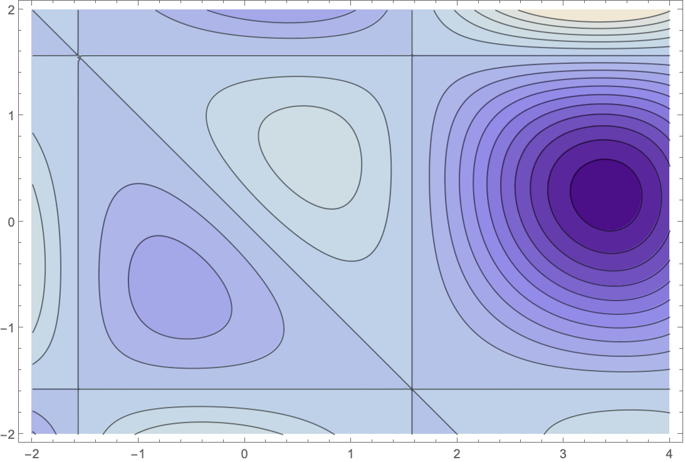
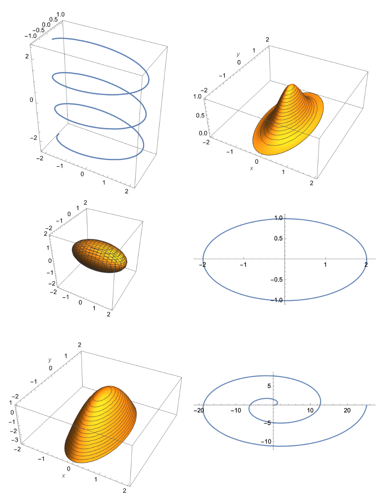

In Precalc, Calc I, Calc II, and just about all math classes prior to Calc III, you study functions mapping $\mathbb R \to \mathbb R.$ Calculus III, though, is all about increasing the dimension in which we work. In the study of parametric/vector functions, we study functions mapping $\mathbb R \to \mathbb R^n$, i.e. we increase the dimension of the *range*. We often think of the input as time so that we're studying motion.

Now, we're going to study functions mapping $\mathbb R^n \to \mathbb R$, i.e. we increase the dimension of the *domain*.


## Bivariate functions

A *bivariate* function is a real valued function of two variables, i.e. $f:\mathbb R^2 \to \mathbb R$. Let's start there.

### Graphs of bivariate functions

The graph of a bivariate function is the set 
$$
\{(x,y,z)\in\mathbb R^3: z = f(x,y)\}.
$$
In general, this looks like a surface: 

```{ojs}
basic_bivariate_pic
```

You can use the menu below to examine several of these things.

```{ojs}
viewof select1
comments
graph3d 
```

### Contour plots 

A *contour plot* offers another way to visualize bivariate functions. Given $f(x,y)$, the idea is to consider the family of curves
$$f(x,y) = k,$$
for a select set of values of $k$. If $f(x,y)=x^2+y^2$, then each contour is a circle centered at the origin, for example. 

The select menu below allows you to examine several of these things. It might be instructive to examine the common values in both menus.

```{ojs}
viewof select2
comment 
contour_pic
```

### The peaks function 

The folks at Mathworks created a fun function called the *peaks function* that's interesting to view as both a graph and as a contour plot. The formula for the peaks function is 
$$
f(x,y) = 3 \, (1-x)^2 e^{-x^2-(y+1)^2}-10 \, e^{-x^2-y^2} \left(-x^3+\frac{x}{5}-y^5\right)-\frac{1}{3} \, e^{-(x+1)^2-y^2}.
$$
Yeah, it's complicated. Effectively, this is a combination of shifted normal distributions in two variables $e^{-(x^2+y)^2}$.

The graph of the peaks function looks like so:

```{ojs}
peaks_graph 
```

Here's a contour plot:

```{ojs}
peaks_contour_pic
```

And here's another graph that emphasizes the relationship between those two:

```{ojs}
peaks3D 
```

The peaks function was built to illustrate some of the challenges involved in multivariate optimization.

## Higher dimensions 

You can talk about functions of as many variables as you might want.

### Examples

**Three variables**: The ideal gas law relates pressure $P$, volume $V$, amount (i.e. number of moles) $n$, and temperature $T$ via $PV=nRT$. Note that $R$ is a constant called the ideal gas constant. We could solve this for $P$ to get pressure as a function of the *three* variables $n$, $T$, and $V$:
$$P = \frac{nRT}{V}.
$$ 

**Four variables**: The mass of a box of uniform density is the product of its length $\ell$, width $w$, height $h$, and density $\rho$:
$$
m = \ell \times w \times h \times \rho.
$$

**Five variables**: The force between two objects with masses $m_1$ and $m_2$ with a displacement vector $\langle x,y,z \rangle$ between them can be expressed as a function of *five* variables:
$$
F(m_1,m_2,x,y,z) = G \frac{m_1 m_2}{x^2 + y^2 + z^2}
$$

I could go on.

### Even more variables

The graph of a function of three variables lives in four dimensional space so I guess we don't draw those.

We *can* draw the contours of functions of three variables, though, and they are often called *level surfaces* in that context. Here are a few examples:


```{ojs}
viewof exampleSurface 
exampleSurface.comment
pic 
```

Better, we can plot a collection of level surfaces. When doing so, it might make sense to slice them in some way to reveal things that would otherwise be obscured. We could also include a fourth variable using color to yield an animation. The animation below, for example, indicates how a solid, hot sphere might cool when dropped in an ice bath.

```{ojs}
cooling_sphere
play 
```

This example uses partial differential equations and you can learn more about the implementation in [this dynamic notebook](https://observablehq.com/@mcmcclur/cooling-of-a-sphere).


## Using Desmos

It's pretty easy to plot functions of two variables with Desmos3D:

- [A wavy checkerboard](https://www.desmos.com/3d/iatvl5idvi){target=_blank}
- [Varying paraboloids](https://www.desmos.com/3d/ddc4o4lfgc){target=_blank}
- [The Peaks function](https://www.desmos.com/3d/ckyze5ovbu){target=_blank}

You can also plot level surfaces with Desmos3D:

- [A two-holed torus](https://www.desmos.com/3d/hajizgpdch){target=_blank}
- [A family of ellipsoids indexed by size](https://www.desmos.com/3d/qvuppgiefs){target=_blank}

And you can plot good old level curves with plain old Desmos:

- [Varying paraboloid contours](https://www.desmos.com/calculator/ug37u6rksk){target=_blank}
- [Contour of the Peaks function](https://www.desmos.com/calculator/4d6vaa0oou){target=_blank}

## Problems

1. The contour diagram of $f(x,y)=(x + y)\cos(x)\cos(y)/2$ is shown in @fig-contour1. Mark the locations of any maxima, minima, or saddle points that you see. 

2. Match the groovy function below with the groovy graph shown in @fig-groovyGraphs.
	
   a. $\vec{p}(t) = \langle 2\cos(t), \sin(t) \rangle$
	 b. $\vec{p}(t) = \langle 2t\cos(t), t\sin(t) \rangle$
	 c. $\vec{p}(t) = \langle 2\cos(t), \sin(t), t/4 \rangle$
	 d. $f(x,y) = 1 - (4 x^2 + y^2)$
	 e. $f(x,y) = e^{-(4 x^2 + y^2)}$
	 f. $x^2 + 4 y^2 + 4 z^2 = 4$

3. Sketch contour diagrams of the following functions:

   a. $f(x,y) = 9x^2 + y^2$
   b. $f(x,y) = 9x^2 - y^2$
   c. $f(x,y) = 9x - y$
   d. $f(x,y) = x\,y$

::: {style="max-width: 600px; margin: 0 auto;"}

{#fig-contour1}

:::

::: {style="max-width: 600px; margin: 0 auto;"}

{#fig-groovyGraphs}

:::


<!-- Code -->

```{ojs}
import { 
    basic_bivariate_pic,
    peaks_graph,
    peaks_contour_pic,
    style
  } from '3a85784b45b30ba1';
import {
  viewof select1,
  comments,
  graph3d,
  modify
} from '@mcmcclur/functions-of-two-variables';
import {
  viewof select2,
  comment,
  contour_pic
} from '@mcmcclur/contour-plots';
import {
  peaks3D
} from '@mcmcclur/gradient-ascent';
import {
  pic, 
  viewof exampleSurface
} from '@mcmcclur/examples-of-level-surfaces';
import {
  play,
  cooling_sphere
} from '@mcmcclur/cooling-of-a-sphere'
```


::: {style="display: none"}
```{ojs}
// Hides some ugly stuff in Hyperbolic paraboloid too
modify 
style
```
:::