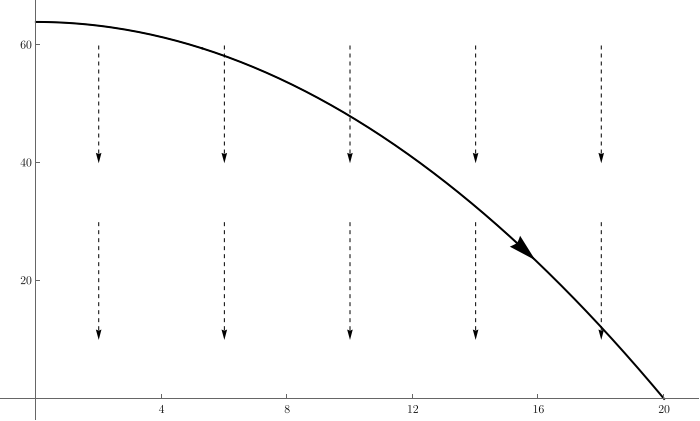
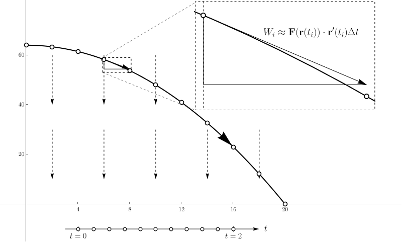
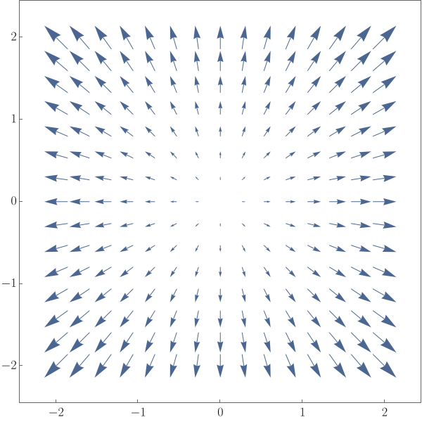
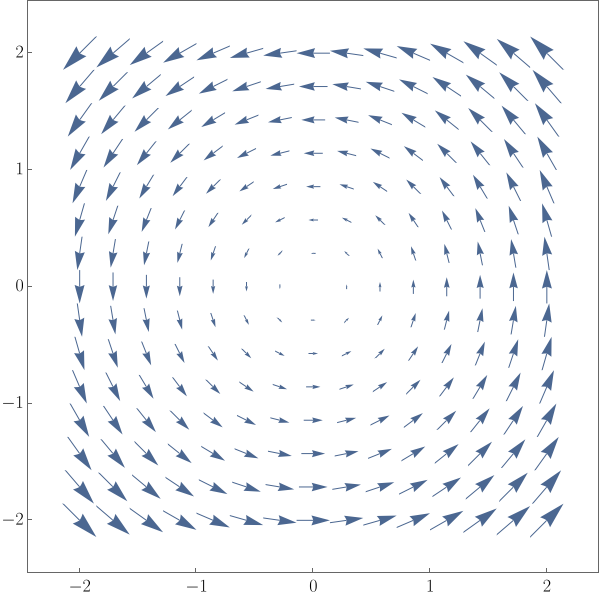
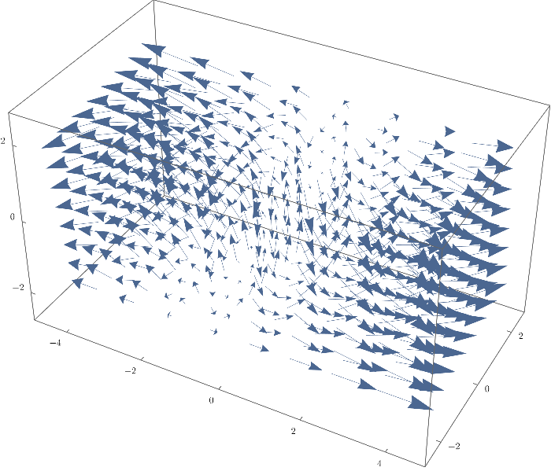
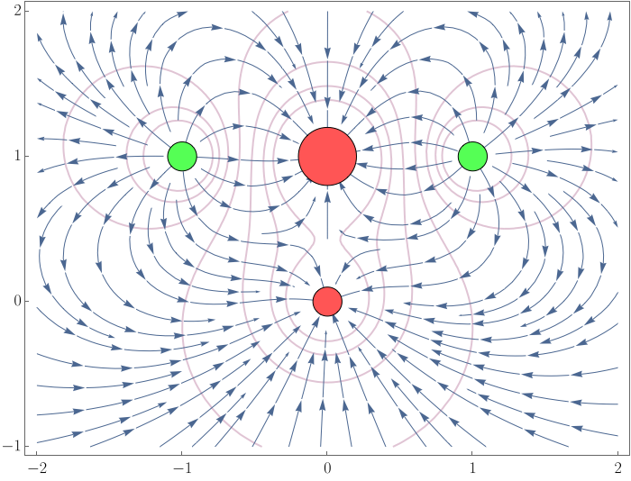
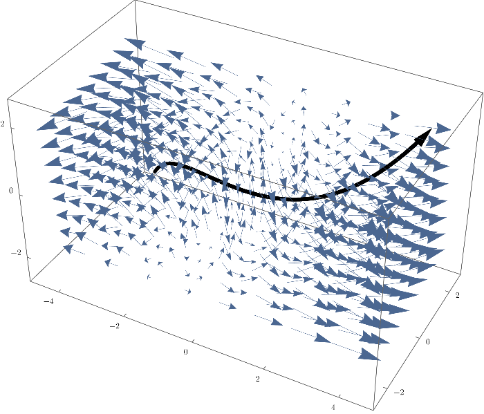

# Falling and work

Suppose we shoot a 1kg object horizontally off of a platform that's 64 feet high with an initial speed of 10 feet per second.

::: {.centered style="max-width: 800px"}
{fig-alt="A parabolic path"}
:::

What is the work done by gravity on this object?

## Defining formulae

In the preceding slide,

- Path: $\mathbf{r}(t) = \langle 10t, 64-16t^2 \rangle$
- Gravitational field: $\mathbf{F}(x,y) = \langle 0, -32 \rangle$

The gravitational field is an example of a *vector field*; it's constant in this case but need not be in general.

## Formula for solution

We can express the work as a *line integral*:

$$
\int_C \mathbf{F} \cdot d\mathbf{r} =
\int_0^2 \mathbf{F}(\mathbf{r}(t))\cdot\mathbf{r}'(t)\,dt.
$$

- The left side is an abstract formulation where $C$ is the path, $\mathbf{F}$ is the vector field, and $\mathbf{r}$ is a parametrization of the path.
- The right side allows you to evaluate the line integral by translating it to a normal integral.

## Solution

Using the line integral formulation, the work is

$$
\begin{aligned}
\int_C \mathbf{F} \cdot d\mathbf{r} &=
  \int_0^2 \mathbf{F}(\mathbf{r}(t))\cdot\mathbf{r}'(t)\,dt \\
  &= \int_0^2 \langle 0, -32 \rangle \cdot \langle 10,-32t \rangle \, dt \\
  &= \int_0^2 1024t \, dt = 2048.
\end{aligned}
$$

## Explanation

The work required to move the object from one point to the next is approximately $\mathbf{F}(\mathbf{r}(t_i))\cdot \mathbf{r}'(t_i)\Delta t$. If we add those all up, we get
$$
\sum_{i=1}^n \mathbf{F}(\mathbf{r}(t_i))\cdot \mathbf{r}'(t_i)\Delta t \to \int_a^b \mathbf{F}(\mathbf{r}(t))\cdot\mathbf{r}'(t)\,dt.
$$

::: {.centered style="max-width: 700px"}
{fig-alt="Trajectory with explanation"}
:::

# Vector fields

- A vector field is a function $\mathbf{F}:\mathbb R^n \to \mathbb R^n$.
- Typically, we visualize a vector field by drawing a collection of vectors each emanating from the point where we evaluate the field.
- Often, we need to scale the vectors to keep the images from being too cluttered.

## Example 1

$$\mathbf{F}(x,y) = \langle x,y \rangle$$

::: {.centered style="max-width: 500px"}
{fig-alt="The identity field"}
:::

## Example 2

$$\mathbf{F}(x,y) = \langle -y,x \rangle$$

::: {.centered style="max-width: 500px"}
{fig-alt="A rotational field"}
:::

## Example 3

$$\mathbf{F}(x,y,z) = \langle x,-z,y \rangle$$

::: {.centered style="max-width: 500px"}
{fig-alt="A 3D field"}
:::

## Example 4

An electrostatic field

::: {.centered style="max-width: 600px"}
{fig-alt="An electrostatic field"}
:::

# A 3D integral

The path of $\mathbf{r}(t) = \langle 2 t, t^2, t^3 \rangle$ over the time interval $-1\leq t \leq 1$ through the vector field $\mathbf{F}(x,y,z) = \langle x,-z,y \rangle$.

::: {.centered style="max-width: 500px"}
{fig-alt="A 3D path"}
:::

## The corresponding line integral

To find the work done by that vector field on an object moving through that path, we evaluate

$$
\int_C \mathbf{F}\cdot d\mathbf{r} =
\int_{-1}^1 \mathbf{F}(\mathbf{r}(t))\cdot\mathbf{r}'(t) \, dt.
$$

Since $\mathbf{F}(x,y,z) = \langle x,-z,y \rangle$ and $\mathbf{r}(t) = \langle 2 t, t^2, t^3 \rangle$,

$$\mathbf{F}(\mathbf{r}(t))\cdot \mathbf{r}'(t) = \langle 2t, -t^3, t^2 \rangle\cdot\langle 2,2t,3t^2\rangle = 4t+t^4.$$ 

## Finishing it

Finishing the integral, we get

$$
\begin{aligned}
\int_C \mathbf{F}\cdot d\mathbf{r} &=
\int_{-1}^1 \mathbf{F}(\mathbf{r}(t))\cdot\mathbf{r}'(t) \, dt\\
&= \int_{-1}^1 \left(4t+t^4\right) \, dt = 2/5.
\end{aligned}
$$

# Conservative vector fields

A vector field $\mathbf{F}$ is called *conservative* if it arises as the gradient of a real valued function.
That is, there is a function $f:\mathbb R^n\to \mathbb R$ such that $\mathbf{F} = \nabla f$.

The function $-f$ is sometimes called the *potential* of the vector field.

## Example

Let

$$
\mathbf{F}(x,y,z) = -
\frac{\langle x,y,z \rangle}{(x^2+y^2+z^2)^{3/2}}.
$$

Then $\mathbf{F}$ is conservative because
$\mathbf{F} = \nabla f,$ where

$$f(x,y,z) = 1/\sqrt{x^2+y^2+z^2},$$

as you can check. This example is essentially the gravitational field.

## Finding the potential

- Vector fields might or might not be conservative.
- If $\mathbf{F}(x,y) = \langle P(x,y), Q(x,y) \rangle$ is a conservative 2D field, then

  $$P = \frac{\partial f}{\partial x} \: \text{ and } \: Q = \frac{\partial f}{\partial y},$$

  for some $f$. Thus (equating the mixed partials of $f$),

  $$
  \frac{\partial P}{\partial y}=
  \frac{\partial}{\partial y}\left(\frac{\partial f}{\partial x}\right) =
  \frac{\partial}{\partial x}\left(\frac{\partial f}{\partial y}\right) =
  \frac{\partial Q}{\partial x}.
  $$

  This gives us a test to see if a vector field is conservative.

## Examples

- $\mathbf{F}(x,y) = \langle xy, x^2y^2 \rangle$ is *not* conservative since

  $$
  \frac{\partial}{\partial y}xy = x \neq 2xy^2 =
  \frac{\partial}{\partial x}x^2y^2.
  $$

- $\mathbf{F}(x,y) = \langle 2xy^3, 3x^2y^2 + 1 \rangle$ *is* conservative since

  $$
  \frac{\partial}{\partial y}2xy^3 = 6xy^2 =
  \frac{\partial}{\partial x}(3x^2y^2+1).
  $$

## Finding the potential

Since $\mathbf{F}(x,y) = \langle 2xy^3, 3x^2y^2 + 1 \rangle$ is conservative, there must be a function $f$ such that $\mathbf{F}=\nabla f$.

- Surely, $\frac{\partial f}{\partial x} = 2xy^3$. Thus,

  $$f(x,y) = x^2y^3 + g(y).$$

- Note that $g(y)$ is a constant of integration; it is constant as far as $x$ is concerned. To find it more precisely, note that

  $$
  \frac{\partial f}{\partial y} = 3x^2y^2 + g'(y) = 3x^2y^2 + 1.
  $$

  Thus, $g'(y)=1$ so $g(y)=y$ and $f(x,y) = x^2y^3+y$.

# FTC for line integrals

If $\mathbf{F} = \nabla f$ is a conservative vector field and $C$ is a path starting at $A$ and ending at $B$, then

$$\int_C \mathbf{F}\cdot d\mathbf{r} = f(B)-f(A).$$

This makes it easy to compute line integrals!

*(for conservative vector fields)*

## Example

Let $\mathbf{F}(x,y) = \langle 2xy^3, 3x^2y^2 + 1 \rangle$, let $\mathbf{r}(t) = \langle t^2,t \rangle$, and $C$ denote the portion of the path parametrized by $\mathbf{r}$ over the time interval $[0,1]$.

Let's evaluate $\displaystyle \int_C \mathbf{F}\cdot d\mathbf{r}.$

**Solution**: We already know that $\mathbf{F}$ is the gradient of $f(x,y)=x^2y^3+y$. We can also see that $C$ moves from $(0,0)$ to $(1,1)$ over the given time interval. Thus,

$$\int_C \mathbf{F}\cdot d\mathbf{r} = f(1,1)-f(0,0) = 2.$$

## Solution 1

We already know that $\mathbf{F}$ is the gradient of $f(x,y)=x^2y^3+y$. We can also see that $C$ moves from $(0,0)$ to $(1,1)$ over the given time interval. Thus,

$$\int_C \mathbf{F}\cdot d\mathbf{r} = f(1,1)-f(0,0) = 2.$$

## Solution 2

Our vector field is $\mathbf{F}(x,y) = \langle 2xy^3, 3x^2y^2 + 1 \rangle$ and our path is $\mathbf{r}(t) = (x(t),y(t)) = (t^2,t)$. We can substitute in directly to get

$$
\begin{aligned}
\int_C \mathbf{F}\cdot d\mathbf{r} &=
\int_0^1 \langle 2(t^2)(t)^3,3(t^2)^2(t)^2 + 1\rangle \cdot
  \langle 2t,1 \rangle \, dt \\
&= \int_0^1 \langle 2t^5,3t^6 + 1\rangle \cdot
  \langle 2t,1 \rangle \, dt \\
&= \int_0^1 (4t^6 + 3t^6 + 1)\,dt \\
&= \int_0^1 (7t^6 + 1) \, dt = 2.
\end{aligned}
$$
