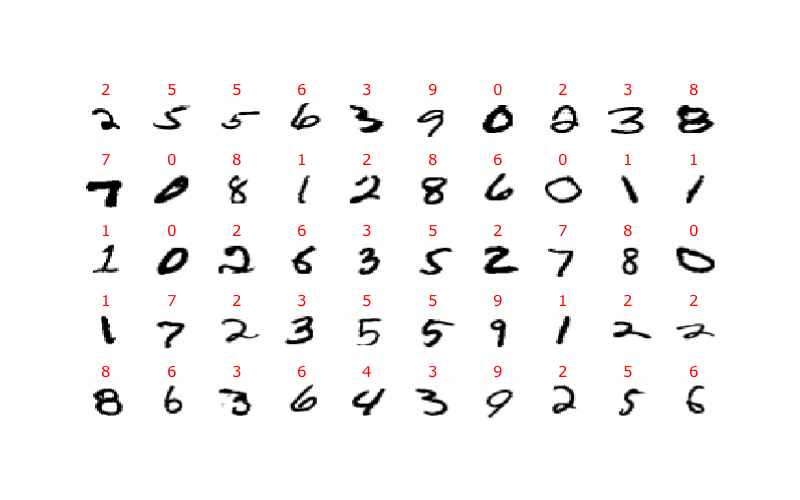

# What is Machine Learning? 

Machine learning consists of a class of algorithms that can consume data to produce a function that performs some desired task. 

Colloquially, we say that the algorithm "learns" from data.

```{python}
#| echo: false 
import pandas as pd 
import numpy as np
import matplotlib.pyplot as plt
from IPython.display import HTML, display
```

## Types of tasks

Sometimes, the data is labeled by class names and the objective is to classify similar data into those same classes. This process is called *classification*.

Sometimes, the data is labeled by continuous numeric values and the objective is computation the corresponding value for similar data. That process is called *regression*.


## A closer look at classification

In this intro presentation, we're going to take a look at a couple of classification problems and a surprisingly simple yet effective machine learning algorithm to solving such problems. This is a real technique in machine learning because:

- We don't write a program from scratch that performs the classification using classic algorithmic techniques.
- Rather, we write a general classification algorithm that's based on known, labelled data.
- When we want to use the program to perform a specific task, we feed it a slew of *relevant* data. Different data would yield different results.

# Data 

To begin, let's clearly state what we mean by *data* and how we need it formatted in the context of machine learning.

Generally, we are interested in *observational level data*. Furthermore, 

- each row should correspond to an individual *observation* and 
- each column should correspond to some attribute of the individual or *variable* of the data.

Data formatted in this way is often called *tidy data*. I'll typically refer to this type of data as a *data table* or *data frame*.

## Palmer penguins

As a concrete example, we'll start the now widely used Palmer penguin data set.

This data was collected in a 2014 study at the Palmer Research station in Antarctica, as described in [this paper](https://journals.plos.org/plosone/article?id=10.1371/journal.pone.0090081){target=_blank}. 

It was collected for use as an R data package, as [described on Allison Horst's Github page](https://allisonhorst.github.io/palmerpenguins/){target=_blank}.

We'll use it a few times throughout this semester.

## The data set 

The penguin data set looks like so:


```{ojs}
penguin_data = fetch("https://marksmath.org/data/penguins.csv").then(async function (r) {
  const t = await r.text();
  return d3.csvParse(t);
})
Inputs.table(penguin_data)
```

This data has 342 observations corresponding to actual penguins; these appear as rows in the table. There are seven attributes associated with each penguin that appear as columns in the table.

The table is interactive so that you can scroll through the complete dataset, if you like.

## Distinction with summary data 

To be clear about what we mean by *observational level, tidy data*, let's draw a distinction between it an *summary level data*.

To generate summary level data for the penguin data set, we might group the penguins by species, compute the average mass per species, and present that as a summary table. The result might look like so:

```{ojs}
{
  const rollups = d3.rollups(
    penguin_data, 
    a => d3.mean(a, o => o.body_mass_g), 
    o => o.species
  );
  console.log(rollups)
  const table = d3.create('table');
  const thead = table.append('tr');
  thead.append('th').text('Species');
  thead.append('th').text('Avg Mass');
  rollups.forEach(function([s,m]) {
    const tr = table.append('tr')
    tr.append('td').text(s)
    tr.append('td').text(`${d3.format('0.2f')(m)} g`)
  })
  return table.node()
}
```

This might very well be quite useful. It's not *tidy data*, though, and it's not the type of data that we build machine learning algorithms with.

# KNN 

Now that we know what data is and what type we're dealing with, we can describe the K-Nearest Neighbors algorithm.

Just to avoid potential confusion down the road, it might be worth distinguishing K Nearest Neighbors from K-Means, which is a clustering algorithm. The two techniques are really quite different but sometimes confused due to their similar names.

## Basic idea 

The fundamental idea behind KNN is to examine other data near the observation point under consideration and to guess the label based on those other values. We might examine 5 nearest neighbors, 8 nearest neighbors, or 15 nearest neighbors. In general, we examine $k$ nearest neighbors, which is where the name comes from.

How we determine our guess for the label depends on the nature of the data.

- If the label is numeric, we often average the neighboring values.
- If the label is categorical, we might use majority vote.

## Example 

Into which species would you classify the first entry ???
```{python}
penguins = pd.read_csv('https://marksmath.org/data/penguins.csv')
adelieDream = penguins[(penguins.species == 'Adelie') & (penguins.island == 'Dream')].iloc[:2]
adelieBiscoe = penguins[(penguins.species == 'Adelie') & (penguins.island == 'Biscoe')].iloc[:2]
gentoo = penguins[(penguins.species == 'Gentoo')].iloc[:3] 
chinstrap = penguins[(penguins.species == 'Chinstrap')].iloc[:3] 

together = pd.concat(
    [adelieBiscoe, adelieDream, gentoo, chinstrap]
).sample(frac=1,random_state=2)

extra =pd.DataFrame([
 {'species': '???', 
 'island': 'Dream',
 'sex': 'MALE',
 'culmen_length_mm': 48,
 'culmen_depth_mm': 15,
 'flipper_length_mm': 222,
 'body_mass_g': 4850
},
{'species': '...', 
 'island': '...',
 'sex': '...',
 'culmen_length_mm': '...',
 'culmen_depth_mm': '...',
 'flipper_length_mm': '...',
 'body_mass_g': '...'
}
])
to_display = pd.concat([extra, together])
to_display = to_display[['species','island','sex','culmen_length_mm','body_mass_g','culmen_depth_mm','flipper_length_mm']]

display(HTML(to_display.to_html(index=False)))
```

## A plot of that data 

Here's a plot of that same data in the body_mass/culmen_depth plane. The classification is even more obvious, now.


```{python}
plt.figure(figsize=(8, 5))
for species, group in together.groupby('species'):
    plt.scatter(group['body_mass_g'], group['culmen_depth_mm'], label=species, s=50)
plt.scatter([4850], [15], s=80, c='#111', label="??")

plt.xlabel("Body Mass (g)")
plt.ylabel("Culmen Depth (mm)")
plt.legend(title="Species")
plt.tight_layout()
plt.show()
```


## Classification plot 

Here's a so-called classification plot of the full dataset:

```{python}
import pandas as pd
import numpy as np
import seaborn as sns
import matplotlib.pyplot as plt
from sklearn.neighbors import KNeighborsClassifier
from sklearn.preprocessing import LabelEncoder, StandardScaler
from sklearn.pipeline import make_pipeline

# Drop rows with missing values in relevant columns
df = penguins.dropna(subset=['body_mass_g', 'culmen_depth_mm', 'species'])

# Extract features and target
X = df[['body_mass_g', 'culmen_depth_mm']].values
y_labels = df['species'].values
le = LabelEncoder()
y = le.fit_transform(y_labels)  # e.g., Adelie → 0, Chinstrap → 1, Gentoo → 2

# Build and fit a KNN classifier (try k=5 to start)
model = make_pipeline(
    StandardScaler(),
    KNeighborsClassifier(n_neighbors=5)
)
model.fit(X, y)

# Create meshgrid to plot decision boundaries
x_min, x_max = X[:, 0].min() - 200, X[:, 0].max() + 200
y_min, y_max = X[:, 1].min() - 1, X[:, 1].max() + 1
xx, yy = np.meshgrid(np.linspace(x_min, x_max, 300),
                     np.linspace(y_min, y_max, 300))
grid = np.c_[xx.ravel(), yy.ravel()]
Z = model.predict(grid).reshape(xx.shape)

# Plot decision boundaries
plt.figure(figsize=(10, 6))
plt.contourf(xx, yy, Z, alpha=0.3, cmap='Set1')

# Overlay actual data points
sns.scatterplot(
    data=df,
    x='body_mass_g',
    y='culmen_depth_mm',
    hue='species',
    palette='Set1',
    edgecolor='k'
)

plt.title("KNN Classification of Penguins\n(Body Mass vs Culmen Depth)")
plt.xlabel("Body Mass (g)")
plt.ylabel("Culmen Depth (mm)")
plt.legend(title='Species')
plt.grid(True)
plt.tight_layout()
plt.show()
```

## Explanation

In that classification plot, the algorithm 

- Sets up a dense grid of points in the BodyMass/CulmenDepth plane,
- For each point, it 
  - Finds the 5 closest data points, 
  - Classifies the selected point by majority vote from those 5 closest points, and 
  - Colors the selected point by that classification.

As we can see, the algorithm can easily distinguish between Gentoo and the other two species. It doesn't distinguish between Adelie and Chinstrap very well.  We can use more variables to improve it, though!


# The MNIST Digits

We can now describe how KNN works for digit recognition. The algorithm is built on the now classic [MNIST Digit Dataset](https://en.wikipedia.org/wiki/MNIST_database). This data consists of two key components:

- A list of $70,000$ vectors of length $784$. Each vector can be partitioned into a $28\times28$ matrix. The entries are all floating point numbers in $[0,1]$ and can be interpreted as gray scale values that determines an image.
- A list of $70,000$ labels each of which is an integer from $0$ to $9$ indicating what digit the corresponding matrix represents.

## A look at the data 

Again, the data consists of a list of 784 dimensional vectors of grayscale values with labels. It's easy to render those vectors as grayscale images and display them with their labels. Here's a short subset of the results:



## The algorithm

Once we understand both KNN and the MNIST dataset, it's pretty easy to describe digit classification by KNN. There are two essential steps:

- The data is in the form of a set of 784 dimensional vectors. Thus
  - Given another image represented as a 784 dimensional vector, we can 
  - Find the 20 vectors from the data that are closest to the given vector, 
  - Determine which labels are most common amongst those 20 vectors, and
  - Classify the given vector as the most common label among those 20 nearest neighbors.
- Before that, though, the input vector should be scaled and centered using the same techniques used to generate the MNIST data.

## Summary

That's really all there is to it.

There might be some further questions, though.

# Further questions

We've got *plenty* to address this semester when it comes to machine learning algorithms.

- What does 784 dimensional space look like? How do we measure distance there?
- What is a *parametric model*? 
  - How do we optimize parametric models?
  - What is *overfitting* and *regularization* to avoid it?
- How do we deal with categorical data?
- How do we assess our models and how confident can we be in our predictions?
- What does this all look like on the computer?

## Mathematics 

Of course, this is a *math* class and, in fact, the answers to those most of those questions really lie in that domain.

- Optimization is one of the major applications of calculus.
- High dimensional vector spaces can be treated efficiently using linear algebra.
- An geometric understanding of high dimensional space will help us regulate our models.
- An understanding of probability theory will help us assess our models.

## Algorithms 

Here are a few of the algorithms that we'll take a look at this semester:

- K-nearest neighbor classification (as you already know)
- Regression - Linear and Logistic
- Google pagerank and Eigenrating
- Principal Component Analysis
- Support vector machines
- Neural Networks