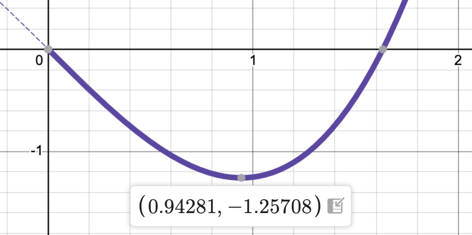

# Our view of single variable, differential calculus

In this first, purely mathematical presentation, we'll survey that part of single variable, differential calculus that we'll need to know to get started with machine learning. Since Calculus I is a prerequisite for this course, I'll assume that you've been at least exposed to Calculus.

We'll talk about integration when we need it for probability theory later in the semester.

Next time, we'll discuss functions of several variables and partial derivatives.


## What will we need to know?

From Calculus I, we'll certainly need to be familiar with the concepts of functions, limits, derivatives, and (later) integrals.

You shouldn't be scared of taking the derivative of, say, $f(x)=e^{-x^2}$. And you should know that the result $f'(x)$ is a new function that tells you about the rate of change of the original and that you can use this to find the maximum of the function.

## What else *will* we need to know?

Calculus I covers really only just a small part of the calculus needed for machine learning. 

The most obvious piece that we'll be missing after today is multivariable calculus, that you typically learn in Calc III and that we'll discuss next time.

In addition, it's important to appreciate Calculus from a *numerical* perspective. That is, we'll be doing a lot of math on the computer in a way that yields numerical estimates. We need to understand how to do that and how to interpret it.

# Why calculus??

Let's go ahead an introduce one of the most important topics of the semester, namely *linear regression*. We'll discuss just the very simplest version of this problem today and we won't even present a solution until next time. We'll see straight away, though, how it is that 

::: {.callout-note appearance="simple"}
*Modelling data leads to an optimization problem.*
:::

Calculus, of course, is a powerful tool for optimization.


## Problem setup

The figure below plots some very simple data:  

$$\{(0, 0),(1, 0),(1, 1),(2, 1),(2, 2),(3, 2)\}.$$

::: {.centered style = "width: 800px; border: solid 1px slategray; border-radius: 4px; background-color: #f8f9fa; margin-top: 10px;"}

```{ojs}
//| echo: false
{
  let pts = [
    [0, 0],
    [1, 0],
    [1, 1],
    [2, 1],
    [2, 2],
    [3, 2]
  ];

  return Plot.plot({
    width: 800,
    height: 300,
    x: { domain: [-0.05, 3.2] },
    y: { domain: [-0.05, 2.2] },
    marks: [
      Plot.dot(pts, { fill: "black" }),
      Plot.ruleX([0]), Plot.ruleY([0])
    ]
  });
}
```

:::

## Basic question

The basic question, how can we best model that data with a line?

::: {.centered style = "width: 800px; border: solid 1px slategray; border-radius: 4px; background-color: #f8f9fa; margin-top: 10px;"}

```{ojs}
//| echo: false
{
  let pts = [
    [0, 0],
    [1, 0],
    [1, 1],
    [2, 1],
    [2, 2],
    [3, 2]
  ];
  return Plot.plot({
    width: 800,
    height: 300,
    x: { domain: [-0.05, 3.2] },
    y: { domain: [-0.05, 2.2] },
    marks: [
      Plot.dot(pts, { fill: "black" }),
      Plot.line([
        [-0.2, 0.73*(-0.2) - 0.09],
        [3.2, 0.73*3.2 - 0.09]
      ], {strokeWidth: 3}),
      Plot.ruleX([0]), Plot.ruleY([0])
    ]
  });
}
```

:::

## A *parametric* model 

Well, the line has the form $f(x) = ax+b$.

The symbols $a$ and $b$ are examples of *parameters*. The question then becomes, can we measure how "good" the approximation is as a function of those two parameters?
 

## Total squared error

In general, we've got data represented as a list of points:
$$
\{(x_i,y_i)\}_{i=1}^N = \{(x_1,y_1),(x_2,y_2),(x_3,y_3),\ldots,(x_N,y_N)\}.
$$

If we model that data with a function $y=f(x)$, then the *total squared error* is defined by
$$
E = \sum_{i=1}^N \left(y_i - f(x_i)\right)^2.
$$
The objective is to choose the parameters defining $f$ to minimize $E$.

## More specifically

In the current example, we model the data with a first order polynomial $f(x) = ax+b$. Thus, our formula takes on the more specific form 
$$
E(a,b) = \sum_{i=1}^N \left(y_i - (a\,x_i + b)\right)^2.
$$
Note that the data is fixed but we have control over the parameters. Thus, we can treat $E$ as a function of the two variables $a$ and $b$ and use the techniques of multivariable calculus to perform the minimization.


## Visualization

Here's a visualization of the situation. The parameters defining the function $f(x)=ax+b$ are controlled by the sliders. You can see how the total squared error changes in response to changes in the values of the parameters.

::: {.small-label}

<style>
  .small-label label {
    width: 30px !important
  }
  .quarto-layout-cell {
    max-width: 30%;
  }
</style>

```{ojs}
//| panel: input
//| layout-ncol: 3
//| echo: false
viewof a = (reset, Inputs.range([0, 2], {
  step: 0.01, label: "a:", value: 0.73 
}));
viewof b = (reset, Inputs.range([-2, 2], { 
  step: 0.01, label: "b:", value: -0.09
}));
viewof reset = Inputs.button("reset")
```

:::

::: {.centered style = "width: 800px; border: solid 1px slategray; border-radius: 4px; background-color: #f8f9fa; margin-top: 10px;"}

```{ojs}
//| echo: false
{
  let l = (x) => a * x + b;

  let pts = [
    [0, 0],
    [1, 0],
    [1, 1],
    [2, 1],
    [2, 2],
    [3, 2]
  ]

  let error = d3.sum(pts.map(([x, y]) => (y - l(x)) ** 2));

  return Plot.plot({
    width: 800,
    height: 300,
    x: { domain: [-0.05, 3.2] },
    y: { domain: [-0.05, 2.2] },
    marks: [
      Plot.dot(pts, { fill: "black" }),
      Plot.line([
        [-0.2, l(-0.2)],
        [3.2, l(3.2)]
      ], {strokeWidth: 3}),
      Plot.text([{ x: 0.1, y: 1.65 }], {
        x: "x",
        y: "y",
        textAnchor: "start",
        fontSize: 14,
        text: () => `f(x) = ${a == 1 ? '' : a}x ${b<0 ? '-' : b==0 ? '' : '+'} ${b == 0 ? '' : Math.abs(b)}`
      }),
      Plot.text([{ x: 0.1, y: 1.5 }], {
        x: "x",
        y: "y",
        textAnchor: "start",
        fontSize: 14,
        text: () => `Total squared error = ${d3.format("0.5f")(error)}`
      }),
      Plot.ruleX([0]), Plot.ruleY([0])
    ]
  });
}
```

:::


# Functions

In one sense, calculus could be understood as a particular bag of tricks to analyze functions. 

In Calculus I, we study functions of a *single variable*. That is, we study functions $f:\mathbb R \to \mathbb R$.

You should certainly be comfortable with basic functions and their graphs.

## Quadratic example 

A quadratic has the form $f(x) = ax^2 + bx + c$. Its graph is a parabola opening up, if $a>0$, its vertex lies at $x=-b/(2a)$ and its $y$-intercept is at $y=c$. 

Thus, it's not hard to to sketch the graph of these things. Of course, you can also use technology as I've done to create the graph of $f(x) = \frac{1}{2}x^2 - 10x$ shown below.

::: {.centered-iframe}

<iframe src="https://www.desmos.com/calculator/8xqbpsk6bz?embed" width="800" height="300" style="border: 1px solid #ccc" frameborder=0></iframe>

:::

## Parameters 

It's particularly important for us to be able to think of functions in terms of *parameters* - i.e., symbols representing constant numbers that vary. The image below, for example shows the graph of 
$$f(x) = a(x-b)^2 + c.$$

::: {.centered-iframe}

<iframe src="https://www.desmos.com/calculator/brafqibbyz?embed" width="800" height="400" style="border: 1px solid #ccc" frameborder=0></iframe>
::: 

## Exponential example 

Exponential functions have the form $f(x) = b^x$ where $b>0$. If $b>1$, then
$$\lim_{x\to\infty} b^x = \infty \text{ and } \lim_{x\to-\infty} f(x) = 0.$$

::: {.centered-iframe}

<iframe src="https://www.desmos.com/calculator/hpdpijfgfh?embed" width="800" height="400" style="border: 1px solid #ccc" frameborder=0></iframe>

:::

# Limits 

As already mentioned, we might think of calculus is as a particular bag of tricks with which to analyze functions. 

That bag of tricks could be defined as those that depend on the notion of the *limit* and includes:

- Continuity,
- Differentiation, and 
- Integration.

## Definition

When we say that $\lim_{x\to a} f(x) = L$, we mean that 

> For every $\varepsilon>0$, there is a $\delta>0$ such that 
$$|f(x)-L| < \varepsilon \text{ whenever } 0<|x-a|<\delta.$$

Or, more intuitively,

> We can make the distance between $f(x)$ and $L$ as small as we like by taking the distance between $x$ and $a$ to be as small as is necessary, though not zero.

Note that $\varepsilon$ is a quantitative measure of how small we'd like the distance between $f(x)$ and $L$ to be and $\delta$ is a quantitative measure of how small we need the distance between $x$ and $a$ to be.

## Geometric example 

Here's a dynamic image illustrating the fact that 
$$\lim_{x\to 2} \frac{1}{4}x(6-x) = 2.$$

::: {.centered-iframe}

<iframe src="https://www.desmos.com/calculator/axkefnvqnk?embed" width="800" height="400" style="border: 1px solid #ccc" frameborder=0></iframe>

:::

## Algebraic computation 

Note that limits interact nicely with the algebraic operations. That is,
$$
\lim_{x\to a} (f(x) + g(x)) = \lim_{x\to a} f(x) + \lim_{x\to a} g(x)
$$
and similarly for multiplication and subtraction. You do need to be careful with division, though.

As a result, we can compute limits involving polynomials by simply plugging in the number. 

Thus,

$$\lim_{x\to 2} \frac{1}{4}x(6-x) = \frac{1}{4}\times2\times(6-2) = 2.$$

## Division 

A good example to keep in mind is
$$\lim_{x\to1} \frac{x^2-1}{x-1} = \frac{0}{0} = ??$$

::: {.fragment}

In order to deal with this, we need to simplify first to avoid the division by zero:

$$
\begin{aligned}
\lim_{x\to1} \frac{x^2-1}{x-1} &= 
\lim_{x\to1} \frac{(x+1)(x-1)}{x-1} \\ 
&= \lim_{x\to1} (x+1) = 2.
\end{aligned}
$$

:::

## Taking care with the simplification

It's important to understand that 

$$\frac{x^2-1}{x-1} = \frac{(x+1)(x-1)}{x-1} \color{red}{\neq} x+1.$$

The distinction is that the final expression is defined at $x=1$, while the original expression is not. Thus,

$$\frac{x^2-1}{x-1} = x+1$$

for all $x$ *except* $x=1$. That one value, though, has no bearing on the limit.


## Geometric interpretation

From a geometric perspective, the graph looks like so:

::: {.centered-iframe}

<iframe src="https://www.desmos.com/calculator/xq2w3xkrow?embed" width="800" height="500" style="border: 1px solid #ccc" frameborder=0></iframe>

:::

## Limits at $\infty$

We can also take limits as $x\to\pm\infty$. For example,

$$\begin{aligned}
\lim_{x\to\infty} \frac{2x^2 - 1}{x^2 + 1} &=
\lim_{x\to\infty} \frac{x^2(2 - 1/x^2)}{x^2(1 + 1/x^2)} \\ 
  &= \lim_{x\to\infty} \frac{2 - 1/x^2}{1 + 1/x^2} = \frac{2 - 0}{1 + 0} = 2.
\end{aligned}$$

::: {.fragment}

Note that we've factored out the highest order powers and canceled them to avoid getting an $\infty/\infty$ term and, then used the fact that 
$$
\frac{\text{constant}}{\text{term that grows without bound}} \to 0.
$$

:::

## Balancing powers 

Generally, it's easy to compute $p(x)/q(x)$ as $x\to\pm\infty$, when $p$ and $q$ are polynomials. We get 

- $p(x)/q(x) \to 0$ if $\text{deg}(p) < \text{deg}(q)$,
- $p(x)/q(x) \to \pm\infty$ if $\text{deg}(p) > \text{deg}(q)$, and 
- $p(x)/q(x)$ approaches the ratio of the highest order coefficients if $\text{deg}(p) = \text{deg}(q)$.

::: {.fragment}

For example,

$$\lim_{x\to\infty} \frac{2x^2}{3x^3+1} = 0.$$

:::

## Exponential limit revisited

Finally, it's easy to see why 
$$
\lim_{x\to-\infty} e^x = \lim_{x\to-\infty} \frac{1}{e^{-x}} = 0.
$$

The reason is that $e^{-x}$ grows without bound as $x\to-\infty$.

# Continuity

In the last column of slides, we saw that it's easy to compute the limit 
$$
\lim_{x\to a} p(x),
$$
whenever $p$ is a polynomial. You can just plug the number in! That is
$$
\lim_{x\to a} p(x) = p(a).
$$
Functions with this property are said to be *continuous* at $x=a$.

## Definition

If $f$ is defined on a domain $D\subset \mathbb R$ and $a\in D$, then we say that $f$ is *continuous* at $x=a$, if
$$
\lim_{x\to a} f(x) = f(a).
$$

If $f$ is continuous at all points of $D$, then we say that $f$ is continuous *on* $D$.

Note that the limit is taken over $x\in D$. For example, the square root function is continuous at $x=0$, since 
$$
\lim_{x\to0^+} \sqrt{x} = 0.
$$

## Non examples

- $f(x) = 1/x$ is not continuous at $x=0$; it's not even defined there!
- The Heaviside function defined by 
$$
f(x) = \begin{cases} 0 & x < 0 \\ 1 & x \geq 0\end{cases}
$$
is not continuous at $x=0$.

::: {.fragment .callout-note}
## Aside

The Heaviside function arises as the derivative of the widely used ReLU activator function in neural networks.

:::

## Theorems

Continuous functions have nice properties that allow us to establish certain useful theorems. Specifically, these theorems allow us to prove the existence of solutions of equations. And, it's nice to know that there *is* a solution before you go trying to find one!

The two most basic examples are:

- The intermediate value theorem (IVT) and 
- The extreme value theorem (EVT).

## The intermediate value theorem 

Suppose that $f:[a,b]\to\mathbb R$ is continuous and that $Y$ is a number between $f(a)$ and $f(b)$. Then, there is a number $c\in(a,b)$ such that $f(c) = Y$.

::: {.fragment}

I mean, it's pretty easy to see why, once you've wrapped your head around the terminology. [Note, though, this is not a *uniqueness* theorem.]{.fragment}

::: {.centered-iframe}

<iframe src="https://www.desmos.com/calculator/86bnzfpmuw?embed" width="800" height="400" style="border: 1px solid #ccc" frameborder=0></iframe>

:::

:::

## The extreme value theorem 

Suppose that $f:[a,b]\to\mathbb R$ is continuous. Then, there are numbers $c,d\in[a,b]$ such that $f(c) \leq f(x)$ for all $x\in[a,b]$ and $f(d) \geq f(x)$ for all $x\in[a,b]$.

::: {.fragment .callout-note}
## Aside 

In machine learning, we are often interested in optimizing the output of an algorithm defined in terms of parameters. These kinds of theorems are very valuable in that context, since they allow us to assert that we can expect that there is a solution under the appropriate hypotheses.

:::


# Derivatives

Given a function $f$ defined on a domain $D\subset \mathbb R$, the *derivative*, $f'$, of $f$ is a new function that gives you some important information about the original.

In particular, $f'(c)$ tells you the rate of change of $f(x)$ at the point $c$.

Geometrically, this can be interpreted as slope. There are loads of other potential application, though.

## Geometric example

In the image below, the thick, purple graph is the the graph of $f$ and the thin, dashed, blue graph is $f'$.

Note that the roots of $f'$ occur at the local extremes of $f$. When $f'>0$, the graph of $f$ is on the way up.

::: {.centered-iframe}

<iframe src="https://www.desmos.com/calculator/39e5habhz5?embed" width="800" height="400" style="border: 1px solid #ccc" frameborder=0></iframe>

:::

## Differentiation rules

You probably remember using algebraic rules to compute derivatives of functions. For example,

- $\frac{d}{dx} (3x^4 - 2x^2 - 1) = 12x^3 - 4x$ and
- $\frac{d}{dx} x^2 e^x = 2x e^x + x^2 e^x$.

::: {.fragment}
The first applies the power rule $\frac{d}{dx} x^p = px^{p-1}$, together with the linear combination rule 
$$\frac{d}{dx} (a f(x) + b g(x)) = a f'(x) + b g'(x).$$
:::

::: {.fragment}
The second uses the exponential rule $\frac{d}{dx} e^x = e^x$ and the product rule as well 
$$\frac{d}{dx} f(x)g(x) = f'(x)g(x) + f(x)g'(x).$$
:::

## The chain rule 

The last rule that you typically learn is the *chain rule*:
$$\frac{d}{dx} f(g(x)) = f'(g(x))g'(x).$$

::: {.fragment}
For example,
$$\frac{d}{dx} (x^2+1)^{100} = 100(x^2+1)^{99} \times 2x = 200x(x^2+1)^{99}.$$
:::

::: {.fragment}
And 
$$
\frac{d}{dx} e^{-x^2} = -2x e^{-x^2}.
$$
:::

## The difference quotient


Ultimately, all these rules really come from the definition of the derivative stated in terms of the difference quotient:

$$f'(x) = \lim_{h\to0} \frac{f(x+h)-f(x)}{h}.$$

We will not spend time evaluating derivatives using this definition or deriving the differentiation rules.

It's more important that we understand *why* this gives us the slope of the graph of the function.

## Geometric interpretation

In the figure below, the purple graph is the graph of a function $f$, the dashed, blue line is the graph of the tangent line at $x=1$, and the thin orange line is the graph of a secant line $x=1$ whose slope is determined by the difference quotient. You can set the value of $h$ with the slider.

::: {.centered-iframe}

<iframe src="https://www.desmos.com/calculator/tylu3zvgbo?embed" width="800" height="400" style="border: 1px solid #ccc;" frameborder=0></iframe>

:::

## Optimization

A key application of the derivative is optimization. In the context of single variable calculus, this amounts to finding  maxima and minima of functions.

Let's suppose that $f:[a,b]\to\mathbb R$ is differentiable. Let's suppose also that $f$ has a local extreme at the point $c\in[a,b]$. Then $c$ must satisfy either
$$
c=a, \, c=b, \text{ or } f'(c) = 0.
$$

If we're trying to find where a max/min value occurs, this narrows down the points we have to check infinitely.

## Optimization example

Find the the absolute maximum and minimum values of $f(x) = \frac{3}{4}x^3 - 2x$ restricted to the interval $[0,2]$, as well as where they occur.

::: {.fragment .callout-note}
## Note

The value (max or min) refers to the $y$-coordinate.  
The location (where it occurs) refers to the $x$-coordinate.

:::

## Solution 

Let's start with a computer generated graph.

::: {.centered-iframe}

<iframe src="https://www.desmos.com/calculator/v9ilu4itxk?embed" width="800" height="400" style="border: 1px solid #ccc" frameborder=0></iframe>

:::

::: {.fragment}
It's pretty clear that there's the absolute maximum value of $y=2$ occurs at $x=2$. There's also a local maximum at the origin, though, that's not the main question.
:::

## Solution (cont)

It also looks like the absolute minimum value occurs just to the left of $x=1$. You can hover over the graph in the interactive version to find that point more precisely to be 

- Absolute minimum value is $y\approx-1.25708$ and 
- Absolute minimum occurs at $x\approx0.94281$.

::: {style="width:400px; margin: 0 auto"}



:::

::: {.fragment}

The key question that we can address with the derivative is: what are the *exact* values?

:::

## Solution (finale)

First, we take the derivative and set it equal to zero.

$$f(x) = \frac{3}{4}x^3 - 2x \implies f'(x) = \frac{9}{4}x^2 - 2 \stackrel{\color{red}?}{=}0$$

Solving that last part for $x$, we find that the absolute minimum occurs at
$$x^2 = 8/9 \text{ or } x = \sqrt{8/9}.$$

We can plug back into $f$ to get the absolute minimum value of
$$y = \frac{3}{4}\left(\sqrt{8/9}\right)^3 - 2\sqrt{8/9}.$$

# The numerical perspective

One important distinction between this class an many other math classes that you might take is that a lot of the math we do has been implemented as numerical algorithms on the computer. We'll take a quick look at that perspective in this column of slides.

**Code**

This column of slides contains code that you can expand and view. 

There's also some executable code in [this Colab notebook](https://colab.research.google.com/drive/17KrBz-jvkM3OP5lPP1k56QRa7R2ABb-r?usp=sharing#forceEdit=true&sandboxMode=true).

## Example 

The figure below shows the graph of $f(x) = x\cos(x)$ with a maximum value indicated near $x=1$.

*Question:* What's a precise estimate for the $x$-coordinate of that maximum?

```{python}
import numpy as np
import matplotlib.pyplot as plt

def f(x):
    return x * np.cos(x)
x = np.linspace(0, 5*np.pi/2, 1000)
y = f(x)

fig, ax = plt.subplots()
ax.plot(x, y)
ax.plot([0.8603], [f(0.8603)], 'ok')

ax.spines['left'].set_position('zero')
ax.spines['bottom'].set_position('zero')
ax.spines['top'].set_visible(False)
ax.spines['right'].set_visible(False)
ax.set_aspect(0.3)
```

## Attempted analytic solution 

As we know, the $x$-coordinate of the maximum must satisfy 

$$
f'(x) = \cos(x) - x\sin(x) = 0.
$$

Good luck finding an [exact analytic solution](https://www.wolframalpha.com/input?i=solve+cos%28x%29-x*sin%28x%29%3D0){target=_blank} to that equation, though!

## A numerical solver

There are plenty of tools that can *numerically estimate* the solution, though. Here's how to do so with SciPy's `fsolve` function.

```{python}
#| code-fold: false
from scipy.optimize import fsolve
def fp(x):
  return np.cos(x) - x * np.sin(x)
[x] = fsolve(fp,[1])
print(f"Solution: x={x}")
```

## Newton's method

Note that `fsolve` requires an initial guess near the root that you're looking for, in addition to the function itself. The reason for this is that `fsolve` uses an algorithm like Newton's method.

Newton's method tells us that, if $x_0$ is a number near a root of a function $F(x)$, then

$$x_1 = x_1 - \frac{F(x_0)}{F'(x_0)}$$

will be even closer to that root. If we then define

$$x_n = x_{n-1} - \frac{F(x_{n-1})}{F'(x_{n-1})},$$

we can generate a sequence of points that converge to a root of $F$. *Which* root of $F$ depends cruicially on the choice of $x_0$.

## Application

In the case at hand, we are trying to find an extreme of $f$, which is a root of $f'$. Thus,

$$
\begin{aligned}F(x) &= f'(x) = \cos(x) - x\sin(x), \text{ and} \\
F'(x) &= f''(x) = -2\sin(x) - x\cos(x).
\end{aligned}
$$

## Implementation

We can implement this iteration as follows:

```{python}
#| code-fold: false
def fpp(x):
  return -2*np.sin(x) - x*np.cos(x)
x = 1
for i in range(8):
  x = x - fp(x) / fpp(x)
  print(x)
```