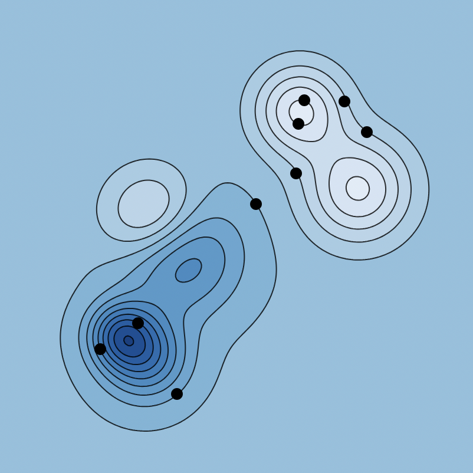

We have our first exam this Friday, January 30. The exam will have 5 or 6 problems, four of which will closely related one of the following.

1. The contour plot of a function is shown in 
[Figure @fig-hills_valleys] on the reverse.
   a) Identify any max, min, or saddle points that you see on the graph.
   b) Note the randomly scattered points on the figure. For each of those points, draw the corresponding gradient vector emanating from that point. Be sure to pay careful attention to the direction and relative magnitude of those vectors.

{#fig-hills_valleys fig-alt="A terrain with hills and valleys" fig-align="center" width=80%}

<!-- Image generated here: -->
<!-- https://observablehq.com/@mcmcclur/hills-and-valleys -->

2. Write down precise the mathematical definition of a non-singular matrix.  
   There will be other definitions, chosen from the review sheet problems.
   
3. Provide an example of a linear system of three equations in three unknowns that has no solutions.  
   This will be one part of three.

4. Let $M$ denote the matrix
$$
M = \left(
\begin{array}{ccc|c}
 2 & 0 & 6 & 2 \\
 2 & -1 & 7 & 1 \\
 -2 & 2 & -8 & 0 \\
\end{array}
\right)
$$
   a) Place $M$ into reduced row echelon form.
   b) Assuming that $M$ is an augmented matrix representing a $3\times3$ system, use your reduced row echelon form to solve that system. If the solution set is infinite, you should parameterize that solution set.

