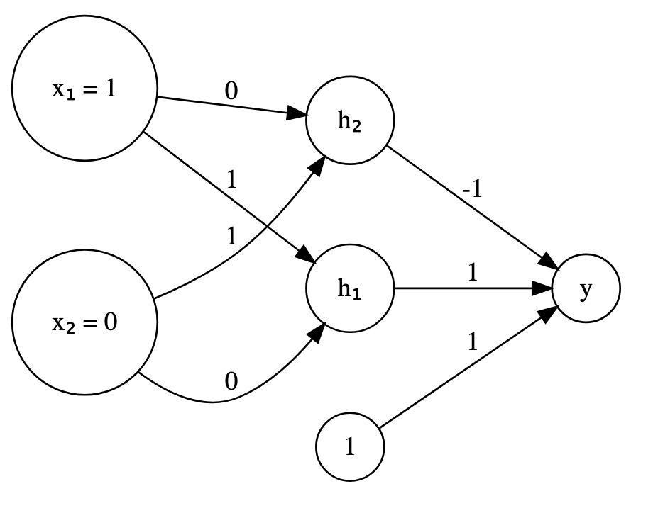
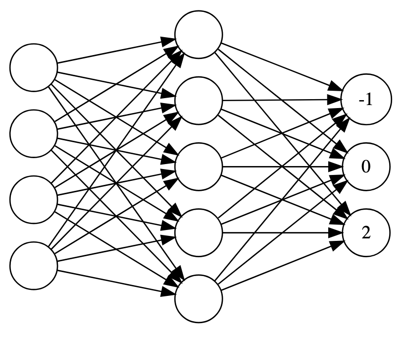

\vspace{-0.5in}
We will have our third exam this Friday! Here's our in class practice sheet.

## The problems

1. Let $A$ denote the matrix 
$$\begin{bmatrix}
  2 & 3 & -5 \\
  0 & -7 & 11 \\
  0 & 0 & 13
\end{bmatrix}.$$
Diagonalize $A$.  
You may assume that the eigenvectors of $A$ from most to least dominant are 
$$
\begin{bmatrix}
  -4 \\ 5 \\ 10
\end{bmatrix},
\: \: 
\begin{bmatrix}
  -2 \\ 5 \\ 0
\end{bmatrix}, \text{ and} 
\: \: 
\begin{bmatrix}
  1 \\ 0 \\ 0
\end{bmatrix}.
$$

2. Let $A$ denote the matrix 
$$
A = \begin{bmatrix}5&-2\\6&-2\end{bmatrix}.
$$
Suppose that I diagonalize $A$ and find that 
$$
A = 
\begin{bmatrix}1&2\\2&3\end{bmatrix}
\begin{bmatrix}1&0\\0&2\end{bmatrix}
\begin{bmatrix}-3&2\\2&-1\end{bmatrix}.
$$
   a. Verify that this is, in fact, a diagonalization.
   b. Compute $A^{10}$.

3. Suppose that $A$ is similar to $B$. That is, there is a non-singular matrix $S$ such that
$$
A = SBS^{-1}.
$$
Find a matrix $S$ that shows that $B$ is similar to $A$ and show that it works.

\newpage 

4. Consider the data matrix $X$ given by  

   ::: {style="max-width: 200px"}

   |$\mathbf{x}_1$|$\mathbf{x}_2$|
   |:---:|:---:|
   |0|0|
   |1|1|
   |2|1|

   ::: 

   a. Sketch the data together with a *rough estimate* of the first principal component.
   b. The principal components of $X$ are the eigenvectors of what matrix?
   c. Which of the following vectors could potentially be the first principal component?
   $$
   \begin{bmatrix}1\\1.6\end{bmatrix}, \: 
   \begin{bmatrix}1.6\\1\end{bmatrix}, \: \text{ or } \:
   \begin{bmatrix}-0.6\\-0.2\end{bmatrix}.
   $$

5. Let $f(x,y,z) = xy^2 + y^2z.$

   a. Draw an expression graph for $f$.  You should probably use operator nodes labeled "square", "times", and "plus".
   b. Further label your expression graph to illustrate the computation $f(1,2,3)$.

6. The neural network shown in @fig-nn below consists of three layers:
    - the input layer,
    - one hidden layer, and 
    - the output layer.

   Let's also suppose that the input layer has a ReLU activation and the output layer has a sigmoid activation.

   Note that the inputs are given. Use those inputs together with forward propagation to compute the value produced by this neural network.

7. Consider the neural network shown in @fig-soft_nn. Probabilities for the three possible outputs of red, yellow or blue from top to bottom are to be computed by applying the softmax to the values currently indicated.
    a. Which value red, yellow, or blue is most likely?
    b. What is the probability associated with that value?

\newpage 

## Figures 

{#fig-nn fig-align="center" fig-alt="A simple neural network image for computation"} 

{#fig-soft_nn fig-align="center" fig-alt="A simple neural network image for softmax computation"}

