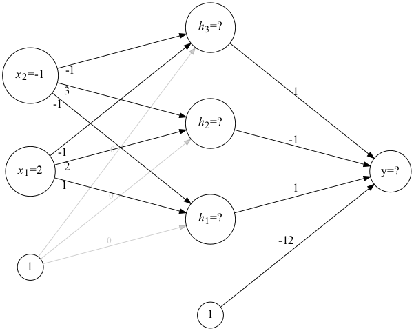
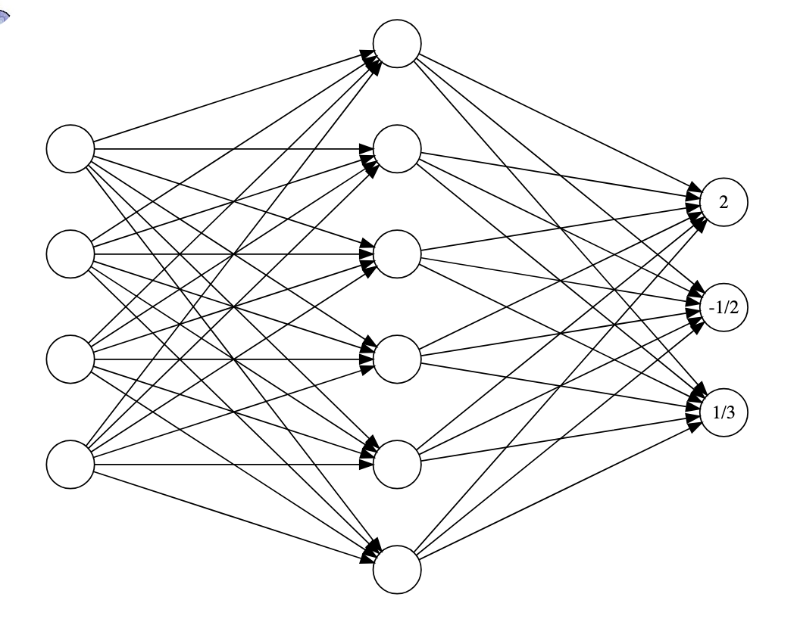

We will have our fourth exam during the term next Friday, April 17. This review sheet is again meant to help you succeed on that exam.

Generally, I will expect *solutions* to the problems, as opposed to just answers. So, for example, if the answer to an optimization problem is $y=5$, then the solution will consist of a clear explanation with correctly written supporting computations indicating *why* the answer is $y=5$.

::: {.content-visible when-format="html"}

Note that there is a link at the bottom of this sheet labeled either "Start Discussion" or "Continue Discussion", depending on the status of those discussions. Following that link will take you to my forum where you can create an account with your UNCA email address. You can ask questions and/or post responses and answers there.

:::

## The problems

1. Write down a careful definition of each of the following.

   a. Similarity of matrices $A$ and $B$
   b. Principle component of a data matrix $X$
   c. The sigmoid function
   d. The ReLU function 
   e. The softmax function.

2.  Diagonalize the matrix $$A = \left(
 \begin{array}{cc}
  5 & 1 \\
  1 & 5 \\
 \end{array}
 \right)$$ That is, express the matrix as a factorization
    $A=SDS^{-1}$ where $D$ is diagonal. You do *not* need to compute the inverse of $S$ explicitly.


3. Diagonalize the matrix $$B = \left(
   		\begin{array}{ccc}
   		 1 & 1 & 4 \\
   		 0 & -2 & 0 \\
   		 0 & -1 & -3 \\
   		\end{array}
   		\right)$$ That is, express the matrix as a factorization
   $B=SDS^{-1}$ where $D$ is diagonal. You do *not* need to compute the inverse of $S$ explicitly.  
   *Comment*: Probably, I'd give you the eigenvalues and eigenvectors for this problem.
   
4. Compute 
$$A^{42}\begin{bmatrix}1 \\ 1\end{bmatrix}$$
where $A$ is the matrix in problem 2 and
$$B^{42}\begin{bmatrix}1 \\ 1 \\ 1\end{bmatrix}$$
where $B$ is the matrix in problem 3 and

5.  Suppose that $A$ is similar to $B$ and that $\lambda$ is an
   eigenvalue of $A$ with corresponding eigenvector $\vec{x}$. Show that $\lambda$ is also an eigenvalue of $B$. What is the
   corresponding eigenvector of $B$?


6.  Bob says that every $3\times3$ matrix is similar to its own inverse. Provide a counter example showing that Bob is wrong.

7.  Suppose that $A$, $B$ and $C$ are $n\times n$ matrices with $A$ similar to $B$ and $B$ similar to $C$. Use the definition of similarity to prove that $A$ is similar to $C$.

8. Consider the data matrix $X$ given by  

   ::: {style="max-width: 200px"}

   |$\mathbf{x}_1$|$\mathbf{x}_2$|
   |:---:|:---:|
   |1|3|
   |2|2|
   |3|1|

   ::: 

   a. The principal components of $X$ are the eigenvectors of what matrix?
   b. In what direction does the first principal component point?  
   It might help to draw a picture!

9. Let $f(x) = \sin(x^3 + 2(x^3+1))$.

   a. Draw out an expression graph for $f$ as it's written. Do be sure to reuse any expressions that you can.
   b. Trace the evaluation of $f(2)$ through the expression graph.

10. Let $f(x,y) = \sin(x^3 + 2(x^3+y^2))$.

    a. Draw out an expression graph for $f$ as it's written. Do be sure to reuse any expressions that you can.
    b. Trace the evaluation of $f(2,-1)$ through the expression graph.

11. The neural network shown in @fig-nn below consists of three layers:
    - the input layer,
    - one hidden layer, and 
    - the output layer.

Let's also suppose that the input layer has a ReLU activation and the output layer has a sigmoid activation.

Note that the inputs are given. Use those inputs together with forward propagation to compute the value produced by this neural network.

12. Consider the neural network shown in @fig-soft_nn. Probabilities for the three possible outputs of red, yellow or blue from top to bottom are to be computed by applying the softmax to the values currently indicated.
    a. Which value red, yellow, or blue is most likely?
    b. What is the probability associated with that value?


## Figures 

{#fig-nn fig-align="center" fig-alt="A simple neural network image for computation"}

{#fig-soft_nn fig-align="center" fig-alt="A simple neural network image for softmax computation"}


::: {.content-visible when-format="html"}

## Your questions and answers 

If you’d like to ask a question about or reply to a question on this sheet, you can do so by pressing the “Reply on Discourse” button below.

```{ojs}
embedDiscourseMathTopic(147)
```

```{ojs}
import {embedDiscourseMathTopic} from '/components/EmbedDiscourseMathTopics/embedDiscourseMathTopic.js';
```

:::