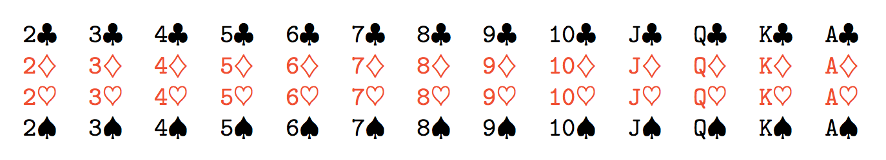

# Recap and look ahead 

Recently, we reviewed the basics of integration and then we saw an overview of how that might be applied to probability theory. Today, we start probability theory in earnest with a discussion of discrete probability.


# What is *probability*?

Probability theory is largely concerned with computing or estimating the probability that certain events might happen. Let's begin by clarifying our language.

- A *random event* is an event where we know which possible outcomes *can* occur
   but we don't know which specific outcome *will* occur.
- The set of all the possible outcomes is called the *sample space* $\Omega$.
- Thus, an event is a subset $A$ of the sample space.

Mathematically, probability is a function $P$ that accepts events and assigns a number in $[0,1]$.

## A framework for examples

The serious, mathematical study of probability theory has its origins in the $17^{\text{th}}$ century in the writings of [Blaise Pascal](https://en.wikipedia.org/wiki/Blaise_Pascal) who studied - gambling. Many elementary examples in probability theory are still commonly phrased in terms of gambling. As a result, it's long standing tradition to use coin flips, dice rolls and playing cards to illustrate the basic principles of probability. Thus, it does help to have a basic familiarity with these things.


## Playing cards

A standard deck of playing cards consists of 52 cards divided into 13 ranks each of which is further divided into 4 suits

 * 13 ranks: A,2,3,4,5,6,7,8,9,10,J,K,Q
 * 4 suits: hearts, diamonds, clubs, spades



When we speak of a "well shuffled deck" we mean that, when we draw one card,
each card is equally likely to be drawn. 

## The one-draw sample space

Suppose we draw a single card from a well-shuffled deck.

- The sample space consists of the set of cards.
- An event is some subset of the sample space.

Example events could be:

- We draw a red card or 
- We draw a heart or 
- We draw the King of Hearts.

## The probability function 

The probability function assigns probabilities to events. In our previous examples,

- The probability that we draw the King of Hearts should be $1/52$,
- The probability that we draw a heart should be $1/4$, and
- The probability that we draw a red card should be $1/2$.

That brings us to our first formula for computing probabilities!

## Mutually exclusive events

The events $A$ and $B$ are called *mutually exclusive* if only one of them can occur.
Another term for this same concept is *disjoint*. If we know the probability that $A$ occurs and we know the probability that $B$ occurs, then we can compute the probability that $A$ or $B$ occurs by simply adding the probabilities. Symbolically,

$$P(A \text{ or } B) = P(A) + P(B).$$

Thus, for example, the probability of drawing a heart is $13/52=1/4$. We can see this since there are 13 hearts, each with probability of being drawn of $1/52$, and  they are mutually exclusive.

# Independent events 

We say that two events are *independent* if the outcome of one has no bearing on the outcome of the other. If I flip a coin twice, for example, the outcome of the first flip shouldn't affect the outcome of the second.

When two events are independent, we can compute the probability that both occur by multiplying their probabilities. Symbolically,
$$P(A \text{ and } B) = P(A)P(B).$$

If I flip a coin twice, for example, the probability that I get two heads is $1/4$.


## Coins 

Independent events are well modelled by coin flips so let's develop some relevant terminology

A binary event is an event with exactly two possible outcomes. We often express a randomly chosen, binary event in terms of a coin toss because...

::: {.fragment}

::::: {.callout-important}
## Fact 
**Coins don't land on their sides!**
:::::

Generally, we think of a coin toss as "fair";  
that is, it comes up heads or tails 50:50.
:::

## Unfair coins 

We are often interested in modelling binary events that are not 50:50. Perhaps, we have a 70:30 coin that comes up heads 70% of the time and tails 30% of the time.

- Such a coin is called *unfair* or *weighted*.  
- A 50:50 coin is called *fair* or *unweighted*.

## Dice 

We can apply similar ideas to dice. 

The most widely used dice are small cubes with six sides. We think of them as "fair" in that they produce numbers one through six with equal probability of $1/6$ for each.

In probability theory, we often speak of $n$-sided die which might be fair or unfair.

- An $n$-sided die is *fair* if it produces each result $1$ through $n$ with equal probability $1/n$.
- We can certainly have unfair dice as well and might list their probabilities in a table:

|1|2|3|4|
|:---:|:---:|:---:|:---:|
|0.1|0.2|0.3|0.4|


## Combined example

Suppose I flip a coin that comes up heads 70% of the time and I also roll a four sided die with the probabilities 

|1|2|3|4|
|:---:|:---:|:---:|:---:|
|0.1|0.2|0.3|0.4|

I count a coin flip as $1$ if it's heads and $0$ if it's tails. I then add the result of the coin flip and the die roll. What's the probability that my combined total is $3$?

::: {.callout-note .fragment}
## Answer

$$0.7\times0.2 + 0.3\times0.3 = 0.23.$$

:::


# Random variables

A *random variable* is a simply a function $X$ defined on the sample space that returns real numbers. That is, $X:\Omega\to\mathbb R$. 

Often, it's simpler and sufficient to think of a random variable as a random process with some numerical outcome.

## Example random variable

Suppose, for example, I roll a 10 sided die and write down

- $X=1$ if the roll comes up 1, 2, or 3,
- $X=2$ if the roll comes up 4, 5, 6, or 7, or
- $X=3$ if the roll comes up 8, 9, or 10

I guess it's easy to see how this is a random process with a numerical outcome.

## The corresponding function 

In the previous example, the sample space is 
$$
\Omega = \{1,2,3,4,5,6,7,8,9,10\}.
$$
The possible outcomes of $X$ are $1$, $2$, or $3$. The random variable can be defined by simply listing its values 

- $X(1)=X(2)=X(3)=1$
- $X(4)=X(5)=X(6)=X(7)=2$
- $X(8)=X(9)=X(10)=3$.

Note that the range of this random variable is contained in the integers. That makes this random variable discrete, rather than continuous.

## Continuous random variables

There are certainly random variables that can, in principle, produce any real number.

  * Example A: Let $X$ be the average number of points that Ohio State beats Michigan by until (hopefully, a long time from now) Michigan wins.
  * Example B: Find somebody and choose $X$ to be a very precise measure of their height.
  * Example C: Randomly choose a college and choose $X$ to be the average salary of all the professors.


These are all continuous random variables. In the language of probability theory, we would say that the sample space is the set of real numbers. We'll focus on these next time.


## Distributions for discrete random variables

Roughly, the *distribution* of a random variable tells you how likely that random variable is to produce certain outputs. For a discrete random variable, this boils down to listing out the probability that the random variable hits every specific value.


The distribution of a discrete random variable is defined to be a table of all the possible outcomes together with their probabilities. 

For example 3 above, we might write

<table>
    <tr>
        <th>X</th><td>1</td><td>2</td><td>3</td>
    </tr>
    <tr>
        <th>p</th><td>3/10</td><td>4/10</td><td>3/10</td>
    </tr>
</table>

Note that all the probabilities should be non-negative and they should sum to one.

## Functional notation

An alternative is to specify the values of a function $P$ for the possible values of $X$. For example, the previous table could be written:

  * $P(X=1) = 3/10$
  * $P(X=2) = 4/10$
  * $P(X=3) = 3/10$

As we'll see next time, this notation will extend in a natural way to continuous distributions.

## Pictorial representation

A final alternative is to represent a discrete distribution with a plot.

```{python}
import matplotlib.pyplot as plt
import numpy as np

plt.plot([1,1],[0,3/10], 'k', linewidth=1)
plt.plot([2,2],[0,4/10], 'k', linewidth=1)
plt.plot([3,3],[0,3/10], 'k', linewidth=1)
plt.plot(1,3/10, 'ko')
plt.plot(2,4/10, 'ko')
plt.plot(3,3/10, 'ko')

ax = plt.gca()
ax.set_xticks([1,2,3])
ax.set_yticks([3/10,4/10])

fig = plt.gcf()
fig.set_figwidth(13)
fig.set_figheight(8)
```


## A large discrete distribution

Pictorial representations of discrete distributions make particular sense when there are a large number of possibilities. The image below portrays a discrete distribution where the sample space is the set of integers between 1 and 100 and smaller numbers are more likely to be chosen than larger numbers.

```{python}
a = 5.18738
for i in range(1,101):
    plt.plot([i,i],[0,1/(a*i)], 'k', linewidth=1/2)
    plt.plot([i],[1/(a*i)], 'ko', markersize=3)
    
ax = plt.gca()
ax.set_yticks([0.1,0.2])

fig = plt.gcf()
fig.set_figwidth(13)
fig.set_figheight(8)
```


## Independence of random variables 

We can extend the idea of independence of random events to independence of random variables in a natural way.

We say that the random variables $X$ and $Y$ are *independent* if 
$$
E(XY) = E(X)E(Y).
$$

## Example of independence 

Suppose I flip a 75:25 coin. Let 
$$
X_i = \begin{cases}
1 & \text{if } i^{\text{th}} \text{ flip is a head} \\
0 & \text{if } i^{\text{th}} \text{ flip is a tail}
\end{cases}
$$

The following tables summarize the possibilities for $X_1$ and $X_2$, together with the probabilities for $X_1X_2$ expressed as products.

::: {.columns}

::::: {.column width="40%"}
||$X_1=1$|$X_1=0$|
|:---:|:---:|:---:|
|$X_2=1$|$\frac{3}{4}\times\frac{3}{4}$|$\frac{1}{4}\times\frac{3}{4}$|
|$X_2=0$|$\frac{3}{4}\times\frac{1}{4}$|$\frac{1}{4}\times\frac{1}{4}$|
::::::

::::: {.column width="10%"}
or
:::::

::::: {.column width="50%"}
||$X_1=1$|$X_1=0$|
|:---:|:---:|:---:|
|$X_2=1$|$\frac{9}{16}$|$\frac{3}{16}$|
|$X_2=0$|$\frac{3}{16}$|$\frac{1}{16}$|
:::::

:::

Ultimately, this follows from the independence of the underlying events.


# Mean and standard deviation

The mean and standard deviation that we learned for data can be extended to random variables using the idea of a *weighted average*.


## Mean or expectation

The *mean* of a discrete random variable is
$$ E(X) = \sum x_i P(X=x_i) = \sum x_i p_i.$$
We might think of this as a weighted mean.

The mean is also frequently referred to as the *expectation* or the *expected value*. This is very common in statistics and even more so in prediction algorithms.


## Example 1 - Weighted die roll

Recall our weighted die roll with probability distribution

<table>
    <tr>
        <th>X</th><td>1</td><td>2</td><td>3</td>
    </tr>
    <tr>
        <th>p</th><td>3/10</td><td>4/10</td><td>3/10</td>
    </tr>
</table>


The expected value of a roll of this die is
$$1\frac{3}{10} + 2\frac{4}{10} + 3\frac{3}{10} = 2.$$


## Example 2 - Weighted coin flip 

I've got a weighted coin that comes up heads $75\%$ of the time, in which case I write down a one. If it comes up tails, I write down a zero. 

The expectation associated with one flip is
$$E(X) = 1\times \frac{3}{4} + 0 \times \frac{1}{4} = \frac{3}{4}.$$


## Standard deviation

The variance of a discrete random variable $X$ is 
$$\sigma^2(X) = \sum (x_i - \mu)^2 p_i.$$
We might think of this as a weighted average of the squared difference of the possible values from the mean. The standard deviation is the square root of the variance.

## Examples 

### Weighted die roll

The variance of our weighted die roll in the example above is
$$(1-2)^2\frac{3}{10} + (2-2)^2\frac{4}{10} + (3-2)^2\frac{3}{10} = \frac{6}{10}.$$

### Weighted coin flip

The variance of our weighted coin flip is 
$$\sigma^2(X) = (1-3/4)^2\frac{3}{4} + (0-3/4)^2 \frac{1}{4}=\frac{3}{16}.$$

## Combining distributions

One nice thing about expectation and variance is that they are *additive*. That is, if 
$X_1$ and $X_2$ are both random variables, then
$$E(X_1 + X_2) = E(X_1) + E(X_2).$$
If $X_1$ and $X_2$ are independent, then
$$\sigma^2(X_1 + X_2) = \sigma^2(X_1) + \sigma^2(X_2).$$

## Example

Suppose I flip my weighted coin that comes up heads 75\% of the time 100 times and let
$X_i$ denote the value of my $i^{\text{th}}$ flip. Thus,
$$X_1 + X_2 + \cdots + X_{100}$$
represents the total number of heads that I get and, by the additivity of expectation, we
get
$$E(X_1 + X_2 + \cdots + X_{100}) = 100 \times \frac{3}{4} = 75.$$

## Example (cont)

Similarly, for the variance we get
$$\sigma^2(X_1 + X_2 + \cdots + X_{100}) = 100 \times \frac{3}{16} = \frac{75}{4}.$$
Of course, this means that the standard deviation is $\sqrt{75/4}$.

*Note*: The standard deviation of one flip is $\sqrt{3/16} \approx 0.433013$ and the 
standard deviation of 100 flips is $\sqrt{75/4} \approx 4.33013$. The second is 10 times
larger in magnitude but, *relative to the total number of flips* it's $0.0433013$, which
is tens times smaller.


# The binomial distribution

The binomial distribution is a discrete distribution that plays a special role in statistics for many reasons. Importantly for us, the binomial distribution allows us to see how a bell curve (in fact *the normal* curve) arises as a limit of other types of distributions.

## Flipping a coin five times

Suppose we flip a coin 5 times and count how many heads we get. This will generate a random number $X$ between 0 and 5 but they are not all equally likely. The probabilities are:

  * $P(X=0)=1/32$
  * $P(X=1)=5/32$
  * $P(X=2)=10/32$
  * $P(X=3)=10/32$
  * $P(X=4)=5/32$
  * $P(X=5)=1/32$


## Flipping a coin five times (cont)

Note that the probability of getting any *particular* sequence of 5 heads and tails is 
$$\frac{1}{2^5} = \frac{1}{32}.$$
That explains the denominator of 32 in the list of probabilities.

## Visualizing all flip sequences

The numerator in that table is the number of ways to get the sum. For example, there are 10 ways to get 2 heads in 5 flips:

```{python}
from heads_tails import plot_combos 
plot_combos(5,2)
```


## Bernoulli random variables  

We'd like to formally generalize the binomial random variables. We'll do so using the concept of a Bernoulli trial.

The random variable generated by a single flip of a (potentially) unfair coin is called a *Bernoulli trial*. Thus, $X$ is Bernoulli if it can take the values zero and one with 

- $P(X=1) = p$ and 
- $P(X=0) = 1-p$.

Note that $p$ is a real parameter satisfying $0\leq p \leq 1$.

## General binomial RVs

Now, a binomial random variable $S$ is simply the sum of $n$ independent Bernoulli trials with the same value of $p$. That is,
$$
S = \sum_{i=1}^{n} X_i
$$


## Interactive binomials

The interactive tool below allows you to play with the parameters defining a binomial distribution.

<iframe width="800" height="500" src="BinomialDistribution.html"></iframe>


# The binomial coefficients

There's a fabulous way to think about the binomial distribution in terms of combinations and permutations that leads to an exact and useful formula. The formula comes in two parts, one of which is the so-called "binomial coefficient" and the the other of which is a product of Bernoulli probabilities $p$ or $1-p$.

## The binomial distribution

Suppose I run $n$ independent Bernoulli trials, each with probability of success $p$. The probability of getting exactly $k$ successes is

$$
\boxed{\frac{n!}{k!(n-k)!}} \:\: \times \:\: \boxed{p^k(1-p)^{n-k}}.
$$

- The term on the left is the *binomial coefficient*.
- The term on the right is a particular probability.

::: {.fragment}
If it's not clear by now, you may think of a Bernoulli trial as the flip of an unfair coin.
:::

## A particular probability 

Let's suppose we flip a $p:1-p$ coin $7$ times. Then, any particular sequence of with five heads is equally likely to appear. Like the one below, they all have probability 
$$
p^5\times(1-p)^2.
$$

::: {style="width: 500px; margin: 0 auto"}
```{python}
from heads_tails import coin_flip_plot
coin_flip_plot('HTHHHTH')
```
:::

More generally, the probability of getting $k$ heads in $n$ flips is $p^k(1-p)^{n-k}$.

## More particulars

But there are a lot more ways to get exactly 5 heads in 7 flips. Here are all 21 ways:

```{python}
plot_combos(7,5,cols=3)
```

## All together 

Taken altogether, the probability of getting exactly five heads in seven flips of a $70:30$ coin is
$$
21\times (0.7)^5 \times (0.3)^2
$$

<hr>

More generally, the probability of getting exactly $k$ heads in $n$ flips of a $p:(1-p)$ coin is
$$
{n\choose k} p^k (1-p)^{n-k}.
$$

## $n$ choose $k$

The $n \choose k$ term is called the *binomial coefficient* and denotes the number of ways to choose $k$ thingamajigs from a larger collection of $n$ thingamaboppers. It is read "$n$ choose $k$" and has the formula 
$$
{n \choose k} = \frac{n!}{k!(n-k)!}.
$$
For example,
$$
{7 \choose 5} = \frac{7!}{5!(7-5)!} = \frac{7\times 6}{2} = 21,
$$
as we've already seen.

## Derivation 

In the binomial coefficient formula, 
$$
\frac{n!}{(n-k)!} = n \times (n-1) \times \cdots (n-(k-1))
$$
denotes the number of ways pick $k$ objects from $n$ in order.

We then divide by the number of permutations of those $k$ things to account for the fact that order doesn't matter to form a set.

## Examples

1. In the expansion of $(x+1)^{100}$, what is the coefficient of $x^{42}$?  
   [*Ans*: ${100\choose42} = \frac{100!}{42!\times58!}$]{.fragment}  
   [or $28258808871162574166368460400$, if you must know]{.fragment}.
2. If I flip a fair coin $100$ times, what's the probability that I get $42$ heads?  
   [*Ans*: ${100\choose42}\frac{1}{2^{100}} \approx 0.0223$]{.fragment}


# Binomial mean and variance

We'd like to quantify our understanding of the binomial distribution. To do so, we'll first derive the distribution of a single binomial trial; we can then derive the binomial distribution using rules of combination for random variables.

By a Bernoulli trial, of course, we mean a random variable $X$ such that, 

$$P(X=1)=p \text{ and } P(X=0)=1-p.$$

## Bernoulli mean and variance

From there, we can compute the mean and variance of $X$ straight away:

$$E(X) = p\times1+(1-p)\times0 = p$$

and

$$
\begin{aligned}
\sigma^2(X) &= p(1-p)^2 + (1-p)(0-p)^2 \\ 
 &= (1-p)\left[p(1-p) + (-p)^2\right] \\
 &= (1-p)\left(p-p^2+p^2\right) = p(1-p).
\end{aligned} 
$$
The standard deviation is then
$$\sigma(X) = \sqrt{p(1-p)}.$$

## Repeated experiments

Now suppose that $S$ represents the sum of $n$ independent runs of $X$. Then, since mean and variance are additive, we have

$$E(S) = np,$$
$$\sigma^2(S) = np(1-p),$$
and
$$\sigma(S) = \sqrt{np(1-p)}.$$

## Example 

I've got a six-sided  die with two sides labeled $-1$ and four sides labeled $5$.

- What is the expected value of 1 roll?  
  [Ans: $\frac{2(-1)+4(5)}{6} = 3$]{.fragment}
- What is the expected value of 100 rolls?  
  [Ans: $100\times3 = 300$]{.fragment}
- What is the variance of 1 roll?  
  [Ans: $(-1-3)^2\frac{1}{3} + (5-3)^2\frac{2}{3} = \frac{20}{3}$]{.fragment}
- What is the variance of 100 rolls?  
  [Ans: $100\times\frac{20}{3}$]{.fragment}

  Of course, the standard deviation is the square root of the variance.

# But... Why???

Why would we do all this?

Ultimately, we'd like to use random variables to model data. A single Bernoulli trial corresponds to the outcome of an experiment or survey. A binomial formed by the sum of Bernoulli trials allows us to estimate a related proportion for the whole population.

## Example

We might stop someone on the street and ask if they plan to vote for Roy Cooper in the coming NC Senate election. That might give us some information but it's just one data point.

If we ask 1000 randomly selected people the same question and compute the proportion who say yes or no, we get an actual estimate to the corresponding proportion for the whole population. If we want to know how good that estimate is, we need to know how that random process is distributed.

## Fitting the normal 

When we actually model the data, we'll end up using a normal curve. The way to do so is to use the normal curve with the same mean and standard deviation.

Thus, we need to know what mean and standard deviation are in these varying contexts.

## The normal fit 

Here's what that fit looks like, when we model a binomial distribution with the corresponding normal:

<iframe width="800" height="500" src="BinomialDistributionWithNormal.html"></iframe>
