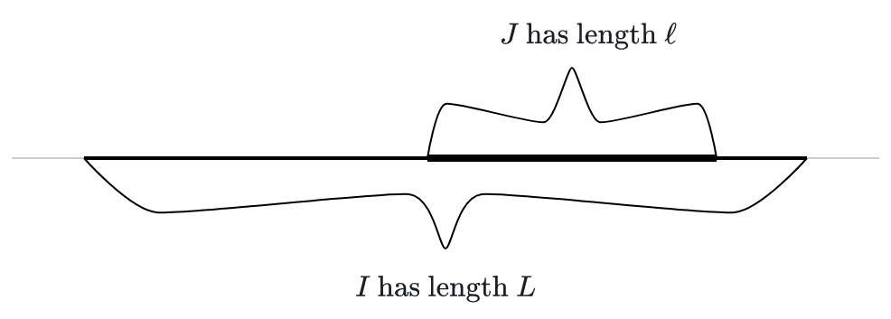

# Recap and look ahead 

Last time, we started probability theory in earnest with a discussion of discrete probability. Today, we'll discuss continuous probability with an emphasis on the normal distribution.


# The uniform distribution

The *continuous, uniform distribution* is probably the simplest example of a continuous distribution in general. 

Suppose I pick a *real* number between $-1$ and $1$ completely (and uniformly) at random. What does that even mean?

Can we make sense of picking zero? Or $1/2$? Or $-1/\pi$?

## Picking from intervals

It might make more sense to think in terms of picking a number out of some subinterval. For example, it seems like the probability that the number lies in the left half of the interval (i.e. to the left of zero) should be equal to the probability that the number lies in the right half. Phrased in terms of a probability function applied to events, we might write

$$P(X<0) = P(X>0) = \frac{1}{2}.$$

## Probability as relative length

Pushing the previous slide a bit further, suppose we a pick number uniformly at random from an interval $I$. The probability of picking a number from a sub-interval should be proportional to the length of that sub-interval.

If the big interval $I$ has length $L$ and the sub-interval $J$ has length $\ell$, then I guess we should have

$$P(X \text{ is in } J) = \ell/L.$$

</img>

## Example

Suppose we pick a number $X$ uniformly at random from the interval $[-10,10].$ What is the probability that the number lies in the interval $[1,3]?$

<div class="fragment">

**Solution**: We simply divide the length of the sub-interval by the length of the larger interval to get

$$P(1<X<3) = \frac{2}{20} = 0.1.$$

Note that we've indicated the event using the inequality $1<X<3$, as we will typically do.

</div>

## Visualizing the continuous uniform distribution

A common way to visualize continuous distributions is to draw the graph of a curve in the top half of the $xy$-plane. The probability that a random value $X$ with that distribution lies in an interval is then the area under the curve and over that interval. This curve is often called the *density function* of the distribution.


## Visualization (cont)

In the case of the uniform distribution over an interval $I$, the "curve" is just a horizontal line segment over the interval $I$ at the height 1 over the length of $I$. In the picture below, for example, $I=[0,2]$. On the left, we see just the density function for the uniform distribution over $I$.  On the right, we see the area under that density function and over the interval $[0.5,1]$. The area is $1/4$ since
$$P(0.5<X<1) = 1/4.$$

<div style="width: 90%; margin: 0 auto;">

```{python}
from components.figures import uniform_density
uniform_density()
```

</div>

## A distribution as a limit

This pictorial view  helps us see how a continuous distribution might arise as a *limit* of discrete distributions.

```{python}
from components.figures import uniform_limit
uniform_limit()
```

## Key point 

The *key point* here is to get you thinking in terms of probability as area under a curve - at least, in one simple example.

# Continuous distributions

As we discussed last time, a random variable $X$ is a function that produces random outputs. We know what kinds of outputs $X$ can produce; we just don't know which values actually occur for any particular application of the function.

We can, however, determine the probabilities that certain types of values might be produced. In the case of a continuous random variable, we do so with a Probability Density Function or PDF. 

## Definition

A *Probability Density Function* or PDF is defined by a function $f:\mathbb{R} \to \mathbb R$ that satisfies a couple of properties:

- $f(x)\geq0$ for all $x\in\mathbb{R}$ and 
- its integral over the real line is $1$, i.e.

$$\int_{-\infty}^{\infty} f(x) \, dx = 1.$$


## Distributions for random variables 

When we say that a continuous random variable $X$ has distribution $f$, we mean that $f$ is a PDF that we can use to compute probabilities associated with $X$. We can say, for example, 

$$P(a < X < b) = \int_a^b f(x) \, dx.$$

It is not at all unusual for $a$ or $b$ to be $\pm\infty$.

## Uniform example

Let us suppose that $X$ is uniformly distributed over the interval $[0,2]$. Put another way, $X$ has the distribution 
$$
f(x) = \begin{cases}
\frac{1}{2} & \text{if } 0 \leq x \leq 2 \\
0 & \text{else.}
\end{cases}
$$
Then, 
$$P\left(\frac{1}{2} < X < 1\right) = \int_{1/2}^1 \frac{1}{2} dx = \frac{1}{4}.$$

## The exponential distribution 

The exponential distribution provides a somewhat more advanced example. It's actually a whole family of distributions defined in terms of a positive parameter $\lambda$ by 
$$
f_{\lambda}(x) = \begin{cases}
\lambda e^{-\lambda x} & \text{if } x \geq 0 \\
0 & \text{else.}
\end{cases}
$$

Note that $f$ is a good PDF, since it's nonnegative and

$$
\begin{aligned}
\int_{-\infty}^{\infty} f(x) \, dx &= \lambda \lim_{b\to\infty} \int_0^{b} e^{-\lambda x} \, dx \\
&= -\lim_{b\to\infty} e^{-\lambda x}\bigg\rvert_0^b = 1.
\end{aligned}
$$

## Exponential PDF 

Here's a look at the exponential family of distributions. There might be more information in the Desmos implementation.


<iframe src="https://www.desmos.com/calculator/o4q5sysz5r?embed" width="800" height="400" style="border: 1px solid #ccc;" frameborder=0></iframe>

## An exponential computation

Here's the probability of generating an exponentially distributed random number in the unit interval:
$$
\lambda \int_0^1 e^{-\lambda x} \, dx = - e^{-\lambda x}\bigg\rvert_0^1 = 1-e^{-\lambda}.
$$
Note that the result $1-e^{-\lambda}$ is close to zero when $\lambda$ is close to zero and it increases up to $1$ as $\lambda$ increases to $\infty$. Thus, the larger $\lambda$ is, the more mass this distribution places into the unit interval.

That certainly seems to be in agreement with our interactive distribution image.


# Mean and standard deviation 

We measure the mean and standard deviation for continuous variables in a way that is directly analogous to discrete variables. The key is to realize that *integration is the continuous analog to summation*.

Thus, if $X$ has the distribution whose PDF is $f$, then

$$E(X) = \int_{-\infty}^{\infty} x f(x) \, dx$$

Note that we are simply multiplying the value $x$ by the density function $f$ and "adding" the results for all values.

## The discrete analog 

To be clear, the discrete analog to the mean is

$$E(X) = \sum_{i=1}^n x_i \, p_i$$

That literally multiplies the value $x_i$ by the distribution function $p_i$ and adds the results for all values.

## Example (mean of exp)

Consider the exponential distribution with parameter $\lambda=1$. It has the density function $f(x) = e^{-x}$ for $x\geq0$. Its expected value is therefore
$$
\begin{aligned}
E(X) &= \int_{-\infty}^{\infty} x f(x) \, dx = \lim_{b\to\infty} \int_0^{b} xe^{-x} \, dx \\ 
&= -\lim_{b\to\infty}\left(e^{-x} x+e^{-x}\right)\bigg\rvert_0^{b} \\
&= -\lim_{b\to\infty}\left[\left(e^{-b} b+e^{-b}\right) - \left(e^{-0} 0+e^{-0}\right)\right] = 1
\end{aligned}
$$
Note that the anti-differentiation step can be checked easily enough by checking that 
$$
-\frac{d}{dx} \left(e^{-x} x+e^{-x}\right) = x e^{-x}.
$$

## Variance 

Once you have the expected value $\mu$, the variance is computed as 
$$
\sigma^2(X) = \int_{-\infty}^{\infty} (x-\mu)^2 f(x) \, dx.
$$

Again, this is directly analogous to the discrete variable situation:

$$
\sum_i (x_i-\mu)^2 p_i.
$$

## Example (var of exp)

Let's at least write down the integral representing the variance of the exponential distribution. Since the expected value is already known to be $\mu=1$, I guess we would get 
$$
\sigma^2 = \int_0^{\infty} (x-1)^2 e^{-x} \, dx.
$$

The following Python code suggests that the value of this integral is 1:

```{python}
#| echo: true
import numpy as np
from scipy.integrate import quad
quad(lambda x: (x-1)**2 * np.exp(-x), 0, 100)
```

## Uniform mean and variance

Computing mean and variance for the uniform distribution is pretty easy and you are asked to do so [in this forum problem](https://discourse.marksmath.org/t/mean-and-standard-distribution-of-a-uniform-distribution/116){target=_blank}.


# The normal distribution 

We've met the normal distribution before, of course. Let's recall its definition and compute some relevant facts.

## Definition

The formula for the general normal distribution with mean $\mu$ and standard deviation $\sigma$ is 
$$
f_{\mu,\sigma}(x) = \frac{1}{\sqrt{2\pi}\sigma} e^{-(x-\mu)^2/(2\sigma^2)}.
$$

If we set $\mu=0$ and $\sigma=1$, we obtain the standard normal distribution
$$
f_{0,1}(x) = \frac{1}{\sqrt{2\pi}} e^{-x^2/2}.
$$

## The normal family album

We also know how the parameters affect the corresponding picture.

<iframe src="https://www.desmos.com/calculator/uh5anxsv4e?embed" width="800" height="400" style="border: 1px solid #ccc" frameborder=0></iframe>

## Total probability 1?

Would you believe that the fact that
$$
\frac{1}{\sqrt{2\pi}}\int_{-\infty}^{\infty} e^{-x^2/2} \, dx = 1
$$ 
can be proved with polar coordinates?! 

I'm going to show this to my Calc III class later this semester and you are welcome to check it out. For now, we'll content ourselves with a numerical check 

```{python}
#| echo: true
quad(lambda x: np.exp(-x**2/2)/np.sqrt(2*np.pi), -10, 10)
```

## Normal mean 

We can compute the mean of the standard normal by simply multiplying by $x$ and integrating the result 
$$
\frac{1}{\sqrt{2\pi}}\int_{-\infty}^{\infty} xe^{-x^2/2} \, dx = 0
$$ 
It's not hard to imagine that the value must be zero.

<iframe src="https://www.desmos.com/calculator/zeij9ysek6?embed" width="800" height="300" style="border: 1px solid #ccc" frameborder=0></iframe>

## Normal variance 

The variance of the standard normal can also be computed as an integral. We hope to get $\sigma^2=1$, of course. 

The computation can be done using integration by parts, which we've not covered. We can at least check this numerically, though:

```{python}
#| echo: true
quad(lambda x: x**2 * np.exp(-x**2/2)/np.sqrt(2*np.pi), -10, 10)
```


# Approximating binomials 

Last time, we ended with the visualization below. Now that we know how to compute the mean and standard deviation associated with both the binomial and the normal distributions, we understand why we might at least hope this might work.

<iframe width="800" height="500" src="BinomialDistributionWithNormal.html"></iframe>


## The central limit theorem

Ultimately, the theoretical explanation of why the normal distribution appears so often in practice is called *the central limit theorem*. 

This theorem involves the repeated application of a single random variable $X$. We assume that each application of $X$ is independent of the others. This process then produces a list of random values
$$
X_1, X_2, \ldots, X_n.
$$
We then compute the average of those values to produce a new value $\bar{X}$ defined by 
$$
\bar{X} = \frac{X_1 + X_2 + \cdots + X_n}{n}.
$$

## Conclusion

With definitions as on the previous slide, the central limit theorem asserts that the random variable $\bar{X}$ is normally distributed. 

Furthermore, if $X$ has mean $\mu$ and standard deviation $\sigma$, then the mean and standard deviation of $\bar{X}$ are $\mu$ and $\sigma/\sqrt{n}$.


# The Z-score 

One of the most fundamental facts that you learn in an elementary statistics class is that 
$$
P(a<X<b) = P\left(\frac{a-\mu}{\sigma}<Z<\frac{b-\mu}{\sigma}\right).
$$
In this formula, $X$ is a normally distributed random variable with mean $\mu$ and standard deviation $\sigma$ and $Z$ has the standard normal distribution. Thus, the formula states that you can compute any normal probability by computing an associated probability with the standard normal.

## $u$-substitution

The validity of the Z-score translation can be proven using $u$-substitution

$$
\begin{align}
\frac{1}{\sqrt{2\pi}{\sigma}} \int_a^b e^{-(x-\mu)^2/(2\sigma^2)} dx &=
  \frac{1}{\sqrt{2\pi}} \int_a^b e^{-\frac{1}{2}\left(\frac{x-\mu}{\sigma}\right)^2} \, \frac{1}{\sigma}dx \\
  &= \frac{1}{\sqrt{2\pi}} \int_{(a-\mu)/\sigma}^{(b-\mu)/\sigma} e^{-u^2/2} du.
\end{align}
$$

## Example ($u$-subs for Z-score)

Here's an example of a fair test question along these lines:

::: {.callout-note title="Sample problem"}

Use $u$-substitution to translate the following normal integral to a standard normal integral:
$$
\frac{1}{18\pi} \int_{-1}^4 e^{-(x-1)^2/18} \, dx.
$$
:::

## Solution (to the sample $u$-subs)

It's not  too hard to identify the mean $\mu=1$ and standard deviation $\sigma=3$ from the formula. Thus, we set $u=(x-1)/3$ so that $dx = \frac{1}{3}du$. Then,

$$
\begin{aligned}
\frac{1}{18\pi} \int_{-1}^4 e^{-(x-1)^2/18} \, dx &= 
\frac{1}{2\pi} \int_{-1}^4 e^{-\frac{1}{2}\left(\frac{x-1}{3}\right)^2} \, \frac{1}{3}dx \\
= \frac{1}{2\pi} \int_{-2/3}^1 e^{-u^2/2} \, du.
\end{aligned}
$$

## Illustration of relation

From an intuitive perspective, the point is that the transformation 
$$
x \to \frac{x-\mu}{\sigma} 
$$
preserves the area under the curve:

<iframe src="https://www.desmos.com/calculator/onk3xtkd8x?embed" width="800" height="300" style="border: 1px solid #ccc" frameborder=0></iframe>


# CDFs

Finally, in preparation for logistic regression, it's worth mentioning the concept of Cumulative Distribution Function or CDF, which represents the area accumulated under the associated PDF. Formally, if the PDF of a distribution is given as $f$, then the associated CDF $F$ is defined by 
$$
F(x) = \int_{-\infty}^x f(t) \, dt.
$$
Since $f(x)\geq0$ for all $x$ and has total integral $1$, we see that $F$ must be non-decreasing with 
$$\lim_{x\to-\infty} F(x) = 0 \text{ and } \lim_{x\to\infty} F(x) = 1.$$


## Illustration of the CDF

Here's an illustration of the relationship between the PDF and the CDF for the standard normal distribution. Note the relationship between this image and the one on our class webpage.

<iframe src="https://www.desmos.com/calculator/yqiytkjc49?embed" width="800" height="300" style="border: 1px solid #ccc" frameborder=0></iframe>