# What is a graph?

A network graph is a data structure that models pairwise relationships between discrete elements within a system. The visual presentation of this type of graph generally consists of a collection of nodes connected by edges between them.

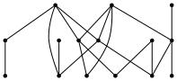

## What is *not* a graph?

We are not talking about graphs of functions in this context. We're not talking about parabolas or sine waves or anything like that.

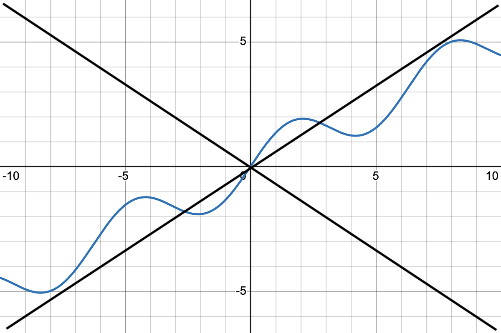


## Terminology for graphs

The following terms are synonymous

- Network 
- Graph 
- Network graph

As are 

- Graph theory 
- Network science

Sometimes, I might refer to the nodes of a graph as vertices.

## Node labels

Sometimes, the nodes might be labeled.

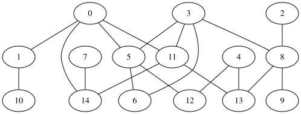

## Digraphs

Sometimes, the edges might be directed. We call this type of graph a *directed graph* or *digraph*.

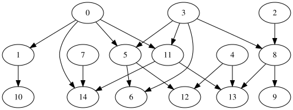

## Directed multi-graphs

Sometimes, the edges might be weighted and we might have more than one between any two vertices. We call this type of graph a *directed multigraph*.

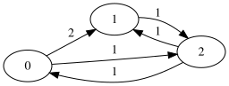{style="max-width: 400px;"}

## Simple graphs 

Given all these possibilities, we often refer to a plain old graph with no directed edges, multi-edges or loops as a *simple graph*.

```{python} 
from images.images import complete_graph
complete_graph(9)
```

# Applications

Graph theory, network analysis, or whatever you want to call it has a lot of applications. Here are just a few.


## Euler's seven bridges of Königsberg

The foundations of graph theory and topology date back to Euler's solution of the seven bridges of Königsberg problem. The problem asked for a walk through the city of Königsberg that crossed each bridge exactly once. Euler showed that there is no such walk.

Can you see how the graph below captures all the information in the map that's essential to address the problem?

::: {layout-ncol=2}
{style="height: 240px"}  

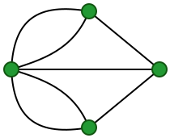{style="height: 240px"}
:::

::: {class="cite"}
Public domain images [from Wikipedia](https://en.wikipedia.org/wiki/Seven_Bridges_of_K%C3%B6nigsberg) -- Map by Bogdan Giuşcă
:::


## Social networks 

The use of social networks to model relationships between people dates back quite a while. I found the image below in [this paper](https://www.cmu.edu/joss/content/articles/volume1/Freeman.html) from Volume 1 of the Journal of Social Structure. That article was a survey of earlier work and states that the image was taken from a 1934 paper studying human development. The image indicates who recognizes who among a collection of nine babies.

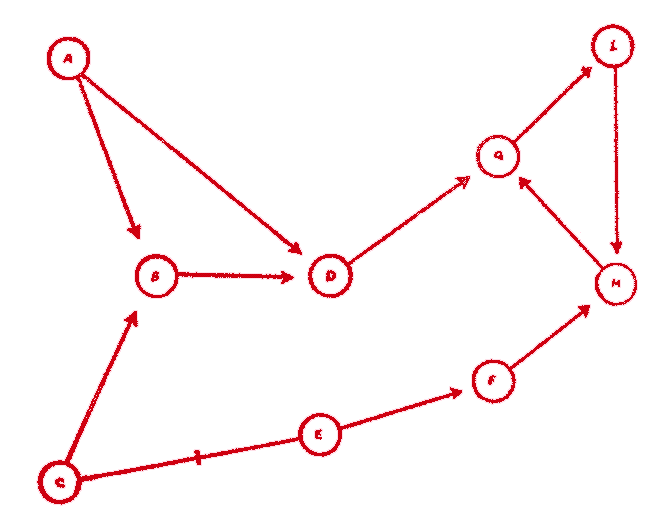

## An internet map 

I guess social networks got bigger. The network graph below is a map of the internet. It could also be viewed as an application to engineering.

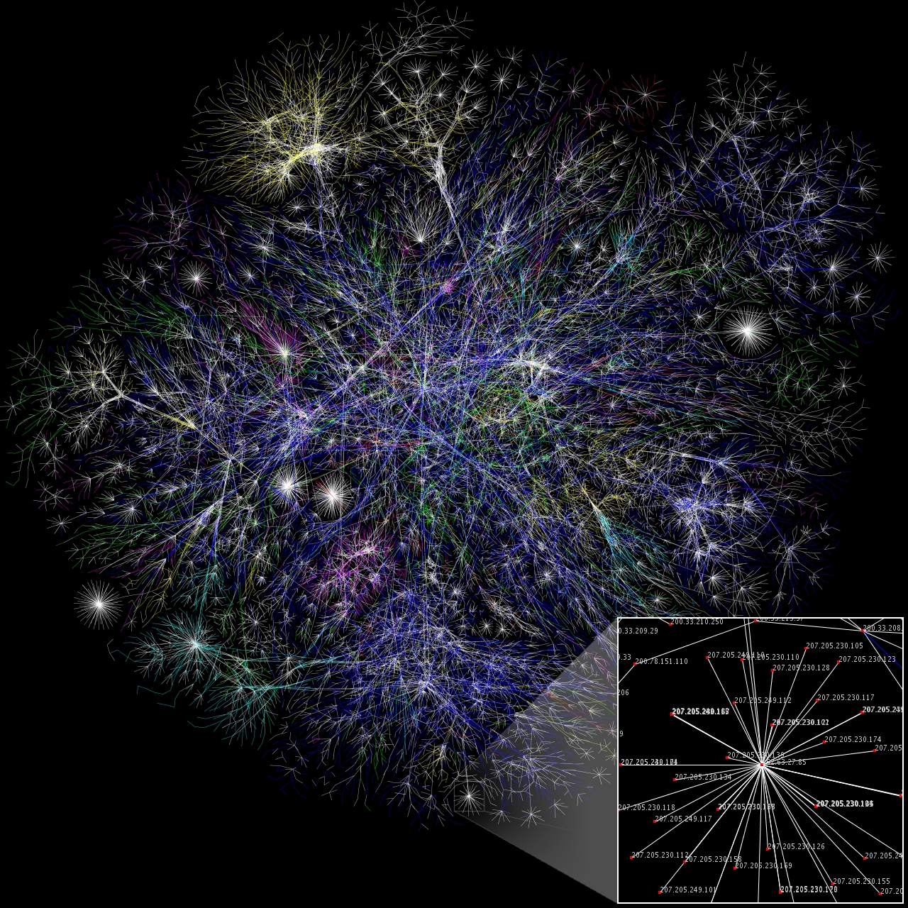

::: {.cite}
By The Opte Project - Originally from the [English Wikipedia](https://commons.wikimedia.org/w/index.php?curid=1538544); description page is/was here., CC BY 2.5, 
:::


## Sports analytics

We've seen this before, of course.

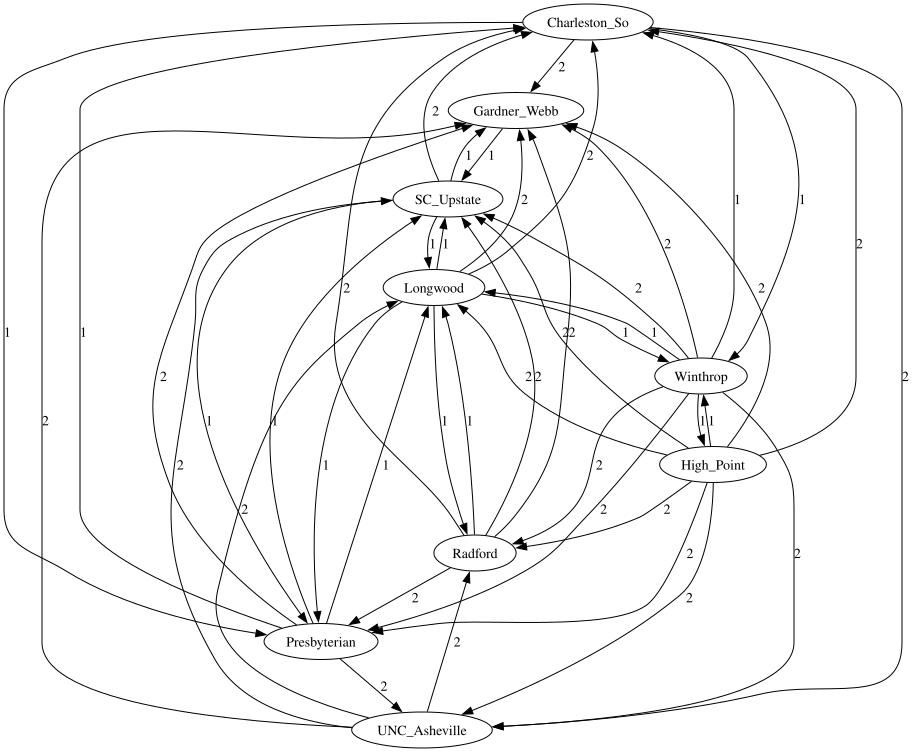

## Digraph fractals

I first learned of so-called directed multi-graphs when studying certain types of fractal objects in preparation for my dissertation in graduate school.

<iframe width="100%" height="520" frameborder="0" src="https://observablehq.com/embed/@mcmcclur/mixed-self-similarity?cells=viewof+show_parts%2Cpics"></iframe>

## The digraph IFS

The fractal curves on the previous slide each consists of smaller copies of both curves. The combinatorics of how they all fit together can be described by the following directed multi-graph:

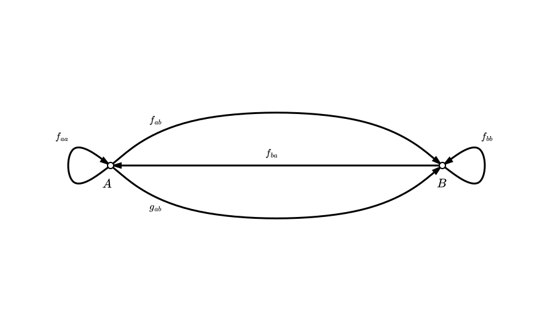


# Terminology for walks

Recall that the seven bridges of Königsberg problem asks for a walk through the city of Königsberg that crossed each bridge exactly once. There's a surprising amount of terminology to reformulate this problem as a graph theoretic problem.


## Walks, trails, and paths

- A *walk* in a graph is a finite sequence of vertices  
  $$
  v_0, v_1, \dots, v_k
  $$  
  such that each consecutive pair $v_i, v_{i+1}$ is connected by an edge.  Vertices and edges may repeat.
- A *trail* is a walk in which no edge is repeated. Vertices may repeat.
- A *path* is a walk in which no vertex is repeated. This implies no edge is repeated, either.
- A *cycle* or *circuit* is a path that starts and ends at the same vertex, with no other repeated vertices.

## Eulerian 

An *Eulerian trail* is a trail that uses every edge of the graph exactly once.

Using this language, the Königsberg problem asks whether the Königsberg graph has an Eulerian trail. 

Can you find an Eulerian trail through the graph below:

```{python}
from images.images import make_house
make_house()
```

## A non-Eulerian graph 

Can you find an Eulerian trail through the Königsberg graph?

::: {style="max-width: 300px"}

:::

::: {.fragment}
<hr />
What is the relevant distinction between these two graphs?
:::

## Two more definitions and Euler's theorem

A graph is *connected* if for every pair of vertices $u$ and $v$, there exists a path from $u$ to $v$.

The *degree* of a vertex $v$, denoted $\deg(v)$, is the number of edges incident to $v$. A loop (if allowed) contributes $2$ to the degree.


### Euler's theorem 

A connected graph has an Eulerian trail (but not an Eulerian circuit) if and only if exactly two vertices have odd degree.

A connected graph has an Eulerian circuit if and only if each vertex has even degree.


# Trees

A tree is a simple graph with no cycles.

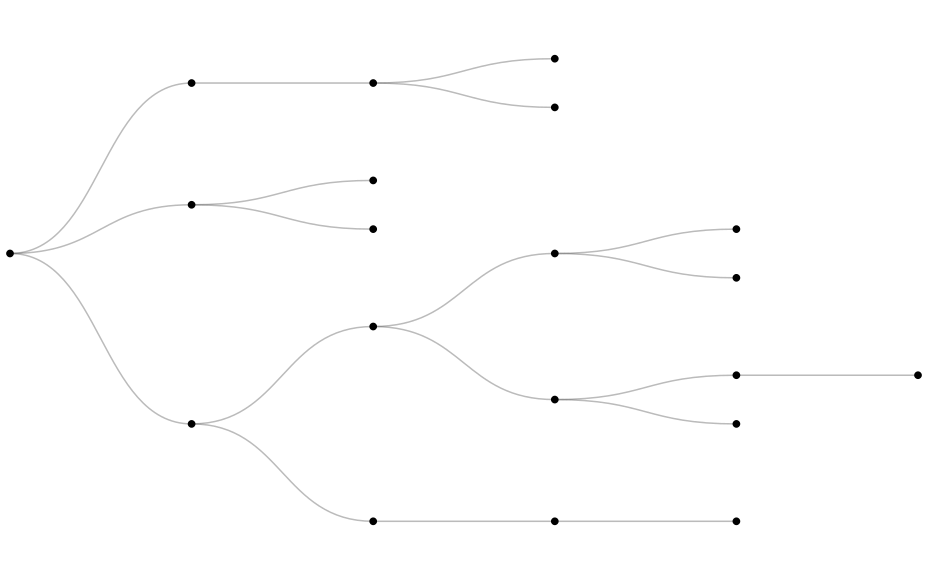

## Tournaments 

Tournaments have the structure of a tree:

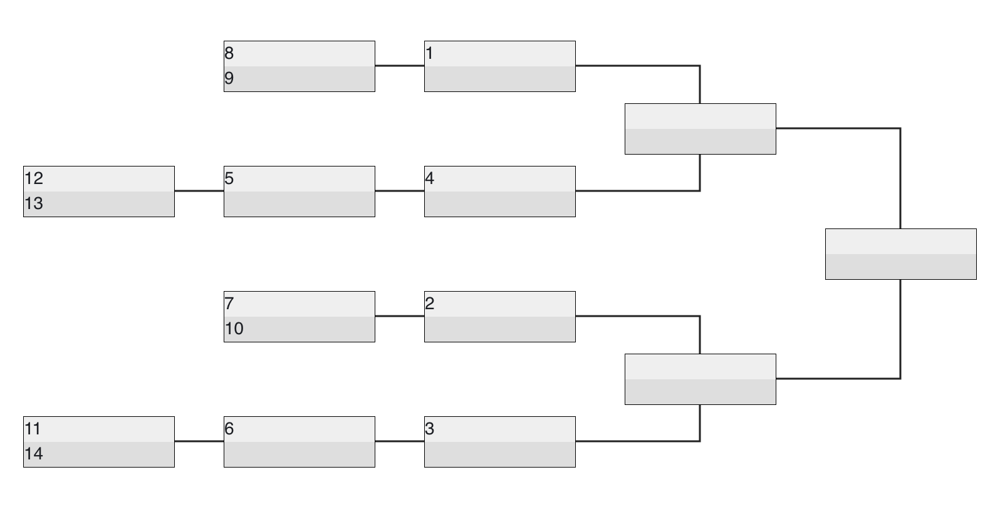

## Administrative structure

Hierarchical structures can often be visualized with a tree. Here's a map based view of hierarchies within the US that I took from [this US Census PDF](https://www2.census.gov/geo/pdfs/maps-data/maps/reference/us_regdiv.pdf):

```{ojs}
import {map, tree} from '@mcmcclur/hierarchical-structure-of-the-us-regions'
map 
```

## Hierarchical tree 

We can examine that same data within a tree structure:

```{ojs}
tree 
```


# Abstract syntax trees

An *abstract syntax tree* or *AST* is a graph theoretic technique to represent a mathematical expression as a tree. Can you see, for example, how we might represent $2x^3 + 1$ as 

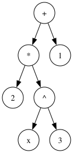

## An AST data structure 

Here's a data structure that might represent that tree:

```{python}
#| echo: true 
expr = {
    "type": "BinaryOp",
    "op": "+",
    "left": {
        "type": "BinaryOp",
        "op": "*",
        "left": {"type": "Number", "value": 2},
        "right": {
            "type": "BinaryOp",
            "op": "^",
            "left": {"type": "Variable", "name": "x"},
            "right": {"type": "Number", "value": 3}
        }
      },
    "right": {"type": "Number", "value": 1}
}
```

## Tree traversal

In a data structure class, you'll certainly discuss tree traversal. In the context of ASTs, this allows you do things like,

- replace variables with other objects to 
  - evaluate the expression at a number,
  - substitute variables with other variables or expressions
- do algebraic manipulations like 
  - simplification or 
  - differentiation 

## An evaluation function

Here's an evaluation function based on recursive tree traversal:

```{python}
#| echo: true 
def evaluate_expr_tree(node: dict, env: dict) -> float:    
    node_type = node["type"]
    
    if node_type == "Number":
        return node["value"]
    
    elif node_type == "Variable":
        name = node["name"]
        if name not in env:
            raise ValueError(f"Variable '{name}' not provided")
        return env[name]
    
    elif node_type == "BinaryOp":
        left_val = evaluate_expr_tree(node["left"], env)
        right_val = evaluate_expr_tree(node["right"], env)
        
        op = node["op"]
        
        if op == "+":
            return left_val + right_val
        elif op == "-":
            return left_val - right_val
        elif op == "*":
            return left_val * right_val
        elif op == "/":
            return left_val / right_val
        elif op == "^":
            return left_val ** right_val
        else:
            raise ValueError(f"Unknown operator: {op}")
    
    else:
        raise TypeError(f"Unknown node type: {node_type}")
```

## Evaluate 

The following computation, for example, computes 
$$2\times4^3 + 1 = 129.$$

```{python}
#| echo: true 
evaluate_expr_tree(expr, {'x': 4})
```


# Directed acyclic graphs 

A directed, acyclic graph (or DAG) is a directed graph with no cycles.

Trees emanating from specified root clearly yield DAGs. There are other examples, though.

## A divisor graph 

Given a set of positive integers as nodes, we can form a directed graph by placing a directed edge from node $i$ to node $j$ if $i$ divides $j$. The result is called a *divisor graph* and it's pretty easy to see that it should be acyclic.

Here's the divisor graph on the set $1$ through $12$:

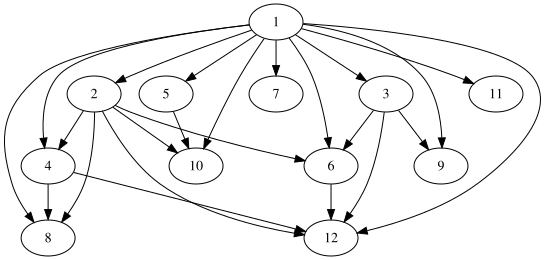

## A neural multiplier

Here's [another DAG](https://blog.marksmath.org/posts/NeuralMultiplier/).

In this case, the edge direction is implied to be upward. This kind of assumption is common in neural networks.

# Finally

Do take a minute to check out 

- [MML Problems](https://discourse.marksmath.org/c/mml-problems/) and 
- [MML Assignments](https://discourse.marksmath.org/c/mml-assignments/).
