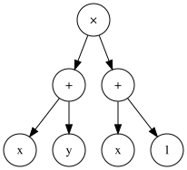

# Recap and look ahead?

Last time, we learned a bit about networks and graph theory. We ended with abstract syntax trees, which provide a graph theoretic way to view algebraic expressions. Since trees can be manipulated as data structures, this yields a framework for us to perform algebra on the computer.

Today, we're going to take a look at an alternative way to represent algebraic expressions as graphs - the so-called *expression graph*, also called a *computation graph*. This alternative is better suited for efficient numerical computation of values and derivatives.

# Description

An *expression graph* is a representation of a mathematical expression in the form of a directed acyclic graph or DAG where

- The input nodes represent variables or constants.
- Intermediate nodes represent primitive computations, such as $+$, $\times$, or exp.
- Variables can be set to specific values to initiate the computation.
- The computation flows along the directed edges indicating how the output of one node is used as input to another.
- The computation ends at a distinguished output node.
- Values can be reused to avoid recomputing repeated subexpressions.

# First example

Let's just jump in and see what these things look like! 
Here's the expression graph for 
$$
(x+y)\times(x+1):
$$


```{python}
from components.ExpressionGraphs import ast_to_graphviz
ast_to_graphviz("(x+y)*(x+1)",x=1,y=2) 
```

## Initial values

We can plug values in for $x$ and $y$.
$$
(2+1)\times(2+1):
$$


```{python}
ast_to_graphviz(
    "(x+y)*(x+1)",
    show_init_values=True,
    x=2, y=1)
```

## Propagating values forward

Any values that we plug in propagate forward to produce a final value.
$$
(2+1)\times(2+1) = 9:
$$

```{python}
ast_to_graphviz(
    "(x+y)*(x+1)",
    show_values=True,
    x=2, y=1)
```

## Forward propagation

Note how the values and operators combine to form subsequent values and how those values propogate through the directed graph to form a final result of the computation.

This process is called *forward propagation*.

## Key distinctions from ASTs

Expression graphs concretely distinct from syntax trees, which start with the top level operator, end at the inputs, and is in the form of a tree.

 


# More examples

Let's look at a few more examples - starting with my favorite function $e^{-x^2}$:

```{python}
ast_to_graphviz(
    "exp(-x**2)",
    show_values=True,
    x=2)
```

## Computation reuse 

If we multiply that last example by $x^2$, we see how that value is reused. Thus, this is the expression graph for $x^2 e^{-x^2}$:

```{python}
ast_to_graphviz(
    "x**2 * exp(-x**2)",
    show_values=True,
    x=2)
```

This reuse of subexpressions is one of the features that makes expression graphs more efficient.

## A polynomial

Here's the expression graph for the polynomial

$$
x^4 - 2x^3 - 3x^2 - 4x - 5:
$$

```{python}
ast_to_graphviz(
    "x**4 - 2*x**3 - 3*x**2 - 4*x - 5",
    show_values=True,
    x=2)
```

## The normal distribution

Here's the expression graph of the normal distribution, which has three symbolic inputs with values $x=0$, $\mu=0$, and $\sigma=1$:
$$
\text{exp}(-(x-\mu)^2/(2\sigma^2))/\sqrt{2\pi\sigma^2}.
$$

```{python}
ast_to_graphviz(
  "exp(-(x-μ)**2/(2*σ**2))/sqrt(2*pi*σ**2)", 
  x=0, μ=0, σ=1, 
  show_values=True)
```

# Backward propagation 

With a just little more information, we can use the expression graph to compute the values of the partial derivatives of the function. This process is called *backpropagation*.

Back in my day, long before ML was so cool, this was called *automatic differentiation*.

## Example of backpropagation (1)

Consider the function $f(x)=e^{-x^2}$, which can be computed in three steps:
$$
x \xrightarrow{\text{pow}(2)} x^2 \xrightarrow{\text{neg}} -x^2 \xrightarrow{\text{exp}} e^{-x^2}.
$$

Thus, application of the chain rule results in a product of three terms:

$$
\frac{d}{dx} e^{-x^2} = (2x)\times(-1)\times \left(e^{-x^2}\right).
$$

If we compute this at a value like $x=1/4$, then we get a numeric result like 
$$
\begin{aligned}
\frac{d}{dx} e^{-x^2}\Big|_{x=1/4} &= \left(2\times\frac{1}{4}\right)\times(-1)\times \left(e^{-(1/4)^2}\right) \\
  &= (\frac{1}{2}) \times (-1) \times (0.939413) = -0.469707
\end{aligned}
$$


## Example of backpropagation (2)

We can use the graph to keep track of these steps:

```{python}
ast_to_graphviz("exp(-x**2)", x=1/4, show_values=True, show_grads=True)
```

Read from right to left:

- The gradient at the end is intialized to $1$,
- The derivative of an exponential is just that same value ($\frac{d}{dx}e^x = e^x$),
- The negation contributes $\times(-1)$ to the derivative ($\frac{d}{dx} cx = c$), and 
- The derivative of $x^2$ contributes $\times2x$, where $x=\frac{1}{4}$.

The fact that we multiply these altogether is exactly the chain rule.

## Expression reuse

When an expression is reused, it will produce multiple arrows all of which sum together to contribute to the accumulated derivative. That's the sum rule! 

We could illustrate this with same function we just used by writing 
$$
e^{-x^2} = e^{-(x\times x)}:
$$

```{python}
ast_to_graphviz("exp(-(x*x))", x=1/4, show_values=True, show_grads=True)
```

- Now, the value in the $\times$ node is $0.25\times0.25$, rather than $0.25^2$ and 
- the grad in the x node is $\frac{1}{4}\times(-0.939413) + \frac{1}{4}\times(-0.939413)$,  
  rather than $2\times\frac{1}{4}\times(-0.939413)$.

## Rules in code 

```
if node.op in {"input", "const"}:
    continue
elif node.op == "add":
    a, b = node.inputs
    a.grad += node.grad
    b.grad += node.grad
elif node.op == "sub":
    a, b = node.inputs
    a.grad += node.grad
    b.grad -= node.grad
elif node.op == "mul":
    a, b = node.inputs
    a.grad += node.grad * b.value
    b.grad += node.grad * a.value
elif node.op == "div":
    a, b = node.inputs
    a.grad += node.grad * (1 / b.value)
    b.grad += node.grad * (-a.value / (b.value ** 2))
elif node.op == "pow_const":
    (a,) = node.inputs
    p = node.param
    a.grad += node.grad * p * (a.value ** (p - 1))
elif node.op == "neg":
    (a,) = node.inputs
    a.grad -= node.grad
```

# More backpropagation examples

Here are a few more examples of expression graphs with backpropagation, starting with a revisit to our initial example $(x+y)\times(x+1)$
at the values $x=2$ and $y=1$:


```{python}
ast_to_graphviz(
    "(x+y)*(x+1)",
    show_values=True,
    show_grads=True,
    x=2, y=1)
```

## Another 

In this example, $f(x,y) = x^2y - xy$. Thus,
$$
\begin{eqnarray}
f_x(x,y) = 2xy-y & \text{ so } & f_x(2,1) = 2\times2\times1 - 1 = 3 \\
f_y(x,y) = x^2 - x & \text{ so } & f_y(2,1) = 2^2 - 2 = 2.
\end{eqnarray}
$$


```{python}
ast_to_graphviz(
    "x**2 * y - x*y",
    show_values=True,
    show_grads=True,
    x=2, y=1)
```