# Intro to Neural Networks 

Now that we've talked about both general networks and expression graphs, we're in a good spot to discuss neural networks. We'll focus today on the foundational *feedforward neural network* - how we represent it, how we compute with it, how we code it, how it's optimized, and what can do with it. We'll discuss variations on that foundational architecture a bit later.


# A mysterious network

Here's the kind of image of a neural network that you might often see. It's a bit... mysterious!

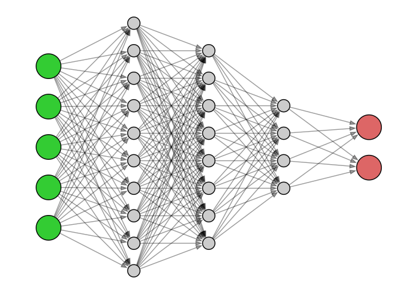{fig-align="center" fig-alt="A somewhat mystical looking Neural Network"}

## Mystification

Neural networks and AI more generally are often described with somewhat mysterious language. Even the term "learning" in Machine Learning anthropomorphizes what's really going on. 

These descriptions are growing every more metaphorical in media these days as we now talk about algorithms that dream or hallucinate. This type of language is now embedded in many reliable descriptions of AI, like [Wikipedia's description of DeepDream](https://en.wikipedia.org/wiki/DeepDream){target="_blank"}, for example.

This type of language might serve a reasonable purpose when speaking to laypeople or the general public. If we really want to understand how neural networks work and create some ourselves, though, it's important to demystify them.

## Demystification

Despite their complexity, the neural network concept is simply another example of a supervised learning algorithm. Thus,

- Neural networks consume data with inputs and labels,
- they build a function that accepts the inputs and depends upon a number of parameters,
- they fit the function by choosing the parameters so that its output matches the labels as closely as possible.

They basic questions are much like we had for linear and logistic regression 

- how is the model function constructed and 
- how do we optimize it?

# Neural network models

We now jump into the structure of the basic feedforward neural network. Like most neural networks, that structure consists of a number of layers of nodes that are connected from left to right. The real purpose of the network is to help us visualize and understand how the network builds its model function and performs a computation.

This overall structure is an example of an architecture. There are certainly variations on that architecture and we'll talk about some of those variations in a week or so.


## The feedforward architecture

Here's a basic illustration of the *structure* of a feedforward neural network:

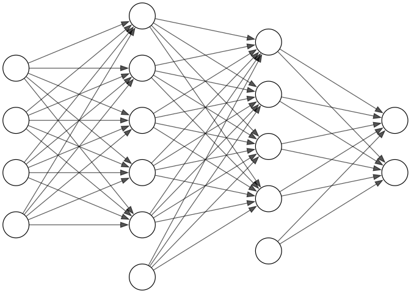{fig-align="center" fig-alt="An empty neural network intended to illustrate only the network structure"}


## A labeled network

Let's label the layers, nodes, and edges:

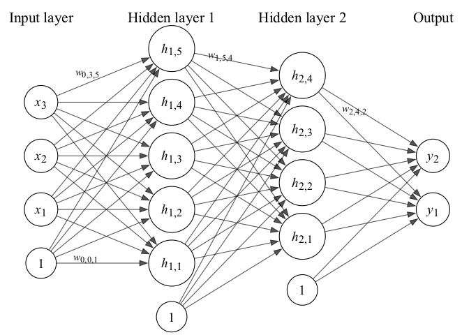{fig-align="center" fig-alt="A labeled neural network"}

##  Label values

The neural network consists of four layers:

- The input layer of four $x$ inputs on the left,
- Two hidden layers of $h$ values in the middle, and
- One output layer of two $y$ values on the right.

In addition, there are edges between consecutive layers that are labeled with weights. (There are only a few edge labels shown to prevent cluttering of the diagram.)

The inputs and weights in the input layer determine the values in the first hidden layer. Those values determine the values in the next layer, etc, so that the values propagate from left to right and ultimately determine the output.

## The nodes

We have four columns of nodes. The nodes in the two hidden layers are indexed by $i$ and $j$ to obtain $h_{i,j}$ where 

- $i$ indicates the column number for the hidden layer and 
- $j$ indicates the index of the node within the column.

The input and output layers need only one index, though, we'll modify the notation so that they also use two indices soon.

The nodes labeled $1$ allow for a constant term, also called the *bias*, as we'll see soon.

## The edges

There are three columns of edges between the columns of nodes. The edges are indexed by $i$, $j$, and $k$ to obtain $w_{i,j,k}$ where 

- $i$ indicates the index of the column of nodes the edge emanates from (with $i=0$ for the input layer),
- $j$ indicates which node within column $i$ the edge emanates from, and 
- $k$ indicates at which node within column $i+1$ the edge terminates.

Each edge in the diagram has such a weight but, again, only  a few weights are shown to prevent cluttering of the diagram.

## First level propagation

The formula to determine the values $h_{1,k}$ for $k=1,\ldots,5$ in the first hidden layer is

$$h_{1,k} = g_1\left(\sum_{j=1}^3 w_{0,j,k} \times x_j + w_{0,0,k}\times1\right).$$

Note that we have here a linear function of the inputs with coefficients determined by the weights together with a constant term due to the node with value $1$ in the input layer. The value of that affine function is passed to a so-called activation function $g_1$. There are a number of possibilities for $g_1$, which we'll discuss soon.

This is illustrated for $k=2$ on the next slide.

---

$$h_{1,2} = g_1\left(\sum_{j=1}^3 w_{0,j,2} \times x_j + w_{0,0,2}\times1\right).$$


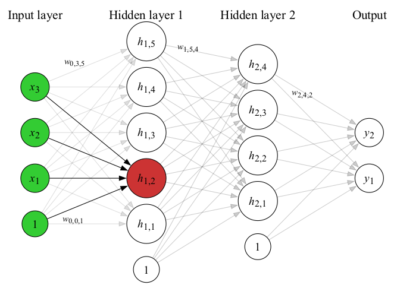{fig-align="center" fig-alt="Illustration of first level propagation"}

## Second level propagation

The formula to determine the values $h_{2,k}$ for $k=1,\ldots,4$ in the second hidden layer is

$$h_{2,k} = g_2\left(\sum_{j=1}^5 w_{1,j,k} \times h_{1,j} + w_{1,0,k}\times1\right).$$

Note that there's a second activation function $g_2$. Generally, activation functions are common to all nodes in a particular layer but can change between layers.

This is illustrated for $k=3$ on the next slide.

---

$$h_{2,3} = g_2\left(\sum_{j=1}^5 w_{1,j,3} \times h_{1,j} + w_{1,0,3}\times1\right)$$

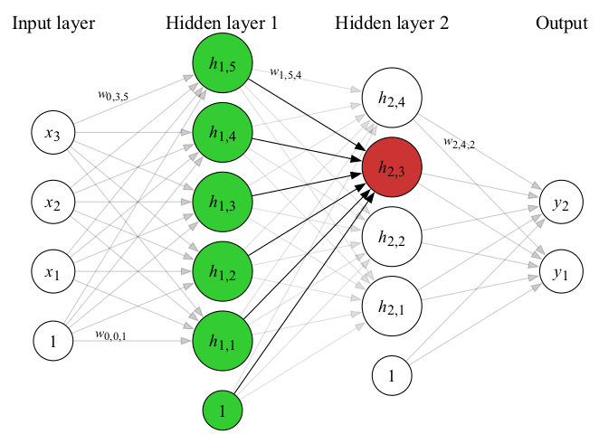{fig-align="center" fig-alt="Illustration of second level propagation"}


## Third level propagation

The formula to determine the values $y_{k}$ for $k=1$ or $k=2$ in the output layer is

$$y_{k} = g_3\left(\sum_{j=1}^4 w_{2,j,k} \times h_{2,j} + w_{2,0,k}\times1\right).$$

There's a third activation function $g_3$. Often, the final activation function is used to massage the final output into the desired form.

This is illustrated for $k=1$ on the next slide.

---

$$y_{k} = g_3\left(\sum_{j=1}^4 w_{2,j,k} \times h_{2,j} + w_{2,0,k}\times1\right).$$


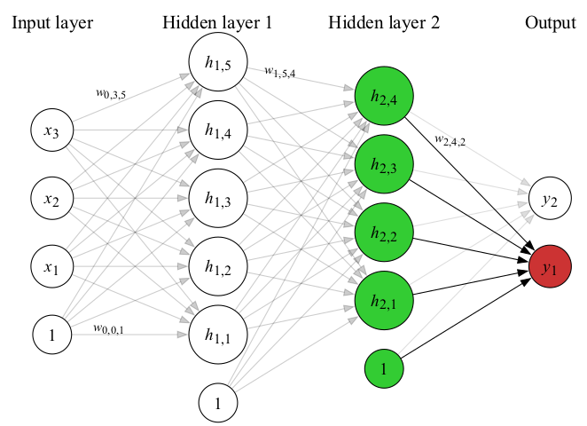{fig-align="center" fig-alt="Illustration of third level propagation"}

## Activation 

At each layer, we apply an activation function. This function need not be linear which means that neural networks are, indeed, more general than linear models. Common choices for the activation function are 

**ReLU**:
$$g(x) = \begin{cases}x & \geq 0 \\ 0 & x < 0 \end{cases}$$

**Sigmoid**: 
$$g(x) = \frac{1}{1+e^{-x}}$$

Sometimes these functions might include parameters that can be optimized via cross-validation.

# Simple example 

Let's take a look at a simple example of neural network with just two inputs, one hidden layer with three nodes, and a single output. 

The network of interest is shown on the next page with all edge weights specified and two input values set. In addition, we'll apply a ReLU activation after the hidden layer and a sigmoid activation to the output.

Our mission is to find the values in the hidden layer and the output after propagation.

## Illustration of the simple example

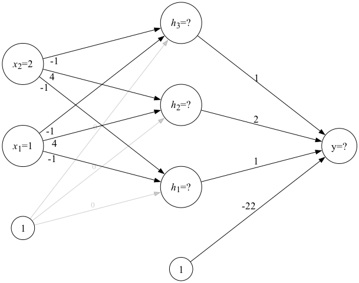{fig-align="center" fig-alt="A simple neural network for computation"}

## Step 1 computation

Computing the values at the first step is simple for a small neural network.
\begin{aligned}
h_1 &= h_3 = -1\times2 + (-1)\times1 = -3 \\ 
h_2 &= 4\times2 + 4\times 1 = 12.
\end{aligned}

Applying the ReLU activator simply zeros out the negative values to get
\begin{aligned}
h_1 &= h_3 = -1\times2 + (-1)\times1 = 0 \\ 
h_2 &= 4\times2 + 4\times 1 = 12.
\end{aligned}

The values are then entered into the next step as shown on the next slide.

## Step 1 illustration 

{fig-align="center" fig-alt="The simple neural network after step 1"}


## Step 2 computation 

The next step is very similar. We now have just one output, though, and non-zero weight constants.
$$
y = 2\times12 + (-22)\times 1 = 24-22 = 2.
$$
We then apply the sigmoid activation function to get the final output:
$$
y = \frac{1}{1+e^{-2}} \approx 0.880797.
$$
The final state of the network is shown on the next slide.

## Final state of the neural network 

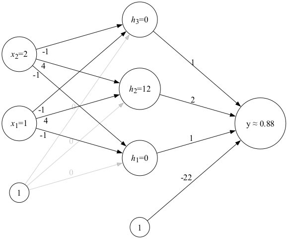{fig-align="center" fig-alt="Final state of the neural network"}

## Bias 

Note the large value of the constant weight at the final step. This has the effect of shifting the value computed by the linear part.

That constant term is often called the *bias*.

In some neural network visualizations, the bias is illustrated as an intrinsic property of the node, rather than as an additional edge.


# Layer transformation as matrix multiplication

In the process of forward propagation, the transformation of each layer into the next can be described as multiplication of a matrix of weights by the vector of inputs followed by application of the activation function. It's worth seeing how this is described mathematically and can be implemented in code.

In the process, we'll generalize the notation for a neural network to account for more hidden layers and to simplify it so that the input and output layers are no longer special cases.

## The labeled network revisited

Recall the labeled neural network we met before:

{fig-align="center" fig-alt="The labeled neural network revisited"}

## The relabeled network 

Let's relabel the nodes so that all layers use a consistent notation:

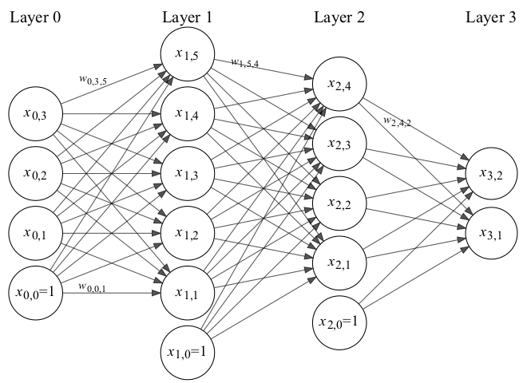{fig-align="center" fig-alt="The same neural network with consistent labels"}

## Expanded interpretation

Note that, in general, we'll have some number $N$ of hidden layers. Thus, we have $N+2$ layers in total - including the input and output. We'll number those layers $i=0,1,2,\ldots,N,N+1$. In the figure, these appear as columns of nodes.

Each of the $N+2$ columns will have some number of nodes. Let's say that the $i^{\text{th}}$ column has $n_i$ nodes plus a constant node with value $1$. We'll number the nodes in the $i^{\text{th}}$ column $0,1,2,\ldots,n_i$. We don't really need a constant node in the output column but it doesn't hurt if it's there.

## Formula for next layer values 

Note that the value of the $k^{\text{th}}$ node in the $i^{\text{th}}$ column of nodes involves the sum of the weights pointing into that node times the values of the nodes those weights come from $+$ the constant weight. Finally, we apply the activation function $g_i$. In symbols:

$$
x_{i,k} = g_i\left(\sum_{j=1}^{N_{i-1}} w_{i-1,j,k} \times x_{i-1,j} + w_{i-1,0,k}\times1\right).
$$

We can simplify that a bit by defining $x_{i-1,0}=1$ for all $i$; essentially fixing the constant values. The formula becomes 

$$
x_{i,k} = g_i\left(\sum_{j=0}^{N_{i-1}} w_{i-1,j,k} \times x_{i-1,j}\right).
$$

## Last formula as a matrix

Now for a given $i$, we can build an $N_{i-1}\times (N_i-1)$ matrix indexed by the edges pointing from nodes in column $i-1$ to the non-constant nodes in column $i$. The entry in row $j$ and column $k$ of that matrix should be the weight associated with the edge from node $j$ in layer $i-1$ to node $k$ in layer $i$.

If we then place the node values in the $i-1^{\text{st}}$ layer in a row vector and form the dot product of that vector with the $k^{\text{th}}$ column of the matrix, we get

$$
\sum_{j=0}^{N_{i-1}} w_{i-1,j,k} \times x_{i-1,j}
$$

That's exactly the linear portion in the formula on the previous slide; thus, we should be able to express that portion in a conveniently compact notation.

## Summary

We've got a feedforward neural network with $1$ input layer, $N$ hidden layers, and $1$ output layer. We suppose that layer $i$ has $n_i+1$ nodes numbered $0,1,\ldots,n$ and we want to describe how the values propagate from layer $i-1$ to layer $i$.

Form the matrix $W_i = [w_{i,j,k}]_{j,k}$ of weights from layer $i-1$ to layer $i$. 

Suppose also that 
$X_i = [1, x_{i-1,1},\ldots, x_{i-1,n_i}]$ is the row vector of values in the $i^{\text{th}}$ column. Then,

$$X_{i} = g_i(X_{i-1} W_i).$$

This is just the activation function applied termwise to the result of a matrix product. Better yet, $X_0$ could be a matrix of rows of inputs that we want to evaluate; we can then use the same formulae to evaluate a whole slew of inputs en masse.


# But... Why?

Why, why, WHY would one do this? 

What possible reason do we have to think that this might be a good idea?

More specifically, why do we think this should be useful for modelling data?

## Because

Here's a train of thought that indicates the motivation behind this to some degree:

1. We can show that linear and logistic regression are both special cases of small neural networks, 
2. We can show that larger neural networks generalize and expand the capability of the smaller ones, 
3. We can illustrate specific geometric properties of data that the expanded capacity can handle better, and 
4. The architecture was originally inspired by the structure of the brain.

## The brain? Really??

Well, yes, but let's not overstate that point.

The architecture was *inspired* by the brain. It was never meant to be a faithful model of the brain. It was just a relatively simple mathematical model that hoped to imitate some basic aspects of cognition.

The [seminal paper](https://www.cs.cmu.edu/~epxing/Class/10715/reading/McCulloch.and.Pitts.pdf){target=_blank} was written in 1943, if you're interested.


## The perceptron 

I suppose that the simplest neural network you could imagine would have just the input and output layers but no hidden layers. This type of setup is called a *perceptron* and, schematically, looks like so:

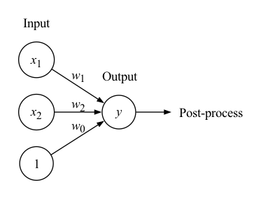{fig-align="center" fig-alt="Illustration of the perceptron implementation of a logic gate"}

## Algebra of the perceptron 

Applying the neural network interpretation we've developed, we find that the perceptron produces values via the formula
$$
y = w_1 \, x_1 + w_2 \, x_2 + w_0.
$$

As it stands, this is exactly the linear regression formula that we would use to model data with two inputs and a single output.

The neural network architecture allows us to apply a final activation function. For linear regression, we use use just the identity function. If we apply the sigmoid, we obtain logistic regression. If we round that result to 0 or 1, we obtain a classification algorithm.

All with just the simplest possible neural network!

# Logic gates

Let's take a look at another small and real example that yields an actual and important computation - the implementation of the elementary logic gates.

To be clear, these are very simple functions with much simpler implementations than the development of a neural network. Nonetheless, their implementation as neural networks is interesting and illustrates some critical concepts, such as

- the role of hidden layers and 
- the basics of fitting a model.

## Definitions

The logic gates are binary, Boolean functions. Thus, they take a pair of variables whose values can be $0$ or $1$ and they return a single result whose value can also be $0$ or $1$. Since there are only four possible inputs, it's easy to directly define these by simply specifying the outputs. Here are the standard definitions of *And*, *Or*, and *Implies*:

<div layout-ncol=3>
<div>
<div style="text-decoration: underline; text-align: center">
  And
</div>
$$
\begin{aligned}
(1,1) &\to 1 \\
(1,0) &\to 0 \\
(0,1) &\to 0 \\
(0,0) &\to 0
\end{aligned}
$$
</div>
<div>
<div style="text-decoration: underline; text-align: center">
  Or
</div>
$$
\begin{aligned}
(1,1) &\to 1 \\
(1,0) &\to 1 \\
(0,1) &\to 1\\
(0,0) &\to 0
\end{aligned}
$$
</div>
<div>
<div style="text-decoration: underline; text-align: center">
  Implies
</div>
$$
\begin{aligned}
(1,1) &\to 1 \\
(1,0) &\to 0 \\
(0,1) &\to 1\\
(0,0) &\to 1
\end{aligned}
$$
</div>
</div>


## A model 

We can model those first three logic gates with the perceptron:

{fig-align="center" fig-alt="Illustration of the perceptron implementation of a logic gate"}

Which, after application of an activation function $g$, will produce 
$$
y = g(w_1 \, x_1 + w_2 \, x_2 + w_0).
$$

## Weights for the *And* gate

One way (of many) to pick weights to yield the *And* gate is $w_1=w_2=2$ and $w_0=-3$. We can then compute
$$
y = 2 \, x_1 + 2 \, x_2 - 3
$$
and classify according to whether $y<0$ or $y>0$. Put another way, our activation function is just a rounded sigmoid.

To see this in action is a simple matter of plugging in:
$$
\begin{aligned}
y(1,1) &= 1 > 0 \implies \text{output} = 1 \\
y(1,0) &= -1 < 0\implies \text{output} = 0 \\
y(0,1) &= -1 < 0 \implies \text{output} = 0 \\
y(0,0) &= -3 < 0\implies \text{output} = 0. \\
\end{aligned}
$$

## Weights for the other gates

The reader is invited to explore possibilities to produce the *Or* and *Implies* gates.

## Exclusive or

Here's one more logic gate, namely *Exclusive or*, often denoted by *Xor*:

\begin{aligned}
(1,1) &\to 0 \\
(1,0) &\to 1 \\
(0,1) &\to 1\\
(0,0) &\to 0.
\end{aligned}

Perhaps surprisingly at first glance, *Xor* throws a bit of wrench into all this happiness. Fiddle as you might with the weights, you won't be able to model *Xor* with the perceptron.

## Visualizing the classification

To understand how this classification works (or not), we can draw the points in the input space and color them blue for $1$ or red for $0$. Here's what the picture looks like for the *And* gate:


```{python}
#| fig-align: center
import matplotlib.pyplot as plt 
import numpy as np

plt.figure(figsize=(5.5,5.5))
points = [(0, 0), (1, 0), (0, 1), (1, 1)]
for i, (x, y) in enumerate(points):
    plt.plot(x, y, 'o', markersize=8, label=f'({x}, {y})', color='blue' if x==1 and y==1 else 'red')
    plt.text(x + 0.05, y + 0.05, f'({x}, {y})', fontsize=12)

plt.grid(True, linestyle='--', alpha=0.7)
plt.xticks(np.arange(-0.5, 2.0, 0.5))  
plt.yticks(np.arange(-0.5, 2.0, 0.5))  
plt.xlim(-0.5, 1.5)
plt.ylim(-0.5, 1.5)
plt.gca().set_aspect('equal', adjustable='box')
plt.xlabel('$x_1$-axis', fontsize=12)
plt.ylabel('$x_2$-axis', fontsize=12);
```

## Drawing the divider

Now, let's plot those same points together with the line $2x_1 + 2x_2 = 3$. We can see clearly how that line breaks the set of inputs into the two classifications

```{python}
#| fig-align: center
plt.figure(figsize=(5.5,5.5))
points = [(0, 0), (1, 0), (0, 1), (1, 1)]
for i, (x, y) in enumerate(points):
    plt.plot(x, y, 'o', markersize=8, label=f'({x}, {y})', color='blue' if x==1 and y==1 else 'red')
    plt.text(x + 0.05, y + 0.05, f'({x}, {y})', fontsize=12)

plt.grid(True, linestyle='--', alpha=0.7)
plt.xticks(np.arange(-0.5, 2.0, 0.5))  
plt.yticks(np.arange(-0.5, 2.0, 0.5))  
plt.xlim(-0.5, 1.5)
plt.ylim(-0.5, 1.5)
plt.gca().set_aspect('equal', adjustable='box')

# Contour line
x = np.linspace(-0.5, 1.5, 500)
y = np.linspace(-0.5, 1.5, 500)
X, Y = np.meshgrid(x, y)
Z = 2 * X + 2 * Y
contour = plt.contour(X, Y, Z, levels=[3], colors='black', linestyles='-', linewidths=1.5)
plt.clabel(contour, inline=True, fontsize=10, fmt="$2x_1+2x_2=3$")
plt.xlabel('$x_1$-axis', fontsize=12)
plt.ylabel('$x_2$-axis', fontsize=12);
```

## Visualizing *Xor*

Now, here are the inputs for *Xor* colored by classification. Do you see the issue?

```{python}
#| fig-align: center

plt.figure(figsize=(5.5,5.5))

points = [(0, 0), (1, 0), (0, 1), (1, 1)]
for i, (x, y) in enumerate(points):
    plt.plot(x, y, 'o', markersize=8, label=f'({x}, {y})', color='blue' if (x==1 and y==0) or (x==0 and y==1) else 'red')
    plt.text(x + 0.05, y + 0.05, f'({x}, {y})', fontsize=12)

plt.grid(True, linestyle='--', alpha=0.7)
plt.xticks(np.arange(-0.5, 2.0, 0.5))  
plt.yticks(np.arange(-0.5, 2.0, 0.5))  
plt.xlim(-0.5, 1.5)
plt.ylim(-0.5, 1.5)
plt.gca().set_aspect('equal', adjustable='box')
plt.xlabel('$x_1$-axis', fontsize=12)
plt.ylabel('$x_2$-axis', fontsize=12);
```

## A neural network classifier

The perceptron effectively generates classifiers with linear boundaries. We need something a bit more complicated. We can achieve that by simply adding a hidden layer so that the perceptron becomes a more general neural network. Here's how that looks:

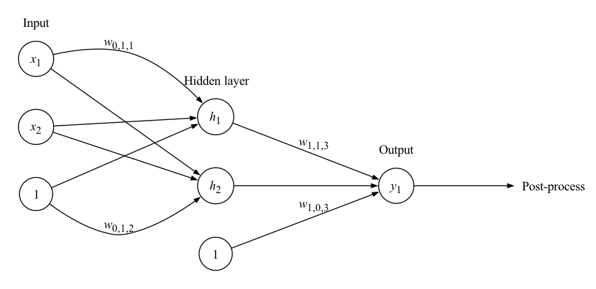{fig-align="center" fig-alt="Expanded perceptron to a neural network"}


## Implementation in code 

I'm going to implement the neural network in the preceding picture with low-level NumPy code. Let's begin by importing NumPy and defining the sigmoid activation function.

```{python}
#| echo: true
import numpy as np
sigmoid = lambda x: 1/(1+np.exp(-x))
step = lambda x: (x > 0).astype(float)
```
## Definitions in code

```{python}
#| echo: true
# The matrix of inputs
X = np.array([[0,0], [0, 1], [1, 0], [1, 1]])

# The matrix of weights from the 
# input layer 0 to hidden layer 1
W0 = np.array([
    [-1,-2], # From node 0 - the constant
    [1,1],   # From node 1
    [1,1]    # From node 2
])
# The matrix of weights from hidden 
# layer 1 to output layer 2
W1 = np.array([[-1],[2],[-2]])
```

## Computational code 

Now we perform the computation. At each step, we augment the values with a column of $1$s ones on the left, form the matrix multiplication and then the sigmoid. In addition, we round the results for the final output.

```{python}
#| echo: true
X0 = np.column_stack([np.ones(len(X)),X])
X1 = step(X0 @ W0)
X1 = np.column_stack([np.ones(len(X)), X1])
X2 = sigmoid(X1 @ W1)
np.round(X2).flatten()
```

The output is exactly what we want for *Xor*!

## Contours of the classification 

The contours of the classification function look somewhat different now:

```{python}
#| fig-align: center
import matplotlib.pyplot as plt
def f(x,y):
    XInput = np.array([x,y])
    W0 = np.array([
        [6,4],
        [6,4]
    ])
    B0 = np.array([-3,-6])
        
    W1 = np.array([7,-8])
    B1 = np.array([-3])
    
    sigmoid = lambda x: 1/(1+np.exp(-x))
    a = sigmoid(np.dot(XInput, W0) + B0)
    yOutput = sigmoid(np.dot(a, W1) + B1)
    
    return yOutput[0]

delta = 0.01
xx = np.arange(-0.3,1.31, delta)
yy = np.arange(-0.3, 1.31, delta)
X, Y = np.meshgrid(xx, yy)
Z = [[f(x,y) for x in xx] for y in yy]

plt.figure(figsize=(5.5,5.5))
ax = plt.gca()
CS = ax.contour(X, Y, Z, 3)
ax.clabel(CS, fontsize=10)
ax.set_title('Contours of the classification function');

points = [(0, 0), (1, 0), (0, 1), (1, 1)]
for i, (x, y) in enumerate(points):
    plt.plot(x, y, 'o', markersize=8, label=f'({x}, {y})', color='blue' if (x==1 and y==0) or (x==0 and y==1) else 'red')
    plt.text(x + 0.05, y + 0.05, f'({x}, {y})', fontsize=12)
plt.xlabel('$x_1$-axis', fontsize=12)
plt.ylabel('$x_2$-axis', fontsize=12);
```

## Finding the weights 

A reasonable question, of course, is - *how* did you find those weights?

::: {.fragment}

By fitting the model to the desired output, of course!!

:::


# Classification plots 

The plots in the last column of slides illustrate an important point: In low dimensions, we can illuminate the possibilities and limitations of a classifier by examining the contours produced by various data sets.

In this last column of slides we're going to do exactly that for a couple of sample data sets that illustrate why it is that classification by neural networks might work better than logistic regression in some cases.

## Penguins

You might remember the penguins data set I've got on my webpage:

```{python}
#! echo: true
import pandas as pd
penguins = pd.read_csv(
  'https://marksmath.org/data/penguins.csv'
)
penguins.sample(5)
```

## Principal components

Here's a scatter plot of the first two principal components of the numerical data:

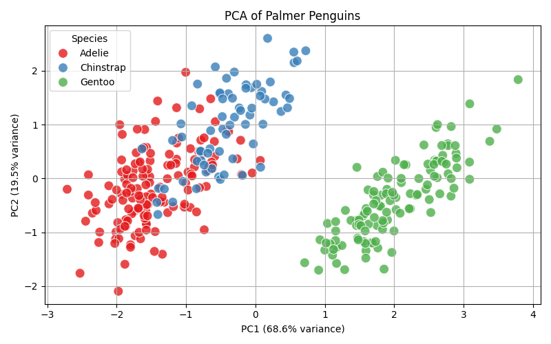{fig-align="center" fig-alt="First two principal components of the Palmer penguin data set"}

## Classification plot defintion

If we fit a classifier to that data, we can apply that classifier to the $x,y$-points in the rectangle and color them according to the classification to get an idea of how well the classifier works.

The next pair of slides shows this process applied to the Palmer penguins using a logistic classifier and a Neural network classifier.

## Logistic penguin classification

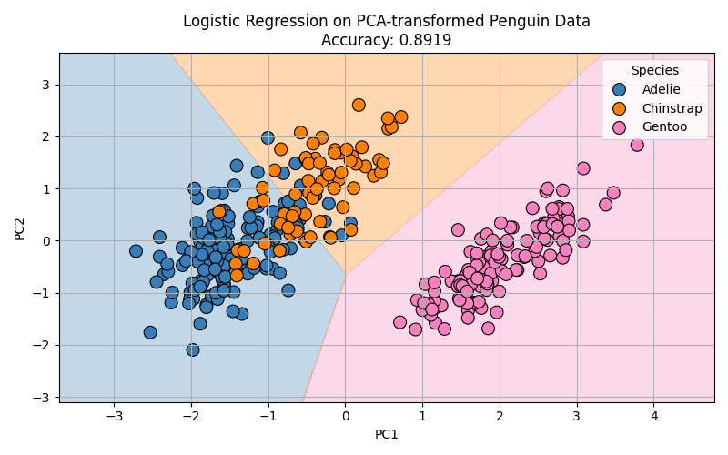{fig-align="center" fig-alt="Logistic classification of the Palmer penguins"}

## Neural net penguin classification

{fig-align="center" fig-alt="Neural classification of the Palmer penguins"}

## Synthetic data set 

Here's another data set that's artificially constructed to come in intertwined portions:

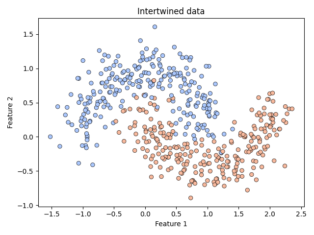{fig-align="center" fig-alt="Scatter plot of artificially constructed and intertwinded data"}


## Logistic classification

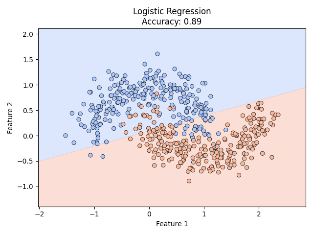{fig-align="center" fig-alt="Logistic classification of the intertwined data"}

## Neural net penguin classification

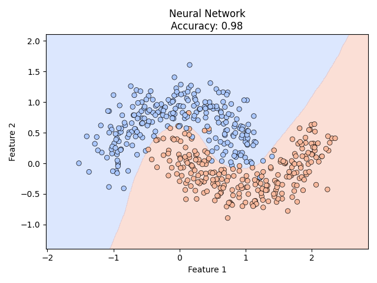{fig-align="center" fig-alt="Neural classification of the intertwined data"}
