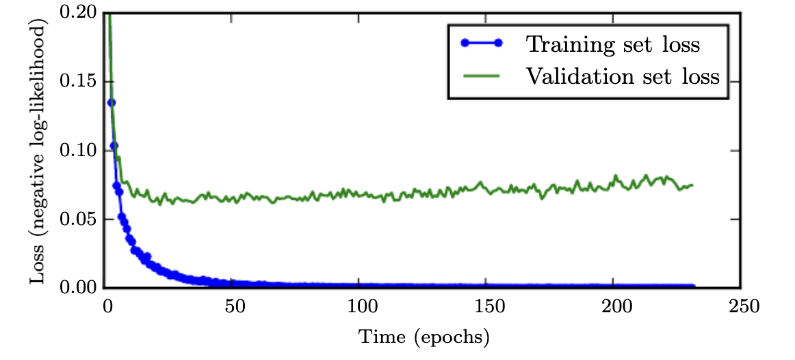
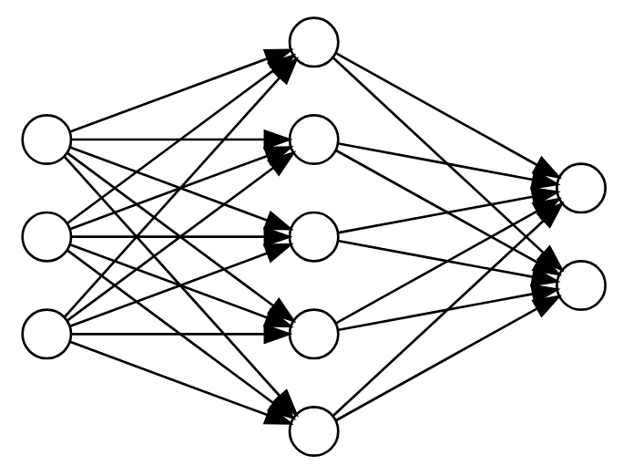
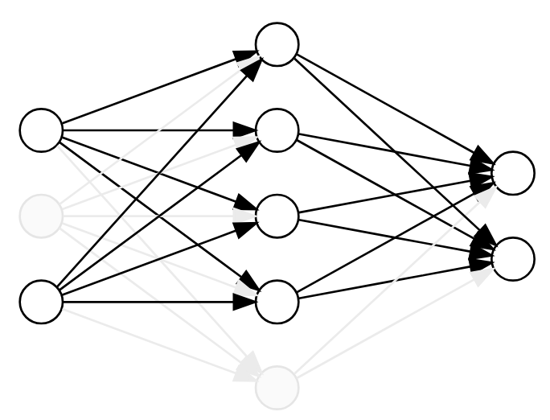
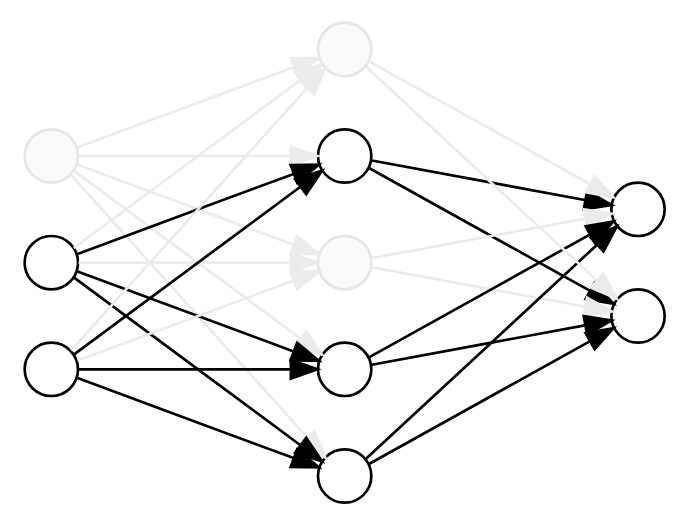

# Recap and look ahead

We just learned about neural networks and have a lab coming up. This is pretty much the same pattern that we had both linear an logistic regression. Just as with both of those topics, there are a some practical issues to consider when we move into the applied setting.

*Objective*: Understand the terminology that we see in code.

# Pros and cons of neural networks 

Neural networks are powerful extensions of linear and logistic regression but they can also be harder to work with. It's worth thinking about their pros and cons before starting a serious project that relies on neural network computations.

## Pros

- Neural networks are natural extensions of some of the tools we already know. Thus, many of the data preparation and model design principles still apply.
- As complex, non-linear models, though, they can model many challenging data sets that simpler regression cannot.
- They scale well and tend to continue to improve longer with more data.
- Large language models, which are so important today, are built on neural network concepts.

## Cons

- As complicated, non-linear models, neural networks typically have *many* local extremes so there's no clear best solution, thus
- they often invite endless tweaking of hyperparameters but
- they are computationally extremely expensive.
- Also, they are easy to overfit.
- They can be difficult to interpret.
- They tend to require lots of data.

# Training via minimization 

A neural network takes a vector of inputs
$$
\mathbf{x} = \begin{bmatrix}
x_1 & x_2 & \cdots & x_d
\end{bmatrix}^{\mathsf{T}}
$$
and returns a vector of outputs 
$$
\mathbf{y} = \begin{bmatrix}
y_1 & y_2 & \cdots & y_k
\end{bmatrix}^{\mathsf{T}}.
$$

If we are performing classification, the activation function that produces these outputs is called the *softmax* function, which is a generalization of the sigmoid that yields more than two categories.

## The softmax 

Given a vector $\mathbf{z} = \begin{bmatrix}
z_1 & z_2 & \cdots & z_k
\end{bmatrix}^{\mathsf{T}} \in \mathbb{R}^k$, 
the softmax function $\mathbf{p} = \mathrm{softmax}(\mathbf{z})$ is defined by 
$$
p_i = \frac{e^{z_i}}{\sum_{j=1}^k e^{z_j}}.
$$
Note that each $p_i$ is positive and 
$$
\sum_{i=1}^k p_i = 1.
$$
Thus, this is a good probability distribution on the vector of outputs. In fact, it's a direct generalization of the sigmoid.

## Minimization

To optimize this, we apply the method of maximum likelihood to obtain
$$
\prod_{i=1}^k p_i^{y_i},
$$
which we'd like to make as large as possible. This is equivalent to making 
$$
\mathcal{L} = -\sum_{i=1}^K y_i \log p_i
$$
as small as possible.
This is called the *negative log-likelihood* or *cross-entropy* and is the function that we minimize to train the network.

This objective function is often called a *loss function* in this context.

## The immediate point 

To be clear, we will not compute with or otherwise need these formulae on the exam. Our main objective now is to familiarize ourselves with the language and terminology that we'll see when working with computer code.

::: {.fragment}

We should all tell Edward that we've *got to know this for the exam*, though. 🤔

:::

# Minimization via gradient descent 

Let's take a high-level view of the minimization procedure via gradient descent in the context of neural networks. 

Again, our major objective is to familiarize ourselves with the terminology that we'll see in computer code.

::: {.fragment}

And, of course, it's OK to let Edward know that, too!

:::

## Initialization

Our objective is to minimize a loss function $\cal{L}$. This function is determined by parameters of the model, which are the weights associated with the edges.

Sometimes, we'd like to emphasize this functional nature so we pack all the edge weights into a single vector denoted $\mathbf{\theta}$ and write $\cal{L}(\theta)$ for our loss function.

To initialize our model, these edge weights are chosen randomly.

## An epoch

Once initial parameter values are chosen,

- we use those values to define an initial model,
- we compute the associated loss obtained by averaging over all the input data,
- from that we backpropagate to determine the gradient,
- we take a small step in the direction of the negative gradient to update the model weights to reduce the loss.

One iteration of this process is called an *epoch*.

## Learning rate 

On the previous slide, we said that "we take a small step in the direction of the negative gradient". The length of this step is called the *learning rate* and is denoted with an $\eta$. Thus, if our normalized gradient is $\nabla \cal{L}$, then our step is exactly
$$
-\eta \, \nabla \cal{L}.
$$
If we want to emphasize the parameter dependence, we might denote our update step as 
$$
\mathbf{\theta} \to \mathbf{\theta} -\eta \, \nabla \cal{L}(\mathbf{\theta}).
$$

## Batches

Given that we have a huge number of parameters and a huge data set, the computation time associated with an update becomes 
$$\text{huge}^2.$$
To alleviate this challenge to some degree, training data set is typically broken into smaller pieces called *batches*. 

- We then determine the loss function from a batch, find the gradient, and update the parameters.
- We then do the same thing for the next batch.
- Once we've cycled through the whole data set, we've completed an epoch.

# Regularization

By design, supervised learning algorithms are fit to the data that they are trained on and tend to look quite good when applied to that data. They don't always generalize well to similar data that they have not yet seen.  We've seen this problem of *overfitting* before and it's often even worse for neural networks. 

*Regularization* is the general term for reducing error on test data, generally at the expense of increasing error on training data. There are a number of specialized tools for dealing with this in the context of neural networks.

This column of slides presents a few regularization techniques that are commonly used in neural networks.

## ~~Cross~~ validation

In neural network training, the entire data set that we use to fit the model is typically broken into three pieces:

- 70-80% forms the training set,
- 10-15% forms the validation set, and 
- 10-15% forms the test set.

The validation set will be used to monitor the progress of the training with every iteration of our minimization algorithm. This is not genuine cross-validation, since there's just one validation set.

The test set is used to evaluate the fit once the minimum loss is determined.

## Early stopping

Most machine learning algorithms fit their data via gradient descent. In the context of linear or logistic regression with normed regularization, the iteration is typically carried out until it appears to have converged. 

In the context of neural networks, though, the iteration is often terminated early. This technique, called *early stopping*, is one of the main regularization techniques for neural networks.

The idea behind early stopping is quite simple. After each epoch, we apply the newly fit model to the validation set. If we notice that the loss applied to the validation set seems to stop going down or even get worse, we stop.

This has the added benefit, of course, that the algorithm finishes sooner!

## Why early stopping?

Early stopping is based on the empirical observation that the training loss tends to continue to decrease long after the validation loss, as shown in the figure below. The validation loss can even begin to increase. The logical guess is that the model is overfitting the training data.

::: {style="max-width: 900px"}

:::

## Bagging / Ensembles

One common way to regularize your models is to form an ensemble and then average out your predictions over the predictions formed by all the models. 

Certainly, 10 models won't all make the same mistake!

This process is called *bagging* or Bootstrap Aggregating in the ML community.

::: {.fragment}

The problem with bagging is it's super expensive to fit *one* model, let alone a bunch of them. So no one ever bags.
:::

::: {.fragment}
But...
:::

## Dropout

Dropout is an efficient technique to emulate bagging. It's not quite bagging but it's close and fast and easy.

Dropout is based on the observation that, if a complete network determines a model, then any subnetwork determines a related model.

A "subnetwork" can be determined by simply dropping some of the nodes and their incident edges.

::: {layout-ncol=3}

:::

## Dropout (cont)

Now, to perform dropout, we randomly drop a subset of the nodes for each batch during training. This zeros out their values and removes their influence on the forward and backward pass. 

Thus, each batch sees a different subnetwork and training with dropout can be viewed as efficiently averaging over many related models that share parameters.

::: {.fragment}

Dropout was first proposed as a technique for regularization in [this 2014 paper](https://www.jmlr.org/papers/volume15/srivastava14a/srivastava14a.pdf){target=_blank} by the so-called "God-father of AI" and his students.

:::

## More data 

Ultimately, the best way to improve a neural network is to obtain more data.

Often, of course, you're limited. People still try using techniques of *data augmentation*.  

We won't go into the details but I mention it because getting more real data is the most surefire way to improve a neural network - a fact I was reminded of while re-reading [Andrej Karpathy's blog](https://karpathy.github.io/2019/04/25/recipe/#:~:text=by%20far%20best%20and%20preferred%20way%20to%20regularize%20a%20model%20in%20any%20practical%20setting%20is%20to%20add%20more%20real%20training%20data){target=_blank} recently.

::: {.fragment}

Which [reminds me ...](https://www.kaggle.com/competitions/march-machine-learning-mania-2026/leaderboard?search=mcclure){target=_blank}

:::

