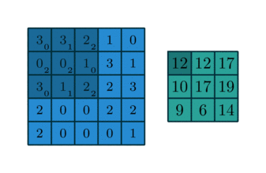

# Recap and look ahead

Recently, we learned how neural networks can be used for image classification. While basic feed forward neural networks can perform OK for this task, the addition of a so-called *convolutional layer* improves performance. We established concrete evidence of that in our last lab:

**Class-wide average results**
  
  - SLP: 85.96% (n = 18)
  - MLP: 88.48% (n = 16)
  - CNN: 92.72% (n = 24)

Today, we'll learn the mathematics of convolution and then, next time, we'll see how that plays out in the context of Tensorflow.

## Imports

There's a bit of code in this presentation so here are some of the libraries we'll be using

```{python}
#| echo: true
import numpy as np
import pandas as pd
import matplotlib.pyplot as plt

import requests
from io import BytesIO
from PIL import Image, ImageDraw
from IPython.display import display
```

# What is convolution?

In one dimension, discrete convolution is a function that combines two sequences by summing the products of one sequence with a shifted and reversed copy of the other.

The two dimensional analog combines two matrices in a similar fashion.

There are nice applications of convolution in one, two, and three dimensions. We're particularly interested in the application of two dimensional convolution to image processing today.

## Convolution in one dimension

In one dimensional convolution, we slide a small one dimensional array over a (typically larger) one dimensional array. At each step, we compute a dot product between the sliding array and the current segment of input. We replace the point in the original array with the result of the computation.

In this context, the smaller, sliding array is often called a *kernel*.

## Mathematical formulation

Mathematically, if the input is $x = [x_1, x_2, \ldots, x_n]$ and the kernel is $w = [w_1, w_2, \ldots, w_k]$, then the convolution output at position $i$ is:

$$
y_i = \sum_{j=1}^{k} w_j  x_{i + j - a}.
$$

The parameter $a$ can be adjusted to align the kernel in the sequence in various ways, though when applied to a long list of data, it doesn't change things much.

## Implementation

In code, convolution might look like so:

```{python}
#| echo: true
def convolve1d(signal, kernel):
    # Flip the kernel
    kernel = np.array(kernel)[::-1]

    # Set the output
    N = len(signal) - len(kernel) + 1
    output = np.zeros(N)
    
    # Do it!
    for i in range(N):
        seg = signal[i:i + len(kernel)]
        output[i] = np.dot(seg, kernel)

    return output

convolve1d([0,1,2,3,4,5,6,7,8,9], [3,2,1])
```

## Why the flip?

The earliest convolution computations were expressed in terms of integration, the continuous analog of a sum:

$$(f*\varphi)(t)=\int _{-\infty }^{\infty }f(\tau )\varphi(t-\tau )\,d\tau.$$

Note that setting $t=0$ aligns the kernel and the function at the origin. Subtracting $\tau$ in $\varphi(t-\tau)$ shifts the kernel to the right, as we might expect, but also introduces the flip. The discrete convolution is set up to emulate that.

## Smoothing data

One common application of one-dimensional convolution is to smooth data. Here's some pretty rough looking data, for example:

```{python}
#| echo: true
#| code-fold: true
aapl = pd.read_csv("./aapl-04-20-26.csv")
prices = aapl['Close'].values.ravel()
plt.figure(figsize=(8, 5))
plt.plot(aapl.index, prices, alpha=0.8)
plt.xlabel("Date")
plt.ylabel("Price")
plt.grid(True)
plt.show()
```

## Smoothed

Here's what the data looks looks like after we smooth it out with a kernel:

```{python}
#| echo: true
#| code-fold: true
plt.figure(figsize=(8, 5))
plt.plot(aapl.index, prices, label='Original Prices', alpha=0.5, linewidth=0.8)

kernel = np.ones(7) / 7
smoothed = convolve1d(prices, kernel)

dates = aapl.index[kernel.size - 1:]
plt.plot(dates, smoothed, label='Smoothed (Custom 7-day MA)', linewidth=2)
plt.xlabel("Date")
plt.ylabel("Price")
plt.legend()
plt.grid(True)
plt.show()
```

## Two-dimensional convolution

Convolution in 2D is very similar but works with two-dimensional arrays, rather than one dimensional arrays. Mathematically, it's easiest to use our matrix notation for this purpose. I guess that looks something like so:


Let $A = [a_{ij}]$ be an $M \times N$ matrix, and let $K = [k_{uv}]$ be a kernel of size $m \times n$. Then the 2D convolution of $A$ with $K$, evaluated at position $(i, j)$, is given by:

$$
(A * K)_{ij} = \sum_{u=0}^{m-1} \sum_{v=0}^{n-1} k_{uv} \cdot a_{i + u - \left\lfloor \frac{m}{2} \right\rfloor,\; j + v - \left\lfloor \frac{n}{2} \right\rfloor}
$$

## Visualization

While the formula is complicated, it has a simple interpretation that's much like the one-dimensional interpretation. The kernel is a smaller matrix that slides around the bigger matrix creating new values via the dot product as it goes along. You might visualize this like so:



## Image blur

It's easy to see how that last slide might have application in image processing. If the matrix represents an image as a large collection of grayscale values and the kernel is $n\times n$ with values each equal to $1/n^2$, then the effect of the convolution to average value over small patches in the image. Visually, this leads to a blurring of the image.

# Edge detection

We now turn to the problem of edge detection, one of the most basic types of feature detection. Let's suppose, for example, that we've got the following basic Pacman like image:


We'd like to be able to detect the large circle with the wedge cut out and the smaller circle and return the result as just the edges drawn in black on a white background.

## The Laplacian

Laplace's kernel is a simple $3\times3$ matrix that works great for edge detection. The kernel looks like so:
$$
\begin{bmatrix}
0&1&0 \\ 1&-4&1 \\ 0&1&0
\end{bmatrix}.
$$

You might notice that the matrix has some nice symmetry in that its terms sum to zero.

## Application to Pacman

Now, the Pacman image is $512\times512$ and, while it's stored as a PNG, we can easily convert it to a simple matrix representation where

- 0 is black,
- 1 is white, and
- 2 is yellow.

Thus, if we convolve that with the Laplace kernel, then *most* of the time, that small $3\times3$ kernel will be wholly contained within one color. The value of the convolution will be zero at those points. Occasionally, though, the kernel will overlap two different colors; at those points, the value of the convolution will be non-zero and that's exactly where the edges are!

So, all we gotta do is compute the convolution, map zero to one color and non-zero to another color and we should generate an image of the edges.

## Implementation

Let's try it! First off, here's the image:

```{python}
#| echo: true
response = requests.get("https://marksmath.org/images/pacman.png")
img = Image.open(BytesIO(response.content))
display(img)
```

## Some ancillary code 

This next code block is a bit long but the main point is that it defines an `image_to_matrix` function so that the `convolve2d` function has a matrix to work with.

```{python}
#| echo: true
# The image is stored as a PNG, which represents colors in RGB format.
# We'll convert those to single numbers. It's not particularly
# important what those numbers are, as long as they're distinct.
COLOR_MAP = {
    (0, 0, 0): 0,             # black
    (255, 255, 255): 1,       # white
    (255, 255, 0): 2,         # yellow
    (204, 204, 0): 2,         # dark yellow
    (255, 0, 0): 3,           # red
    (173, 216, 230): 4        # light blue
}

# Using the COLOR_MAP we just defined, convert image to a matrix.
def img_to_matrix(img):
    img_data = np.array(img)
    matrix = np.zeros((img_data.shape[0], img_data.shape[1]), dtype=np.uint8)
    for rgb, label in COLOR_MAP.items():
        mask = np.all(img_data == rgb, axis=-1)
        matrix[mask] = label

    return matrix

# Definition of two-dimensional convolution
def convolve2d(image, kernel):
    kernel = np.flipud(np.fliplr(kernel))
    image_height, image_width = image.shape
    kernel_height, kernel_width = kernel.shape
    pad_y = kernel_height // 2
    pad_x = kernel_width // 2

    padded = np.pad(image, ((pad_y, pad_y), (pad_x, pad_x)), mode='reflect')
    output = np.zeros_like(image, dtype=float)

    for i in range(image_height):
        for j in range(image_width):
            region = padded[i:i+kernel_height, j:j+kernel_width]
            output[i, j] = np.sum(region * kernel)

    return output

# Use the convolve2d function to detect the edges and return
# the result as a matrix.
def detect_edges(M):
    edge_matrix = convolve2d(M.astype(float), KERNEL)
    edge_abs = np.abs(edge_matrix)
    edge_scaled = 255 - 255 * (edge_abs / edge_abs.max())
    return edge_scaled.astype(np.uint8)
```

## Do it 

OK, now we'll define Laplace's kernel and apply it to the image to display the edges:

```{python}
#| echo: true
#| code-fold: true
KERNEL = np.array([
    [0,  1, 0],
    [1, -4, 1],
    [0,  1, 0]
])
processed_matrix = np.abs(convolve2d(img_to_matrix(img), KERNEL))
processed_matrix = 255 - 255 * (processed_matrix / processed_matrix.max())
processed_matrix = processed_matrix.astype(np.uint8)
Image.fromarray(processed_matrix, mode='L')
```

# Directional detection

Edge detection is just one example of feature detection; convolution can be used to detect many types of features within an image. This is the foundation of how tools like Photoshop work their magic.

Let's illustrate this with just one more example; this time we'll build a kernel that detects lines and is sensitive to direction.

## Sobel's kernels

One of the two most basic Sobel kernels looks like so:
$$
K = \begin{bmatrix}
1&2&1 \\ 0&0&0 \\ -1&-2&-1
\end{bmatrix}
$$
The terms of this matrix again sum to zero so that, if we form the convolution at a point wholly contained within a single color, then we'll get zero. This matrix also has an interesting symmetry - but of a kind that's clearly distinct from the Laplacian.

Notice that every column sums to zero. As a result, this kernel does *not* detect vertical lines. It should detect horizontal lines, as well as diagonal lines to varying degrees depending on the slope. The transpose $K^T$ has the opposite property. Thus, these kernels are, in some sense, directional.


## A test image 

Here's an artificially generated image that Sobel's kernel should work well on:

```{python}
#| echo: true
#| code-fold: true
response = requests.get("https://marksmath.org/images/square_on_back.png")
img = Image.open(BytesIO(response.content))
display(img)
```


## Application of Sobel's kernel

Let's try it!

```{python}
#| echo: true
#| code-fold: true
KERNEL = np.array([
    [1,2,1],
    [0,0,0],
    [-1,-2,-1]
])
processed_matrix = np.abs(convolve2d(img_to_matrix(img), KERNEL))
processed_matrix = 255 - 255 * (processed_matrix / processed_matrix.max())
processed_matrix = processed_matrix.astype(np.uint8)
Image.fromarray(processed_matrix, mode='L')
```