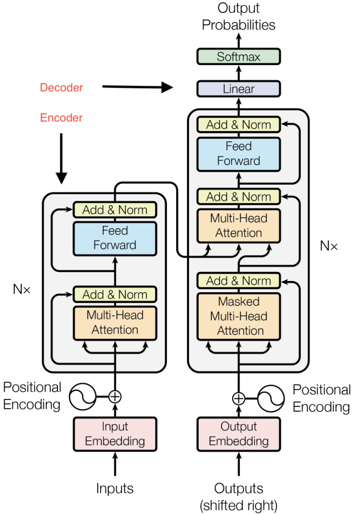

# 

Today is a bit different from usual. While we'll talk a just a little about how some of the mathematics that we've learned fits into this monster, I'll also point you to some tools you might explore some day and wax slightly philosophic.

# Why LLMs?

Artificial intelligence is a topic that's been around for decades - since at least the 1940s. The current AI frenzy, though, is based largely around Large Language Models.

I guess they're making a bit of an impact.

## Some good things

It seems to me that there are a lot of objectively good things coming out of the transformer architecture:

- Programmer productivity tools
- Data wrangling
- Improved search
- Accessibility 
- Translation
- Diagnostic imaging 
- Computational biology

## Some questionable things

- Volatility in the job market:
  - Recent layoffs at Facebook, Microsoft, Bank of America  
    Higher Ed could go anywhere  
    AI washing, supposedly at Amazon
- Questionable economics
- Environment and regional impacts

## So what to do?

My view on AI is to learn about it!

More generally, for fledgling programmers - broaden your interests!

- Mathematically inclined programmers have always had an edge at algorithm design
- Domain expertise has always helped programmers produce software for use in other domains

# Symbolic AI

Gary Marcus is a frequent critic of LLMs:  
[https://garymarcus.substack.com/](https://garymarcus.substack.com/){target=_blank}

He's also a major proponent of *Symbolic AI*.

## Examples of symbolic AI

- Computer Algebra
- Game playing
  - Culminated in Deep Blue, which beat Gary Kasparov in 1997
- Classic natural language processing
- Scheduling algorithms
- Robotic motion
- Wolfram Alpha

I [worked for Wolfram Alpha](https://blog.wolframalpha.com/2013/04/26/get-real-with-wolframalpha-computing-roots/){target=_blank} for a few years, by the way.

## Still surprised

I was as surprised as most people in 2023, though, when suddenly computers could speak in complete sentences and carry on a semi-normal conversation.

# LLM development

The major steps in LLM development look like so:

- Data curation
- tokenization 
- embedding 
- model design
- pretraining 
- finetuning 
- evaluation 
- inference

## Data curation

This is the process of forming a large corpus or body of text to model. This has been done largely by

- crawling the web
- scanning books
- audio to text

The data does *not* need to be labeled. As the objective is next token prediction, the training process is an example of *self-supervised* training.

## Tokenization

The process of translating the text to computer consumable tokens. This uses a process called *byte pair encoding*, which recursively merges the most frequent pairs of characters in a corpus.

You can see the result at [the tokenizer playground](https://huggingface.co/spaces/Xenova/the-tokenizer-playground){target=_blank}.

## Vector embedding

While tokens are numeric, they don't really live within a structured space. Vector embedding is the process of placing them within a vector space with a structure that reflects meaning.

Points that are close together generally have similar meanings. The classic algebraic craziness is 
$$
\text{king} - \text{man} + \text{woman} \approx \text{queen}.
$$

You can play with an example of a vector embedding at the [vector projector](https://projector.tensorflow.org/){target=_blank}. 

## Model definition

::: {layout="[5,3]"}

The fundamental structure of a Large Language model is called a *transformer*. It's literally built to transform one sequence of tokens into another.

A schematic of the transformer (taken from the seminal 2017 paper "Attention is all you need") is shown at the right. It comes it two parts:

- An encoder, which can be used for classification or regression by itself
- A decoder, which can be used for text generation for chatbots.

Some tasks, like translation, use both the encoder and the decoder.

:::

## Pretraining and finetuning

Pretraining is the process of training the model to write natural text. This portion works a lot like previous supervised learning algorithms work. Thus, we feed our corpus to the model. Each sequence of consecutive tokens in the data is labeled by subsequent token, and we apply the method of maximum likelihood to obtain a next token predictor.

After pretraining, our model can converse naturally but it doesn’t necessarily follow instructions, align with our preferences, or reliably produce accurate responses. The process of training the model further is called finetuning. This is often done with human feedback

## Evaluation and inference

The evaluation and inference are very much as we've seen in other cases. Thus, the model is pretty much built and ready to use. So we

- Apply the model to some withheld data to evaluate it and
- Apply the model to new data to use it!

# Resources

There are lots of ways to use LLMs other than direct interface with ChatGPT or some other major chatbot. There are also lots of models that can be highly customized and used as a chatbot of via an API for various purposes.

That's exactly how the Math Proofreader on [our forum works](https://discourse.marksmath.org){target=_blank}.

## OpenRouter

[OpenRouter](https://openrouter.ai/){target=_blank} provides a unified API access to nearly 700 models. I've spent about 20 cents on all the API calls for the forum this semester. About 5 cents of that was my own usage of the chatbot.

Things can go awry, though.

## Hugging Face

[Hugging Face](https://huggingface.co/){target=_blank} is a company based in NYC that provides tools, libraries, and a model hub for building, sharing, and deploying machine learning models. You can build and deploy your own models for testing right there, though you'll probably want to move beyond Hugging Face for production.

## vLLM

[vLLM](https://vllm.ai/){target=_blank} is an open source server for AI large language models. You can rent GPU server space from a company like [DigitalOcean](https://www.digitalocean.com/){target=_blank} or [Lambda](https://lambda.ai/){target=_blank} and use vLLM from there.

My webpages are served by DigitalOcean.

## Andrej Karpathy

Andrej Karpathy cofounded and worked at OpenAI and also worked for a bit at Tesla. In early 2023, he began creating amazing free resources available which you can find listed [on his website](https://karpathy.ai/){target=_blank}.

Of particular interest, I would point out

- [nanochat on GitHub](https://github.com/karpathy/nanochat){target=_blank} and 
- [Let's build GPT on YouTube](https://www.youtube.com/watch?v=kCc8FmEb1nY){target=_blank},

where he explains how to build GPT V2 from scratch for less than $100.

