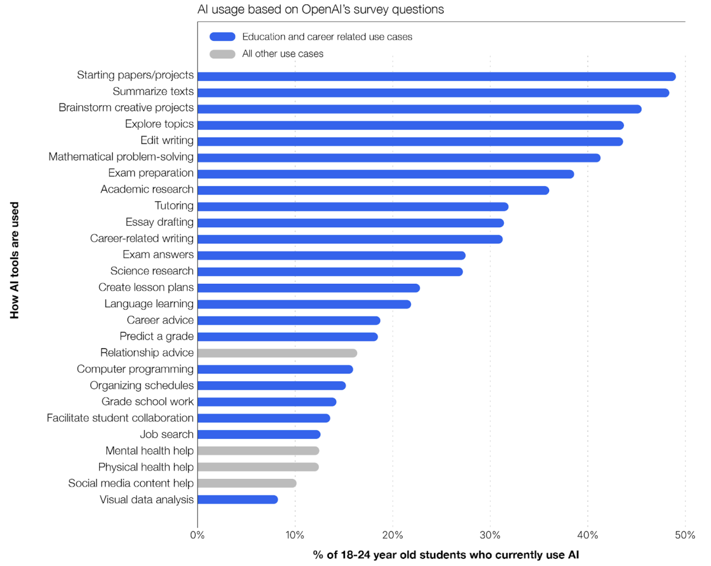

::: {.callout-note}
## TLDR

You should probably play with ChatGPT and maybe (if you're interested in data) also try Julia AI. If you'd really like to see how to tailor AI to your course, you could also try out Notebook LM. Otherwise, chill out, read a bit, and wait for the future.

Ultimately, though, it is the University's responsibility to provide a high quality, safe, and secure general AI system. Failure to do so already represents a clear administrative failure on the part of UNCA and the entire UNC System.
:::

## A little initial advice

Most of our students are using AI. That's not a conjecture; it's empirical. For example, @copyleaks2025_ai_trends surveyed 1100 US university students and found that, as of Sept 2025,

- 90% of college students used AI to some degree,
- 29% used AI daily, and
- 73% were *increasingly* using AI.

Expanding on that report, @legatt2025_forbes_ai_students argues that most students lack AI fluency and need help from their schools and instructors. Students particularly use AI for mathematics. We see this in @fig-AIUseCases which is taken from @openai2025_edu_workforce and shows what types of topics students use ChatGPT for.

{#fig-AIUseCases}

Taking all this into account, @mitnews2025_forbes_ai_students states

> Universities have a responsibility to ensure students, faculty, and staff gain a strong foundation in AI’s concepts, opportunities, and risks.

Personally, I would stop short of putting this on all faculty. We all have our own strengths and weaknesses and it's best to use them. I do think it's generally a  good idea for faculty to read and learn about AI to the extent that it fits within their objectives. For those who have genuine interest, it's a good time to learn as much as you can.

## Current, widely available tools

Here are the biggest tools that are already in widespread use.

### Chat GPT

- [https://chatgpt.com/](https://chatgpt.com/){target=_blank}

We've all heard of ChatGPT by OpenAI, which kicked off the current AI craze in late 2022. By all accounts that I've found, ChatGPT is still dominant with 60-80% of the market. @muslimcoder2025_ai_chatbots indicates 81.85%, which is the highest I've found and unbelievably precise.

It's certainly the case, though, that it's hard to understand what AI looks like to students without playing with ChatGPT at least a little bit.

### Other general purpose chatbots

Chat GPT is not the only chatbot in town (or, wherever these things live). Here are three more general purpose chatbots that can all do basic mathematics reasonably well.

#### Claude

- [https://claude.ai/](https://claude.ai/){target=_blank}

Claude probably gets the most hype because it's owned by Anthropic, which is such a major player. I have not used Claude much but plan to this coming summer.

#### Gemini

- [https://gemini.google.com/](https://gemini.google.com/){target=_blank}

We all use Gemini, whether we know it or not, because Google search AI summaries are generated by Gemini. There's also a standalone chatbot, as linked above.

#### Perplexity

- [https://www.perplexity.ai/](https://www.perplexity.ai/){target=_blank}

If you can't stand the way that ChatGPT, Claude, and Gemini keep asking follow up questions to draw you in, then Perplexity is definitely worth checking out! Perplexity is designed to be more of a direct answer engine and less conversational. As such, it might actually be the best choice for *general use* in academia.

## Math/Stat focused

Here are four more AI tools that are more focused on math or stat and are generally more than just a chatbot. Note that all of these have free/paid versions and I've used only the free version.

These are all potentially awesome - and nobody uses them.

### Thetawise

- [https://thetawise.ai/](https://thetawise.ai/){target=_blank}

Of these, Thetawise is probably the most chatbot like. You can ask it direct math questions and it will answer directly. It does provide a tutor mode that coaches you a bit.

### JuliusAI

- [https://julius.ai/](https://julius.ai/){target=_blank}

This is more of a stat/data analysis tool that I've gotta admit that I kinda like. Julius can access a freely available data sets online (at least US Census data, for example), do analysis and generate data visualizations directly. It took me no time to generate a choropleth map of North Carolina's counties shaded by population density, for example. I guess you can upload your own data sets, as well.

### MathGPT

- [https://www.mathgpt.ai/](https://www.mathgpt.ai/){target=_blank}

MathGPT feels less like a chatbot and more like a platform. There's a whole integrated curriculum and you can ask questions and get immediate responses right within that platform.

### Khanmigo

- [https://www.khanmigo.ai/](https://www.khanmigo.ai/){target=_blank}

Khanmigo is by far the most ambitious of all these tools. Like MathGTP, Khanmigo feels more like a platform than a chatbot. Unlike MathGPT, however, Khanmigo is built into Khan Academy and, as such, is part of an already widely used platform. It's also built by established tech folks and really should be completely awesome.

It's too bad nobody uses it, as @meyer2026_khanmigo says.

Khanmigo provides a cautionary tale - quality content, technical competence, and substantial funding are no guarantee of success. The reality is that students simply weren't interested in interacting with Khanmigo within the platform when they could just ask ChatGPT.

## Institutional tools

Recall that @mitnews2025_forbes_ai_students puts the onus on *universities* to ensure that students and faculty gain a strong foundation in AI. Here are a couple of tools that are currently available through UNCA's Google suite and one more that might be on the way, I guess.

### Gemini within Colab

- [https://colab.research.google.com/](https://colab.research.google.com/){target=_blank}

Colab is a notebook based, programming environment. We've had it for years and it really is a great tool to use if you want your students to write some code. I've used it in quite a few classes including Intro Stats, Linear Algebra, Fractals and Chaos, Numerical Analysis, and Math for Machine Learning.

Within the last couple years, Colab has begun to access Gemini as a coding assistant. This is actually illustrative of a major way that AI is being used more and more. Thus, it's a great tool to be able to share with our students.

Unfortunately, you can't force the damn thing to turn off. Thus, students *always* have access to programming assistance when using Colab. Not ideal for an educational tool.

### NotebookLM

- [https://notebooklm.google.com](https://notebooklm.google.com){target=_blank}

This is another Google product, which really is a bit different and more personalized. You can upload course materials to Notebook LM. That can really be anything in digital form including PDFs, text, images, audio, or video. You can upload a copy of your textbook, if you have permission, or the address of any webpage that you might refer to.

Notebook LM will digest all that and create a Q&A site *for your course*. Students can ask questions like how to do HW problems or when is exam 2. Responses should be tailored to your class.

For example, if a student in *my* Calc I asked how to compute
$$
\lim_{\theta\to0} \frac{\sin(2\theta)}{\theta}
$$
it shouldn't show them l'Hospital's rule, since I tell my students (in writing) not to do the problem that way.

Of course, the more digital material you provide it, the better it will be aligned to your class.

### Amplify

Amplify is a Higher Ed specific LLM that is under development at Vanderbilt. Amplify provides a number of features that are clearly important or desirable for AI use in a university setting, including

- FERPA compliant data security and privacy,
- institutional control and customization,
- LMS integration, and
- choice among various LLM backends.

Amplify is not restricted to just Vanderbilt University; it is already deployed at more than 50 institutions. In fact, Vanderbilt announced on January 6 of this year that it had already been deployed across the entire University of North Carolina system, as you can read on [the Wayback Machine](https://web.archive.org/web/20260115013146/https://computing.vanderbilt.edu/2026/01/06/amplify-2-0-ushers-in-a-new-era-of-ai-powered-productivity-at-vanderbilt/#:~:text=the%20entire%20University%20of%20North%20Carolina%20system){target=_blank}.

Unfortunately, Amplify has not yet been installed at UNCA or, as far as I know, at any of the UNC System schools. Given the system's focus on "tech readiness" and UNCA's so-called "future forward" perspective, it's hard to characterize this as anything short of a systematic failure.

## Reading resources

As it's not quite clear where the UNC System is going with AI, it's reasonable for faculty to educate *themselves* as much as they can. In addition to trying out some of these tools, there is plenty of good reading.

### AI in education

Here are three blogs on AI in higher education. All the authors are very knowledgeable but have different levels of enthusiasm.

- [https://www.oneusefulthing.org/](https://www.oneusefulthing.org/){target=_blank}  
  One Useful Thing by Ethan Mollick is an optimistic look at the possibilities of AI in higher ed.
- [https://substack.com/@marcwatkins](https://substack.com/@marcwatkins){target=_blank}  
  Marc Watkins' substack is much more balanced.
- [https://helenbeetham.substack.com/](https://helenbeetham.substack.com/){target=_blank}  
  Helen Beetham believes that AI has no place in education.

### AI in Mathematics

Here are a couple of great blogs that are focused on the use of AI in mathematics and teaching.

- [https://danmeyer.substack.com/](https://danmeyer.substack.com/){target=_blank}  
  Dan Meyers is a former teacher who focuses on using AI to improving math instruction by designing tasks that are more engaging and less rote.
- [https://terrytao.wordpress.com/](https://terrytao.wordpress.com/){target=_blank}  
  Terrence Tao is a giant of pure mathematics. He's also deeply interested in the use of AI in mathematical research.

### Marcus on AI

- [https://garymarcus.substack.com/](https://garymarcus.substack.com/){target=_blank}

Anyone who wants to monitor AI overhype in general, should read Gary Marcus.

## The not so distant future?

I really don't know where AI is going to push education. It's tough to make predictions, especially about the future.

Nonetheless, I'm going to toss out a couple scenarios concerning what I'm afraid might happen and what I hope could happen.

### Will AI kill college?

There are all kinds of dire predictions about what *will* happen because of AI. For example,

- AI usage will dumb our children down,
- the energy demands of AI will kill our power grid and push our climate further to the brink,
- the circular business dealings of AI will blow the economic bubble up so much that the coming crash will yield the worst economic disaster yet, and
- work displacement will be catastrophic.

Personally, I'm still in the "that all *might* happen" camp. I don't know that they *will* happen, though. Make no mistake, though, these are real possibilities.

The impact of AI on higher education, in particular, is multi-dimensional. We should all be concerned about the possibility of AI displacing in person instruction. I don't believe there's any way that an AI based system could be anywhere near as rich, rewarding, and (well) educational as personal interaction - ever.

### Useful AI?

I'm hopeful that, in the future, we'll have easy access to *small*, *tailored* AI models that focus on specific tasks. I'll be working on such a system this summer and fall via an NC Innovation grant.

## References