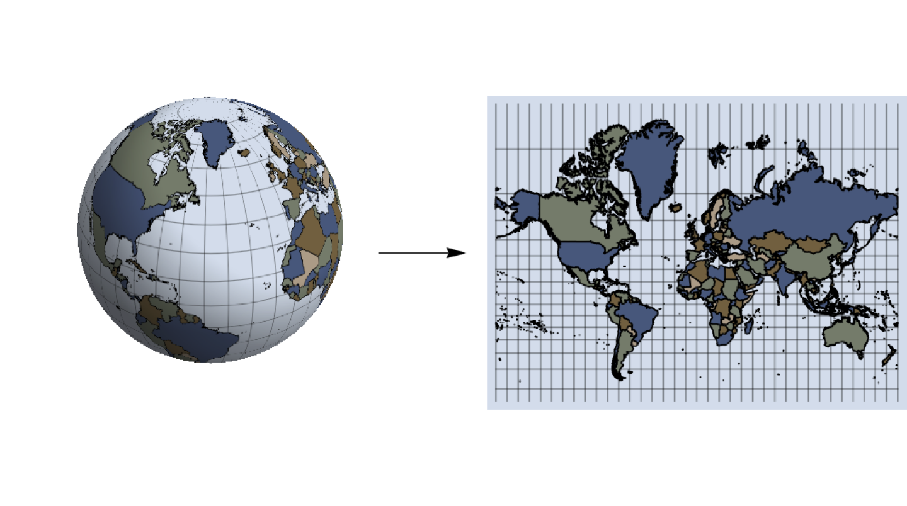
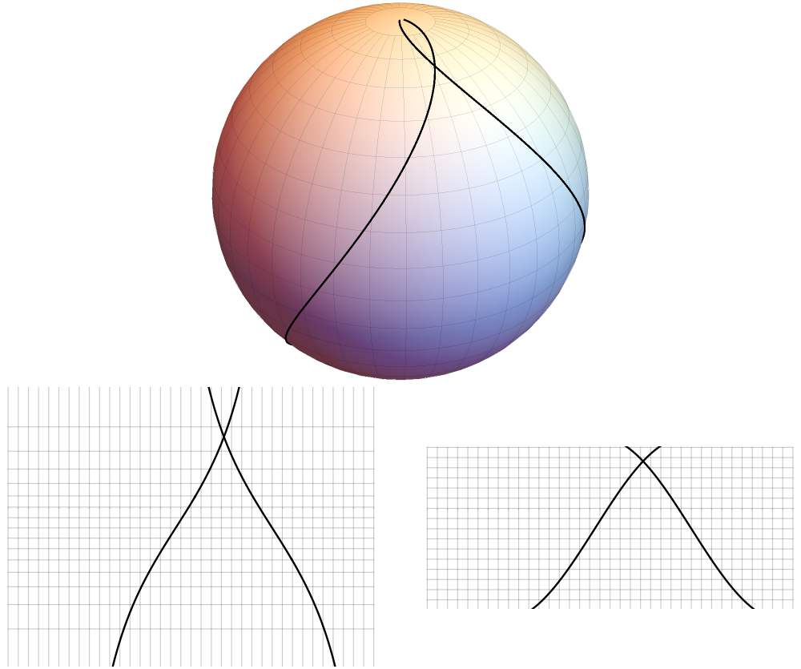
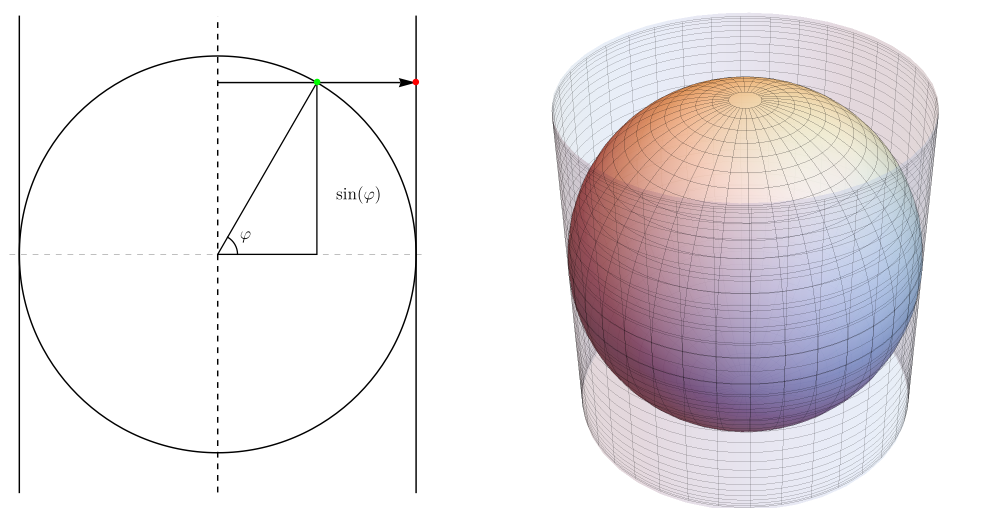
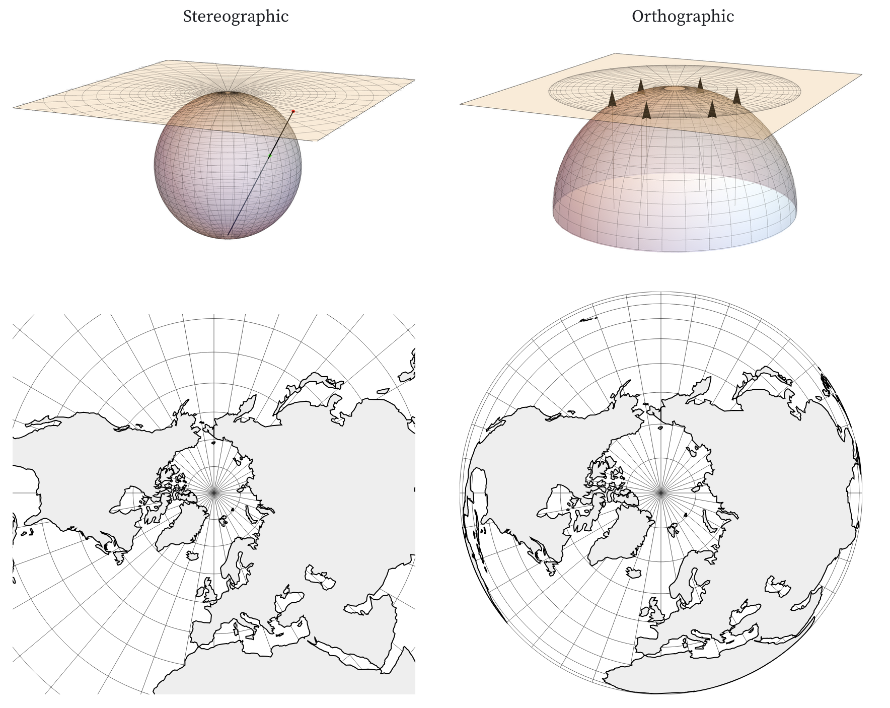
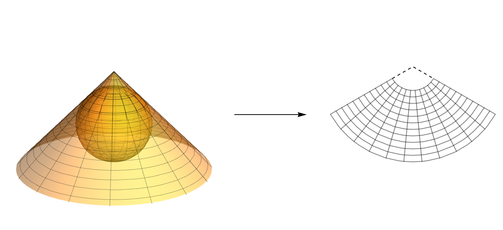

## Introduction

In multivariable calculus, we study higher dimensional calculus, that is, derivatives and integrals applied to functions mapping $\mathbb{R}^m$ to $\mathbb{R}^n$. Viewed in this context, the study of map projection is quite natural since we are mapping the surface of a globe to a planar rectangle. The globe is naturally parameterized in terms of two variables, latitude $\varphi$ and longitude $\theta$. Thus, we could think of a map projection as a function 
$$T:\mathbb{R}^2 \to \mathbb{R}^2 \text{ or } T(\varphi,\theta) = (x(\varphi,\theta), y(\varphi,\theta)).$$
Isn't that exactly the kind of thing we study in Calc III???

### Example map projections 

The earth, as we well know, is approximately spherical; it is best represented as a globe. For convenience both physical and conceptual, however, we frequently represent the spherical earth with a flat map. Such a representation *must* involve distortion. The process is illustrated in @fig-globeAndMap.

{#fig-globeAndMap fig-align="center"}

The projection shown in @fig-globeAndMap is called *Mercator's projection*. Mercator created his projection in 1569. Although it was not universally adopted immediately, it represented a major breakthrough in navigation because *paths of constant compass bearing are represented as straight lines*. Ultimately, this property follows from the fact that Mercator's projection is a *cylindrical, conformal* projection. A major goal of this document is to understand these facts.

We will not really fully understand a map projection until we know and understand the formula defining the projection. We'll get to that formula for Mercator's projection by the time this document is done (which it isn't, just yet).

Of course, there are a huge number of map projections. The interactive image below shows just a few.

::: {.card .bg-light style="padding: 15px;"}

```{ojs} 
viewof projection = Inputs.select(projectionOptions, {
  value: projectionOptions[0],
  format: (o) => o.name,
  label: "Projection:"
})
```

```{ojs}
map = {
  advance;
  return renderAnimatedProjectionMap(
    state, projection, land, invalidation
  );
}
```
```{ojs}
comment = md`${projection.comment}`
```

:::


## Two big questions

When choosing a map projection there are two big questions that we should ask about the map. 

First, what properties should the map have? Should it represent equal areas in equal proportions? Should it properly represent distance to some central point? Will it represent direction in some canonical way? 

Second, what type of map projection is it? Was it constructed by projection onto a cylinder, plane, or cone? A proper understanding of map type helps us analyze the first question.

### Properties of maps

When considering what map projection to use for a particular purpose, you need to know what properties the map should have. There are many properties that might be relevant to all sorts of questions but there are two major properties that we will consider here.

#### Equal area maps

Does the map need to be *equal area* (also called area preserving)? This means quite simply that areas are represented in their correct proportions. Mercator's projection is *not* equal area. Greenland (with an area of about $2.2$ million square kilometers) looks larger than South America (with an area of about $17.8$ million square kilometers). The Equal Earth, shown on the right in @fig-conformal_and_equal_area, is an equal area map.


```{ojs}
//| label: fig-conformal_and_equal_area
//| fig-cap: "Conformal and equal-area maps"
{
  let div = d3.create("div");
  let left = div
    .append("div")
    .style("display", "inline-block")
    .style("width", "360px");
  left
    .append("div")
    .style("width", "360px")
    .style("text-align", "center")
    .text("Mercator's projection");
  left.append(() => plain_pic(land, d3.geoMercator()));
  let right = div
    .append("div")
    .style("margin-left", "10px")
    .style("display", "inline-block")
    .style("width", "360px");
  right
    .append("div")
    .style("width", "360px")
    .style("text-align", "center")
    .text("Equal Earth projection");
  right.append(() => plain_pic(land, d3.geoEqualEarth()));

  return div.node();
}
```

#### Why equal area?

Some maps are designed to illustrate some simple concept, such as population, political affiliation, region or whatever. In this case, it's common to strip out most unnecessary details to focus on the issue at hand. This type of map is commonly called a *thematic map* or *choropleth*.

When designing a choropleth, it's often desirable for the map to be equal area, particularly when the shading is intended to indicate density. The reason is pretty clear, I suppose. If you shade a Mercator map by temperature, for example, then your impression of average temperature is likely to be skewed towards the cooler side due to the tremendous inflation near the poles.

The map in @fig-choropleth shows a choropleth for population density in the contiguous US.

```{ojs}
//| label: fig-choropleth
//| fig-cap: "A choropleth for US population density"
choropleth_map 
```

#### Conformal maps 

Should the map be *conformal*? This means that the map preserves angles. To understand this, suppose we have two paths on a globe that intersect at some angle. If we take the image of these paths under a conformal transformation, the angle will be the same. This is illustrated in @fig-conformal, where we see the image of two paths on the globe under Mercator's projection and the equi-rectangular projection. The angle is preserved under Mercator's projection but not under the equi-rectangular projection.

{#fig-conformal fig-align="center"}

#### Why conformal???

When navigating from one spot to another, it's often desirable to have a conformal map. We'll talk more about this when we discuss Mercator's map in more detail

#### Balancing objectives

Since this is a math class, let's state a couple of theorems:
 
::: {.callout-note appearance="minimal"}
**Thm 1**: A map projection cannot represent all distances between pairs of points proportionally.
:::

This seems reasonably easy to believe. To be distance preserving in this fashion, the projection would have to preserve shapes exactly and, in particular, it would preserve any curvature inherent in the shape. Thus, we can't flatten a curved surface without distorting some distances. Nonetheless, we can often do a reasonable job of minimizing that distortion, particularly on maps of small regions. That's obviously a desirable for maps designed for navigation.

Our second theorem is a little more challenging:

::: {.callout-note appearance="minimal"}
**Thm 2**: A map projection cannot be both conformal and area preserving.
:::

This is a well-known and long established theorem that's been proven mathematically; it is not a topic of discussion. Both properties are desirable in certain situations, though, so it's essential to know when to design your map with the appropriate property. Here are some criteria to consider when choosing between these properties:

#### Centered equidistant maps

While we can't represent *all* distances on a map in their correct proportion, we can sometimes represent some collection of distances correctly. Such a map is called an *azimuthal equidistant map*. @fig-asheville_equidistant shows circles centered at Asheville in two different projections. In only one of those directions do the circles look like circles, though!

```{ojs}
viewof asheville_projection
```
```{ojs}
//| label: fig-asheville_equidistant
//| fig-cap: "An Asheville equidistant map"
asheville_map
```


### Types of map projections

When we refer to the *type* of a map projection we are essentially classifying the projections roughly by the way they are constructed. These generally fall into one of three types:
- Cylindrical,
- Conic, or
- Azimuthal.

There are variations on these themes, such as composite maps formed by combining other maps and interrupted maps with discontinuities. We'll focus on the three main types here, though.

#### Cylindrical projections

Conceptually, a cylindrical projection can be visualized by wrapping a cylinder around a globe and projecting points on the globe out to the cylinder. Lambert's equal area projection is obtained quite literally from a geometric projection where each point on the globe is projected out radially from a line that goes through the North and South poles. This is illustrated in @fig-cylindricalProjection.

{#fig-cylindricalProjection fig-align="center"}

When we refer to a "cylindrical projection", we don't mean that it arises as a literal geometric projection in the sense that Lambert's does. Rather, we mean that the parallels all appear on the map as horizontal lines of constant width and that the meridians are evenly spaced and are perpendicular to the parallels. This geometric characterization leads to an algebraic form that a cylindrical projection must have, namely:
$$T(\varphi,\theta) = (\theta,h(\varphi)).$$
We have several examples of this by now:

- The equirectangular projection: $T(\varphi,\theta) = (\theta,\varphi)$,
- Lambert's equal area projection: $T(\varphi,\theta) = (\theta,\sin(\varphi))$, and
- Mercator's projection: $T(\varphi,\theta) = (\theta, \ln(|\sec(\varphi) + \tan(\varphi)|))$.

Of these, only Lambert's is a literal projection. Nonetheless, all cylindrical projections share similarities and can be analyzed in similar ways.


#### Azimuthal projections

*Azimuthal* is just a groovy word meaning *planar*. Conceptually, a polar, azimuthal projection can be visualized by placing a plane tangent to the globe at one pole and projecting the sphere onto this plane. 

There are multiple ways this projection process could go. Two possibilities called the *stereograph* and the *orthographic* projections are shown in @fig-azimuthalProjection.

{#fig-azimuthalProjection fig-align="center"}

The stereographic projection is conformal while the orthographic is neither conformal nor equal area. Both distort distance quite a lot as we move away from the pole.

All polar azimuthal projections map parallels to concentric circles centered at the point of tangency with the meridians appearing as equally spaced rays emanating from the center. This implies that the general form of a polar azimuthal projection should be
$$T(\varphi,\theta) = (r(\varphi)\cos(\theta), r(\varphi)\sin(\theta)).$$
Put another way, we simply need to know how to space out the circles representing the parallels as we move away from the center and the function $r(\varphi)$ tells us exactly how to do so.

More generally, any function $T(\varphi,\theta)$ of this form is considered to be a polar azimuthal projection; it needn't arise from an actual physical process. An important example is the *azimuthal equidistant* projection where $r(\varphi)$ is defined to be proportional to the actual distance along the globe from the pole to any point at latitude $\varphi$. This map has the property that distances from any point to the pole are represented proportionally, as in @fig-azimuthal_equidistant.

```{ojs}
//| label: fig-azimuthal_equidistant
//| fig-cap: "Azimuthal equidistant"
plain_pic(land, d3.geoAzimuthalEquidistant().rotate([0, -90]), {
  scale: 120,
  w: 600,
  h: 600
})
```

Of course, an azimuthal map can be centered at any point, like our Asheville equidistant map shown in @fig-asheville_equidistant.


#### Conic projections

Conceptually, a conic projection is obtained by projecting a sphere onto a cone and then cutting the cone so that it lies flat on a plane, as shown in @fig-conicProjection.


{#fig-conicProjection fig-align="center"}

If the cone is tangent to the sphere, there will be one standard parallel along which there is no distortion of length. More often, the cone intersects the sphere along two parallels, which become standard parallels on the map. As a result, conic projections can achieve very small distortion along a large area in a temperate zone.

Like azimuthal projections, the parallels of a conic projection map to circular arcs and the meridians map to rays emanating from the common center of those circles. Unlike an azimuthal projection, the common center of the circles typically lies off the map.

Conic projections are not generally appropriate for whole earth maps. They do a great job representing large regions restricted to the temperate zones, though. One nice example of this is the official state map of North Carolina!

```{ojs}
//| label: fig-nc_conic
//| fig-cap: "The state map of North Carolina"
nc_conic
```

### The Peters world map controversy 

The Gall-Peters projection was first described in 1855 by the Scot James Gall and rediscovered in the 1960s by the German Arno Peters. In the 1970s, Peters vigorously promoted his map as superior to the Mercator map projection, essentially since it's equal area. Peters was dismissed as a bit of crank by cartographers of the time and the whole affair become known as the [Peters world map controversy](https://en.wikipedia.org/wiki/Gall%E2%80%93Peters_projection#Peters_world_map_controversy){target=_blank}. You can see this parodied in [The West Wing](https://youtu.be/vVX-PrBRtTY?t=44){target=_blank}.

To be clear, Mercator's map is probably not ideal for a classroom wall map and the Gall-Peters map is a reasonable alternative. It seems that Peters' "mistake" was his failure to realize 

1. that Mercator had a different objective and
2. there are many area preserving maps.

One widely used equal earth map projection today is the equal earth projection. You can read about its motivation in [this presentation](https://www.equal-earth.com/NACIS_slides.pdf){target=_blank}.


::: {.callout-note appearance=minimal} 

While Mercator's map has been occasionally criticized for its disproportionate representation of areas and, as we've already said, it should *not* be used for choropleth maps. 

That was simply not his objective in designing the map, though. Mercator's objective was to build a map for *navigation*, a task of some importance in his time. He accomplished this by designing it so that *lines of constant compass bearing appear as straight lines on the map*.

In reality, there is no way to describe Mercator's accomplishment as anything less than a technical masterpiece and watershed event in our understanding of the world. In fact, Mercator's formula for the placement of the parallel for the line at latitude $\varphi$ boils down to
$$h(\varphi) = \int_0^{\varphi} \sec(\phi)\,d\phi = \ln(|\sec(\varphi) + \tan(\varphi)|).$$
Now consider that he did this 100 years prior to the invention of calculus and 35 years prior to the discovery of the logarithm. His technique for actually computing the placement of the parallels was essentially what we would today call numerical integration. Truly a marvel.

:::


## Up next

On Friday, we'll dig deeper into the formulae for these map projections and we'll learn what really makes a map conformal or equal area. This will make it easy to see why 

- Maps like Mercator's and the stereographic are conformal and 
- Maps like Lambert's and the Gall-Peters are equal area. 


```{ojs}
import {
  d3,
  plain_pic,
  loadLandFeature,
  projectionOptions,
  createProjectionState,
  advanceProjectionState,
  renderAnimatedProjectionMap
} from "./components/projection_examples.js"
```

```{ojs}
import {
  viewof asheville_projection, asheville_map, nc_conic
} from 'd/1989aac6562a5d62'
``` 


```{ojs}
state = createProjectionState()
```

```{ojs}
advance = advanceProjectionState(state, projection)
```

```{ojs}
land = loadLandFeature(await FileAttachment("data/ne_110m_land.json").json())
```

```{ojs}
import {map as choropleth_map} from '@ddv373/population-choropleth-for-the-contiguous-us-states'
```
