## Introduction

In multivariable calculus, we study higher dimensional calculus, that is, derivatives and integrals applied to functions mapping $\mathbb{R}^m$ to $\mathbb{R}^n$. Viewed in this context, the study of map projection is quite natural since we are mapping the surface of a globe to a planar rectangle. The globe is naturally parameterized in terms of two variables, latitude $\varphi$ and longitude $\theta$. Thus, we could think of a map projection as a function $T:\mathbb{R}^2 \to \mathbb{R}^2$ or $T(\varphi,\theta) = (x(\varphi,\theta), y(\varphi,\theta))$.

### Example map projections

The earth, as we well know, is approximately spherical; it is best represented as a globe. For convenience both physical and conceptual, however, we frequently represent the spherical earth with a flat map. Such a representation *must* involve distortion. The process is illustrated in @fig-globeAndMap.

::: {.content-visible when-format="html"}
{#fig-globeAndMap fig-align="center"}
:::
::: {.content-visible when-format="pdf"}
{#fig-globeAndMap fig-align="center"}
:::

The projection shown in @fig-globeAndMap is called *Mercator's projection*. Mercator created his projection in 1569. Although it was not universally adopted immediately, it represented a major breakthrough in navigation because *paths of constant compass bearing are represented as straight lines*. Ultimately, this property follows from the fact that Mercator's projection is a *cylindrical, conformal* projection. A major goal of this document is to understand these facts.

We will not really fully understand a map projection until we know and understand the formula defining the projection. The formula for Mercator's projection is $T(\varphi,\theta) = (\theta, \ln(|\sec(\varphi) + \tan(\varphi)|))$.

Of course, there are a huge number of map projections. Two more cylindrical projections are shown in @fig-equiAndLambert. The top figure, called the *equi-rectangular* projection, is perhaps the simplest of all map projections; its formula is $T(\varphi,\theta) = (\theta,\varphi)$. The other is *Lambert's equal area cylindrical* projection; its formula is $T(\varphi,\theta) = (\theta,\sin(\varphi))$. We will discuss the meanings of "cylindrical" and "equal area" shortly.

::: {.content-visible when-format="html"}
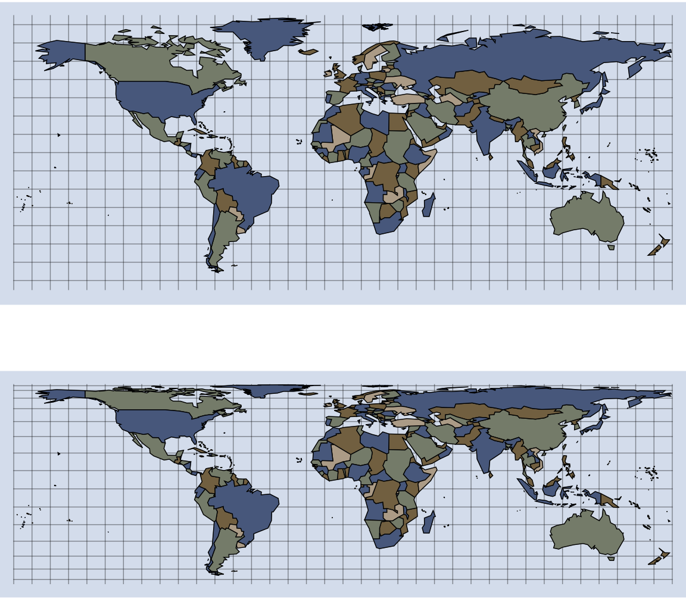{#fig-equiAndLambert fig-align="center"}
:::
::: {.content-visible when-format="pdf"}
{#fig-equiAndLambert fig-align="center"}
:::

There are *many, many* map projections. @fig-EckertIV illustrates just one more: the Eckert IV projection. I like it because it is pretty and requires a little numerical analysis to generate.

::: {.content-visible when-format="html"}
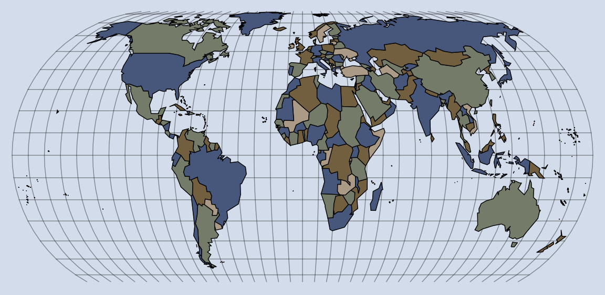{#fig-EckertIV fig-align="center"}
:::
::: {.content-visible when-format="pdf"}
{#fig-EckertIV fig-align="center"}
:::

### Two big questions

When dealing with a map there are two big questions that we should ask about the map. First, what properties does the map have? Does it represent equal areas in equal proportions? Does it properly represent distance to some central point? Does it represent direction in some canonical way? Second, what type of map projection is it? A proper understanding of map type will help us analyze the first question.

## Properties of maps

When considering what map to use for a particular purpose, you need to know what type of properties the map has. There are many properties that might be relevant to all sorts of questions but there are two major properties that we will consider here.

Is the map *equal area* (also called area preserving)? This means quite simply that areas are represented in their correct proportions. Mercator's projection shown in @fig-globeAndMap is *not* equal area. Greenland (with an area of about $2.2$ million square kilometers) looks larger than South America (with an area of about $17.8$ million square kilometers). Lambert's map, shown in @fig-equiAndLambert, is an equal area map.

Is the map *conformal*? This means that the map preserves angles. To understand this, suppose we have two paths on a globe that intersect at some angle. If we take the image of these paths under a conformal transformation, the angle will be the same. This is illustrated in @fig-conformal, where we see the image of two paths on the globe under Mercator's projection and the equi-rectangular projection. The angle is preserved under Mercator's projection but not under the equi-rectangular projection.

::: {.content-visible when-format="html"}
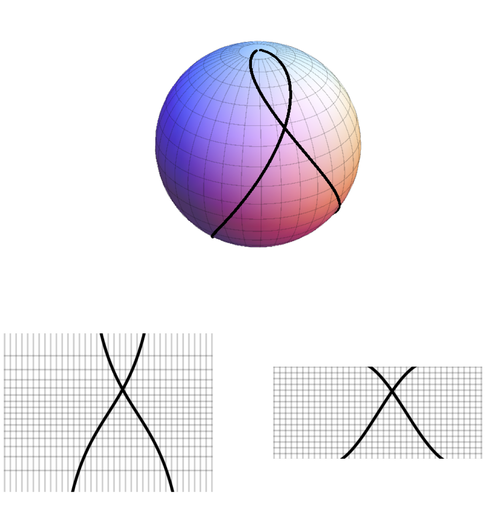{#fig-conformal fig-align="center"}
:::
::: {.content-visible when-format="pdf"}
{#fig-conformal fig-align="center"}
:::

## Cylindrical projections

If we want to understand the properties that a map has, it helps to first understand what type of map projection we are dealing with. Map projections are roughly classified into the types of surfaces that the globe is projected onto. We will focus first on cylindrical projections, but there are others.

### Geometrical motivation

Conceptually, a cylindrical projection can be visualized by wrapping a cylinder around a globe and projecting points on the globe out to the cylinder. Lambert's equal area projection is obtained quite literally from a geometric projection where each point on the globe is projected out radially from a line that goes through the North and South poles. This is illustrated in @fig-geometricLambert, and the final rectangular map is shown in the bottom of @fig-equiAndLambert. Using a little trigonometry, we can see why the formula for Lambert's equal area projection is $T(\varphi,\theta) = (\theta,\sin(\varphi))$. It should be noted that we assume the sphere has radius one for simplicity.

::: {.content-visible when-format="html"}
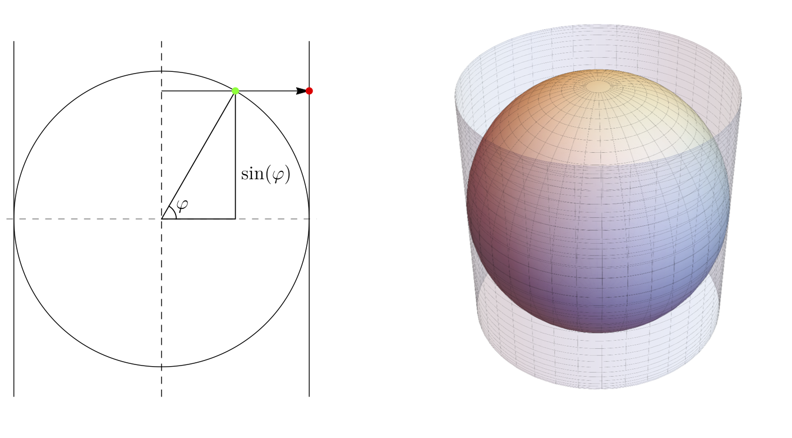{#fig-geometricLambert fig-align="center"}
:::
::: {.content-visible when-format="pdf"}
{#fig-geometricLambert fig-align="center"}
:::

In @fig-globeAndMap and @fig-equiAndLambert, we see the geometrical characteristics of all cylindrical map projections. Specifically, the cylindrical map projections are those map projections such that

- the parallels (paths of constant latitude) map to horizontal line segments of constant width, and
- the meridians (paths of constant longitude) map to vertical line segments of constant height.

### Algebraic characterization

The geometric characterization of cylindrical projections just presented leads to an algebraic form that a cylindrical projection must have. Specifically, a cylindrical projection must have the form $T(\varphi,\theta) = (\theta, h(\varphi))$. Here are several examples.

- Equi-rectangular: $T(\varphi,\theta) = (\theta,\varphi)$
- Lambert's equal area: $T(\varphi,\theta) = (\theta,\sin(\varphi))$
- Gnomonic: $T(\varphi,\theta) = (\theta,\tan(\varphi))$
- Mercator: $T(\varphi,\theta) = (\theta,\ln(|\sec(\varphi) + \tan(\varphi)|))$

## Scale factors

If we move from point $A$ to point $B$ on the globe, this induces a change of distance on the map. The corresponding scaling factor is simply the change in distance on the map divided by the change in distance on the globe. This simple idea is the key to understanding which geometrical properties are preserved by a map projection.

### Why?

To see why scale factors are so important to the understanding of geometric properties of transformations, we will focus on some particularly simple examples, namely the transformation of rectangles in the plane. In spite of the level of simplicity, the ideas generalize quite readily to our setting.

Suppose we want our transformation to be conformal, that is, it should preserve angles. In particular, if we draw a rectangle in the plane, the angle that the diagonal of the rectangle makes with either side should be preserved under the transformation. This situation is illustrated in @fig-conformalImage, where it becomes almost immediately apparent what property the transformation should have. *In order for a transformation to be conformal, it must scale equally in the horizontal and vertical directions.* This statement indicates that the equality of scaling factors is a *necessary* condition. It can be proved that it is also a *sufficient* condition. That is, if the transformation scales by the same amount in both the horizontal and vertical directions, then it will be conformal.

::: {.content-visible when-format="html"}
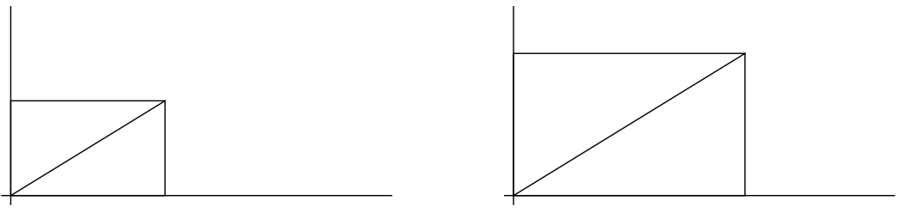{#fig-conformalImage fig-align="center"}
:::
::: {.content-visible when-format="pdf"}
{#fig-conformalImage fig-align="center"}
:::

Now suppose that we would like our transformation to preserve area. The transformation in @fig-conformalImage clearly does not preserve area, but the transformation in @fig-equalAreaImage does. Again, the figure indicates how to obtain the desired property. If we scale by the factor $M$ in one direction, we have to scale by the factor $1/M$ in the other. Thus, *in order for a transformation to be area preserving, the horizontal and vertical scaling factors must be reciprocals of one another*. This condition is again sufficient as well as necessary.

::: {.content-visible when-format="html"}
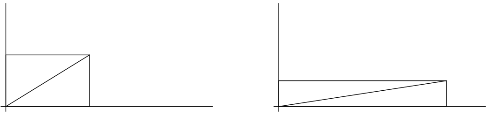{#fig-equalAreaImage fig-align="center"}
:::
::: {.content-visible when-format="pdf"}
{#fig-equalAreaImage fig-align="center"}
:::

### Scale factors for a cylindrical projection

When we apply these ideas to a cylindrical map projection, which of course maps a globe to a plane, we take the scale factors along a parallel and along a meridian to be the two cardinal directions. We denote these scaling factors by $M_{\varphi}$ and $M_{\theta}$ respectively. Thus, if we are at the point $(\varphi,\theta)$ on the globe, our cylindrical map projection will be conformal near that point if $M_{\varphi} = M_{\theta}$ there. A cylindrical map projection will be area preserving if $M_{\varphi} = 1/M_{\theta}$ there.

Suppose a point on the globe is at position $(\varphi,\theta)$. Consider the parallel through that point. On the globe, that parallel is a circle of radius $\cos(\varphi)$. Take another look at @fig-geometricLambert to convince yourself of this. Thus, the circumference of that parallel on the globe is $2\pi\cos(\varphi)$. Furthermore, this parallel maps to a line segment that stretches the whole width of the map, as shown in @fig-cylindricalScaleFactors. The length of that segment is $2\pi$. Thus the scaling factor along the parallel is a uniform

$$
M_{\varphi} = \frac{2\pi}{2\pi\cos(\varphi)} = \sec(\varphi).
$$

::: {.content-visible when-format="html"}
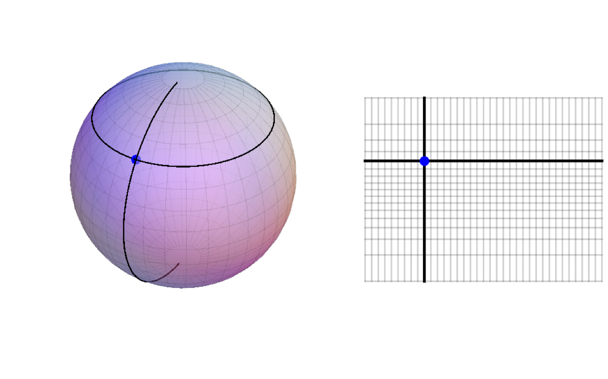{#fig-cylindricalScaleFactors fig-align="center"}
:::
::: {.content-visible when-format="pdf"}
{#fig-cylindricalScaleFactors fig-align="center"}
:::

Analysis of the scaling factor along a meridian is a little trickier. Recall that our cylindrical projection has the form $T(\varphi,\theta) = (\theta, h(\varphi))$. While $M_{\varphi}$ is uniform and depends only on $\varphi$, $M_{\theta}$ is not necessarily uniform and depends on the function $h$. Here is the key observation. Suppose we are at a point with latitude $\varphi$ and we increase the latitude a bit to $\varphi + t$. On the globe, we move a distance $t$. This follows from the definition of radian measure. On the map we move from the point $h(\varphi)$ to $h(\varphi + t)$. Thus our scaling factor is

$$
\frac{h(\varphi + t) - h(\varphi)}{t}.
$$

Of course, we are interested in the local scaling factor. Thus we take a limit as $t \to 0$ to obtain $h'(\varphi)$.

This pair of scaling factors is worth knowing. For a cylindrical map projection $T(\varphi,\theta) = (\theta, h(\varphi))$,

- the scaling factor $M_{\varphi}$ along a parallel is $\sec(\varphi)$, and
- the scaling factor $M_{\theta}$ along a meridian is $h'(\varphi)$.

## Application

We are now in a position to understand why Lambert's map in @fig-equiAndLambert is equal area and why Mercator's map in @fig-globeAndMap is conformal. In fact, the analysis is quite easy for both.

### Lambert's equal area map

Recall that the formula is $T(\varphi,\theta) = (\theta,\sin(\varphi))$. Thus, $M_{\theta} = \cos(\varphi)$ and $M_{\varphi} = \sec(\varphi)$. Since these are reciprocals, the projection is equal area. That is it.

### Mercator's projection

Let us now put ourselves in Mercator's shoes and ask: what function $h(\varphi)$ will force the cylindrical projection $T(\varphi,\theta) = (\theta, h(\varphi))$ to be conformal? We need $h'(\varphi) = \sec(\varphi)$. Thus, we should take

$$
h(\varphi) = \int_0^{\varphi} \sec(\phi)\, d\phi = \ln(|\sec(\varphi) + \tan(\varphi)|).
$$

There you are.

### Comments

When we present a contemporary analysis of a historical accomplishment, it can obscure the genius that went into the original work. It is easier to appreciate Mercator's work in 1569, for example, when you consider that logarithms were not known in Europe until Napier's publication in 1614 and the earliest publicized works in calculus appeared in the 1680s. Thus, Mercator clearly did not use the simple formula that we have derived here. Rather, he estimated the correct positions of the latitudes using a technique that essentially amounts to numerical integration. Not bad.

## Generalization

To this point, we have worked solely with cylindrical map projections, but there are many other types of projections. Rather than go through a detailed analysis for each different class, it should be possible to use a more general approach. After all, this is Calc III and we have developed some powerful tools such as partial derivatives and Jacobians for exactly this type of purpose.

### Equal area maps

If we want to understand the distortion of area under a map projection, it seems that we already have the perfect tool, namely the Jacobian. There is one little complication, though. The Jacobian measures the distortion of area of a transformation from a plane to a plane. Thus, if $T(\varphi,\theta) = (x(\varphi,\theta), y(\varphi,\theta))$, then the Jacobian $JT$ really measures the distortion from the equi-rectangular projection to the final projection. To measure the distortion from the globe to the final projection, we need to account for the intermediate distortion from the globe to the equi-rectangular projection. This is illustrated in @fig-distortionOfArea.

::: {.content-visible when-format="html"}
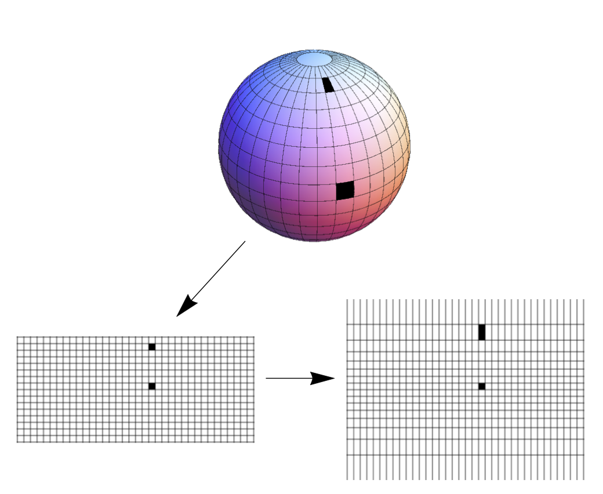{#fig-distortionOfArea fig-align="center"}
:::
::: {.content-visible when-format="pdf"}
{#fig-distortionOfArea fig-align="center"}
:::

Of course, we already know the scale factors from the globe to the equi-rectangular projection, namely $M_{\varphi} = \sec(\varphi)$ and $M_{\theta} = 1$. We simply multiply these to obtain the area distortion from the globe to the equi-rectangular projection. Then, we compute the area distortion from the equi-rectangular projection to the final projection and multiply this by $\sec(\varphi)$. Thus, *given a map projection* $T$, *the area distortion of* $T$ *from the globe to the map is* $\sec(\varphi)JT$. Recall that the Jacobian of $T(\varphi,\theta) = (x(\varphi,\theta), y(\varphi,\theta))$ is defined by

$$
JT =
\left|
\begin{array}{cc}
x_{\theta} & x_{\varphi} \\
y_{\theta} & y_{\varphi}
\end{array}
\right|.
$$

Note that I have chosen to differentiate in the order $\theta$ then $\varphi$ so that a positive Jacobian indicates preservation of orientation.

As an example, let us compute the area distortion in Mercator's projection, $T(\varphi,\theta) = (\theta, \ln(|\sec(\varphi) + \tan(\varphi)|))$. Recall that the second component $h(\varphi) = \ln(|\sec(\varphi) + \tan(\varphi)|)$ is chosen precisely so that $h'(\varphi) = \sec(\varphi)$. Thus,

$$
JT =
\left|
\begin{array}{cc}
1 & 0 \\
0 & \sec(\varphi)
\end{array}
\right|
= \sec(\varphi).
$$

Thus, the total area distortion in Mercator's projection is $\sec(\varphi)JT = \sec^2(\varphi)$.

More generally, we can compute the area distortion of an arbitrary cylindrical projection $T(\varphi,\theta) = (\theta, h(\varphi))$ to reprove the fact that $T$ will preserve area only if $h'(\varphi) = \cos(\varphi)$. See Exercise 8. The real power of this technique lies in the fact that it is applicable to other types of projections. Consider, for example, the sinusoidal projection $T(\varphi,\theta) = (\cos(\varphi)\theta, \varphi)$ shown in @fig-sinusoidal. This is an equal area, pseudo-cylindrical projection. Pseudo-cylindrical simply means that the parallels appear as horizontal line segments but not necessarily of equal length.

::: {.content-visible when-format="html"}
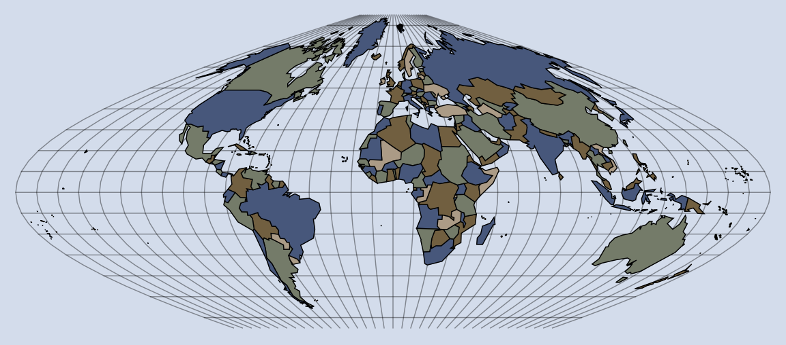{#fig-sinusoidal fig-align="center"}
:::
::: {.content-visible when-format="pdf"}
{#fig-sinusoidal fig-align="center"}
:::

To prove that the sinusoidal projection is equal area, we simply compute the area distortion factor:

$$
\sec(\varphi)JT =
\sec(\varphi)
\left|
\begin{array}{cc}
\cos(\varphi) & -\sin(\varphi)\theta \\
0 & 1
\end{array}
\right|
= \sec(\varphi)\cos(\varphi) = 1.
$$

Since this worked out to be one, area is indeed preserved.

### Conformal maps

To generalize the analysis of conformal maps that we applied to the cylindrical situation, we need to be able to compute the scaling factors $M_{\varphi}$ and $M_{\theta}$ for an arbitrary map projection $T(\varphi,\theta) = (x(\varphi,\theta), y(\varphi,\theta))$. We will do this using the partial derivatives $T_{\varphi} = (x_{\varphi}, y_{\varphi})$ and $T_{\theta} = (x_{\theta}, y_{\theta})$. It seems that the scaling factor $M_{\varphi}$ along a parallel, where the longitude $\theta$ is changing, should be $\|T_{\theta}\|$ and that the scaling factor $M_{\theta}$ along a meridian, where the latitude $\varphi$ is changing, should be $\|T_{\varphi}\|$. Of course, there is just a bit more to it than this. First, as with the area distortion analysis, we are interested in measuring the scaling factors from the *globe* to the final projection. Thus, the correct scaling factors are $M_{\varphi} = \sec(\varphi)\|T_{\theta}\|$ and $M_{\theta} = \|T_{\varphi}\|$. Second, equality of scaling factors is not quite enough to ensure conformality; you must independently verify that the angle between two cardinal directions is preserved as well. To see why, consider the function defined by $T(u,v) = (5u + 3v, 4v)$. This image of a rectangle under this function is illustrated in @fig-nongood. It is easy enough to show that $\|T_u\| = \|T_v\| = 5$, but the transformation clearly does not preserve angles. It *would* be conformal if just one angle were preserved, and it is easy enough to check the angle between the positive $x$ and $y$ directions using the dot product.

::: {.content-visible when-format="html"}
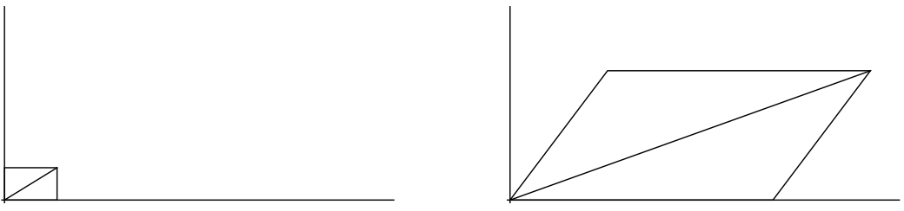{#fig-nongood fig-align="center"}
:::
::: {.content-visible when-format="pdf"}
{#fig-nongood fig-align="center"}
:::

Putting this all together, we obtain the following: *The general map projection* $T(\varphi,\theta) = (x(\varphi,\theta), y(\varphi,\theta))$ *will be conformal if and only if* $\sec(\varphi)\|T_{\theta}\| = \|T_{\varphi}\|$ *and* $T_{\varphi} \cdot T_{\theta} = 0$.

As an example, let us reprove the fact that Mercator's projection is conformal. Since $T(\varphi,\theta) = (\theta, \ln(|\sec(\varphi) + \tan(\varphi)|))$, we have $\sec(\varphi)\|T_{\theta}\| = \sec(\varphi)\|(1,0)\| = \sec(\varphi)$ and $\|T_{\varphi}\| = \|(0,\sec(\varphi))\| = \sec(\varphi)$. Thus, $\sec(\varphi)\|T_{\theta}\| = \|T_{\varphi}\|$. Furthermore, $T_{\varphi} \cdot T_{\theta} = (0,\sec(\varphi)) \cdot (1,0) = 0$. Thus, Mercator's projection is conformal by our new criterion.

### Polar, azimuthal projections

Again, the advantage of this generalization is its applicability to other families of map projections. In particular, we can apply this analysis to polar, azimuthal maps. Azimuthal is just a groovy word meaning *planar*. Conceptually, a polar, azimuthal projection can be visualized by placing a plane tangent to the globe at one pole and projecting the sphere onto this plane. This process is illustrated for an important projection called the *stereographic projection* in @fig-stereographic. In this projection, we draw a line from the south pole through a given point on the globe. The intersection of that line with the plane determines the location of the projected point.

::: {.content-visible when-format="html"}
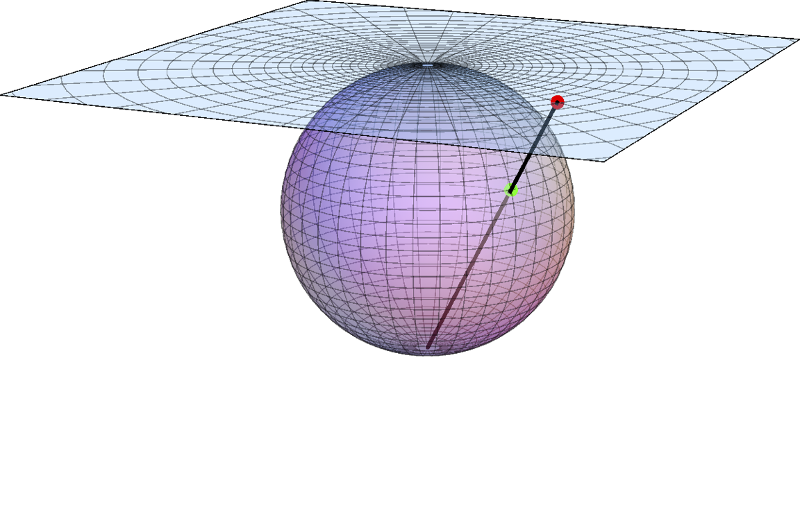{#fig-stereographic fig-align="center"}
:::
::: {.content-visible when-format="pdf"}
{#fig-stereographic fig-align="center"}
:::

As we can see in @fig-stereographic, the parallels have all mapped to concentric circles centered at the pole and the meridians have mapped to lines emanating from the pole. This implies that the algebraic form of a stereographic projection will be $T(\varphi,\theta) = r(\varphi)(\cos(\theta), \sin(\theta))$. The specific formula for the stereographic projection is $T(\varphi,\theta) = 2\tan\left(\frac{\pi}{4} - \frac{\varphi}{2}\right)(\cos(\theta), \sin(\theta))$. Let us use our newly developed tools to see if this projection is conformal. Well,

$$
T_{\varphi} = -\sec^2\left(\frac{\pi}{4} - \frac{\varphi}{2}\right)(\cos(\theta), \sin(\theta))
$$

and

$$
T_{\theta} = 2\tan\left(\frac{\pi}{4} - \frac{\varphi}{2}\right)(-\sin(\theta), \cos(\theta)).
$$

Thus, it is pretty easy to see that $T_{\varphi} \cdot T_{\theta} = 0$. It is a bit harder to show that $\sec(\varphi)\|T_{\theta}\| = \|T_{\varphi}\|$ but, since I have been using *Mathematica* to write this, I am going to use it to do some algebra. It is quite easy to show that $\|T_{\varphi}\| = \sec^2\left(\frac{\pi}{4} - \frac{\varphi}{2}\right)$ and that $\|T_{\theta}\| = 2\tan\left(\frac{\pi}{4} - \frac{\varphi}{2}\right)$. The tricky question is whether

$$
2\sec(\varphi)\tan\left(\frac{\pi}{4} - \frac{\varphi}{2}\right) = \sec^2\left(\frac{\pi}{4} - \frac{\varphi}{2}\right).
$$

The original LaTeX file embedded two Mathematica screenshots at this point, but those image files are not present in this directory. The same symbolic identity can be checked directly in [WolframAlpha](https://goo.gl/zCyP41).

The stereographic projection applied to the Northern hemisphere is shown in @fig-stereoMap.

::: {.content-visible when-format="html"}
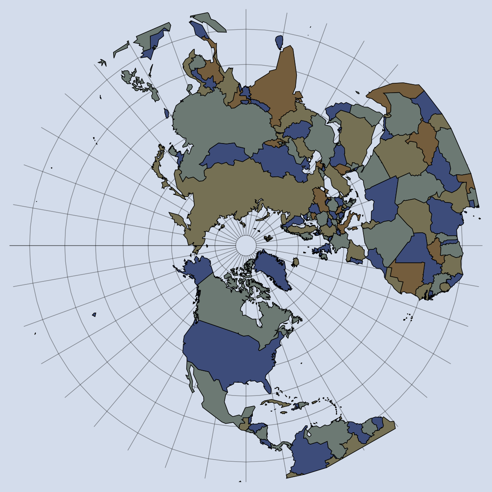{#fig-stereoMap fig-align="center"}
:::
::: {.content-visible when-format="pdf"}
{#fig-stereoMap fig-align="center"}
:::

### Conic projections

Conceptually, a conic projection is obtained by projecting a sphere onto a cone and then cutting the cone so that it lies flat on a plane, as shown in @fig-conicProjection. If the cone is tangent to the sphere, there will be one standard parallel along which there is no distortion of length. More often, the cone intersects the sphere along two parallels, which become standard parallels on the map. As a result, conic projections can achieve very small distortion along a large area in a temperate zone.

::: {.content-visible when-format="html"}
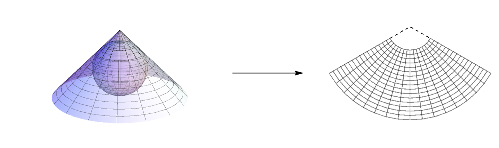{#fig-conicProjection fig-align="center"}
:::
::: {.content-visible when-format="pdf"}
{#fig-conicProjection fig-align="center"}
:::

Note that parallels map to circular arcs all centered at a common point $C$ that is usually off the map. The meridians map to radii of the parallels. This implies an algebraic form of a conic projection:

$$
\begin{aligned}
x &= \rho \sin\left(n(\theta - \theta_0)\right) \\
y &= \rho_0 - \rho \cos\left(n(\theta - \theta_0)\right)
\end{aligned}
$$

In these formulae, $\theta_0$ is the central meridian, $\rho_0$ is the distance between $C$ and the circular arc representing the North pole, and $n$ (called the cone constant) is the ratio of the angle between meridians and their true angle. Often, $\theta_0$ is chosen by the cartographer while $\rho_0$ and $n$ are determined by the desired properties of the map, such as the standard parallels.

Much of what we have learned in this document is immediately applicable to conic projections. In particular, the Jacobian can be used to check if a map is area preserving and, since meridians and parallels meet at right angles, a projection is conformal if and only if $\|T_{\varphi}\| = \|T_{\theta}\|$. Conic formulae are more involved than the cylindrical or azimuthal cases, making these computations more difficult.

#### Lambert's conformal conic

As its name implies, this is a conformal map projection obtained via the conic formula by choosing

$$
\begin{aligned}
n &= \frac{\log\left(\cos(\varphi_1)\sec(\varphi_2)\right)}{\log\left(\cot\left(\frac{\varphi_1}{2} + \frac{\pi}{4}\right)\tan\left(\frac{\varphi_2}{2} + \frac{\pi}{4}\right)\right)} \\
F &= \cos(\varphi_1)\tan^n\left(\frac{\varphi_1}{2} + \frac{\pi}{4}\right)/n \\
\rho_0 &= F\cot\left(\frac{\varphi_0}{2} + \frac{\pi}{4}\right) \\
\rho &= F\cot\left(\frac{\varphi}{2} + \frac{\pi}{4}\right)
\end{aligned}
$$

A particular example of Lambert's conformal conic using $\varphi_0 = 38^\circ$, $\varphi_1 = 32^\circ$, $\varphi_2 = 44^\circ$, $\theta_0 = -96^\circ$, and applied to the contiguous US is shown in @fig-lambertCC.

::: {.content-visible when-format="html"}
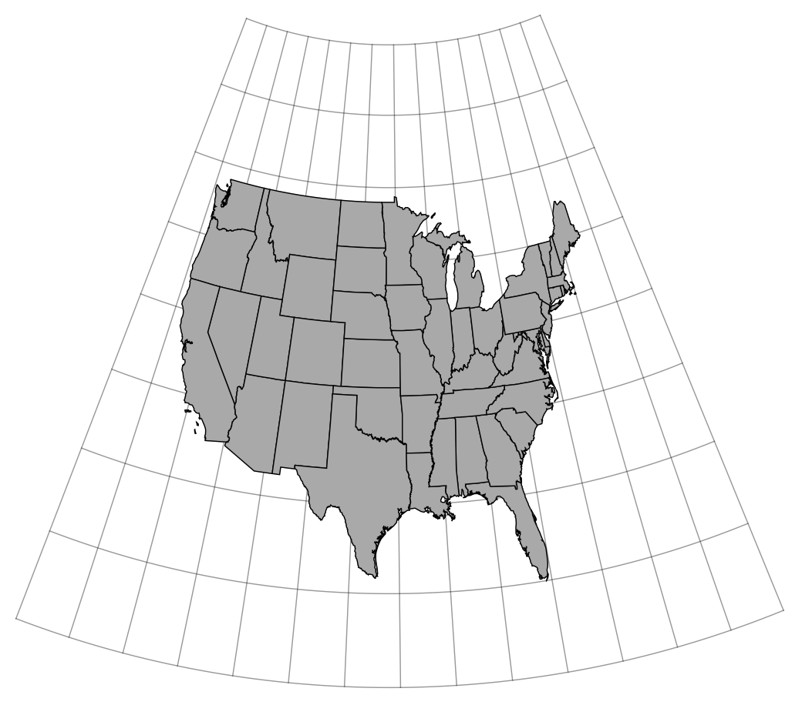{#fig-lambertCC fig-align="center"}
:::
::: {.content-visible when-format="pdf"}
{#fig-lambertCC fig-align="center"}
:::

## Exercises

### Exam type questions

1. The equi-rectangular projection is the cylindrical projection defined by $T(\varphi,\theta) = (\theta,\varphi)$. Compute the general distortion factors $M_p$ and $M_m$ for $T$ as functions of $\varphi$ and $\theta$. Use this to explain why the equi-rectangular projection is neither conformal nor equal area.
2. Mercator's projection is the cylindrical projection defined by $T(\varphi,\theta) = (\theta,\ln(|\sec(\varphi) + \tan(\varphi)|))$. Compute the general distortion factors $M_p$ and $M_m$ for $T$ as functions of $\varphi$ and $\theta$. Use this to prove that Mercator's projection is conformal.
3. Lambert's equal area, cylindrical projection is the cylindrical projection defined by $T(\varphi,\theta) = (\theta,\sin(\varphi))$. Compute the general distortion factors $M_p$ and $M_m$ for $T$ as functions of $\varphi$ and $\theta$. Use this to prove that Lambert's projection is equal area.
4. Prove that *every* cylindrical map projection satisfies $T_{\varphi} \cdot T_{\theta} = 0$.
5. Use @fig-sinusoidal to explain why the sinusoidal projection is *not* conformal.

### General questions

6. Compute the scaling factors $M_{\varphi}$ and $M_{\theta}$ in Asheville for both Mercator's projection and the equi-rectangular projection. How close is the equi-rectangular projection to being conformal here? How close is Mercator's projection to being area preserving here?
7. Prove that *every* polar azimuthal projection satisfies $T_{\varphi} \cdot T_{\theta} = 0$.
8. Use the Jacobian method to compute the area distortion of a general cylindrical projection and show that you obtain the same result we derived using just scaling factors.
9. New York and Barcelona lie very close to the same latitude, having the coordinates $74^\circ W$ by $41^\circ N$ and $2^\circ E$ by $41^\circ N$.

   a. On cylindrical or pseudo-cylindrical maps, the naive straight line between Barcelona and New York lies on the common parallel. What is the distance between the two cities along this parallel?

   b. What is the actual shortest distance between those two cities?

Hint: note that both curves are parts of circles.

10. An orthographic, polar, azimuthal projection can be described geometrically by projecting one hemisphere onto a plane, where we assume that the light source is at infinity, so all light rays strike the plane perpendicularly. This process is illustrated in @fig-ortho, and the resulting map of the Northern hemisphere is shown in @fig-orthoMap. You might compare this to the stereographic map shown in @fig-stereoMap.

    a. Find a formula $P(\varphi,\theta)$ for the projection.

    b. Find the linear distortion factors $M_{\varphi}$ and $M_{\theta}$ for this projection.

    c. Show that this projection is area preserving.

::: {.content-visible when-format="html"}
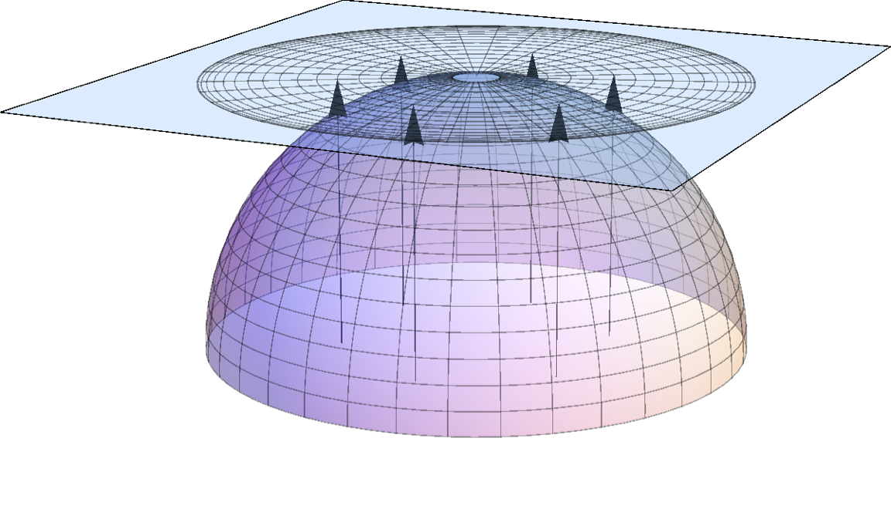{#fig-ortho fig-align="center"}
:::
::: {.content-visible when-format="pdf"}
{#fig-ortho fig-align="center"}
:::

::: {.content-visible when-format="html"}
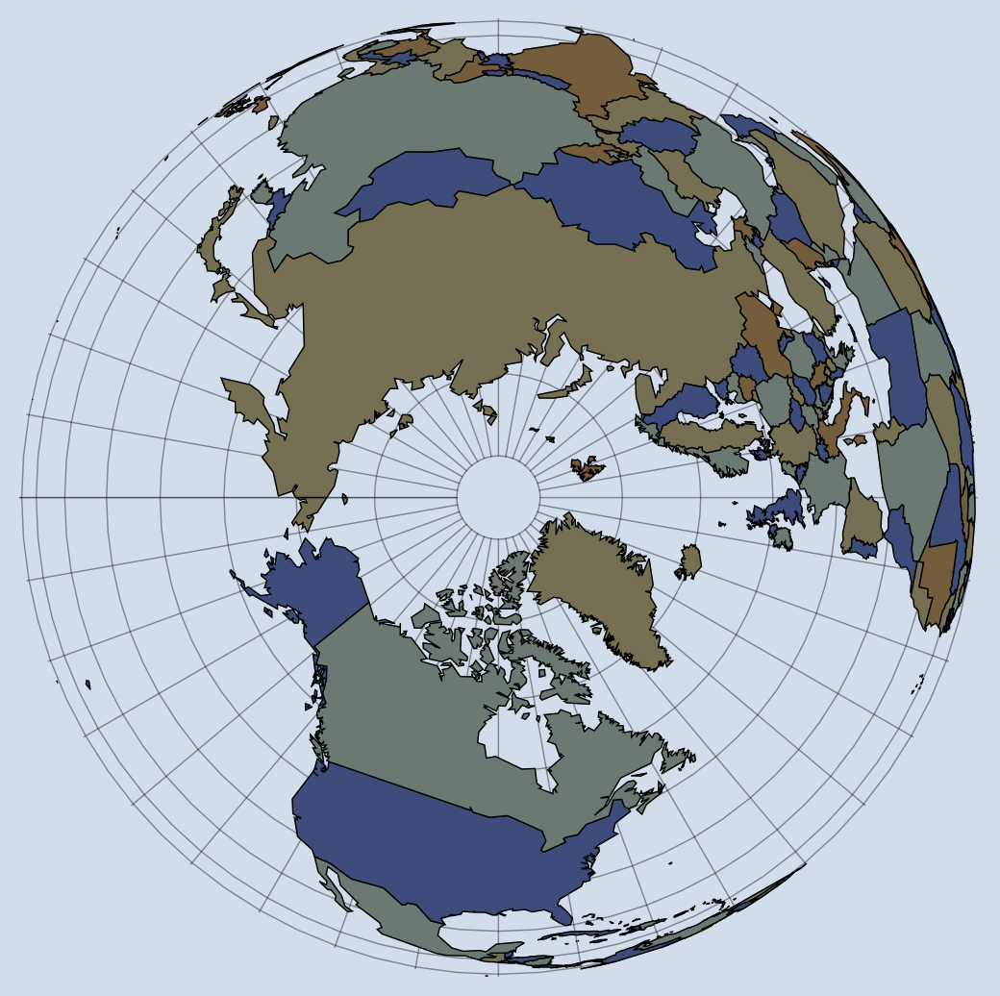{#fig-orthoMap fig-align="center"}
:::
::: {.content-visible when-format="pdf"}
{#fig-orthoMap fig-align="center"}
:::
