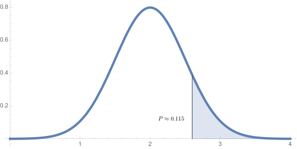
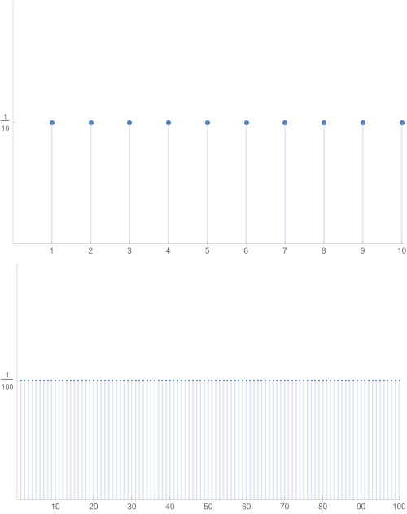
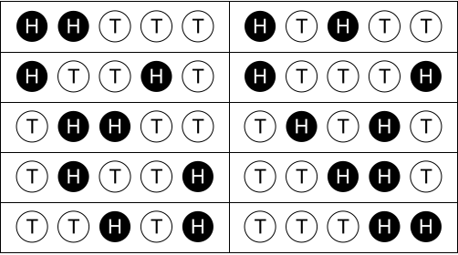
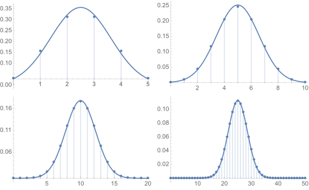
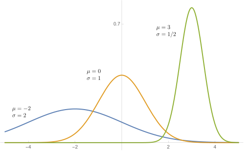
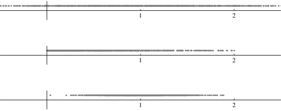

{#fig:aNormalIntegral}

A strong understanding of *data* has become highly valuable in today's world and data is analysed using statistics. Statistical models of data are built on top of so-called *distributions* and computations involving continuous distributions often involve computing the area under a curve. Not surprisingly, then, the theoretical and computational foundations of statistics really lie in calculus.

In this document, we'll take a look at what a distribution really is and how the so-called *normal distribution*, used so often in elementary statistics, arises in practice. We'll also see how computations performed by rote in an introductory statistics class really arise from basic integration. Using these techniques, we'll be able to answer questions arising in games of chance like

-   Suppose we flip a coin 20 times; what is the probability that we get
    more than 12 heads?

-   Suppose we roll a six-sided die 9 times; what is the probability that our sum total exceeds 20?

And we'll answer those questions in the same way that we approach data-based questions like

-  If 690 out of 1100 North Carolina voters surveyed plan to vote for Candidate A, what's the probability that Candidate A will  earn more than half the vote?

Continuous and discrete distributions {#continuous-and-discrete-distributions .unnumbered}
=====================================

The function shown in figure [1](#fig:aNormalIntegral){reference-type="ref" reference="fig:aNormalIntegral"} is an example of a *continuous distribution*. To understand this and how it relates to probabilistic computations, we should first examine a few simpler distributions.

Uniform distributions {#uniform-distributions .unnumbered}
---------------------

Suppose we pick a *real number* randomly from the interval $[0,1]$. What does that even mean? What is the probability we pick $1$ or $0.1234$ or $1/\pi$? What is the probability that our pick lies in the left half of the interval? One way to make sense of this is to suppose the probability that our pick lies in any particular interval is proportional to the length of that interval. This might make sense if, for example, we choose the number by throwing a dart at a number line while blindfolded. Then, the answer to our second question should be $1/2.$ The probability that our pick lies in the interval $[0,0.3]$ should be $3/10.$

More generally, we can express such a probability via integration against a probability density function. A *probability density function* is simply a non-negative function whose total integral is 1; i.e.

$$\int_{-\infty }^{\infty } f(x) \, dx=1.$$

In our example involving $[0,1]$ our probability density function would be

$$f(x)=\left\{
\begin{array}{cc}
 1 &  0\leq x\leq 1 \\
 0 & \text{else}.
\end{array}
\right.$$

Then, the probability that a point chosen from $[0,1]$ lies in the left half of the interval is

$$\int_0^{1/2} 1 \, dx=\frac{1}{2}.$$

The probability that we pick a number from the interval $[0,0.3]$ is the area of the darker, rectangular region shown in figure [2](#fig:uniformDist){reference-type="ref" reference="fig:uniformDist"}.

![The uniform distribution on $[0,1]$](Figure2.svg){#fig:uniformDist}

In some sense, this is a natural generalization of a discrete problem: Pick an integer between 1 and 10 uniformly and at random. In that case, it makes sense to suppose that each number has an equal probability $1/10$ of being chosen. The probability of choosing a $1$, $2$, or $3$ would be $1/10+1/10+1/10$ or $3/10$; this is called a *uniform discrete distribution*. The sub-rectangles indicated by the dashed lines in figure [2](#fig:uniformDist){reference-type="ref" reference="fig:uniformDist"} are meant to emphasize the relationship, since they all have area $1/10$. A discrete visualization of this is shown in the top of figure [3](#fig:aDiscretDistribution){reference-type="ref" reference="fig:aDiscretDistribution"}. The bottom of figure [3](#fig:aDiscretDistribution){reference-type="ref" reference="fig:aDiscretDistribution"} illustrates the uniform discrete distribution on the numbers $\{1,2,\ldots ,100\}$. Note how the continuous uniform distribution on $[0,1]$ shown in figure [2](#fig:uniformDist){reference-type="ref" reference="fig:uniformDist"} appears to be a limit of these discrete distributions, after rescaling.

{#fig:aDiscretDistribution}

Now suppose we pick an integer between $1$ and $1000$, all with equal probability $1/1000$. Then the probability of generating a number between $1$ and $314$ would be

$$\sum _1^{314} \frac{1}{1000}=\frac{314}{1000}=\int _0^{0.314}1dx.$$

I've included the integral here to emphasize the relationship with the continuous distribution. In a real sense, the continuous, uniform distribution on $[0,1]$ is a limit of discrete distributions.

A bell shaped distribution {#a-bell-shaped-distribution .unnumbered}
--------------------------

Next, we'll generate a bell shaped distribution. To do so, we generate an integer between $0$ and $10$ by flipping a coin 10 times and counting the number of heads. There are 11 possible outcomes, but they are not all equally likely. The probability of generating a zero is $1\left/2^{10}\right.=1/1024$, which is much smaller than $1/11$. This is because we must throw a tail on each throw and the throws are independent of one another. Since the probability of getting a tail on a single throw is $1/2$, the probability of getting 10 straight heads is $1\left/2^{10}\right.$. The probability of generating a 1 is $10\left/2^{10}\right.$, since the single head could occur on any of 10 possible throws; this probability is ten times bigger than the probability of a zero, yet still much smaller than $1/11$.

In a discrete math class or introductory statistics class, we would talk carefully about the binomial coefficients:

$$\left(
\begin{array}{c}
 n \\
 k
\end{array}
\right)=\frac{n!}{k!(n-k)!}.$$

This is read $n$ choose $k$ and represents the number of ways to choose $k$ objects from $n$ given objects. Thus, if we flip a coin $n$ times and want exactly $k$ heads, there are $n$ choose $k$ possible ways to be successful. If, for example, we flip the coin five times and want exactly two heads, there are

$$\left(
\begin{array}{c}
 5 \\
 2
\end{array}
\right)=\frac{5!}{2!(5-2)!}=10$$

ways to make this happen. These are all illustrated in figure [4](#fig:headsTails){reference-type="ref" reference="fig:headsTails"}. Note that each particular sequence of heads and tails has equal probability $1\left/2^5\right.$ of occurring. Thus, the probability of getting exactly 2 heads in five flips is $10/32 = 0.3125$.

{#fig:headsTails}

More generally, the probability of getting exactly $k$ heads in $n$ flips is

$$\left(
\begin{array}{c}
 n \\
 k
\end{array}
\right)\frac{1}{2^n}.$$

We can plot these numbers in a manner that is analogous to the uniform discrete distributions shown in figure [3](#fig:aDiscretDistribution){reference-type="ref" reference="fig:aDiscretDistribution"}; the result is shown in figure [5](#fig:binomialDistributions){reference-type="ref" reference="fig:binomialDistributions"}. Note that each discrete plot is accompanied by a continuous curve that approximates the points very closely. There is a particular formula for this curve that defines a continuous distribution, called a *normal distribution*. This continuous distribution is, in a natural sense, the limit of the discrete distributions when properly scaled. A basic understanding of the normal distribution is our primary objective here. We've got a bit more notation we'll have to slog through first, however.

{#fig:binomialDistributions}

Formalities {#formalities .unnumbered}
-----------

Let's try to write down some careful definitions for all this. The outcome of a random experiment (tossing a coin, throwing a dart at a number line, etc.) will be denoted by $X$. Probabilists would call $X$ a *random variable*. We can feel that we thoroughly understand $X$ if we know its *distribution*. The two broad classes of distributions we've seen to this point are *discrete* and *continuous* leading to discrete or continuous random variables.

### Discrete random variables {#discrete-random-variables .unnumbered}

A discrete random variable $X$ takes values on a discrete set, like $\{0,1,2,\ldots ,n\}$ and a discrete distribution is simply a list of non-negative probabilities, like $\left\{p_0,p_1,p_2,\ldots ,p_n\right\}$ associated with these that add up to one. The uniform discrete distribution, for example, takes all these probabilities to be the same. The binomial distribution weights the middle terms much more heavily. In either case, the probability that $X$ takes on some particular value $i$ is simply $p_i$. To compute the probability that $X$ takes on one of a set $S$ of values, we simply sum the corresponding $p_i$s, i.e. we compute

$$\sum _{i\in S} p_{i.}$$

### Continuous random variables {#continuous-random-variables .unnumbered}

A continuous random variable $X$ takes its values in an interval or even the whole real line $\mathbb{R}$. The distribution of $X$ is a non-negative function $f(x)$. To compute the probability that $X$ lies in some interval $[a,b]$, we compute the integral

$$\int _a^bf(x)dx.$$

Of course, a real valued random variable must take on *some* value. That is the probability of choosing some number must be one. Thus, we require that $$\int _{-\infty}^{\infty} f(x)dx = 1.$$

Measures of distributions {#measures-of-distributions .unnumbered}
=========================

There are two very general and important descriptive properties defined for distributions, namely the mean $\mu$ and standard deviation $\sigma$. We must understand these to understand how the normal distributions are related to the binomial distributions.

Mean and standard deviation for discrete random variables {#mean-and-standard-deviation-for-discrete-random-variables .unnumbered}
---------------------------------------------------------

As we've just described, if $X$ is a random variable taking on values $\{0,1,\ldots ,n\}$, its distribution is simply the list $\left\{p_0,p_1,\ldots ,p_n\right\}$ where $p_k$ indicates the probability that $X=k$. The *mean* $\mu$ of a distribution simply represents the weighted average of its possible values. We express this concretely as

$$\mu =\sum _k k \, p_k.$$

For example, if we choose a number $\{0,1,2,3,4\}$ uniformly (so each term has probability $p=1/5$), then the mean is

$$\mu =\frac{(0+1+2+3+4)}{5}=2,$$

exactly as we'd expect. The mean of the binomial distribution is also "near the middle" but distributions can certainly be weighted otherwise.

The binomial distribution is particularly useful for us, since we ultimately want to understand the normal distribution. Recall that a binomially distributed random variable is constructed by flipping a coin $n$ times and counting the number of heads. If we flip a coin once, we generate either a zero or a one with probability $1/2$ each. Thus, the mean of one coin flip is $1/2$. If we add random variables, then their means add. Thus, the mean of the binomial distribution with $n$ flips is $n/2$. This reflects the fact that we expect to get a head about half the time. In fact, the mean is often referred to as the *expectation*. In this context, the expectation of the random variable $X$ is written as $E(X)$.

*Standard deviation* $\sigma$, and its square the *variance* $\sigma ^2$, both measure the dispersion of the data; the larger the value of $\sigma$, the more spread out the data. They're quite similar conceptually but sometimes one is more easy to work with than the other. The variance of a random variable with mean $\mu$ is defined by

$$\sigma ^2=\sum _k (k-\mu )^2 p_k.$$

Note that the expression $k-\mu$ is the (signed) difference between the particular value and the average value. We want to measure how large this is on average so we take the weighted average. It makes sense to square first, since we don't want the signs to cancel.

The variance of our coin flip example is

$$\sigma ^2=\left(0-\frac{1}{2}\right)^2\frac{1}{2}+\left(1-\frac{1}{2}\right)^2\frac{1}{2}=\frac{1}{4}.$$

It follows that the standard deviation is $\sigma =1/2$. If we add random variables, then their variances add. Thus, the variance of the binomial distribution with $n$ flips is $n/4$ and its standard deviation is $\left.\sqrt{n}\right/2$.

Mean and standard deviation for continuous random variables {#mean-and-standard-deviation-for-continuous-random-variables .unnumbered}
-----------------------------------------------------------

The mean, standard deviation, and variance of continuous probability distributions can be defined an a way that is analogous to discrete distributions. The main difference is that we use integration, rather than summation, to define these. Of course, the definite integral is defined as a limit of sums and definite integration is often thought of as a continuous analog of summation. So, perhaps, this will help this all make some sense.

Specifically, the mean $\mu$ and variance $\sigma^2$ are defined by

$$\mu  = \int _{-\infty }^{\infty }x p(x)dx$$

and

$$\sigma ^2 = \int _{-\infty }^{\infty }(x-\mu )^2p(x)dx.$$

As with discrete distributions, the standard deviation is the square root of the variance.

Suppose, for example that $X$ is uniformly distributed on the interval $[a,b]$. Thus, $X$ has distribution

$$p(x)=\left\{
\begin{array}{cc}
 \frac{1}{b-a} & a\leq x\leq b \\
 0 & \text{else}.
\end{array}
\right.$$

Then, we can compute the mean as follows:

$$\left.\frac{1}{b-a}\int_a^b x \, dx=\frac{1}{b-a}\frac{1}{2}x^2\right|_a^b=\frac{1}{2(b-a)}\left(b^2-a^2\right)=\frac{a+b}{2}.$$

This is, of course, exactly what we'd expect. In your homework, you'll show that $\sigma ^2=\left.(b-a)^2\right/12$. Note that the larger the interval, the larger the variance.

The normal distribution {#the-normal-distribution .unnumbered}
=======================

The most widely used distribution in all of elementary statistics is certainly the *normal distribution*. In this section, we'll take a look at its true, mathematical definition as a formula involving the exponential and we'll see how to deal with integrals involving that formula.

Definition {#definition .unnumbered}
----------

The formula for the normal distribution with mean $\mu$ and standard deviation $\sigma$ is

$$\label{eq:normalDistribution}
p(x)=\frac{1}{\sqrt{2 \pi } \sigma }e^{-(x-\mu )^2/\left(2\sigma ^2\right)}.$$

The graphs of several normal distributions are shown in figure [8](#fig:normalDistributions){reference-type="ref" reference="fig:normalDistributions"}. [Here's an interactive version as well:]{.content-visible when-format="html"}

::: {.content-visible when-format="html"}

<iframe src="https://www.desmos.com/calculator/kwuwkqokdb?embed" width="800" height="500" style="border: 1px solid #ccc" frameborder=0></iframe>

:::

When $\mu =0$ and $\sigma =1$ we get the *standard normal*. Thus, the probability distribution of the standard normal is

$$p(x)=\frac{1}{\sqrt{2 \pi }}e^{\left.-x^2\right/2}.$$

The standard normal is symmetric about the vertical axis in figure [8](#fig:normalDistributions){reference-type="ref" reference="fig:normalDistributions"}.

{#fig:normalDistributions}

Interpretation as probability {#interpretation-as-probability .unnumbered}
-----------------------------

Let's make sure we understand how this crazy looking $e^{-(x-\mu)^2/(2\sigma^2)}/(\sqrt{2\pi}\sigma)$ function is related to probability. Suppose that we have a random variable $X$ that is normally distributed with mean $70$ and standard deviation $\sigma = 10$. Suppose we're curious to know the probability that a value generated by $X$ lies in the interval between $65$ and $80$. In symbols, we want to know $P(65<X<80)$.

The point behind the normal distribution function is that we can express $P(65<X<80)$ as
$$
P(65<X<80) = \frac{1}{\sqrt{2\pi}\,10} \int_{65}^{80} e^{-(x-70)^2/(2\times10^2)}\,dx.
$$

Now, how you might actually compute such an integral is another matter!

Relating normal distributions {#relating-normal-distributions .unnumbered}
-----------------------------

Any normal distribution is related to the standard normal distribution because changing $\mu$ or $\sigma$ changes the graph of a normal distribution in predictable ways. A change of $\mu$ simply shifts the graph to the left or right; this changes the mean of the distribution, which is located where the maximum occurs. Reducing the size of $\sigma$ increases the maximum value and concentrates the graph about that maximum value.

A major challenge in dealing with the normal distribution is that *it has no elementary anti-derivative*! Elementary statistics courses get around this by providing a table of numerically computed values of

$$
  p(x)=\frac{1}{\sqrt{2 \pi}}\int_0^b e^{\left.-x^2\right/2}dx.
$$

From that information, one can immediately compute all sorts of integrals involving the standard normal. For example,

$$
  \frac{1}{\sqrt{2 \pi }}\int_{-1}^2 e^{\left.-x^2\right/2} \, dx = \frac{1}{\sqrt{2 \pi}}\int_0^1 e^{\left.-x^2\right/2} \, dx +\frac{1}{\sqrt{2 \pi }}\int_0^2e^{\left.-x^2\right/2}dx
$$

and both of the integrals on the right can be computed from the table. Furthermore, integrals involving *any* normal distribution can be computed in terms of the standard normal. While the trick is described in an elementary statistics class, it ultimately boils down to the following formula:

$$\frac{1}{\sqrt{2\pi }\sigma }\int_a^b e^{-\frac{(x-\mu )^2}{2\sigma ^2}} \, dx=\frac{1}{\sqrt{2\pi }}\int _{(a-\mu )/\alpha }^{(b-\mu )/\sigma
}e^{\left.-x^2\right/2}dx.$$

Let's use $u$-substitution to verify this. Let $u=(x-\mu )/\sigma$ so that $du = \frac{1}{\sigma} dx$. Then,

$$\begin{aligned}
\frac{1}{\sqrt{2\pi }\sigma }\int_a^b e^{-\frac{(x-\mu )^2}{2\sigma ^2}} \, dx &= 
\frac{1}{\sqrt{2\pi }}\int_a^b e^{-\frac{1}{2}\left(\frac{x-\mu}{\sigma}\right)^2} \, \frac{1}{\sigma}dx \\ 
&= \frac{1}{\sqrt{2\pi }}\int_{(a-\mu)/\sigma}^{(b-\mu)/\sigma} e^{-u^2/2}\,du.
\end{aligned}$$

We'll see several explicit examples illustrating how to use this in the context of a problem as we move through the document.


Obtaining numerical estimates {#obtaining-numerical-estimates .unnumbered}
-----------------------------

So, just how *do* we compute an integral like 
$$
\frac{1}{\sqrt{2\pi}10} \int_{65}^{80} e^{-(x-70)^2/(2\times10^2)}\,dx
$$
to, thereby, evaluate $P(65<X<80)$?

First, recall that we *know* that there's no elementary formula for an antiderivative of the normal distribution. So, ultimately, the computation has to boil down to numerical approximation. That is, our answer won't look like $1/\sqrt{\pi}$ or something like that, though, it could look like $0.56419$.

There are two fundamental approaches this problem:

- Use a numerical integrator or
- Translate the integral to the integral of the *standard* normal and, then, look up the result in a table of standard normal integrals.

For calculus students, it's worth understanding both techniques and, in particular, how the two methods are related.

### Numerical integration 

Numerical integration, quite generally, is the art of obtaining numerical estimates for definite integrals - a topic of tremendous importance in its own right. It might seem that we are are "just" asking the computer for the numerical value. To be clear, though, there's plenty of mathematical theory lurking in the background. Details behind these kinds of algorithms are discussed in most introductory courses in Numerical Analysis.

Here's some code in the Python programming language that uses the numerical libraries NumPy and SciPy to obtain a good numerical estimate to our integral of interest:

::: {.content-visible when-format="html"}

<div class="sage">
<script type="text/x-sage">
from numpy import pi, exp, sqrt
from scipy.integrate import quad
def f(x):
  return exp(-(x-70)**2/(2*10**2))/(sqrt(2*pi)*10)
quad(f, 65, 80)
</script>
</div>

:::

::: {.content-visible when-format="pdf"}

```{python}
from numpy import pi, exp, sqrt
from scipy.integrate import quad
def f(x):
  return exp(-(x-70)**2/(2*10**2))/(sqrt(2*pi)*10)
quad(f, 65, 80)
```

:::

Note that the result is a `(val, err)` pair, where `val` is the value of the estimate and `err` is an error estimate, i.e. an upper bound on how far off `val` is from the actual value. The SciPy `quad` function obtains its name from [quadrature](https://en.wikipedia.org/wiki/Quadrature_(geometry)), the ancient art of finding a square with the same area as a given plane figure.


### Using a normal table

The other alternative is to use $u$-substitution to translate your integral to a standard normal and then look up the value of that standard normal in a normal table. This is the technique that's typically taught in an introductory statistics class. Ultimately, though, the standard normal table is computed using a numerical integrator and understanding the relationship between the methods is really only attainable with a good knowledge of calculus.

The [appendix of this document](#a-standard-normal-table) contains a table of integrals for the standard normal; probabilities arising from all types of normal distributions can be computed using the techniques described here. Ultimately, though, the values in the table are all computed numerically. Thus, with a solid understanding of calculus, it probably makes sense to simply use a numerical integrator in the first place.

Let's illustrate how we could compute the previous example 
$$
\frac{1}{\sqrt{2\pi}10} \int_{65}^{80} e^{-(x-70)^2/(2\times10^2)}\,dx
$$
using a normal table.

- **Step 1**: Convert the integral to a standard normal integral with the substitution $u=(x-\mu)/\sigma$. In this particular case, $\mu=70$ and $\sigma=10$. Thus, our integral becomes
$$\begin{aligned}
\frac{1}{\sqrt{2\pi}\,10}\int_{65}^{80} e^{-(x-70)^2/(2\times10^2)} \, dx &= 
\frac{1}{\sqrt{2\pi}}\int_{65}^{80} e^{-\frac{1}{2}\left(\frac{x-70}{10}\right)^2} \, \frac{1}{10}dx \\ 
&= \frac{1}{\sqrt{2\pi}}\int_{(65-70)/10}^{(80-70)/10} e^{-u^2/2} \, du \\ 
&= \frac{1}{\sqrt{2\pi}}\int_{-1/2}^{1} e^{-u^2/2} \, du = P(-1/2 < Z < 1).
\end{aligned}$$

- **Step 2**: Look up the endpoint values in a standard normal integral (like the [one in our appendix](#a-standard-normal-table)) and subtract. In this particular case, we find that  
$P(Z < -0.5) \approx 0.3085$ and $P(Z < 1) \approx 0.8413$. Thus,
$$\begin{aligned}
\frac{1}{\sqrt{2\pi}10} \int_{65}^{80} e^{-(x-70)^2/(2\times10^2)}\,dx &= P(65 < X < 80) \\ 
  &= P(-1/2 < Z < 1) = P(Z < 1) - P(Z < -0.5) \\ &\approx 0.8413 - 0.3085 = 0.5328.\end{aligned}$$


The central limit theorem {#the-central-limit-theorem .unnumbered}
-------------------------

There are two big theorems in probability theory - the law of large numbers and the central limit theorem; it is the second of these that explains the importance of the normal distribution. Both deal with a sequence of independent random variables $X_1,X_2,\ldots$ that all have the same distribution. The law of law large numbers simply states that, if each $X_i$ has mean $\mu$, then

$$\bar{X}_n=\frac{X_1+X_2+\cdots +X_n}{n}$$

is almost certainly close to $\mu$. That is, flip a coin a bunch of times and it will come up heads around half the time.

The central limit theorem states more precise information about the distribution of $\bar{X}_n$. Technically, the central limit theorem states that if each $X_i$ has mean $\mu$ and standard deviation $\sigma$, then the random variable $\sqrt{n}\left(\bar{X}_n-\mu \right)$ converges to the normal distribution with mean $0$ and standard deviation $\sigma$. In practice this means that we can approximate $S_n=X_1+X_2+\cdots +X_n$ using a normal distribution. Now the mean of $S_n$ will be $n \mu$ and its standard deviation will be $\sqrt{n}\sigma$. Thus, we must approximate using the normal distribution with this same mean and standard deviation. That is

$$\label{eq:centralLimitNormalIntegral}
p(x)=\frac{1}{\sqrt{2n \pi }\sigma }e^{-(x-n \mu )^2/\left(2n \sigma ^2\right)}.$$

It is important to understand that the distributions of the $X_i$ play no role here; all that is important is that they be independent and have the same distributions. Thus, no matter what the distribution of the original $X_i$s, their average will be approximately normal!

Examples {#examples .unnumbered}
========

Here are a few more examples illustrating the types of computations described in this document. The integrals must be worked out numerically and the text includes Python code (using NumPy/SciPy) to accomplish this, though there are plenty of good numerical integrators.

Note that NumPy represents mathematical $\infty$ as `inf`. This is particularly convenient when computing normal integrals because we often have $\infty$ or $-\infty$ as a bound of integration. If you're using a numerical integrator that doesn't recognize $\pm\infty$, you should be safe going four or more standard deviations past the mean.

Coin flipping {#coin-flipping .unnumbered}
-------------

Suppose we flip a coin 99 times. What is the probability that we get fewer than 47 heads?

*Solution*: As we've seen, the mean and standard deviation of a single coin flip are both $1/2$. By the central limit theorem, the sum of $n$ coin flips is approximately normally distributed with mean and standard deviation $n/2$ and $\left.\sqrt{n}\right/2$ respectively. Taking $n=99$, we find that we should evaluate the following integral.

$$\int _{-\infty }^{46.5}\frac{2}{\sqrt{2\ 99\pi }}e^{\left.-(x-99/2)^2\right/(2 99/4)}dx$$

The upper bound of $46.5$, rather than $47$ arises as an adjustment to relate the discrete and continuous distributions. This integral *must* be evaluated numerically; we can do so with Python as follows:

::: {.content-visible when-format="html"}

<div class="sage">
<script type="text/x-sage">
from numpy import pi, exp, sqrt, inf
from scipy.integrate import quad
def f(x):
  return 2*exp(-((x-99/2)**2)/(2*99/4))/sqrt(2*99*pi)
quad(f, -inf, 46.5)
</script>
</div>

:::

::: {.content-visible when-format="pdf"}

```{python}
from numpy import pi, exp, sqrt, inf
from scipy.integrate import quad
def f(x):
  return 2*exp(-((x-99/2)**2)/(2*99/4))/sqrt(2*99*pi)
quad(f, -inf, 46.5)
```

:::

This particular example can also be done using the binomial distribution. In fact, the answer is *exactly*
$$
\frac{1353597022728323255915530247}{4951760157141521099596496896}
$$

The normal integral is an approximation, but it is a very good one. The difference between the previous two computations is about $0.000109944$.

The real power of using the normal distribution arises when we have a very large number of trials - as might happen in a problem in statistical mechanics. For example, what's the probability of getting fewer than $500001000$ heads in $1000000000$ tosses? The binomial approach has half a billion complicated terms in the sum, which might not be practical to compute. The normal integration approach is no harder than it was in the previous example, though. We still need to compute the integral with a numerical integrator:

::: {.content-visible when-format="html"}

<div class="sage">
<script type="text/x-sage">
from numpy import pi, exp, sqrt
from scipy.integrate import quad
n = 10**9
b = 500001000.5
def f(x):
  return 2*exp(-(x-n/2)**2/(2*n/4))/sqrt(2*n*pi)
res, err = quad(f, 500000000, 500001000.5)
0.5 + res
</script>
</div>

:::

::: {.content-visible when-format="pdf"}

```{python}
from numpy import pi, exp, sqrt
from scipy.integrate import quad
n = 10**9
b = 500001000.5
def f(x):
  return 2*exp(-(x-n/2)**2/(2*n/4))/sqrt(2*n*pi)
res, err = quad(f, 500000000, 500001000.5)
0.5 + res
```

:::

Can you see how starting at the mean and adding $0.5$ is equivalent to starting at $-\infty$?

Dice {#dice .unnumbered}
----

Suppose we roll $100$ six sided die; what are the odds that our sum total is at least 400?

We can solve this problem by modeling it with a normal distribution. To do so, we first compute the mean and variance associated with one roll of a die. We can then use the additivity of mean and variance to extend that to 100 rolls.

For one roll of a die, the distribution is simply $p_1=p_2=p_3=p_4=p_5=p_6=1/6$. Thus, we can compute $\mu$ and $\sigma$ as follows.

$$\begin{aligned}
  \mu &= \sum_{k=1}^{6}\frac{k}{6} = \frac{7}{2} \\
  \sigma^2 &= \sum_{k=1}^6 (k-7/2)^2/6 = \frac{35}{12}
\end{aligned}$$

If we roll 100 such dice, then the outcome is approximately normal with mean $100\mu$ and standard deviation $10\sigma$. Thus, the density function is
$$
\frac{1}{\sqrt{2\pi }10\sigma} e^{-(x-100\mu )^2/\left(200\sigma ^2\right)},
$$
where $\mu$ and $\sigma$ are already defined. Thus the probability that our sum is at least 400 is

$$\frac{1}{\sqrt{2\pi }10\sigma }\int_{399.5}^{\infty}e^{-(x-100\mu )^2/\left(200\sigma ^2\right)} dx \approx 0.00187522.$$


::: {.content-visible when-format="html"}

<div class="sage">
<script type="text/x-sage">
from numpy import pi, exp, sqrt, inf
from scipy.integrate import quad
m = 7/2
s = sqrt(35/12)
def f(x):
  return exp(-(x-100*m)**2/(200*s**2))/(sqrt(2*pi)*10*s)
quad(f, 399.5, inf)
</script>
</div>

:::

::: {.content-visible when-format="pdf"}

```{python}
from numpy import pi, exp, sqrt, inf
from scipy.integrate import quad
m = 7/2
s = sqrt(35/12)
def f(x):
  return exp(-(x-100*m)**2/(200*s**2))/(sqrt(2*pi)*10*s)
quad(f, 399.5, inf)
```

:::


Problems {#problems .unnumbered}
========

1.  Referring to the table of standard normal integrals on the last page, compute the following.

    (a) $\displaystyle \frac{1}{\sqrt{2\pi }}\int_0^{1.3} e^{\left.-x^2\right/2} \, dx$

    (b) $\displaystyle \frac{1}{\sqrt{2\pi }}\int_{-0.4}^{1.3} e^{\left.-x^2\right/2} \, dx$

    (c) $\displaystyle \frac{1}{\sqrt{2\pi }}\int_{0.4}^{1.3} e^{\left.-x^2\right/2} \, dx$

2.  Using $u$-substitution, convert the following normal integrals into standard normal integrals. Then evaluate the integral using the table on the last page or your favorite numerical integrator.

    (a) $\displaystyle \frac{1}{\sqrt{2\pi }2}\int_0^1 e^{\left.-(x-1)^2\right/8} \, dx$

    (b) $\displaystyle \frac{1}{\sqrt{2\pi }4}\int_{12}^{18} e^{\left.-(x-10)^2\right/32} \, dx$

3.  Given that
    $$\frac{1}{\sqrt{2\pi }}\int_0^{\infty } e^{\left.-x^2\right/2} \, dx=\frac{1}{2},$$

    show that

    $$\frac{1}{\sqrt{2\pi }\sigma }\int_{\mu }^{\infty } e^{-(x-\mu )^2/\left(2\sigma ^2\right)} \, dx=\frac{1}{2},$$

    for all $\mu \in \mathbb{R}$ and $\sigma >0$.

4.  Below we see three probability distributions. I used each of these to generate 100 points and plotted the results in figure
    [11](#fig:scatter){reference-type="ref" reference="fig:scatter"}.
    Match the distribution functions with the point plots.

    (a) $\displaystyle \frac{1}{\sqrt{2\pi }0.3}e^{-\frac{(x-1)^2}{2\cdot 0.3^2}}$
        over $(-\infty ,\infty )$

    (b) $\displaystyle \frac{1}{\sqrt{2\pi }0.7}e^{-\frac{(x-1)^2}{2\cdot 0.7^2}}$
        over $(-\infty ,\infty )$

    (c) $\displaystyle \frac{\log (5)}{24}5^{2-x}$ over $[0,2]$

5.  For each of the following functions, find the constant $c$ that makes the function a probability distribution over the specified interval.

    (a) $c x(x-1)$ over $[0,1]$

    (b) $c 2^x$ over $[0,\infty ]$

    (c) $c \sqrt{1-(x-1)^2}$ over $[0,2]$

6.  Compute the mean $\mu$ and standard deviation $\sigma$ of the following distributions.

    (a) The uniform distribution over $[a,b]$

    (b) The exponential distribution $p(x)=e^{-x}$ over $[0,\infty ]$

    (c) The standard normal distribution

7.  Suppose we flip a coin 1000 times. Use a normal integral to find the probability that you get more than 666 heads.

8.  Suppose we roll a standard six sided die 12 times. Use a normal integral to find the probability that your rolls total more than 50.

9.  Suppose we roll a fair 10 sided die 10 times. Use a normal integral to find the probability that your rolls total more than 60.

{#fig:scatter}

\newpage

A standard normal table {#a-standard-normal-table .unnumbered}
=======================

You can use the table below to compute values of standard normal integrals.


::: {.content-visible when-format="html"}

```{ojs}
//|echo: false
viewof cumulation_type = Inputs.radio([0, 1], {
  label: "Cumulative from:",
  format: (v) => (v == 0 ? "zero" : "-Infinity"),
  value: 1
})
```

```{ojs}
//|echo: false
make_normal_table(cumulation_type)
```

```{ojs}
//|echo: false
import {make_normal_table} from '@mcmcclur/simple-normal-table'
```
:::

::: {.content-visible when-format="pdf"}

\newpage

\begin{tabular}{| rrrrr | rrrrr | c}
  \cline{1-10}
&&& \multicolumn{4}{c}{Second decimal place of $Z$} &&& \\
  \cline{1-10}
0.09 &  0.08 &  0.07 &  0.06 &  0.05 &  0.04 &  0.03 &  0.02 &  0.01 &  0.00 & $Z$  \\
  \hline
  \hline
\footnotesize{0.0002} & \footnotesize{0.0003} & \footnotesize{0.0003} & \footnotesize{0.0003} & \footnotesize{0.0003} & \footnotesize{0.0003} & \footnotesize{0.0003} & \footnotesize{0.0003} & \footnotesize{0.0003} & \footnotesize{0.0003} & $-3.4$ \\
  \footnotesize{0.0003} & \footnotesize{0.0004} & \footnotesize{0.0004} & \footnotesize{0.0004} & \footnotesize{0.0004} & \footnotesize{0.0004} & \footnotesize{0.0004} & \footnotesize{0.0005} & \footnotesize{0.0005} & \footnotesize{0.0005} & $-3.3$ \\
  \footnotesize{0.0005} & \footnotesize{0.0005} & \footnotesize{0.0005} & \footnotesize{0.0006} & \footnotesize{0.0006} & \footnotesize{0.0006} & \footnotesize{0.0006} & \footnotesize{0.0006} & \footnotesize{0.0007} & \footnotesize{0.0007} & $-3.2$ \\
  \footnotesize{0.0007} & \footnotesize{0.0007} & \footnotesize{0.0008} & \footnotesize{0.0008} & \footnotesize{0.0008} & \footnotesize{0.0008} & \footnotesize{0.0009} & \footnotesize{0.0009} & \footnotesize{0.0009} & \footnotesize{0.0010} & $-3.1$ \\
  \footnotesize{0.0010} & \footnotesize{0.0010} & \footnotesize{0.0011} & \footnotesize{0.0011} & \footnotesize{0.0011} & \footnotesize{0.0012} & \footnotesize{0.0012} & \footnotesize{0.0013} & \footnotesize{0.0013} & \footnotesize{0.0013} & $-3.0$ \\
    \hline
    \hline
  \footnotesize{0.0014} & \footnotesize{0.0014} & \footnotesize{0.0015} & \footnotesize{0.0015} & \footnotesize{0.0016} & \footnotesize{0.0016} & \footnotesize{0.0017} & \footnotesize{0.0018} & \footnotesize{0.0018} & \footnotesize{0.0019} & $-2.9$ \\
  \footnotesize{0.0019} & \footnotesize{0.0020} & \footnotesize{0.0021} & \footnotesize{0.0021} & \footnotesize{0.0022} & \footnotesize{0.0023} & \footnotesize{0.0023} & \footnotesize{0.0024} & \footnotesize{0.0025} & \footnotesize{0.0026} & $-2.8$ \\
  \footnotesize{0.0026} & \footnotesize{0.0027} & \footnotesize{0.0028} & \footnotesize{0.0029} & \footnotesize{0.0030} & \footnotesize{0.0031} & \footnotesize{0.0032} & \footnotesize{0.0033} & \footnotesize{0.0034} & \footnotesize{0.0035} & $-2.7$ \\
  \footnotesize{0.0036} & \footnotesize{0.0037} & \footnotesize{0.0038} & \footnotesize{0.0039} & \footnotesize{0.0040} & \footnotesize{0.0041} & \footnotesize{0.0043} & \footnotesize{0.0044} & \footnotesize{0.0045} & \footnotesize{0.0047} & $-2.6$ \\
  \footnotesize{0.0048} & \footnotesize{0.0049} & \footnotesize{0.0051} & \footnotesize{0.0052} & \footnotesize{0.0054} & \footnotesize{0.0055} & \footnotesize{0.0057} & \footnotesize{0.0059} & \footnotesize{0.0060} & \footnotesize{0.0062} & $-2.5$ \\
    \hline
  \footnotesize{0.0064} & \footnotesize{0.0066} & \footnotesize{0.0068} & \footnotesize{0.0069} & \footnotesize{0.0071} & \footnotesize{0.0073} & \footnotesize{0.0075} & \footnotesize{0.0078} & \footnotesize{0.0080} & \footnotesize{0.0082} & $-2.4$ \\
  \footnotesize{0.0084} & \footnotesize{0.0087} & \footnotesize{0.0089} & \footnotesize{0.0091} & \footnotesize{0.0094} & \footnotesize{0.0096} & \footnotesize{0.0099} & \footnotesize{0.0102} & \footnotesize{0.0104} & \footnotesize{0.0107} & $-2.3$ \\
  \footnotesize{0.0110} & \footnotesize{0.0113} & \footnotesize{0.0116} & \footnotesize{0.0119} & \footnotesize{0.0122} & \footnotesize{0.0125} & \footnotesize{0.0129} & \footnotesize{0.0132} & \footnotesize{0.0136} & \footnotesize{0.0139} & $-2.2$ \\
  \footnotesize{0.0143} & \footnotesize{0.0146} & \footnotesize{0.0150} & \footnotesize{0.0154} & \footnotesize{0.0158} & \footnotesize{0.0162} & \footnotesize{0.0166} & \footnotesize{0.0170} & \footnotesize{0.0174} & \footnotesize{0.0179} & $-2.1$ \\
  \footnotesize{0.0183} & \footnotesize{0.0188} & \footnotesize{0.0192} & \footnotesize{0.0197} & \footnotesize{0.0202} & \footnotesize{0.0207} & \footnotesize{0.0212} & \footnotesize{0.0217} & \footnotesize{0.0222} & \footnotesize{0.0228} & $-2.0$ \\
    \hline
    \hline
  \footnotesize{0.0233} & \footnotesize{0.0239} & \footnotesize{0.0244} & \footnotesize{0.0250} & \footnotesize{0.0256} & \footnotesize{0.0262} & \footnotesize{0.0268} & \footnotesize{0.0274} & \footnotesize{0.0281} & \footnotesize{0.0287} & $-1.9$ \\
  \footnotesize{0.0294} & \footnotesize{0.0301} & \footnotesize{0.0307} & \footnotesize{0.0314} & \footnotesize{0.0322} & \footnotesize{0.0329} & \footnotesize{0.0336} & \footnotesize{0.0344} & \footnotesize{0.0351} & \footnotesize{0.0359} & $-1.8$ \\
  \footnotesize{0.0367} & \footnotesize{0.0375} & \footnotesize{0.0384} & \footnotesize{0.0392} & \footnotesize{0.0401} & \footnotesize{0.0409} & \footnotesize{0.0418} & \footnotesize{0.0427} & \footnotesize{0.0436} & \footnotesize{0.0446} & $-1.7$ \\
  \footnotesize{0.0455} & \footnotesize{0.0465} & \footnotesize{0.0475} & \footnotesize{0.0485} & \footnotesize{0.0495} & \footnotesize{0.0505} & \footnotesize{0.0516} & \footnotesize{0.0526} & \footnotesize{0.0537} & \footnotesize{0.0548} & $-1.6$ \\
  \footnotesize{0.0559} & \footnotesize{0.0571} & \footnotesize{0.0582} & \footnotesize{0.0594} & \footnotesize{0.0606} & \footnotesize{0.0618} & \footnotesize{0.0630} & \footnotesize{0.0643} & \footnotesize{0.0655} & \footnotesize{0.0668} & $-1.5$ \\
    \hline
  \footnotesize{0.0681} & \footnotesize{0.0694} & \footnotesize{0.0708} & \footnotesize{0.0721} & \footnotesize{0.0735} & \footnotesize{0.0749} & \footnotesize{0.0764} & \footnotesize{0.0778} & \footnotesize{0.0793} & \footnotesize{0.0808} & $-1.4$ \\
  \footnotesize{0.0823} & \footnotesize{0.0838} & \footnotesize{0.0853} & \footnotesize{0.0869} & \footnotesize{0.0885} & \footnotesize{0.0901} & \footnotesize{0.0918} & \footnotesize{0.0934} & \footnotesize{0.0951} & \footnotesize{0.0968} & $-1.3$ \\
  \footnotesize{0.0985} & \footnotesize{0.1003} & \footnotesize{0.1020} & \footnotesize{0.1038} & \footnotesize{0.1056} & \footnotesize{0.1075} & \footnotesize{0.1093} & \footnotesize{0.1112} & \footnotesize{0.1131} & \footnotesize{0.1151} & $-1.2$ \\
  \footnotesize{0.1170} & \footnotesize{0.1190} & \footnotesize{0.1210} & \footnotesize{0.1230} & \footnotesize{0.1251} & \footnotesize{0.1271} & \footnotesize{0.1292} & \footnotesize{0.1314} & \footnotesize{0.1335} & \footnotesize{0.1357} & $-1.1$ \\
  \footnotesize{0.1379} & \footnotesize{0.1401} & \footnotesize{0.1423} & \footnotesize{0.1446} & \footnotesize{0.1469} & \footnotesize{0.1492} & \footnotesize{0.1515} & \footnotesize{0.1539} & \footnotesize{0.1562} & \footnotesize{0.1587} & $-1.0$ \\
    \hline
    \hline
  \footnotesize{0.1611} & \footnotesize{0.1635} & \footnotesize{0.1660} & \footnotesize{0.1685} & \footnotesize{0.1711} & \footnotesize{0.1736} & \footnotesize{0.1762} & \footnotesize{0.1788} & \footnotesize{0.1814} & \footnotesize{0.1841} & $-0.9$ \\
  \footnotesize{0.1867} & \footnotesize{0.1894} & \footnotesize{0.1922} & \footnotesize{0.1949} & \footnotesize{0.1977} & \footnotesize{0.2005} & \footnotesize{0.2033} & \footnotesize{0.2061} & \footnotesize{0.2090} & \footnotesize{0.2119} & $-0.8$ \\
  \footnotesize{0.2148} & \footnotesize{0.2177} & \footnotesize{0.2206} & \footnotesize{0.2236} & \footnotesize{0.2266} & \footnotesize{0.2296} & \footnotesize{0.2327} & \footnotesize{0.2358} & \footnotesize{0.2389} & \footnotesize{0.2420} & $-0.7$ \\
  \footnotesize{0.2451} & \footnotesize{0.2483} & \footnotesize{0.2514} & \footnotesize{0.2546} & \footnotesize{0.2578} & \footnotesize{0.2611} & \footnotesize{0.2643} & \footnotesize{0.2676} & \footnotesize{0.2709} & \footnotesize{0.2743} & $-0.6$ \\
  \footnotesize{0.2776} & \footnotesize{0.2810} & \footnotesize{0.2843} & \footnotesize{0.2877} & \footnotesize{0.2912} & \footnotesize{0.2946} & \footnotesize{0.2981} & \footnotesize{0.3015} & \footnotesize{0.3050} & \footnotesize{0.3085} & $-0.5$ \\
    \hline
  \footnotesize{0.3121} & \footnotesize{0.3156} & \footnotesize{0.3192} & \footnotesize{0.3228} & \footnotesize{0.3264} & \footnotesize{0.3300} & \footnotesize{0.3336} & \footnotesize{0.3372} & \footnotesize{0.3409} & \footnotesize{0.3446} & $-0.4$ \\
  \footnotesize{0.3483} & \footnotesize{0.3520} & \footnotesize{0.3557} & \footnotesize{0.3594} & \footnotesize{0.3632} & \footnotesize{0.3669} & \footnotesize{0.3707} & \footnotesize{0.3745} & \footnotesize{0.3783} & \footnotesize{0.3821} & $-0.3$ \\
  \footnotesize{0.3859} & \footnotesize{0.3897} & \footnotesize{0.3936} & \footnotesize{0.3974} & \footnotesize{0.4013} & \footnotesize{0.4052} & \footnotesize{0.4090} & \footnotesize{0.4129} & \footnotesize{0.4168} & \footnotesize{0.4207} & $-0.2$ \\
  \footnotesize{0.4247} & \footnotesize{0.4286} & \footnotesize{0.4325} & \footnotesize{0.4364} & \footnotesize{0.4404} & \footnotesize{0.4443} & \footnotesize{0.4483} & \footnotesize{0.4522} & \footnotesize{0.4562} & \footnotesize{0.4602} & $-0.1$ \\
  \footnotesize{0.4641} & \footnotesize{0.4681} & \footnotesize{0.4721} & \footnotesize{0.4761} & \footnotesize{0.4801} & \footnotesize{0.4840} & \footnotesize{0.4880} & \footnotesize{0.4920} & \footnotesize{0.4960} & \footnotesize{0.5000} & $-0.0$ \\
    \hline
\multicolumn{11}{l}{{\normalsize$^*$For $Z \leq -3.50$, the probability is less than or equal to $0.0002$.}}
\end{tabular}
\label{normTableSide1}


\newpage


\begin{tabular}{c | rrrrr | rrrrr |}
  \cline{2-11}
&&&& \multicolumn{4}{c}{Second decimal place of $Z$} &&& \\
  \cline{2-11}
$Z$ & 0.00 & 0.01 & 0.02 & 0.03 & 0.04 & 0.05 & 0.06 & 0.07 & 0.08 & 0.09 \\
  \hline
  \hline
0.0 & \footnotesize{0.5000} & \footnotesize{0.5040} & \footnotesize{0.5080} & \footnotesize{0.5120} & \footnotesize{0.5160} & \footnotesize{0.5199} & \footnotesize{0.5239} & \footnotesize{0.5279} & \footnotesize{0.5319} & \footnotesize{0.5359} \\
  0.1 & \footnotesize{0.5398} & \footnotesize{0.5438} & \footnotesize{0.5478} & \footnotesize{0.5517} & \footnotesize{0.5557} & \footnotesize{0.5596} & \footnotesize{0.5636} & \footnotesize{0.5675} & \footnotesize{0.5714} & \footnotesize{0.5753} \\
  0.2 & \footnotesize{0.5793} & \footnotesize{0.5832} & \footnotesize{0.5871} & \footnotesize{0.5910} & \footnotesize{0.5948} & \footnotesize{0.5987} & \footnotesize{0.6026} & \footnotesize{0.6064} & \footnotesize{0.6103} & \footnotesize{0.6141} \\
  0.3 & \footnotesize{0.6179} & \footnotesize{0.6217} & \footnotesize{0.6255} & \footnotesize{0.6293} & \footnotesize{0.6331} & \footnotesize{0.6368} & \footnotesize{0.6406} & \footnotesize{0.6443} & \footnotesize{0.6480} & \footnotesize{0.6517} \\
  0.4 & \footnotesize{0.6554} & \footnotesize{0.6591} & \footnotesize{0.6628} & \footnotesize{0.6664} & \footnotesize{0.6700} & \footnotesize{0.6736} & \footnotesize{0.6772} & \footnotesize{0.6808} & \footnotesize{0.6844} & \footnotesize{0.6879} \\
  \hline
  0.5 & \footnotesize{0.6915} & \footnotesize{0.6950} & \footnotesize{0.6985} & \footnotesize{0.7019} & \footnotesize{0.7054} & \footnotesize{0.7088} & \footnotesize{0.7123} & \footnotesize{0.7157} & \footnotesize{0.7190} & \footnotesize{0.7224} \\
  0.6 & \footnotesize{0.7257} & \footnotesize{0.7291} & \footnotesize{0.7324} & \footnotesize{0.7357} & \footnotesize{0.7389} & \footnotesize{0.7422} & \footnotesize{0.7454} & \footnotesize{0.7486} & \footnotesize{0.7517} & \footnotesize{0.7549} \\
  0.7 & \footnotesize{0.7580} & \footnotesize{0.7611} & \footnotesize{0.7642} & \footnotesize{0.7673} & \footnotesize{0.7704} & \footnotesize{0.7734} & \footnotesize{0.7764} & \footnotesize{0.7794} & \footnotesize{0.7823} & \footnotesize{0.7852} \\
  0.8 & \footnotesize{0.7881} & \footnotesize{0.7910} & \footnotesize{0.7939} & \footnotesize{0.7967} & \footnotesize{0.7995} & \footnotesize{0.8023} & \footnotesize{0.8051} & \footnotesize{0.8078} & \footnotesize{0.8106} & \footnotesize{0.8133} \\
  0.9 & \footnotesize{0.8159} & \footnotesize{0.8186} & \footnotesize{0.8212} & \footnotesize{0.8238} & \footnotesize{0.8264} & \footnotesize{0.8289} & \footnotesize{0.8315} & \footnotesize{0.8340} & \footnotesize{0.8365} & \footnotesize{0.8389} \\
  \hline
  \hline
  1.0 & \footnotesize{0.8413} & \footnotesize{0.8438} & \footnotesize{0.8461} & \footnotesize{0.8485} & \footnotesize{0.8508} & \footnotesize{0.8531} & \footnotesize{0.8554} & \footnotesize{0.8577} & \footnotesize{0.8599} & \footnotesize{0.8621} \\
  1.1 & \footnotesize{0.8643} & \footnotesize{0.8665} & \footnotesize{0.8686} & \footnotesize{0.8708} & \footnotesize{0.8729} & \footnotesize{0.8749} & \footnotesize{0.8770} & \footnotesize{0.8790} & \footnotesize{0.8810} & \footnotesize{0.8830} \\
  1.2 & \footnotesize{0.8849} & \footnotesize{0.8869} & \footnotesize{0.8888} & \footnotesize{0.8907} & \footnotesize{0.8925} & \footnotesize{0.8944} & \footnotesize{0.8962} & \footnotesize{0.8980} & \footnotesize{0.8997} & \footnotesize{0.9015} \\
  1.3 & \footnotesize{0.9032} & \footnotesize{0.9049} & \footnotesize{0.9066} & \footnotesize{0.9082} & \footnotesize{0.9099} & \footnotesize{0.9115} & \footnotesize{0.9131} & \footnotesize{0.9147} & \footnotesize{0.9162} & \footnotesize{0.9177} \\
  1.4 & \footnotesize{0.9192} & \footnotesize{0.9207} & \footnotesize{0.9222} & \footnotesize{0.9236} & \footnotesize{0.9251} & \footnotesize{0.9265} & \footnotesize{0.9279} & \footnotesize{0.9292} & \footnotesize{0.9306} & \footnotesize{0.9319} \\
  \hline
  1.5 & \footnotesize{0.9332} & \footnotesize{0.9345} & \footnotesize{0.9357} & \footnotesize{0.9370} & \footnotesize{0.9382} & \footnotesize{0.9394} & \footnotesize{0.9406} & \footnotesize{0.9418} & \footnotesize{0.9429} & \footnotesize{0.9441} \\
  1.6 & \footnotesize{0.9452} & \footnotesize{0.9463} & \footnotesize{0.9474} & \footnotesize{0.9484} & \footnotesize{0.9495} & \footnotesize{0.9505} & \footnotesize{0.9515} & \footnotesize{0.9525} & \footnotesize{0.9535} & \footnotesize{0.9545} \\
  1.7 & \footnotesize{0.9554} & \footnotesize{0.9564} & \footnotesize{0.9573} & \footnotesize{0.9582} & \footnotesize{0.9591} & \footnotesize{0.9599} & \footnotesize{0.9608} & \footnotesize{0.9616} & \footnotesize{0.9625} & \footnotesize{0.9633} \\
  1.8 & \footnotesize{0.9641} & \footnotesize{0.9649} & \footnotesize{0.9656} & \footnotesize{0.9664} & \footnotesize{0.9671} & \footnotesize{0.9678} & \footnotesize{0.9686} & \footnotesize{0.9693} & \footnotesize{0.9699} & \footnotesize{0.9706} \\
  1.9 & \footnotesize{0.9713} & \footnotesize{0.9719} & \footnotesize{0.9726} & \footnotesize{0.9732} & \footnotesize{0.9738} & \footnotesize{0.9744} & \footnotesize{0.9750} & \footnotesize{0.9756} & \footnotesize{0.9761} & \footnotesize{0.9767} \\
  \hline
  \hline
  2.0 & \footnotesize{0.9772} & \footnotesize{0.9778} & \footnotesize{0.9783} & \footnotesize{0.9788} & \footnotesize{0.9793} & \footnotesize{0.9798} & \footnotesize{0.9803} & \footnotesize{0.9808} & \footnotesize{0.9812} & \footnotesize{0.9817} \\
  2.1 & \footnotesize{0.9821} & \footnotesize{0.9826} & \footnotesize{0.9830} & \footnotesize{0.9834} & \footnotesize{0.9838} & \footnotesize{0.9842} & \footnotesize{0.9846} & \footnotesize{0.9850} & \footnotesize{0.9854} & \footnotesize{0.9857} \\
  2.2 & \footnotesize{0.9861} & \footnotesize{0.9864} & \footnotesize{0.9868} & \footnotesize{0.9871} & \footnotesize{0.9875} & \footnotesize{0.9878} & \footnotesize{0.9881} & \footnotesize{0.9884} & \footnotesize{0.9887} & \footnotesize{0.9890} \\
  2.3 & \footnotesize{0.9893} & \footnotesize{0.9896} & \footnotesize{0.9898} & \footnotesize{0.9901} & \footnotesize{0.9904} & \footnotesize{0.9906} & \footnotesize{0.9909} & \footnotesize{0.9911} & \footnotesize{0.9913} & \footnotesize{0.9916} \\
  2.4 & \footnotesize{0.9918} & \footnotesize{0.9920} & \footnotesize{0.9922} & \footnotesize{0.9925} & \footnotesize{0.9927} & \footnotesize{0.9929} & \footnotesize{0.9931} & \footnotesize{0.9932} & \footnotesize{0.9934} & \footnotesize{0.9936} \\
  \hline
  2.5 & \footnotesize{0.9938} & \footnotesize{0.9940} & \footnotesize{0.9941} & \footnotesize{0.9943} & \footnotesize{0.9945} & \footnotesize{0.9946} & \footnotesize{0.9948} & \footnotesize{0.9949} & \footnotesize{0.9951} & \footnotesize{0.9952} \\
  2.6 & \footnotesize{0.9953} & \footnotesize{0.9955} & \footnotesize{0.9956} & \footnotesize{0.9957} & \footnotesize{0.9959} & \footnotesize{0.9960} & \footnotesize{0.9961} & \footnotesize{0.9962} & \footnotesize{0.9963} & \footnotesize{0.9964} \\
  2.7 & \footnotesize{0.9965} & \footnotesize{0.9966} & \footnotesize{0.9967} & \footnotesize{0.9968} & \footnotesize{0.9969} & \footnotesize{0.9970} & \footnotesize{0.9971} & \footnotesize{0.9972} & \footnotesize{0.9973} & \footnotesize{0.9974} \\
  2.8 & \footnotesize{0.9974} & \footnotesize{0.9975} & \footnotesize{0.9976} & \footnotesize{0.9977} & \footnotesize{0.9977} & \footnotesize{0.9978} & \footnotesize{0.9979} & \footnotesize{0.9979} & \footnotesize{0.9980} & \footnotesize{0.9981} \\
  2.9 & \footnotesize{0.9981} & \footnotesize{0.9982} & \footnotesize{0.9982} & \footnotesize{0.9983} & \footnotesize{0.9984} & \footnotesize{0.9984} & \footnotesize{0.9985} & \footnotesize{0.9985} & \footnotesize{0.9986} & \footnotesize{0.9986} \\
  \hline
  \hline
  3.0 & \footnotesize{0.9987} & \footnotesize{0.9987} & \footnotesize{0.9987} & \footnotesize{0.9988} & \footnotesize{0.9988} & \footnotesize{0.9989} & \footnotesize{0.9989} & \footnotesize{0.9989} & \footnotesize{0.9990} & \footnotesize{0.9990} \\
  3.1 & \footnotesize{0.9990} & \footnotesize{0.9991} & \footnotesize{0.9991} & \footnotesize{0.9991} & \footnotesize{0.9992} & \footnotesize{0.9992} & \footnotesize{0.9992} & \footnotesize{0.9992} & \footnotesize{0.9993} & \footnotesize{0.9993} \\
  3.2 & \footnotesize{0.9993} & \footnotesize{0.9993} & \footnotesize{0.9994} & \footnotesize{0.9994} & \footnotesize{0.9994} & \footnotesize{0.9994} & \footnotesize{0.9994} & \footnotesize{0.9995} & \footnotesize{0.9995} & \footnotesize{0.9995} \\
  3.3 & \footnotesize{0.9995} & \footnotesize{0.9995} & \footnotesize{0.9995} & \footnotesize{0.9996} & \footnotesize{0.9996} & \footnotesize{0.9996} & \footnotesize{0.9996} & \footnotesize{0.9996} & \footnotesize{0.9996} & \footnotesize{0.9997} \\
  3.4 & \footnotesize{0.9997} & \footnotesize{0.9997} & \footnotesize{0.9997} & \footnotesize{0.9997} & \footnotesize{0.9997} & \footnotesize{0.9997} & \footnotesize{0.9997} & \footnotesize{0.9997} & \footnotesize{0.9997} & \footnotesize{0.9998} \\
   \hline
\multicolumn{11}{l}{{\normalsize$^*$For $Z \geq 3.50$, the probability is greater than or equal to $0.9998$.}}
\end{tabular}

:::
