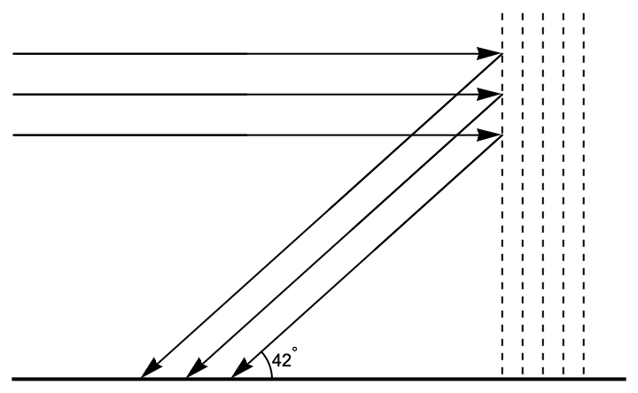
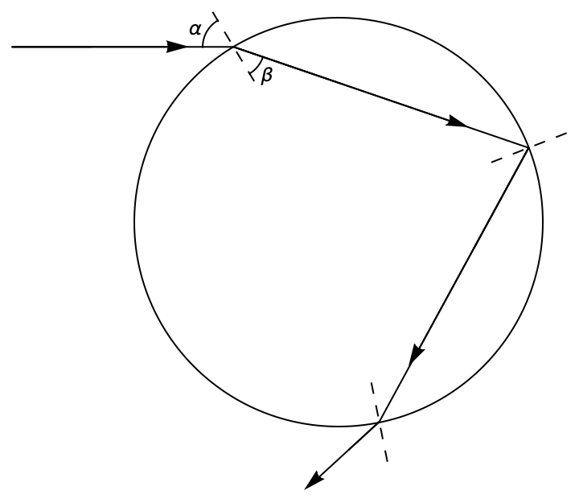
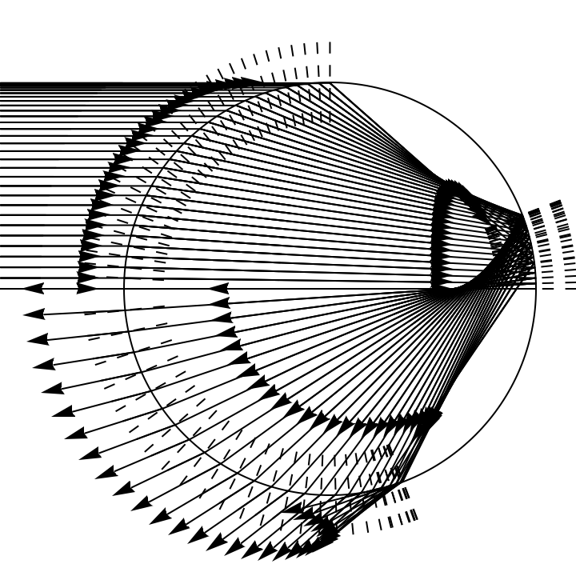
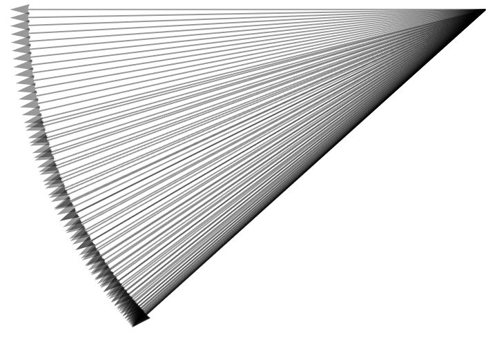

. All others generated by yours truly.](https://upload.wikimedia.org/wikipedia/commons/5/5c/Double-alaskan-rainbow.jpg)

## Applied question

I'm sure that you've all seen rainbows and were struck by their beauty at some point. I would guess that most of you have seen how a prism can create rainbow effect as well. You probably know that this happens because light is *refracted* or bent when it passes from one medium to another (like from air to water or glass). If you *really* got into the weeds, you might have learned that the amount of refraction obeys an equation called *Snell's law*. Furthermore, the amount of refraction depends on the wavelength. Thus the different colors bend different amounts and the light is separated into those different colors.

A schematic diagram of that might look something like so:

```{python}
#| echo: false
#| fig-width: 3
#| fig-height: 3
#| out-width: 3in
#| out-height: 3in
#| fig-responsive: true
import numpy as np
import matplotlib.pyplot as plt
import matplotlib.colors as mcolors


# Function to generate a smooth spectrum of colors between 380nm (violet) and 700nm (red)
def wavelength_to_rgb(wavelength):
    """
    Convert a wavelength in the range 380-700 nm to an RGB color.
    """
    gamma = 0.8
    intensity_max = 255
    factor = 0.0
    R = G = B = 0

    if (380 <= wavelength < 440):
        R = -(wavelength - 440) / (440 - 380)
        G = 0.0
        B = 1.0
    elif (440 <= wavelength < 490):
        R = 0.0
        G = (wavelength - 440) / (490 - 440)
        B = 1.0
    elif (490 <= wavelength < 510):
        R = 0.0
        G = 1.0
        B = -(wavelength - 510) / (510 - 490)
    elif (510 <= wavelength < 580):
        R = (wavelength - 510) / (580 - 510)
        G = 1.0
        B = 0.0
    elif (580 <= wavelength < 645):
        R = 1.0
        G = -(wavelength - 645) / (645 - 580)
        B = 0.0
    elif (645 <= wavelength <= 700):
        R = 1.0
        G = 0.0
        B = 0.0

    # Adjust intensity
    if (380 <= wavelength < 420):
        factor = 0.3 + 0.7*(wavelength - 380) / (420 - 380)
    elif (420 <= wavelength < 645):
        factor = 1.0
    elif (645 <= wavelength <= 700):
        factor = 0.3 + 0.7*(700 - wavelength) / (700 - 645)

    R = round(intensity_max * (R * factor)**gamma)
    G = round(intensity_max * (G * factor)**gamma)
    B = round(intensity_max * (B * factor)**gamma)

    return (R / 255, G / 255, B / 255)

# Define wavelengths to cover the spectrum
wavelengths = np.linspace(380, 700, 15)  # More granularity in colors
colors = [wavelength_to_rgb(w) for w in wavelengths]

# Adjust angles so that red bends the least, violet the most
angle_shift = np.linspace(-30, -10, len(colors))

# Set up the figure and axis
fig, ax = plt.subplots(figsize=(8, 6))
ax.set_xlim(-1, 1)
ax.set_ylim(-1, 1)
ax.set_xticks([])
ax.set_yticks([])
ax.set_frame_on(False)

# Draw the prism (45-degree tilted line)
prism_x = [-0.2, 0.2]
prism_y = [-0.2, 0.2]
ax.plot(prism_x, prism_y, color='gray', linewidth=4, zorder=3)  # Draw on top

# Define the point of refraction
refraction_point = (0, 0)

# Draw the incoming white light (horizontal)
incoming_x = [-0.8, refraction_point[0]]
incoming_y = [0, 0]
ax.plot(incoming_x, incoming_y, color='white', linewidth=3, zorder=1)

# Draw the refracted rays with fine wavelength-based colors
for i, (color, angle) in enumerate(zip(colors, angle_shift)):
    exit_x = [refraction_point[0], 0.8]
    exit_y = [refraction_point[1], np.tan(np.radians(angle)) * 0.8]
    ax.plot(exit_x, exit_y, color=color, linewidth=3, zorder=1)

# Set background color to black
fig.patch.set_facecolor('black')
ax.set_facecolor('black')

# Show the plot
plt.show()
```

How does this work to form a rainbow, though? And why is it that a rainbow forms where it does?

More specifically, it's explained on [Wikipedia's rainbow page](https://en.wikipedia.org/wiki/Rainbow) that rainbows consistently form at an angle of about $42^{\circ}$ above the horizon. Why is that?

As it turn out, that $42^{\circ}$ angle can be derived by a minimization process in calculus. The purpose of this webpage is to explain that process.

## Analysis

Here's a schematic diagram of a light rays coming in from the horizon behind you, bouncing off of distant rain in front of you, and then coming toward you:




We want to set up an optimization problem explaining where that magic angle of $42^{\circ}$ comes from. First, we need to consider the path of a light ray which passes through a distant raindrop and, ultimately, to our adoring eyes. That might look something like so:



Note that the light ray is first refracted, then reflected, and then refracted again. At the first point, the entering normal angle $\alpha$ is related to the angle of refraction $\beta$ by Snell's law:

$$\sin (\alpha )=k \sin (\beta ).$$

The parameter $k$ is called the index of refraction and depends upon the material and the wavelength being refracted. At the second point, the angle of incidence and the angle of reflection are both $\beta$. At the exit point, the angle of incidence is now $\beta$ and the angle of refraction is $\alpha$. Note that the total clockwise rotation that the ray goes through is

$$(\alpha -\beta )+(\pi -2\beta )+(\alpha -\beta )=\pi +2\alpha -4\beta$$

We might call this total clockwise rotation the *deviation* of the ray.

Now, of course, there are many parallel light rays entering the
raindrop. A large collection of these might look something like this:



Since the drop is very small and far away, we could even illustrate the exiting rays by collecting them to show them emanating from a point:



The opacity in this image emphasizes the following crucial point: The light coming out of the drop will be most intense where the exiting rays are most strongly concentrated. This happens at the bottom of the picture, *where the angle of deviation of the incoming light is the smallest*. Thus to figure out where to look for a rainbow, we should try to *find that minimum possible deviation*. The angle at which we need to look up will be supplementary to the minimum possible deviation.

Now as we saw above,

$$d(\alpha ,\beta )=\pi +2\alpha -4\beta$$

represents the amount of clockwise rotation that a light ray undergoes as it passes through a spherical body (such as a raindrop) as a function of the entering normal angle $\alpha$ and the angle of refraction $\beta$. We need to reduce this to a function of a single variable, which we can do since $\alpha$ and $\beta$ are related via Snell's law. Specifically,

$$\sin (\alpha )=k \sin (\beta )\text{  }\Rightarrow \text{  }\beta  = \arcsin \left(\frac{1}{k}\sin (\alpha )\right).$$

Thus,

$$d(\alpha )=\pi +2\alpha -4\arcsin \left(\frac{1}{k}\sin (\alpha )\right).$$

Now, the index of refraction for light passing from light into water is $k\approx4/3$. Thus, we've got to minimize this expression when $k$ is that value. Since this is supposed to be just for fun, I'm going to use a computer algebra system to do it. That system is called [SymPy](https://www.sympy.org/) and is implemented in Python. 

Here's some code to define the deviation function and compute it's derivative:

```{python}
from sympy import *
alpha = var('alpha')
k = 4/3
def d(alpha):
    return pi + 2*alpha - 4*asin(sin(alpha)/k)
deriv = diff(d(alpha), alpha)
deriv
```

Since we're using SymPy, it's easy to find the critical points:

```{python}
critical_points = solve(deriv, alpha)
critical_points
```

It turns out that there are two critical points that are equal but opposite. I believe that we can use either one, if we interpret correctly. Let's choose the positive one. Thus, if we want the minimal deviation in degrees, we can do the following:

```{python}
cp = critical_points[1]
minimal_deviation = N(d(cp)*180/pi)
minimal_deviation
```

We want to tilt our head to the supplementary angle:

```{python}
180 - minimal_deviation
```

So if the sun is setting behind us and it is raining in front of us, we need to look up at an angle of approximately $42^{{}^{\circ}}$ to see the rainbow!

I wonder where the secondary rainbow comes from??

## The code 

You can run the code on this page on any system with Python and SymPy. At UNCA, that includes [Google Colab](https://colab.research.google.com/){target="_blank"}, which is part of our Google Suite. Anyone can also run it in [this Sage Cell](https://sagecell.sagemath.org/?q=fnpgpq){target="_blank"}.
